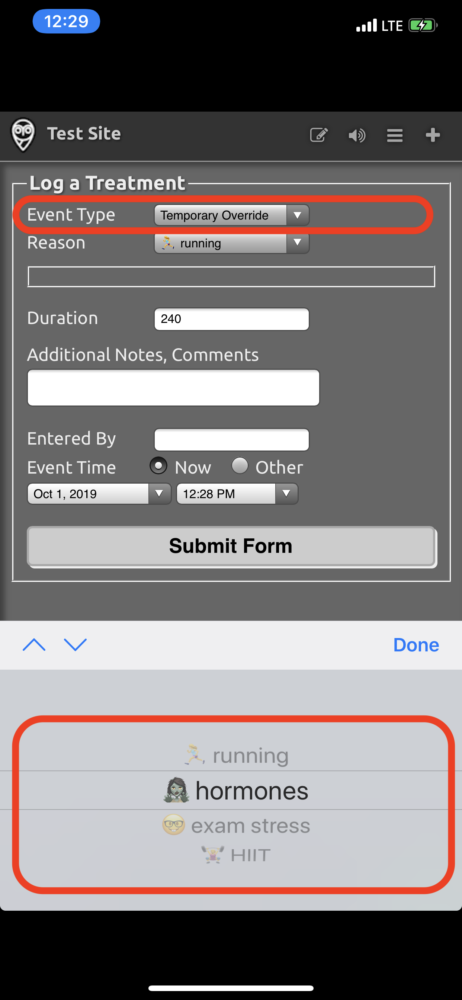

## Requirements

Remote commands require the configuration steps from [Remote Configuration](remote-config.md).

!!! question "Do I have to use Loop Caregiver?"
    There are a number of methods for using remote commands.

    Things everyone needs to know are covered on this page, so you should read it regardless of how you plan to issue remote commands. The next page is devoted to using [Loop Caregiver](loop-caregiver.md).

## More Information

Not yet incorporated into *LoopDocs* - need to add:

The expanded capabilities for remote commands in &nbsp;*Loop 3*&nbsp; are currently documented in this [Remote Carb/Bolus Guide](https://docs.google.com/document/d/1wPpCljo9NuwllltjhImf7YZReIgqP9yF05PN7E6hphM). That information will be incorporated into *LoopDocs* soon.

## Remote Overrides

Remote Overrides do not require a One Time Passcode (OTP). There are some versions of Nightscout that provide a row for entry of an OTP for Temporary Override in the Nightscout Careportal. Leave that row blank.

## FAQs on Remote Overrides

Don't forget to read [Loopdocs: Overrides](../operation/features/overrides.md). For remote overrides in particular:

1. **Can I set a different override in *Nighscout* than I have programmed into *Loop* app?**  
   **Answer**: No. You will only be able to enact override presets already programmed into the Loop app.

2. **If I didn't start the override in *Nightscout* (it was started in *Loop* itself), can I still use *Nightscout* to cancel it?**  
   **Answer**: Yes. You can cancel an override set in *Loop* with a Nightscout-set cancel "temporary override" command in the careportal.

3. **Can I replace an override set in *Loop* with an override set in *Nightscout*?**  
   **Answer**: Yes.

4. **If I have multiple *Nightscout* sites because I have multiple kiddos with T1D looping, do I need multiple APNs Keys?**  
   **Answer**: No. If you have multiple kids using *Loop*, you can use the one APNs key in each of their *Nightscout* sites.

5. **How can I tell if it worked?**  
   **Answer**: You should see your override pill in *Nightscout*, with the  **NEXT** *Loop* cycle, reflecting that the desired override action took place. If you are near the *Loop* app, you should see the new override within less than 30 seconds or so.

6. **Can I see on *Nightscout* when a temporary override has been set using the looper’s phone?**  
   **Answer**: Yes. There will be a grey bar with the name of the override noted and the *Loop* Pill will display the targets and duration. Remember, there is a KNOWN issue with the grey bars, so use the pill as your best guide.

7. **Can a looper cancel a remote override**?  
   **Answer**: Yes. They can tap the heart icon :fontawesome-solid-heart-pulse: in *Loop* so that it is no longer highlighted. This turns off the override, regardless of where it was initiated.

8. **I set a remote override in *Nightscout* but the Looper tapped the heart symbol :fontawesome-solid-heart-pulse: in the *Loop* app, so the override turned off. Will the override get reinstated  the next time *Loop* completes with internet access?**  
   **Answer**: No. The *APN* is only sent once. You can set the remote override again if need be.

9. **Can I schedule a remote override ahead of time using Nightscout?**    
   **Answer**: No. When you set a remote override in *Nightscout*, it starts immediately and lasts for the duration programmed for that override in the *Loop* app. You can only set an override in advance using the *Loop* app.

## Remote Commands

Remote Commands to deliver a bolus or add a carb entry **require** a One Time Passcode (OTP).

!!! important "Minimum Versions: &nbsp;Loop 3 and &nbsp;**Nightscout 14.2.6**"
    If your Nightscout version does not meet that minimum requirement, remote commands **might** be accepted but if they are, the time for the commands is always the current time. In other words, Carbs in the Past or Future might be accepted, but would be entered at the current time on the looper's phone.

!!! danger "**Duplicate Delivery Risk**"
    We want to highlight a very important risk before you get started.

    For safety, always assume a previous remote carbs/bolus was delivered. For motivation think of the following example:
    
    * You send a 5-unit remote bolus.
    * The bolus is delivered to the Looper.
    * *Nightscout* is having a temporary technical issue and doesn't show the bolus was received.
    * You are watching *Nightscout* and you don’t see a delivery so you assume it failed.
    * You send another remote 5-unit bolus.
    * The second 5-unit bolus is delivered to the Looper (10 Units total).

You can see the danger of sending duplicate bolus/carbs so be careful. If a remote bolus/carb entry doesn’t show in *Nightscout*, use your own judgment on whether enough time has passed to try again.

!!! warning "If sending both, choose Bolus then Carbs"
    If you plan to send a carb command remotely and later decide to issue a bolus command - STOP and consider.

    There are 2 scenarios of concern that could lead to too much insulin:
    
    * *Looper* is using the **`Temp Basal`** (temporary basal) Dosing Strategy
        * *Loop* will initiate a max `Temp Basal` when it receives the carbs remote command
        * Your bolus will be accepted and take place in addition to the high temporary basal
    * *Looper* is using **`Automatic Bolus`** Dosing Strategy
        * *Loop* will initiate 40% of the recommended dose when it receives the carbs remote command
        * Your bolus will be accepted and take place in addition to an automatic boluses
    
    Typically, sending a carbs command alone is sufficient for *Loop* to know about the carbs and begin to dose for them.
    
    If you really want to both bolus for carbs and enter carbs, then do it in that order.
    
    1. The bolus, when accepted, will cause *Loop* to issue a 0 `Temp Basal` (temporary basal) (which is "safer")
    2. The carbs, when accepted, will cause *Loop* to respond to the carbs while including the bolus already delivered and included in the Looper&#39; IOB
    
    ❗️ Remember - you should pause at least 60 seconds between remote commands or the One-Time-Password (OTP) will be rejected as having already been used.

## Using Remote Commands

There are four ways you can trigger your commands remotely; [Loop Caregiver](loop-caregiver.md) (link takes you to a new page), [Nightscout Careportal](#nightscout-careportal), [Shortcuts](#shortcuts), and [IFTTT](#ifttt).

!!! warning "Config Var Reminder"

    * If you used a remote method for your build of *Loop*, don't forget you must add `LOOP_PUSH_SERVER_ENVIRONMENT` config variable to your *Nightcout* site or remote commands will not work. [LoopDocs: Remote Build Config Var Requirement](remote-config.md#remote-build-config-var-requirement)
    * If you return to *Xcode* build, you must remove the `LOOP_PUSH_SERVER_ENVIRONMENT` config var.

### [Loop Caregiver](loop-caregiver.md)

Click the link above to read more about Loop Caregiver.

### Nightscout Careportal

To use remote commands in the Careportal, you must configure Nightscout site according to the directions [here](update_user.md) in Loopdocs in addition to setting up the [Remote Configuration](remote-config.md). 

Pay particular attention to these entries in the `ENABLE` line: `override` `careportal` `Loop`. The order of the words in the `ENABLE` line is not important.

You'll also need to have your [site authenticated](update_user.md#authenticate-site) so that your Careportal is active to send remote overrides . 

Once authenticated by entering your `API_SECRET`, there is a plus sign (:material-plus-thick:) in the upper right corner of your site. That is your *Careportal*. Tap the *Careportal* plus sign (:material-plus-thick:) and then scroll down in the `event type` menu to find `Temporary Override`.  
Within there, you will find all your *Loop* override presets already loaded for you.

The Looper will see a banner notification that a remote command has been sent with details about that command and whether it succeeded (or not).

Canceling an override through *Nightscout careportal* is as simple as selecting the event type `Temporary Override Cancel` and submitting.

### Shortcuts

If you want to make your life SUPER AMAZING, check out using the iPhone's Shortcuts app. The Shortcuts app is for making little automations (like mini apps) that can integrate parts of your life. In this case, we've written a couple of shortcuts for you that integrate &nbsp;*Loop*&nbsp; overrides with *Nightscout*.

!!! important "Important Note"
    Before you click on the download file below...save yourself some trouble.
    
    1. Download the Shortcuts app if you don't have it yet
    2. Choose to run any shortcut from the Gallery. It can be the laundry timer...I don't care, **just pick one shortcut and run it**.  
    3. THEN, go to download the shortcut of your choice below.  
       ℹ️ The shortcuts that aren't run through the Gallery option are called "untrusted". And you need a slider in your iPhone to trust the "untrusted" shortcuts you would be downloading here.  
       But...in a lovely iOS glitch...that slider doesn't appear unless you've run a trusted shortcut first.  So, run one now.
    4. Then, this slider will now be visible in the iPhone Settings app under the Shortcuts app menu.
    5. When you will see the message "This shortcut cannot be opened because your Shortcuts security system settings don't allow untrusted shortcuts"
    6. Open iPhone Settings and scroll down the list and tap the Shortcuts menu to turn on "Allow Untrusted Shortcuts".

Click these links on your iPhone and you'll be prompted to download the premade shortcuts (assuming you open the links in Safari browser on iPhone):

[Comprehensive *Loop* Shortcut](https://github.com/LoopKit/Loop/raw/4699417/Shortcuts/Loop.shortcut)
 *includes Set Remote Override, Cancel Override, Loop Troubleshooting Tips, Quick Text options, Manual BG entry, Bookmarks to websites, etc.*

And if you want to save one click to get to these one functions more directly: these shortcuts are simplified to offer only one function:

[Set Remote Override only shortcut](https://github.com/LoopKit/Loop/raw/4699417/Shortcuts/Loop Remote Overrides.shortcut)

[Cancel Override only shortcut](https://github.com/LoopKit/Loop/raw/4699417/Shortcuts/Cancel Override.shortcut)

!!! note "A couple notes about these shortcuts:"
    1. You will need iOS 13 at a minimum on the phone you'd like to trigger these shortcuts from. Looper&#39;s phone can still be lower than iOS 13, but your phone as the shortcut user would need iOS 13.
        * For &nbsp;*Loop 3*, the minimum iOS is iOS 15.1
    1. You need to open those links in the *Safari* browser on your iPhone. A confirmation will show to initiate the download. After the download finishes, tap the button marked `AA` near your *Safari* address bar and tap `Downloads` (downloads)  to find and open the downloaded Shortcut. Then wait a bit, and the shortcut's inner guts will be there...scroll ALL the way down to the bottom to click the button to save the untrusted shortcut.
3. When you enter your *Nightscout* URL in the `URL` field of the &nbsp;*Loop*&nbsp; shortcut setup, make sure you don't include a trailing `/`, or the API calls to *Heroku* will error out.
4. When a remote override is set properly, you'll see an `ok` message displayed. If there is an error, you'll see an error message. Most errors will be that you have an `API_SECRET` wrong (make sure there isn't a space at the end of your `API_SECRET` that you don't see) or you failed to do the steps to setup *Nightscout* and update your *Loop* app as described in steps 1-3 above.
5. You can absolutely customize these bits and pieces within the shortcut. Change the text messages, and change the links... It is totally up to you.

### *IFTTT*

If you want to walk uphill both ways in the snow carrying bags of uneven groceries, you can also set overrides remotely by using If This, Then That (IFTTT) integration. By using IFTTT, you can have single button presses on your phone that will set an override, log a cannula change, log a sensor change and much more.

* Please see
    * [Nightscout: Configurations: IFTTT Maker](https://nightscout.github.io/nightscout/setup_variables/#ifttt-maker)
    * [Nightscout: IFTTT](https://nightscout.github.io/nightscout/ifttt/)

