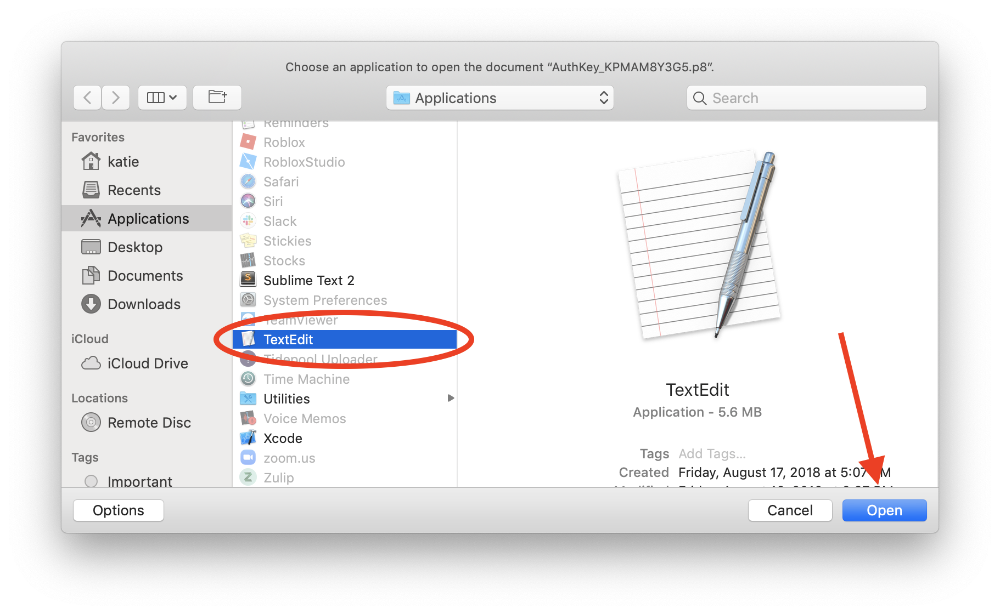

!!! abstract "Page Summary"

    1. [Update the Looper's iPhone Settings](#step-1-update-the-loopers-iphone-settings)
    2. [Create a Key for an `Apple Push Notifications service (APNs)`](#step-2-apple-push-notifications)
    3. [Update Nightscout site and add some "config vars" lines in Nightscout site settings](#step-3-add-apn-to-nightscout)
    4. [Test Remote Overrides](#step-4-test-remote-overrides)

## Set Up Remote for Nightscout

You can use the Looper's Nightscout site to remotely set and cancel override presets in your Looper's Loop app.

With &nbsp;Loop 3, you can also send remote commands to add carbs and command a bolus. **Remote bolus/carb commands** have a minimum requirement of &nbsp;**Nightscout 14.2.6**. If your Looper's Nightscout version does not meet that minimum requirement, remote commands **might** be accepted, but the time for the commands is always the current time. In other words, Carbs in the Past or Future might be accepted, but would be entered at the current time on the Loop phone.

After you complete the configuration, read the entire [Remote Commands](remote-commands.md) page - pay attention to the warnings and caveats. Test this while your Looper is sitting next to you so you can watch their phone.

!!! warning "Remote Nightscout Interface Caveats"
    * Must use a paid Apple Developer account to build Loop
        * Apple Push Notifications (APN) service is not available with a Free account
    * When you build Loop, the required *APN* information is tied to your Apple Developer account
        * You add your *APN* information to your Looper's Nightscout site
        * If you support multiple Looper's, you add the same APN variables to each of their Nightscout sites
    * There are many choices for building your own or paying someone to build a Nightscout site
        * The directions for only one of the options is documented on this page
        * Use that as a guide for your site
    * [Nightscout Docs: Comparison Table](https://nightscout.github.io/nightscout/new-user/#vendors-comparison-table)
        * Warning: examine the `Loop remote carbs/bolus` row
        * If a green check is missing, it might just be too new for evaluation

## Step 1: Update the Looper's iPhone settings

For remote commands to successfully deploy to a Looper's iPhone when the phone is locked, they must have Background App Refresh enabled.

* The slider in `iPhone -> Settings -> General -> Background App Refresh -> Loop` must be enabled

Consequence if Looper's phone is not configured correctly:

- If Background app refresh is not enabled, the remote overrides might only enact if the Loop app is open and the phone is unlocked

!!! warning "Keep Notifications Turned on for Looper's Phone"
    Typically, the Looper's phone has Notifications enabled for Loop. In fact, if they don't, a red warning bar is prominently displayed. 
    
    There may be times when you really need Loop to be quiet, so you can turn off Notifications. The remote commands still go through but the Looper does not see a notification that this happened.

    Best practice is to keep Loop Notifications enabled.

## Step 2: *Apple Push Notifications*

The step is required for the Loop app to give permissions to your Nightscout site to remotely interact with it. To enable this, you need to create a key and grant it access to the Apple Push Notification Service (APNS). 

!!! info "Reminder"
    This only works with the **paid** Apple Developer ID.

1. To get started, go to the `Keys` section under Apple Developer's [`Certificates, Identifiers & Profiles`](https://developer.apple.com/account/resources/authkeys/list) and login with the *Apple ID* associated with your developer team that you used to build the Loop app.
2. If not already open in your browser (compare with the below screenshot), 
    - Click on **`Keys`** (located in the left-hand column). 
    - Either click on the blue **`Create a new key`** button **OR** the plus button (:material-plus-circle:)  to add a new key.
    > 
3. In the form that appears, do the following:
    - Click the checkbox for enabling **`Apple Push Notifications service (APNs)`**
    - Enter a name for the key such as `Nightscout` (you can name it however you want, just make sure you know what the key is for by the name you choose).
    - Then click the **`Continue`** button in the upper right of the screen.  
  > 
4. In the screen that follows, click the blue **`Register`** button.  
   > 
5. In the screen that follows, click the blue **`Download`** button.  
    This step will download a file with a name that starts with `AuthKey` and ends with `.p8`.  
> 
6. Find your `AuthKey` downloaded file in your downloads folder.  
   Double-click to open it and you will be presented a message asking how you'd like to open it. The graphic and instructions below are for a Mac. Make sure your editor does not change any characters in your APN key; use a text-only editor like NotePad (PC) or TextEdit (Mac).
   Click on `Choose Application...` and then select *`TextEdit`* as your application to open it with.  
> 
> 
7. When the file opens, it will look similar to the screenshot below. In a few minutes, after we do a few other steps first, we will need to highlight **ALL OF THE CONTENTS** of that file and copy it because we will be pasting it in *Heroku* or whichever Nightscout provider you are using. Yes, *allllll* of the contents.  
    So, the easiest way is to:
      * **Click inside that file**
      * Highlight **all** the text, and then
      * Copy **all** the text to the clipboard (Cf. screenshot below).
        * On a **Mac**, press ++command+"A"++ to select all, then press ++command+"C"++ to copy the selection. 
        * On a **PC**, press ++control+"A"++ to select all, then press ++control+"C"++ to copy the selection.
     
      You don't have to do it right now...just keep that window open in the background for now until we need it a little further down. Then we will copy all that text.
    > 

## Step 3: Add APN to Nightscout

### Update Nightscout Site

You'll need to make sure your Nightscout site version is version `13.0.1` or newer for remote overrides and version `14.2.6` or newer for access to all the remote command features. 

!!! info "What is my Nightscout Version Number?"
    To find your Nightscout version number:
    
     - **Tap** on (`☰`) the hamburger button (3 horizontal lines stacked on each other) at the upper right, near the authentication button.
     - A context menu slides in from below the hamburger.
     - **Scroll** to the very bottom of this menu.
     - The **version** is located in the **`About`** section after the `Settings` section, (below the `Save` button).

This link should be used if you want to [Nightscout: Update](https://nightscout.github.io/update/update/) your Nightscout site.

!!! note "Note for Google Cloud Users"
    The [Xdrip: Google Cloud Nightscout](https://navid200.github.io/xDrip/docs/Nightscout/GoogleCloud.html) instructions include information about updating your site.  
    Scroll down to the line (on that page) that says `Update Nightscout`.

### Add APN Variables to Nightscout

In order to use remote overrides, you must add a couple of new variables. If you don't know how to update your Nightscout configuration, review [Nightscout: Setup Variables](https://nightscout.github.io/nightscout/setup_variables/) and then come back.

The instructions in this section show *Heroku* images. If you are using a different method, you should be able to "translate" the steps.

Go to the `Settings` tab near the top of the screen on your *Heroku* app and then click on `Reveal Config Vars`.

> {width="650"}
{align="center"}

Scroll down the bottom of the `Config Vars` lines until you find the last blank one.  You are going to add three new rows of config vars for remote overrides as shown below:

> {width="650"}
{align="center"}

|
KEY
|VALUE|
|---------|---------|
|`LOOP_APNS_KEY`| Enter the **ENTIRE** contents of the downloaded `.p8` file including the `BEGIN` and `END` lines. Here's where you can use the ++command+"A"++ and ++command+"C"++ to highlight and copy all the text in that file so you can paste it into Heroku here for this new variable you are creating. |
|`LOOP_APNS_KEY_ID`|String of characters on the `.p8` download file immediately following the underscore (`_`) and not including the file extension (`.p8`), or you can get it from your saved key in your developer account as shown next step, too. This is a part of the downloaded filename located after the underscore (`_`) and before the file extension (`.p8`).    
|`LOOP_DEVELOPER_TEAM_ID`| Get this value from Loop app signing or in your Apple Developer account's top right corner under your name |
|`LOOP_PUSH_SERVER_ENVIRONMENT`| (optional) Set this to `production` if you installed Loop remotely such as with *TestFlight*, *Diawi*, *AppCenter*, or an *IPA*.  If you built directly to your phone in *XCode* with your phone plugged into to your computer, do not include this variable.|

#### Remote Build Config Var Requirement

That last row of the table above is needed if you are using a remote build option such as [LoopDocs: GitHub Build Actions](../gh-actions/gh-overview.md) or downloaded an archived file via [Loop and Learn: Remote Build with Diawi](https://www.loopandlearn.org/remote-build/). If you later return to a direct *Xcode* build to your phone, you must remove that config var or remote commands will not work.

When executed properly, you should have something that looks like this for the three (or four) new variables that you added:

> 

#### BadDeviceToken

When the Nightscout config var LOOP_PUSH_SERVER_ENVIRONMENT does not match the Loop app build method; the error message contains the phrase `APNs delivery failed: BadDeviceToken`.

* If Loop was installed remotely (typically from TestFlight following GitHub Browser Build), you **must** have Nightscout config var `LOOP_PUSH_SERVER_ENVIRONMENT` set to `production`
* If Loop was built using Mac-Xcode, you **cannot** have `LOOP_PUSH_SERVER_ENVIRONMENT` as one of your Nightscout config vars

### Do Not Confuse Your Keys

!!! danger "API Key vs APN Key"
    If you build with the *GitHub* [Browser Build](../gh-actions/gh-overview.md), you may notice the Application Programming Interface (API) key has the same type of format as the Apple Push Notification (APN) key. The keys for both purposes are of type `p8`, but should not be confused.

    The Secrets for building with *GitHub* use the API Key.
    
    The config vars for Nightscout use the APN Key.
    
    * If you are using remote commands with Nightscout and building with the **GitHub Browser** build method, you must also add the config var of `LOOP_PUSH_SERVER_ENVIRONMENT` with a value of `production` to your Nightscout site or the remote commands will not work.
    * If you are using the **Mac-Xcode** build method, you should not have a config var of `LOOP_PUSH_SERVER_ENVIRONMENT` entered - remove it if it is present.

## Step 4: Test Remote Overrides

If remote overrides do not function, remote commands for delivering a bolus or adding a carb entry will not work either.

After you finish setting up your Nightscout site:

1. Use the Looper's phone to set an override
1. Make sure that override shows up on the Nightscout site
1. Then using the Nightscout Careportal, test that you can turn off that override

### Things to Check:

*    Remote overrides will not start working until after you activate an override in the app at least once
    * Activating an override from the Loop interface will upload the necessary push notification token to Nightscout which will enable remote commands to work
    * If your Looper gets a new phone - be sure to activate an override from the new phone before trying to use remote commands
*    Notifications must be allowed in Loop
*    Give loop access to all health data
*    Enable Background App Refresh
*    Double check your Nightscout credentials
*    Low Power Mode may prevent background notifications from working
*    Some have found that activating the “Focus” and Do-Not-Disturb features on iOS can prevent push notifications from being delivered
    * Turn these off when troubleshooting to eliminate this as a source of problems
*    iOS 15.3.x: Note there are reports of Remote notifications not being received to the Loopers device for iOS version 15.3 and 15.3.1; this is fixed in iOS version 15.4
*    If you distribute the app remotely (i.e. TestFlight, Diawi, AppCenter), you must set a special Nightscout variable, LOOP_PUSH_SERVER_ENVIRONMENT to “production”, to enable push notifications
    * See [Remote Build Config Var Requirement](#remote-build-config-var-requirement)
