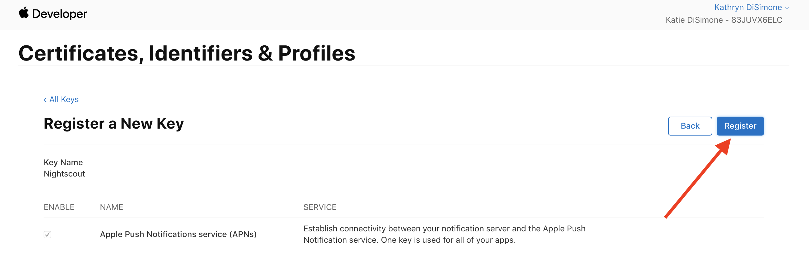
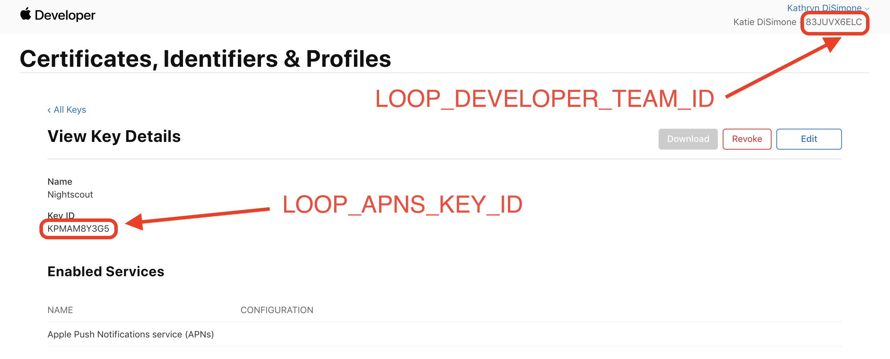

## Set Up Remote for *Nightscout*

You can use your *Nightscout* site to remotely set and cancel your override presets in your Loop app. What?! Yes, really...you can set/cancel an override remotely for your child's *Loop*.

If you are using &nbsp;Loop 3, then you can also send remote commands to add carbs and command a bolus. **Remote commands** have a minimum requirement of &nbsp;**Nightscout 14.2.6**. If your Nightscout version does not meet that minimum requirement, remote commands **might** be accepted but if they are, the time for the commands is always the current time. In other words, Carbs in the Past or Future might be accepted, but would be entered at the current time on the looper's phone.

!!! warning "Remote Nightscout Interface Caveats"
    * Requires **`Apple Push Notifications service (APNs)`** - not available with a Free account
    * When you build *Loop*, the required *APN* information is tied to your Apple Developer account
        * You add your *APN* information to your *Nightscout* site (directions on this page)
        * *Nightscout* sites, in general, allow you to add the required **APN** information
    * If you use *T1Pal* for *Nightscout* and want to use remote commands, contact *T1Pal* about enabling them for a subscription fee.

!!! important "Remote Builds"
    There are several methods for building remotely for your family members (or even yourself).

    * [*LoopDocs*: *GitHub Build* Actions](../gh-actions/gh-overview.md) (new with Loop 3) allows you to build on a browser (no need for a Mac) and send *Loop* to your phone using *TestFlight*
    * [*Loop and Learn*: Remote Build with *Diawi*](https://www.loopandlearn.org/remote-build/) allows you to save a build created by *Xcode*, store it in the cloud, and then download and install it on your phone later
    
    Both of these remote options require this [*Nightscout*: Config Var](https://nightscout.github.io/nightscout/setup_variables/#nightscout-config-vars) to be added to *Nightscout*:
    
    `LOOP_PUSH_SERVER_ENVIRONMENT = production`
    
    Be aware that if you then return to building directly from *Xcode*, you must disable that config var from *Nightscout* and restart the server.
    
    Note - this is covered in detail in step 3 below when you [*LoopDocs*: Add *APN* Variables to *Nightscout*](#add-apn-variables-to-nightscout).

!!! abstract "What you will need to do.."

    1. Update the Looper's iPhone Settings
    
    2. Create a Key for an `Apple Push Notifications service (APNs)`
    
    3. Update your *Nightscout* site and add some "config vars" lines in your *Nightscout* site settings.
    
    And read this entire page - focus on warnings and caveats.

!!! tip "New Feature in Loop 3"
    Remote bolus and remote carb capability are added with *Loop version 3*. In order to support this capability, there are new minimum versions:

    * *Loop 3*&nbsp; or newer
    * iOS 15.1 or newer
    * *Nightscout* version 14.2.6 or newer  
        Required to get all the features
    
    Not required and is still under development, but users who are testing this separate app are pleased
    
    * [Loop Caregiver](#loopcaregiver) app (iOS 16 or higher) enables the following from the caregiver's phone:
        * monitor &nbsp;*Loop*
        * issue remote commands for carbs, bolus, and overrides
    * To clarify minimum versions for using updated remote features with *Loop Caregiver*
        * *Loop Caregiver* phone: iOS 16
        * *Loop* phone: iOS 15.1 running Loop 3
        * Nightscout&nbsp; 14.2.6
    
    The expanded capabilities for remote commands in &nbsp;*Loop 3*&nbsp; are currently documented in this [Remote Carb/Bolus Guide](https://docs.google.com/document/d/1wPpCljo9NuwllltjhImf7YZReIgqP9yF05PN7E6hphM). That information will be incorporated into *LoopDocs* soon.

## Step 1: Update the Looper's iPhone settings

For remote commands to successfully deploy to a Looper's iPhone, they will need to have two settings on the iPhone enabled.

1. The slider in `iPhone -> Settings -> Loop -> Notifications` needs to be turned to `Allow Notifications`
2. The slider in `iPhone -> Settings -> General -> Background App Refresh -> Loop` must be enabled

Error messages if Looper's phone is not configured correctly:

-  Without notifications, the person trying to set a remote override will see a message about `"no deviceToken"` and no remote override will actually enact
- If Background app refresh is not enabled, the remote overrides will only enact if the *Loop* app is open and the phone is unlocked.

## Step 2: *Apple Push Notifications*

The next part of this will help your *Loop* app give permissions to your *Nightscout* site to remotely interact with it. To enable this, you need to create a key and grant it access to the Apple Push Notification Service (APNS). 

!!! info "Reminder"
    This only works with the **paid** Apple Developer ID.

1. To get started, go to the `Keys` section under Apple Developer's [`Certificates, Identifiers & Profiles`](https://developer.apple.com/account/resources/authkeys/list) and login with the *Apple ID* associated with your developer team that you used to sign your *Loop* app.
2. If not already open in your browser (compare with the below screenshot), 
    - Click on **`Keys`** (located in the left-hand column). 
    - Either click on the blue **`Create a new key`** button **OR** the plus button (:material-plus-circle:)  to add a new key.
    > 
3. In the form that appears, do the following:
    - Click the checkbox for enabling **`Apple Push Notifications service (APNs)`**
    - Enter a name for the key such as `Nightscout` (you can name it however you want, just make sure you know what the key is for by the name you choose).
    - Then click the **`Continue`** button in the upper right of the screen.  
  > 
4. In the screen that follows, click the blue **`Register`** button.  
   > 
5. In the screen that follows, click the blue **`Download`** button.  
    This step will download a file with a name that starts with `AuthKey` and ends with `.p8`.  
> 
6. Find your `AuthKey` downloaded file in your downloads folder.  
   Double-click to open it and you will be presented a message asking how you'd like to open it.  
   Click on `Choose Application...` and then select *`TextEdit`* as your application to open it with.  
> 
> 
7. When the file opens, it will look similar to the screenshot below. In a few minutes, after we do a few other steps first, we will need to highlight **ALL OF THE CONTENTS** of that file and copy it because we will be pasting it in *Heroku* or whichever *Nightscout* provider you are using. Yes, *allllll* of the contents.  
    So, the easiest way is to:
      * **Click inside that file**
      * Highlight **all** the text, and then
      * Copy **all** the text to the clipboard (Cf. screenshot below).
        * On a **Mac**, press ++command+"A"++ to select all, then press ++command+"C"++ to copy the selection. 
        * On a **PC**, press ++control+"A"++ to select all, then press ++control+"C"++ to copy the selection.
     
      You don't have to do it right now...just keep that window open in the background for now until we need it a little further down. Then we will copy all that text.
    > 

## Step 3: Add APN to *Nightscout*

### Update *Nightscout* Site

You'll need to make sure your *Nightscout* site version is version `13.0.1` or newer for remote overrides and version `14.2.6` or newer for access to all the remote command features. 

!!! info "What is my *Nightscout* Version Number?"
    To find your *Nightscout* version number:
    
     - **Tap** on (`☰`) the hamburger button (3 horizontal lines stacked on each other) at the upper right, near the authentication button.
     - A context menu slides in from below the hamburger.
     - **Scroll** to the very bottom of this menu.
     - The **version** is located in the **`About`** section after the `Settings` section, (below the `Save` button).

This link should be used if you want to [Nightscout: Update](https://nightscout.github.io/update/update/) your *Nightscout* site.

!!! note "Note for *Google Cloud* Users"
    The [`Xdrip`: Google Cloud Nightscout](https://navid200.github.io/xDrip/docs/Nightscout/GoogleCloud.html) instructions include information about updating your site.  
    Scroll down to the line (on that page) that says `Update Nightscout`.

### Add APN Variables to *Nightscout*

In order to use remote overrides, you must add a couple of new variables. If you don't know how to update your *Nightscout* configuration, review [Nightscout: Setup Variables](https://nightscout.github.io/nightscout/setup_variables/) and then come back.

The instructions in this section show *Heroku* images. If you are using a different method, you should be able to "translate" the steps.

Go to the `Settings` tab near the top of the screen on your *Heroku* app and then click on `Reveal Config Vars`.

> {width="650"}
{align="center"}

Scroll down the bottom of the `Config Vars` lines until you find the last blank one.  You are going to add three new rows of config vars for remote overrides as shown below:

> {width="650"}
{align="center"}

|
KEY
|VALUE|
|---------|---------|
|`LOOP_APNS_KEY`| Enter the **ENTIRE** contents of the downloaded `.p8` file including the `BEGIN` and `END` lines. Here's where you can use the ++command+"A"++ and ++command+"C"++ to highlight and copy all the text in that file so you can paste it into Heroku here for this new variable you are creating. |
|`LOOP_APNS_KEY_ID`|String of characters on the `.p8` download file immediately following the underscore (`_`) and not including the file extension (`.p8`), or you can get it from your saved key in your developer account as shown next step, too. This is a part of the downloaded filename located after the underscore (`_`) and before the file extension (`.p8`).    
|`LOOP_DEVELOPER_TEAM_ID`| Get this value from *Loop* app signing or in your *Apple Developer* account's top right corner under your name |
|`LOOP_PUSH_SERVER_ENVIRONMENT`| (optional) Set this to `production` if you installed *Loop* remotely such as with *TestFlight*, *Diawi*, *AppCenter*, or an *IPA*.  If you built directly to your phone in *XCode* with your phone plugged into to your computer, do not include this variable.|

#### Remote Build Config Var Requirement

That last row of the table above is needed if you are using a remote build option such as [LoopDocs: GitHub Build Actions](../gh-actions/gh-overview.md) or downloaded an archived file via [Loop and Learn: Remote Build with Diawi](https://www.loopandlearn.org/remote-build/). If you later return to a direct *Xcode* build to your phone, you must remove that config var or remote commands will not work.

When executed properly, you should have something that looks like this for the three (or four) new variables that you added:

> 

### Do Not Confuse Your Keys

!!! danger "API Key vs APN Key"
    If you build with the *GitHub* [Browser Build](../gh-actions/gh-overview.md), you may notice the Application Programming Interface (API) key has the same type of format as the Apple Push Notification (APN) key. The keys for both purposes are of type `p8`, but should not be confused.

    The Secrets for building with *GitHub* use the API Key.
    
    The config vars for *Nightscout* use the APN Key.
    
    * If you are using remote commands with *Nightscout* and building with the **GitHub build**, you must also add the config var of `LOOP_PUSH_SERVER_ENVIRONMENT` with a value of `production` to your *Nightscout* site or the remote commands will not work.
    * If you are using the **Mac-Xcode** build method, do not have a config var of `LOOP_PUSH_SERVER_ENVIRONMENT` entered - remove it if it is present.
