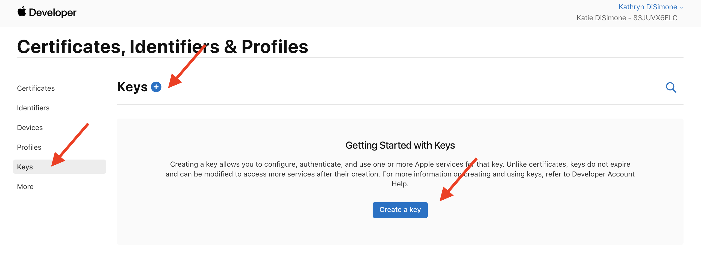
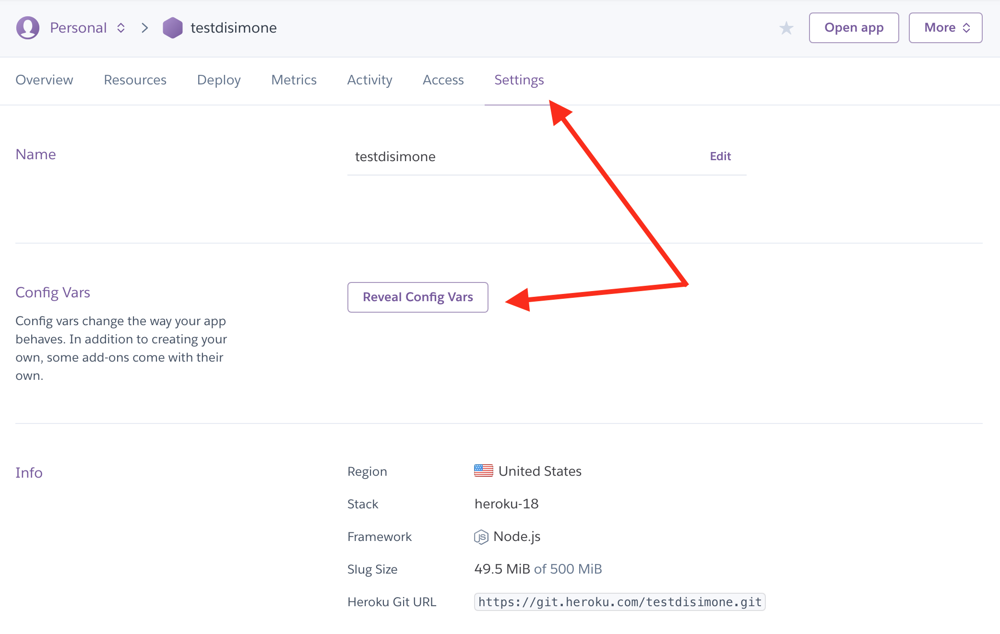
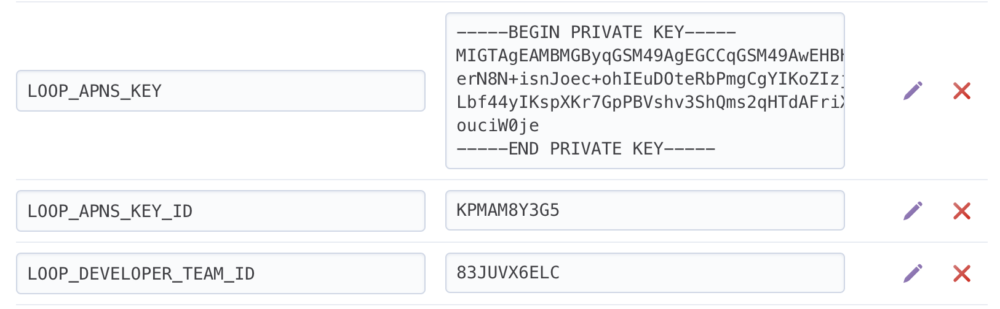
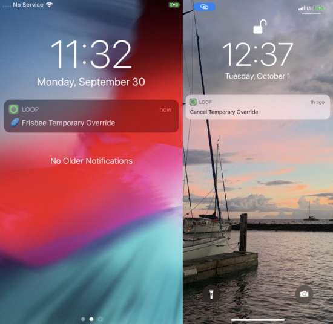

## Set Up Remote for Nightscout

You can use your Nightscout site to remotely set and cancel your override presets in your Loop app. What?! Yes, really...you can set/cancel an override remotely for your child's Loop.

If you are using Loop 3, then you can also send remote commands to add carbs and command a bolus.

!!! warning "Remote Nightscout Interface Caveats"
    * Requires Apple Push Notifications (APN) - not available with a Free account
    * When you build Loop, the required APN information is tied to your developer account
        * You add your APN information to your Nightscout site (directions on this page)
        * Nightscout sites, in general, allow you to add the required APN information
    * If you use T1Pal for Nightscout and want to use remote commands, contact T1Pal about enabling them for a subscription fee.

!!! danger "Remote Builds"
    There are several methods for building remotely for your family members (or even yourself).

    * [LoopDocs: GitHub Build Actions](../gh-actions/gh-overview.md) (new with Loop 3) allows you to build on a browser (no need for a Mac) and send Loop to your phone using TestFlight
    * [Loop and Learn: Remote Build with Diawi](https://www.loopandlearn.org/remote-build/) allows you to save a build created by Xcode, store it in the cloud and then download and install on your phone later

    Both of these remote options require this [Nightscout: Config Var](https://nightscout.github.io/nightscout/setup_variables/#nightscout-config-vars) to be added to Nightscout:

    `LOOP_PUSH_SERVER_ENVIRONMENT` = `production`

    Be aware that if you then return to building directly from Xcode, you must disable that config var from Nightscout and restart the server.

    Note - this is covered in detail in Step 3 below when you [LoopDocs: Add APN Variables to Nightscout](#add-apn-variables-to-nightscout).


!!! abstract "What you will need to do.."

    1. Update the Looper's iPhone Settings

    2. Create a Key for an Apple Push Notifications service (APNs)

    3. Update your Nightscout site and add some "config vars" lines in your Nightscout site settings.

    And read this entire page - focus on warnings and caveats.

!!! tip "New Feature in Loop 3"
    Remote bolus and remote carb capability is added with Loop 3. In order to support this capability, there are new minimum versions:

    * Loop 3 or newer
    * iOS 15.1 or newer
    * Nightscout version 14.2.6 or newer
        * Required to get all the features

    Not required and still under development, but users who are testing this separate app are pleased

    * [LoopCaregiver](#loopcaregiver) app (iOS 16 or higher) enables the following from the caregiver's phone
        * monitor Loop
        * issue remote commands for carbs, bolus and overrides
    * To clarify minimum versions for using updated remote features with LoopCaregiver
        * LoopCaregiver phone iOS 16
        * Loop phone iOS 15.1 running Loop 3
        * Nightscout 14.2.6

    The expanded capabilities for remote commands in Loop 3 are currently documented in this [Remote Carb/Bolus Guide](https://docs.google.com/document/d/1wPpCljo9NuwllltjhImf7YZReIgqP9yF05PN7E6hphM). That information will be incorporated into LoopDocs soon.

## Step 1: Update the Looper's iPhone settings

For remote commands to successfully deploy to a Looper's iPhone, they will need to have two settings on the iPhone enabled.

1. The slider in iPhone -> Settings -> Loop -> Notifications needs to be turned to Allow Notifications
1. The slider in iPhone -> Settings -> General -> Background App Refresh -> Loop must be enabled

Error messages if Looper's phone is not configured correctly:

-  Without notifications, the person trying to set a remote override will see a message about "no deviceToken" and no remote override will actually enact
- If Background app refresh is not enabled, the remote overrides will only enact if the Loop app is open and the phone is unlocked.

## Step 2: Apple Push Notifications

The next part of this will help your Loop app give permissions to your Nightscout site to remotely interact with it. (Reminder - this only works with the paid Apple Developer ID.)

1. Login to your [Apple developer account](https://developer.apple.com/account/) with the Apple ID associated with your developer team that you used to sign your Loop app.
2. Click on "Certificates, Indentifiers & Profiles" and then, on the next page, click on "Keys" (located on the left-hand column). Click on the blue "Create a new key" **OR** the &plus; icon to add a new key.



3. In the form that appears, click the checkbox for enabling "Apple Push Notifications service (APNs)" and enter a name for the key such as "Nightscout". Then click the "Continue" button in the upper right of the screen.


4. In the screen that follows, click the blue "Register" button.


5. In the screen that follows, click the blue "Download" button. This step will download a file with a name that starts with "AuthKey" and ends with ".p8".


6. Find your AuthKey download in your downloads folder. Double-click to open it and you will be presented a message asking how you'd like to open it. Click on "Choose Application..." and then select "TextEdit" as your application to open it with.


1. When the file opens, it will look similar to the screenshot below. In a few minutes, after we do a few other steps first, we will need to highlight **ALL OF THE CONTENTS** of that file and copy it because we will be pasting it in Heroku. Yes, allllll of the contents. So, easiest way is to click inside that file and then press `command-a` to highlight all the text and then `command-c` to copy it all to the clipboard. You don't have to do it right now...just keep that window open in the background for now until we need it a little further down. Then we will copy all that text.


## Step 3: Add APN to Nightscout

### Update Nightscout Site

You'll need to make sure your Nightscout site version is at version 13.0.1 or newer for remote overrides and version 14.2.6 or newer for access to all the remote command features. You can check your version number by looking at the bottom of your NS site's settings (tap on the hamburger menu - three horizontal lines at the upper right), near where the authentication button is located.

This link should be used if you want to [Nightscout: Update](https://nightscout.github.io/update/update/) your Nightscout site.

Note - for Google Cloud users, the [Xdrip: Google Cloud Nightscout](https://navid200.github.io/xDrip/docs/Nightscout/GoogleCloud.html) instructions include information about updating your site. Scroll down to the line (on that page) that says `Update Nightscout`.

### Add APN Variables to Nightscout

In order to use remote overrides, you must add a couple of new variables. If you don't know how to update your Nightscout Configuration, review [Nightscout: Setup Variables](https://nightscout.github.io/nightscout/setup_variables/) and then come back.

The instructions in this section show Heroku images. If you are using a different method, you should be able to "translate" the steps.

Go to the `Settings` tab near the top of the screen on your Heroku app and then click on `Reveal Config Vars`.

{width="650"}
{align="center"}

Scroll down the bottom of the Config Vars lines until you find the last blank one.  You are going to add three new rows of config vars for remote overrides as shown below:

{width="650"}
{align="center"}

|KEY|VALUE|
|---------|---------|
|LOOP_APNS_KEY|enter ENTIRE contents of the downloaded .p8 file including the BEGIN and END lines. Here's where you can use the `command-a` and `command-c` to hightlight and copy all the text in that file so you can paste it into Heroku here for this new variable you are creating. |
|LOOP_APNS_KEY_ID|string of characters on the .p8 download file immediately following the underscore (  _  ) and not including the file extension ( .p8 ), or you can get it from your saved key in your developer account as shown next step, too 
|LOOP_DEVELOPER_TEAM_ID|get this value from Loop app signing or in your developer account's top right corner under your name |
|LOOP_PUSH_SERVER_ENVIRONMENT| (optional) Set this to production if you installed Loop remotely such as with TestFlight, Diawi, AppCenter, or an IPA. If you built directly to your phone in XCode with your phone plugged into to your computer, do not include this variable.|

#### Remote Build Config Var Requirement

That last row of the table above is needed if you are using a remote build option such as [LoopDocs: GitHub Build Actions](../gh-actions/gh-overview.md) or downloaded an archived file via [Loop and Learn: Remote Build with Diawi](https://www.loopandlearn.org/remote-build/). If you later return to a direct Xcode build to your phone, you must remove that config var or remote commands will not work.


When executed properly, you should have something that looks like this for your three new variables that you added:



## FAQs on Remote Overrides

Don't forget to read [Loopdocs: Overrides](../operation/features/workout.md). For remote overrides in particular:

1. **Can I set different override in Nighscout than I have programmed into Loop app?** Answer: No. You will only be able to enact override presets already programmed into the Loop app.

2. **If I didn't start the override in Nightscout (it was started in Loop itself), can I still use Nightscout to cancel it?** Answer: Yes. You can cancel a Loop-set override with a Nightscout-set cancel "temporary override" command in careportal.

3. **Can I override a Loop-set override with a Nightscout-set override?** Answer: Yes.

4. **If I have multiple Nightscout sites because I have multiple kiddos with T1D looping, do I need multiple APNs Keys?** Answer: No. If you have multiple kids looping, you can use the one APNs key in each of their Nightscout sites.

5. **How can I tell if it worked?** Answer: You should see your override pill in Nightscout, with the NEXT Loop cycle, reflecting that the desired override action took place. If you are near the Loop app, you should see the new override within less than 30 seconds or so.

6. **Can I see on Nightscout when a temporary override has been set using the looper’s phone?** Yes. There will be a grey bar with the name of the override noted and the Loop Pill will display the targets and duration. Remember, there is a KNOWN issue with the grey bars, so use the pill as your best guide.

7. **Can a looper cancel a remote override**? Yes. They can tap the heart icon in Loop so that it is no longer highlighted. This turns off the override, regardless of where it was initiated.

8. **I set a remote override in Nightscout but the looper tapped the heart symbol in the Loop app, so the override turned off. Will the override get reinstated next time Loop completes with internet access?** No. The APN is only sent once. You can set the remote override again if need be.

9. **Can I schedule a remote override ahead of time using Nightscout?** No. When you set a remote override in Nightscout, it will begin immediately and last for whatever duration is programmed for that override in the Loop app. You can set an override for ahead of time using the Looping App only.

## Warnings for Remote Commands

!!! danger "**Duplicate Delivery Risk**"
    We want to highlight a very important risk before you get started.

    For safety, always assume a previous remote carb / bolus was delivered. For motivation think of the following example:

    * You send a 5 unit remote bolus.
    * The bolus is delivered to the Looper.
    * Nightscout is having a temporary technical issue and doesn't show the bolus was received.
    * You are watching Nightscout and you don’t see a delivery so you assume it failed.
    * You send another remote 5 unit bolus.
    * The second 5 unit bolus is delivered to the Looper (10 Units total).

You can see the danger of sending duplicate bolus/carbs so be careful. If a remote bolus/carb entry doesn’t show in Nightscout, use your own judgment on whether enough time has passed to try again.

!!! warning "If sending both, choose Bolus then Carbs"
    If you plan to send a carb command remotely and later decide to issue a bolus command - STOP and consider.

    There are 2 scenarios of concern that could lead to too much insulin:

    * Looper is using Temp Basal Dosing Strategy
        * Loop will initiate a max Temp Basal when it receives the carb remote command
        * Your bolus will be accepted and take place in addition to the high temp basal
    * Looper is using Automatic Bolus Dosing Strategy
        * Loop will initiate 40% of the recommended dose when it receives the carb remote command
        * Your bolus will be accepted and take place in addition to the any previous automatic boluses

    Typically, sending a carb command alone is sufficient for Loop to know about the carbs and begin to dose for them.

    If you really want to both bolus for carbs and enter carbs, then do it in that order.

    * The bolus, when accepted, will cause Loop to issue a 0 Temp Basal (which is "safer")
    * The carbs, when accepted, will cause Loop to respond to the carbs while including the bolus already delivered and included in the Looper's IOB

    Remember - you should pause at least 60 sec between remote commands or the One-Time-Password (OTP) will be rejected as having already been used.

## Using Remote Commands

There are four ways you can trigger your commands remotely; [LoopCaregiver](#loopcaregiver) (under development), [Nightscout Careportal](#nightscout-careportal), [Shortcuts](#shortcuts), and [IFTTT](#ifttt).

Config Var Reminder:

* If you used a remote method for your build of Loop, don't forget you must add LOOP_PUSH_SERVER_ENVIRONMENT config variable to your Nightcout site or remote commands will not work. [LoopDocs: Remote Build Config Var Requirement](#remote-build-config-var-requirement)
* If you then return to Xcode build, you must remove the LOOP_PUSH_SERVER_ENVIRONMENT config var.


### LoopCaregiver   {width="50"}

The LoopCaregiver app is under development to make remote commands easier to implement and monitor.

!!! danger "Configuration Breaking Change on 2023 January 24"
    What does that mean? Sounds scary!

    This is an app under development. Sometimes, when improvements are added, you have to start over with a fresh download and enter all your information again to take advantage of the update. The app on your phone keeps working until you are ready to update.

    * **The location of the repository has moved**
    * **The ability to build with [GitHub](../gh-actions/gh-other-apps.md) as well as Xcode has been added**
    * **The bundle ID has been modified**

    Because the bundle ID has changed:

    * If you already have LoopCaregiver running and do a fresh download and build, you will be building a separate app and will need to delete the old one and add your Looper(s) in again
    * If you haven't built LoopCaregiver, the app you download and build today has the new format for the bundle ID

    Details:

    * Bundle ID used to be: org.loopkit.LoopCaregiver
    * Bundle ID now: com.TEAMID.loopkit.LoopCaregiver
    * This is a step towards enabling the GitHub build method, but please be patient, wait until instructions are posted
    * There might be additional architectural updates coming - this note will be updated at that time
    * As always, TEAMID refers to your unique Apple Developer Team ID

* Minimum Requirements
    * iOS 16 for LoopCaregiver's phone
    * iOS 15.1 with Loop 3 for Looper's phone
    * Nightscout 14.2.6
* Complete all 3 steps:
    * [Step 1: Update the Looper's iPhone settings](#step-1-update-the-loopers-iphone-settings)
    * [Step 2: Apple Push Notifications](#step-2-apple-push-notifications)
    * [Step 3: Add APN to Nightscout](#step-3-add-apn-to-nightscout)
* Safety First - Read these 2 sections again
    * [FAQs on Remote Overrides](#faqs-on-remote-overrides)
    * [Warnings for Remote Commands](#warnings-for-remote-commands)

!!! warning "Older NS Versions"
    If you ignore this minimum version requirement - what happens:

    * If you attempt to use the carb entry in the past or future, the caregiver app accepts it but the remote commands accepted by the Loopers phone show up at the current time - not when the caregiver intended to insert carbs
    * Please take the time to update your Nightscout site to master
    * Nightscout 14.2.6 was released 30-Sep-2022 as Classic Liquorice

If you plan to use LoopCaregiver, please join [Loop Caregiver App](https://loop.zulipchat.com/#narrow/stream/358458-Loop-Caregiver-App) zulipchat stream.

**As with all development code, monitor zulipchat for announcements, report any problems you experience, be prepared to build frequently, and pay attention.**

#### Build LoopCaregiver

A build script is available to assist in building LoopCaregiver. This should be straightforward for anyone who has previously built Loop 3 using the script. You may also choose to build it with the GitHub build method as documented on the Browser Build: [Other Apps](../gh-actions/gh-other-apps.md) page.

Open a terminal window. Copy the line below that starts with `/bin/bash` by hovering the mouse near the bottom right side of the text and clicking the copy icon (should say Copy to Clipboard when you hover over it). When you click the icon, a message that says “Copied to Clipboard” will appear on your screen.

```title="Copy and Paste to start the BuildLoopCaregiver.sh script"
/bin/bash -c "$(curl -fsSL https://raw.githubusercontent.com/loopnlearn/LoopBuildScripts/main/BuildLoopCaregiver.sh)"
```

Paste the line into the Terminal window. Be sure to click anywhere in the terminal before trying to paste. (Ways to paste: CMD-V; or CNTL-click and select from menu or Edit-Paste at top of Mac screen.) Once the line is pasted, hit return to execute the script. The directions for downloading and building are contained in the script. Please read carefully.

!!! warning "Not Loop"
    The output you see in the Terminal may look very similar to when you build Loop 3 from a script.

    It is pulling down a clone from a different location (gestrich instead of LoopKit) and just the caregiver branch. Do not attempt to build Loop with this download.

    The developers say: "The Caregiver app is being designed to be a full Loop integrated app, being able to benefit from Loop data stores, visualization, and other parts of the system that are mature and have a lot of design/thought put into them. At some point it will just be a single checkout, and you can build both."  **But NOT yet**

#### Use LoopCaregiver

Some limited directions for using the LoopCaregiver app are provided - please also read the zulipchat stream.

#### LoopCaregiver Main Screen

LoopCaregiver uses a lot of features from Loop with some Nightscout-like features in the Timeline.

The Timeline:

* Autoscales the vertical display for glucose reported over the last 24 hours (plus the forecast if that is turned on)
    * The graphic below has `Show Prediction` turned off for Timeline
* Horizontal display can be adjusted with spread/pinch and scrolling
* A double-tap on the Timeline provides a factor of 2 expansion horizontally if at default
* A double-tap on the Timeline returns the display to default if expanded


{width="300"}

#### Add a Looper to LoopCaregiver

You add each Looper under settings. (LoopCaregiver can monitor more than one Looper).

* On Looper Phone
    * Tap on Loop->Settings->Services->Nightscout
    * Tap on the One-Time-Password row to see the QR code
    * Pro-tip - take a screen shot and store it on your computer - you can then add view the QR code in LoopCaregiver without bothering your Looper
* On LoopCaregiver Phone
    * Tap on  LoopCaregiver->Settings
    * Tap on **&plus;** to add a Looper
    * Enter the name of the Looper, the Nightscout URL and API_SECRET
    * Touch the QR code row - this opens the camera - point camera at QR code from Looper's phone

You can also use the LoopCaregiver->Settings screen to modify:

* Units used for glucose display: mg/dL or mmol/L
* Include the Loop Forecast display on the Timeline chart as well as the Glucose chart of the main display (graphic above has `Show Prediction` turned off)

#### Issue Remote Commands with LoopCaregiver

You issue override, carb and bolus commands using a toolbar similar to the one seen on Loop. In the example graphic above, the carb and bolus entries visible were issued remotely. (Note that Adam 6 is a test phone.)

The use of LoopCaregiver makes remote commands much easier and more reliable.

Go back and read the warnings again before using the app. [Warnings for Remote Commands](#warnings-for-remote-commands)


### Nightscout Careportal

To use remote commands, I'm assuming you've setup your Nightscout site according to the directions [here](update_user.md) in Loopdocs. Especially the part about your ENABLE line including each of the words: "override careportal loop" (in addition to other variables you'd be interested in - order of the words in the ENABLE line is not important). You'll also need to have your [site authenticated](update_user.md#authenticate-site) so that your careportal is active to send remote overrides. Once authenticated by entering your API_SECRET, then there will be a &plus; in the upper right corner of your site. That is your careportal. Tap the careportal &plus; and then scroll down in the "event type" menu to find "Temporary Override". Within there, you will find all your Loop override presets already loaded for you.


The Looper will see a banner notification that an remote command has been sent with details about that command and whether it succeeded (or not).



Canceling an override through Nightscout careportal is as simple as selecting the event type "Temporary Override Cancel" and submitting.

### Shortcuts

If you want to make your life SUPER AMAZING, check out using the iPhone's Shortcuts app. The Shortcuts app is for making little automations (like mini apps) that can integrate parts of your life. In this case, we've written a couple shortcuts for you that integrate Loop overrides with Nightscout.

!!! info "Important note"
    Before you click that download below...save some trouble. Download the Shortcuts app if you don't have it yet and choose to run any shortcut from the Gallery. It can be the laundry timer...I don't care, just pick one and run it.  THEN go to download the shortcut of your choice below. The shortcuts that aren't run through the Gallery option are called "untrusted". And you need a slider in your iPhone to trust the "untrusted" shortcuts you would be downloading here. But...in lovely iOS glitch...that slider doesn't appear unless you've run a trusted shortcut first. So, run one now. Then you'll have the slider in iPhone Settings, Shortcuts app to turn "Allow Untrusted Shortcuts" on when you will see a message "This shortcut cannot be opened because your Shortcuts security system settings don't allow untrusted shortcuts."

Click these links on your iPhone and you'll be prompted to download the premade shortcuts (assuming you open the links in Safari browser in iPhone):

[Comprehensive Loop Shortcut](https://github.com/LoopKit/Loop/raw/4699417/Shortcuts/Loop.shortcut)
 *includes Set Remote Override, Cancel Override, Loop Troubleshooting Tips, Quick Text options, Manual BG entry, Bookmarks to websites, etc.*

And if you want to save one click to get to these one functions more directly: these shortcuts are simplified to offer only one function:

[Set Remote Override only shortcut](https://github.com/LoopKit/Loop/raw/4699417/Shortcuts/Loop Remote Overrides.shortcut)

[Cancel Override only shortcut](https://github.com/LoopKit/Loop/raw/4699417/Shortcuts/Cancel Override.shortcut)

**A couple notes about these shortcuts:**

1. You will need iOS 13 at a minimum on the phone you'd like to trigger these shortcuts from. Looper's phone can still be lower than iOS 13, but your phone as the shortcut user would need iOS 13.
    * For Loop 3, the minimum iOS is iOS 15.1
2. You need to open those links in the Safari browser on your iPhone. A confirmation will show to initiate the download. After the download finishes, tap the button marked "AA" near your Safari address bar and tap "Downloads" to find and open the downloaded Shortcut. Then wait a bit, and the shortcut's inner guts will be there...scroll ALL the way down to the bottom to click the button to save the untrusted shortcut.
3. When you enter your Nightscout URL in the "URL" field of the Loop shortcut setup, make sure you don't include a trailing "/" or the API calls to Heroku will error out.
4. When a remote override is set properly, you'll see an "ok" message displayed. If there is an error, you'll see an error message. Most errors will be that you have an API_SECRET wrong (make sure there isn't a space at the end of you API_SECRET that you don't see) or you failed to do the steps to setup NS and update your Loop app as described in steps 1-3 above.
5. You can absolutely customize these bits and pieces within the shortcut. Change the text messages, change the links...totally up to you.

### IFTTT

If you want to walk uphill both ways in the snow carrying bags of uneven groceries, you can also set overrides remotely by [setting up IFTTT](ns_crossref.md#IFTTT), too.

## Known Issues

Just a brief mention so you are aware:

1. The override pill will display information about what override is currently active in the Looper's phone. BUT, there can be a slight delay as that information is only transmitted every 5 minutes at best (it is tied to Loop runs and Nightscout upload events in Loop). So, wait 5 minutes to see that the information has gone through a refresh cycle before assuming the override message failed to enact.
2. When you add a new override preset in Loop, that preset has to be uploaded to Nightscout before it will be available as a remote override. To trigger that upload, you can simply enact that new override for a few seconds and turn it off again. that will get the Nightscout upload going.

## Common Errors

Once you've set up remote overrides, you may encounter errors when trying to run them via Nightscout or iOS Shortcuts.  Below are the most common and the typical solutions.

1. **Error: Loop notification failed: Could not find deviceToken in loopSettings** You might see this in either Nightscout or Shortcuts.  The error is most commonly caused by Loop not pointing to the right Nightscout instance or you haven't yet run an override locally (with the Loop app) before trying to run one remotely.  **Solution:** confirm the Loop app is pointing to the right Nightscout site (and there are not extra spaces or a slash (/) at the end, and always run an override for a few seconds in the Loop app before you try to run one remotely.
2. **Error: cannot POST/api/v2/notifications/loop** You might see this in iOS Shortcuts.  This means Nightscout is not updated correctly and you are running a version of Nightscout that doesn't yet support remote overrides.  **Solution:** Follow the steps above again on how to update to the version of Nightscout that supports remote overrides.
3. **Error: {“status”:401,”message”:”Unauthorized”,”description”:Invalid\\/Missing”}** You might see this in iOS Shortcuts.  This is caused by having the incorrect API_SECRET in the Shortcut.  **Solution:** Double check the API_SECRET is correct and that there are no spaces at the end.
4. **Error: APNs delivery failed: InvalidProviderToken** You might see this in either Nightscout or Shortcuts.  This is caused because your LOOP_APNS_KEY_ID and LOOP_DEVELOPER_TEAM_ID are swapped in Heroku.  **Solution:** Double check what's listed in your Apple Developer Account and compare to the config variables in Heroku. Your Team_ID is next to your name in the top right corner.  The other code is your Key_ID. Get the IDs in the correct location in Heroku to resolve the error.
