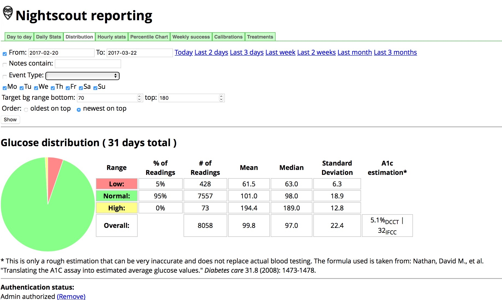

# Reports

Nightscout offers some fantastic data-crunching report tools in the settings area (the upper right corner, three horizontal lines).  You can play around with various date ranges, target ranges, and provide reports to your endocrinologist to review.

{width="700"}
{align="center"}

{width="y00"}
{align="center"}
