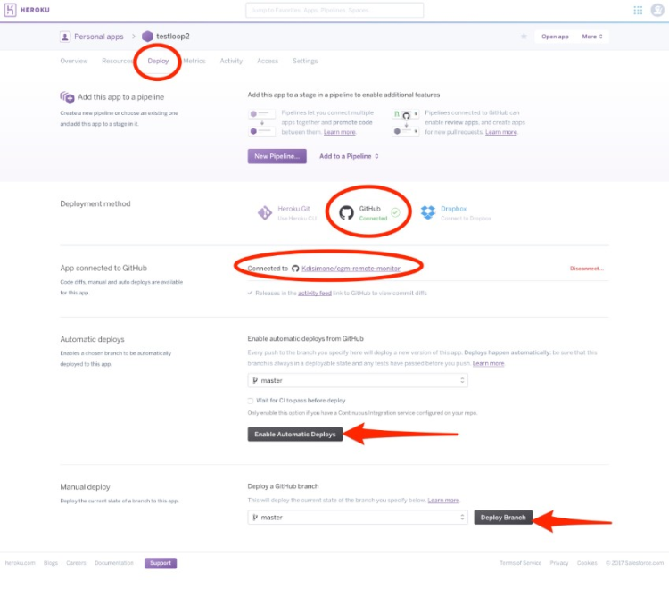

# UPDATING NIGHTSCOUT SITE

If you are new to Loop and haven’t updated your NS site since before December 1, 2016, you will want to update your NS site.  You can run either the "master" or "dev" branches of cgm-remote-monitor with Loop.  To check what version your Nightscout site is running, go to your Nightscout site and pull open the site settings by clicking on the three horizontal lines at the top right of the screen.  Scroll down and see if you are running 0.9.2-dev-20161201 or newer for "dev" branch.  Notice the “dev” branch is date stamped 0.9.x-dev-YYYMMDD; or you’ll see version 0.9.2 for "master" branch deployments.

If you are a current NS user and simply want to update your site, this procedure will work as well.

## Updating your repository in GitHub

1. Copy, paste, and goto the one of the following links depending on which branch of cgm-remote-monitor you are currently running (replace "yourgithubname" with your actual GitHub user name)

For dev branch deployments:

https://github.com/yourgithubname/cgm-remote-monitor/compare/dev...nightscout:dev

 or for master branch deployments:

https://github.com/yourgithubname/cgm-remote-monitor/compare/master...nightscout:master

Click the big green "create pull request" button. Another screen will appear, fill in a title and click button to create the pull request, and then you can "Merge Pull Request", and finally "confirm merge".
 

If you don’t have your Heroku set-up to automatically update when your repository is updated, you may have to go into your Heroku “deploy” section and manually deploy your branch now that your repository has been updated.  Make sure you are connected to your GitHub cgm-remote-monitor repository.

## New Loopers Variables

For new Loopers (but old Nightscout users), you will need to add some variables to your Heroku site to Loop.  

1. Login to your Heroku site, select the “settings” tab near the top of the screen on your Heroku app.

2.  Click on “Reveal Config  Vars”.  Scroll down the bottom of the Config Vars lines until you find the last blank one.  You are going to add several additional lines of config vars for Loop use; the DEVICESTATUS_ADVANCED and ENABLE lines are required, the others just make Nightscout more useful when Looping.

<dl>
<dt>DEVICESTATUS_ADVANCED</dt>
<dd>true</dd>

<dt>ENABLE</dt>
<dd>loop pump careportal bridge basal iob cob sage cage</dd>

<dt>SHOW_FORECAST</dt>
<dd>loop</dd>

<dt>PUMP_RETRO_FIELDS</dt>
<dd>battery reservoir clock status</dd>

<dt>PUMP_FIELDS</dt>
<dd>battery reservoir clock status</dd>

<dt>SHOW_FORECAST</dt>
<dd>loop</dd>

<dt>SHOW_PLUGINS</dt>
<dd>loop pump cob iob sage cage careportal</dd>

<dt>PUMP_ENABLE_ALERTS</dt>
<dd>true</dd>

<dt>PUMP_URGENT_BATT_U</dt>
<dd>30</dd>
(this is the pump battery percentage that will trigger a red, urgent alert in NS)

<dt>PUMP_URGENT_BATT_V</dt>
<dd>1.25</dd>
(this is the pump battery voltage that will trigger a red, urgent alert in NS)

<dt>PUMP_URGENT_RES</dt>
<dd>10</dd>
(this is the reservoir volume that will trigger a red, urgent alert in NS)

<dt>PUMP_URGENT_CLOCK</dt>
<dd>30

<dt>LOOP_ENABLE_ALERTS</dt>
<dd>true</dd>

<dt>LOOP_WARN</dt>
<dd>20</dd>
(this is the minutes since Loop last successfully looped, the t1d will have a similar notification at this time through the Loop app.  this will be a yellow alert in NS.)

<dt>LOOP_URGENT</dt>
<dd>60</dd>
(same as the alert above, but will be red in color and have a shorter snooze option)
</dl>

3. Click on “Open App” in the top right corner of your Heroku site.

4.  Click on the settings (those three horizontal lines in upper right corner).  Now check  that your basal render is selected to either default or icicle (personal preference for how the temp basals show as blue lines in NS site), check the boxes that you’d like pills showing for info on your NS site in the SHOW PLUGINS (usually all of them), and then press save.

5.  Double check that your NS Profile settings are current and that you have a basal profile entered, if you want to see the temp basals that Loop is setting.

Your NIGHTSCOUT site is all set-up.  Congrats!

## EVENT HISTORY

Don't forget to keep you Loop App's Preferred Source set to "Event History" if you want your NS site to smoothly integrate.  Preferred Source set to "Reservoir Volumes" will result in carbs not being uploaded and temp basals not being displayed.
