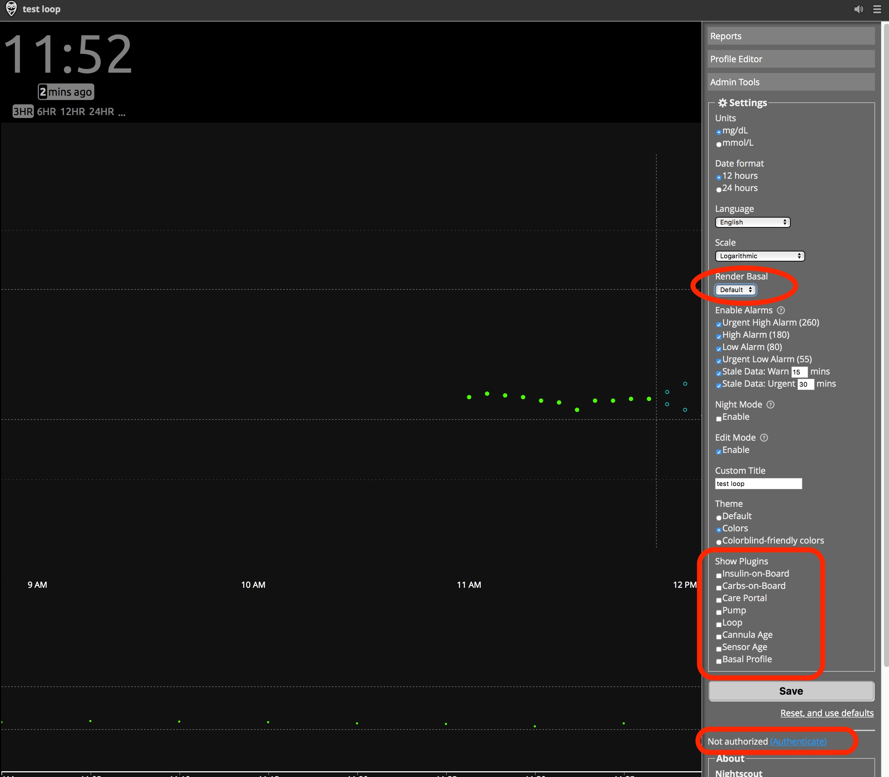

# Adding Loop to Existing NS

Many people may already have an existing Nightscout site setup from before adding Loop to their management strategies. In order to make the most of your Looping setup, you will need to modify your existing Nightscout site a bit specifically for Loop. The process is pretty easy and should not take long.

## New Variables for Loopers

The modifications for retrofitting an existing NS site for a new Loop user require you to make some edits to your Nightscout Config Vars.  These instructions are for people using Heroku, because that is the most common choice. If your Nightscout site is not on Heroku, this page provides a guide for the Config Vars used by Loop. There are five steps:

1. Login to Heroku, Open Settings Tab
2. Edit/Add Config Vars
3. Open Nightscout Site
4. Turn on Plugins
5. Update Profile Settings

### Step 1: Login to Heroku, Settings Tab

[Login to your Heroku account](https://id.heroku.com/login), select the `Settings` tab near the top of the screen on your Heroku app.

{width="600"}
{align="center"}

### Step 2: Edit/Add Config Vars

Click on `Reveal Config Vars`.  Scroll down the bottom of the Config Vars lines until you find the last blank one.  You are going to add several additional lines of config vars for Loop use; the DEVICESTATUS_ADVANCED and ENABLE lines are required, the others just make Nightscout more useful when Looping.

{width="600"}
{align="center"}

<table>
<thead>
<tr>
<th></th>
<th></th>
</tr>
</thead>
<tbody>
<tr>
<th>ENABLE</th>
<td>bridge loop pump iob cob basal careportal sage cage bage override dbsize  
<b>(Note: If you are an existing NS user, you likely already have an ENABLE line in this section of Heroku. Don't add a new one. Simply find the existing ENABLE line, click on the little pencil icon to the right of it, and add the words shown on the ENABLE line above to the existing words already on the enable line.  Avoid duplicates. The remainder of the lines are likely going to be brand new additions to your Heroku settings.)</b></td>
</tr>
<tr>
<th>DEVICESTATUS_ADVANCED</th>
<td>true</td>
</tr>
<tr>
<th>PUMP_FIELDS</th>
<td>battery reservoir clock status</td>
</tr>
<tr>
<th>PUMP_RETRO_FIELDS</th>
<td>battery reservoir clock status</td>
</tr>
<tr>
<th>SHOW_FORECAST</th>
<td>loop</td>
</tr>
<tr>
<th>SHOW_PLUGINS</th>
<td>loop pump cob iob sage cage careportal basal override dbsize</td>
</tr>
<tr>
<th>PUMP_ENABLE_ALERTS</th>
<td>true</td>
</tr>
<tr>
<th>PUMP_URGENT_BATT_U</th>
<td>30  (This is the pump battery percentage that will trigger a red, urgent alert in NS.)</td>
</tr>
<tr>
<th>PUMP_URGENT_BATT_V</th>
<td>1.25  (This is the pump battery voltage that will trigger a red, urgent alert in NS.)</td>
</tr>
<tr>
<th>PUMP_URGENT_RES</th>
<td>10  (This is the reservoir volume that will trigger a red, urgent alert in NS.)</td>
</tr>
<tr>
<th>PUMP_URGENT_CLOCK</th>
<td>30</td>
</tr>
<tr>
<th>LOOP_ENABLE_ALERTS</th>
<td>true</td>
</tr>
<tr>
<th>LOOP_WARN</th>
<td>20  (This is the minutes since Loop last successfully looped, the t1d will have a similar notification at this time through the Loop app.  This will be a yellow alert in NS.)</td>
</tr>
<tr>
<th>LOOP_URGENT</th>
<td>60  (Same as the alert above, but will be red in color and have a shorter snooze option.)</td>
</tr>
<tr>
<th>BASAL_RENDER</th>
<td>default</td>
</tr>
</tbody>
</table>

### Step 3: Open Your NS Site

Click on `Open App` in the top right corner of your Heroku site.

{width="600"}
{align="center"}

### Step 4: Turn on Plugins

Click on the "hamburger" menu (those three horizontal lines in the upper right corner).  Now check that your basal render is selected to either default or icicle (personal preference for how the temp basals show as blue lines in NS site), check the boxes that you’d like display pills in the SHOW PLUGINS (usually all of them), and then click save. (You are saving your display preferences, not modifying anything in the NS database.)

If you have not authenticated your site previously, and you want to use the care portal and have access to other tools, you can add your API Secret under this menu.

Note - Nightscout has been updated since this figure was generated.

{width="600"}
{align="center"}

## Nightscout Version Update

If you are new to Loop and haven’t updated your Nightscout site for a while, check to see if there's an available update. Visit [The Nightscout Update Instructions](https://nightscout.github.io/update/update/) for directions on updating.
