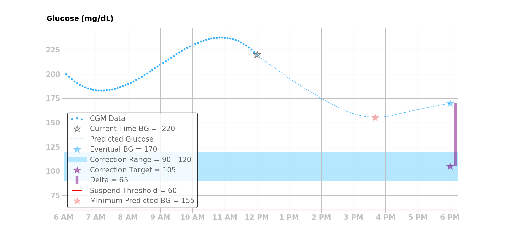
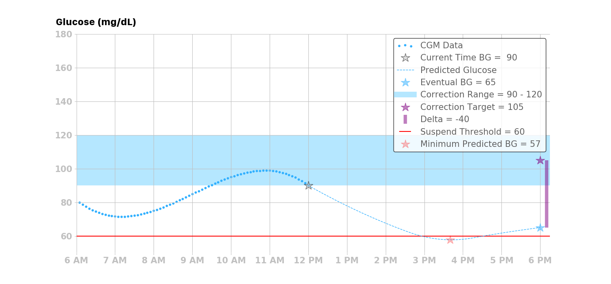
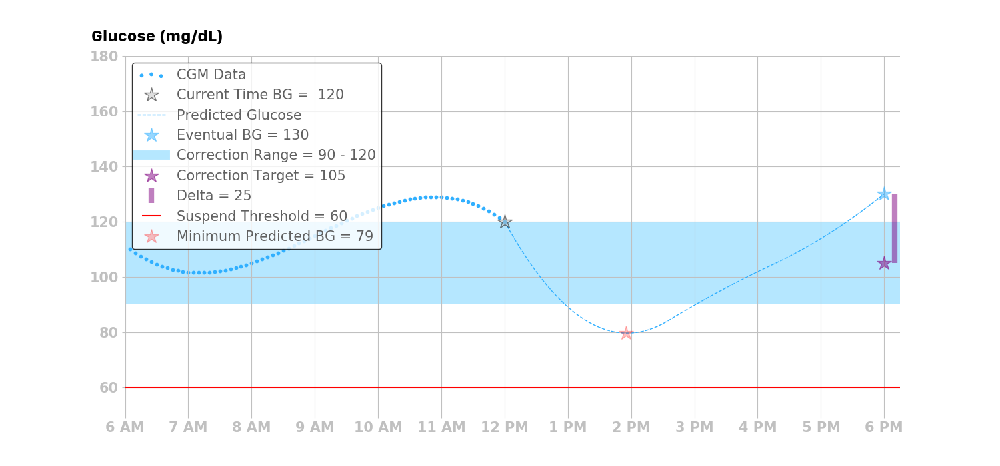

## Calculated Dose

The *Loop* algorithm takes one of [four actions](#four-possible-actions) depending upon the glucose prediction, target range and glucose safety threshold when Closed Loop operation is enabled.

The recommended insulin dose (positive or negative) is calculated first, including all safety checks, and then the insulin delivery adjustments are applied based on the dosing strategy, while respecting the maximum Temp Basal and maximum Bolus values in the user's [Therapy Settings](../../loop-3/therapy-settings.md){: target="_blank" }. The automated dosing (increase or decrease) is updated with every CGM value - typically every 5 minutes.

If a decrease in insulin dose is recommended, this is always applied using a temporary basal rate that is less than the scheduled basal rate.

!!! abstract "Temporary Basal Duration"
    All temporary basal rate commands are issued for a duration of 30 minutes. If communication with the pump is lost, the last issued temporary basal rate will last for at most 30 minutes before the pump reverts to the user’s scheduled basal rates.

    The *Loop* app may enact a new temporary basal rate every 5 minutes based on incoming glucose readings.

**Dosing Strategy: Temp Basal Only**

If the Looper has selected Temp Basal Only Dosing Strategy and an increase in insulin dose is recommended, that increase is converted to a temporary basal rate that exceeds the current scheduled basal rate.

**Dosing Strategy: Automatic Bolus**

If the Looper has selected Automatic Bolus Dosing Strategy and an increase in insulin dose is recommended, then an automatic bolus, which is less than the recommended dose, is delivered promptly.

### No Automatic Dosing

If glucose is entirely below the correction range but above glucose safety level, no automatic increase in insulin delivery will be enacted. The Looper can tap on the manual bolus tool and get a recommendation, but no automatic bolus or high temp basal will be issued automatically until the glucose level is higher than the minimum value of the correction range.

The Pre-Meal button or a named override can be configured with a correction range lower than the scheduled correction to assist in getting insulin delivered automatically after meals.

## Four Possible Actions

With each new glucose reading, *Loop* implements one of four possible actions: [**decrease** basal rate](#decrease-basal-rate), [**increase** basal rate](#increase-basal-rate) or [**bolus automatically**](#deliver-automatic-bolus-with-scheduled-basal), [set **zero** basal rate](#zero-the-basal-rate), or [**resume** scheduled basal rate](#resume-basal-rate).

!!! info "Automatic Bolus"

    If you are using an Automatic-Bolus Dosing Strategy in closed Loop mode and *Loop* predicts you need an **increase** in insulin; this **increase** is provided as a percentage of the recommended bolus instead of an increased temporary basal. The default percentage is 40%.

    If you add the Algorithm Experiments option of [Glucose Based Partial Application](../../loop-3/features.md#glucose-based-partial-application-gbpa){: target="_blank" }, the percentage varies from 20% when glucose is lower to 80% when glucose is higher.

### Decrease Basal Rate

If the eventual glucose is less than the correction range and all of the predicted glucose values are above the suspend threshold, then *Loop* will issue a temporary basal rate that is lower than the current scheduled basal rate to bring the eventual glucose up to the correction target.

### Increase Basal Rate

or

### Deliver Automatic Bolus with Scheduled Basal

If the eventual glucose is greater than the correction range and all of the predicted glucose values are both above the suspend threshold and equal to or above the correction range, then the *Loop* app takes action to safely bring the eventual glucose down to the correction target. Refer to [Dosing Strategy](../../loop-3/settings.md#dosing-strategy){: target="_blank" }.

* Temp Basal Only Dosing Stategy: *Loop* will issue a temporary basal rate that is higher than the current basal rate
* Automatic Bolus Dosing Stategy: *Loop* will restore the pump to scheduled basal rate if a current temp basal is running and issue an automatic bolus

### Zero the Basal Rate

If the minimum predicted glucose goes below the suspend threshold, then *Loop* will issue a temporary basal rate of zero units per hour, regardless of the eventual glucose.

### Resume Basal Rate

There are three situations where the *Loop* algorithm will resume the current scheduled basal rate.

If the eventual glucose is within the correction range, and all of the predicted glucose values are above the suspend threshold, then *Loop* will resume the current scheduled basal rate.

If the eventual glucose is above the correction range, and the predicted glucose values have a temporary excursion below the correction range but still above the suspend threshold, then *Loop* will resume the current scheduled basal rate.

If the *Loop* algorithm does not have ALL of the data it needs to make a prediction, it will let the remaining temporary basal rate run its duration (maximum of 30 minutes), and then the basal rate will default back to the current scheduled basal rate, thus returning to the same therapy pattern that they would receive using a traditional insulin pump.

## Determine the Recommended Bolus

In the scenario where *Loop* will either increase basal rate or issue an automatic bolus, *Loop* calculates a “dose” in the same way doses are calculated in both open-loop and traditional insulin pump therapy. It's also the same math many people on multiple-daily injection therapy use. The benefit of *Loop* (and all other close-loop algorithms) is that it does this math every 5 minutes, and is far less prone to error than humans doing the math. *Loop* also does its math based on predicting into the future, which traditional pumps and humans, do not always have the time or inclination to do.

The amount of insulin needed, or dose, is calculated using the desired reduction in glucose and the user’s ISF. For the *Loop* algorithm, the desired reduction in glucose is the delta between the eventual glucose and the correction target:

$$ \mathit{dose} = \frac{\mathit{BG_{eventual}} - \mathit{BG_{target}}}{\mathit{I}\mathit{SF}} $$

!!! info "Loop Dose Calculation"

    A major difference between traditional pump therapy and how the *Loop* calculates dose is that in pump therapy the current glucose is used to estimate the dose, whereas in the *Loop* algorithm the eventual and minimum glucose predictions are also used in determining dosing decisions.

* Temp Basal Only Dosing Stategy: see [Determine the Temporary Basal Rate](#determine-the-temporary-basal-rate)
* Automatic Bolus Dosing Stategy: the amount of the automatic bolus is reduced from the recommended dose as explained in [Automatic Bolus](../../loop-3/settings.md#automatic-bolus){: target="_blank" }

### Determine the Temporary Basal Rate

When a recommended dose is calculated and the Dosing Strategy is set to Temp Basal Only, *Loop* converts the dose into a basal rate using the Loop’s temporary basal rate duration of 30 minutes:

$$ \mathit{BR_correction} = \frac{\mathit{dose}}{30 \mathrm{min}} = \frac{\mathit{dose}}{\frac{1}{2} \mathrm{hr}} = \frac{2 \times \mathit{dose}}{\mathrm{hr}} $$

where $\mathit{BR_correction}$ is the basal rate ( $\mathrm{\frac{U}{hr}}$ ), which is the amount of insulin needed over the next 30 minutes to bring the eventual glucose to the correction target. The basal rate, however, is the amount of basal rate needed beyond the user’s scheduled basal rate. As such, the required basal rate can be determined by:

$$ \mathit{BR_required} = \mathit{BR_scheduled} + \mathit{BR_correction} $$

Finally, *Loop* compares the $BR_{required}$ with the user-specified maximum temporary basal rate $BR_{max}$ setting to determine the temporary basal to issue:

$$ \mathit{BR_temp} = \max(\min( \mathit{BR_required}, \mathit{BR_max} ), 0) $$

After running the temporary basal calculation described above, *Loop* checks whether there is already an appropriate basal running with at least 10 minutes remaining. If so, *Loop* will not reissue the temporary basal. However, if the recommended temporary basal differs from the currently running temporary basal — or the current scheduled basal, when no temporary basal is running —  then *Loop* will replace the current basal rate with the recommended temporary basal rate.

As mentioned at the beginning of this section, the process of determining whether a temporary basal should be issued is repeated every 5 minutes.

### Temporary Basal Rate Calculation Example

To illustrate how the *Loop* calculates the temporary basal rate when there is a recommended bolus, consider the calculation for the following scenario:

* $\mathit{BG_eventual} = 200 \mathrm{\frac{mg}{dL}}$
* $\mathit{BG_target} = 100 \mathrm{\frac{mg}{dL}}$
* ${\mathit{I}\mathit{SF} = 50 \mathrm{\frac{\frac{mg}{dL}}{U}}}$
* $\mathit{BR_scheduled} = 1 \mathrm{\frac{U}{hr}}$
* $\mathit{BR_max} = 6 \mathrm{\frac{U}{hr}}$ (set by user in Loop)

First, calculate the dose:

$$ dose = \frac{\mathit{BG_eventual} - \mathit{BG_target}}{\mathit{I}\mathit{SF}} = \frac{200 \mathrm{\frac{mg}{dL}} - 100 \mathrm{\frac{mg}{dL}}}{50 \mathrm{\frac{\frac{mg}{dL}}{U}}} = 2 \mathrm{U} $$

Then, convert the dose into a basal rate to be issued for the next 30 minutes:

$$ \mathit{BR_correction} = \frac{2 \times \mathit{dose}}{\mathrm{hr}} = \frac{2 \times 2 \mathrm{U}}{\mathrm{hr}} = 4 \mathrm{\frac{U}{hr}} $$

Next, calculate the required basal rate:

$$ \mathit{BR_required} = \mathit{BR_scheduled} + \mathit{BR_correction} = 1 \mathrm{\frac{U}{hr}} + 4 \mathrm{\frac{U}{hr}} = 5 \mathrm{\frac{U}{hr}} $$

Lastly, compare the required basal rate to the maximum temporary basal rate, and find that *Loop* will enact a temporary basal rate of $5 \mathrm{\frac{U}{hr}}$ for 30 minutes since this temporary basal rate is below the maximum temporary basal rate of $6 \mathrm{\frac{U}{hr}}$, which was set by the user in *Loop* app settings.

$$ \mathit{BR_{temp}} = \max(\min( \mathit{BR_{required}}, \mathit{BR_max}), 0) = \max(\min( 5 \mathrm{\frac{U}{hr}}, 6 \mathrm{\frac{U}{hr}} ), 0) = 5 \mathrm{\frac{U}{hr}}$$

### More Temporary Basal Examples

Consider the following values as fixed values for our calculation:

* $\mathit{BG_target} = 100 \mathrm{\frac{mg}{dL}}$
* $\mathit{I}\mathit{SF} = 50 \mathrm{\frac{\frac{mg}{dL}}{U}}$
* $\mathit{BR_scheduled} = 1 \mathrm{\frac{U}{hr}}$
* $\mathit{BR_max} = 6 \mathrm{\frac{U}{hr}}$

The table below shows the $\mathit{BR_temp}$ for different $\mathit{BG_eventual}$. $\mathit{BR_temp}$ should never turn negative and should never be greater than $\mathit{BR_max}$.

| $\mathit{BG_eventual}$ $\mathrm{(\frac{mg}{dL}})$ | $\mathit{dose}$ $\mathrm{(U)}$ | $\mathit{BR_correction}$ $\mathrm{(\frac{U}{hr}})$ | $\mathit{BR_required}$ $\mathrm{(\frac{U}{hr}})$ | $\mathit{BR_temp}$ $\mathrm{(\frac{U}{hr})}$ |
|--------------------------------------------------:|-------------------------------:|---------------------------------------------------:|-------------------------------------------------:|---------------------------------------------:|
|                                               300 |                            4.0 |                                                8.0 |                                              9.0 |                                          6.0 |
|                                               200 |                            2.0 |                                                4.0 |                                              5.0 |                                          5.0 |
|                                               100 |                            0.0 |                                                0.0 |                                              1.0 |                                          1.0 |
|                                                90 |                           -0.2 |                                               -0.4 |                                              0.6 |                                          0.6 |
|                                                75 |                           -0.5 |                                               -1.0 |                                              0.0 |                                          0.0 |
|                                                50 |                           -1.0 |                                               -2.0 |                                             -1.0 |                                          0.0 |

## Algorithm Section Menu

* [Algorithm Overview](overview.md)
    * [Bolus Recommendations](bolus.md)
    * [Glucose Prediction](prediction.md)
    * [Automatic Dosing Adjustments](auto-adjust.md)
