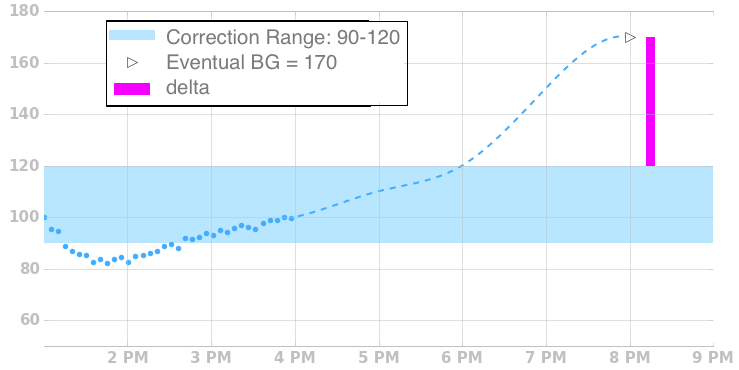

# Bolus Recommendations

Loop also uses the forecast to generate recommendations for bolus amounts. Carbs are not directly used in bolus calculations, but rather indirectly through the forecast. After carbs are entered, the forecast is updated using the carb amounts, and then a recommendation is generated using the forecast.

The forecast used for bolusing is slightly different than the forecast used for adjust temp basals in that positive BG momentum is not included.

## Eventual BG Above Target Range

A bolus recommendation is given if Eventual BG is above Target Range.  The delta between Eventual BG and the top of the Target Range is used, along with your current Insulin Sensitivity to calculate the recommendation.
