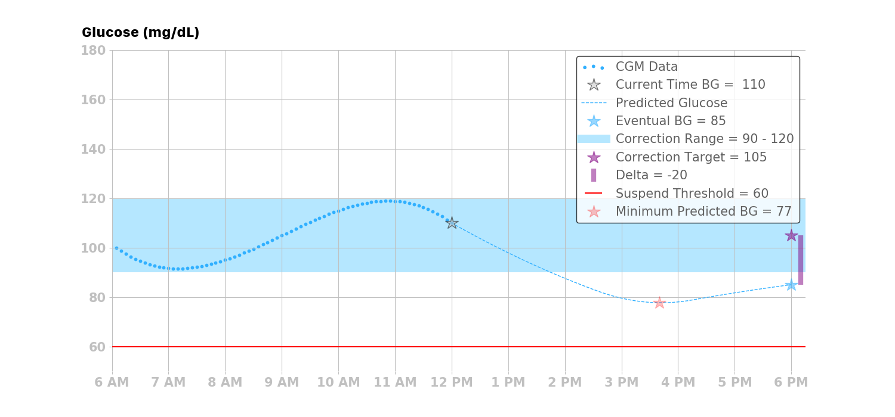

## Loop Algorithm

Loop’s algorithm for adjusting insulin delivery is oriented around making a blood glucose prediction. Every five minutes, triggered by new blood glucose data, it generates a new prediction. Both [bolus recommendations](bolus.md) and [temporary basal rate adjustments](temp-basal.md) are set based on this [prediction](prediction.md).

## Algorithm Terminology

This graph and legend illustrates terms commonly used in discussing Loop's algorithm,
and shows them in the context of historical and forecasted blood glucose in style similar to the
status screen of Loop.

|  |  |
|---------|---------|
|Insulin activity duration|The insulin activity duration is the duration of the insulin activity curve, and describes the point at which the delivered insulin dose no longer affects blood glucose. The insulin activity duration is 6 hours for Loop's rapid-acting and ultra-rapid insulin models.|
|Correction range|The correction range is the blood glucose range Loop uses to determine corrective actions (e.g., between 90 and 120 mg/dL in the figure). NOTE: Loop’s correction range is a user setting and should not be confused with the target range, typically 70-180 mg/dL, used for the purpose of calculating the percent time in range.|
|Correction minimum|The lower or minimum value of the user’s correction range, which is 90 mg/dL in the figure.|
|Correction maximum|The upper or maximum value of the user’s correction range, which is 120 mg/dL in the figure.|
|Correction target|The correction target is the average value of the correction range. In the overview figure, this is 105 mg/dL given that the correction minimum is 90 mg/dL and the correction maximum is 120 mg/dL.|
|Predicted blood glucose|Loop makes a prediction of blood glucose values out for a length of time equal to your insulin action duration. The predicted blood glucose is the basis for how Loop makes its insulin delivery recommendations and actions.|
|Eventual blood glucose|The last value of the predicted glucose curve, in other words the very last blood glucose predicted at the end of your insulin action duration. In the figure above, this is 85 mg/dL.|
|Minimum predicted blood glucose|The lowest blood glucose value at any point in time within the prediction. In the figure above, this is 77 mg/dL.|
|Delta|The delta is the difference between the eventual blood glucose and the correction target. In the overview figure, the eventual blood glucose is 85 mg/dL and the correction target is 105 mg/dL, which means that the delta is  -20 mg/dL. |
|Suspend Threshold|The suspend threshold is a safety feature of the Loop algorithm. If any predicted blood glucose is below this threshold, the Loop algorithm will issue a temporary basal rate of 0|
|CGM data|Blood glucose readings made by a continuous glucose monitor.|
|Insulin sensitivity factor|A configuration value that provides an estimate of how much blood glucose will drop given a unit of insulin.|
|Active insulin|Active insulin, often referred to as Insulin-on-Board (IOB), is the remaining amount of insulin activity from boluses and temporary basal rates relative to a user’s scheduled basal rates. More specifically, it is the total amount of insulin activity due to all bolus and basal insulin delivered within the last N hours, where N is determined by the insulin activity duration. The amount of “active” insulin depends upon the insulin activity curve, and also accounts for the insulin withheld via basal suspensions. As such, it is possible that the active insulin can be negative. Negative active insulin will result in an increase in predicted blood glucose. The active insulin displayed in Loop's main display does not reflect the currently enacted temporary basal rate, as that basal rate may be canceled or modified before completion over the next 30 minutes. In others words, Loop doesn't count chickens before the eggs hatch...insulin delivery must be confirmed before being added to the active insulin reporting.|

## Algorithm Section Menu

* [Algorithm Overview](overview.md)
    * [Bolus Recommendations](bolus.md)
    * [Blood Glucose Prediction](prediction.md)
    * [Temp Basal Adjustments](temp-basal.md)
