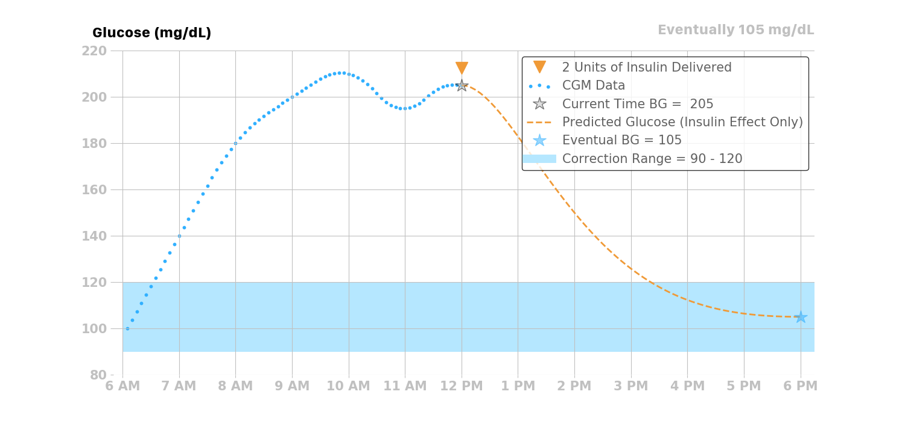
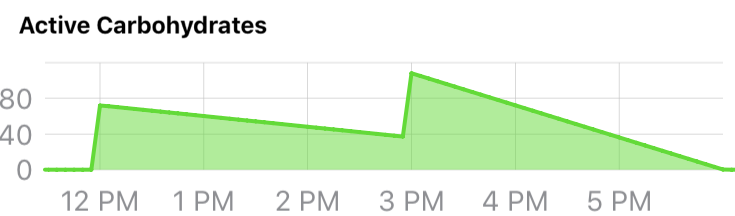

# Blood Glucose Prediction

Loop uses an algorithm to maintain blood glucose in a correction range by predicting the contributions from four individual effects (insulin, carbohydrates, retrospective correction, and blood glucose momentum) at any time *t* to recommend temporary basal rate corrections and boluses. 

You can see the individual contributions of these effects by tapping on the predicted blood glucose chart on Loop's status screen. Loop updates this blood glucose prediction every five minutes when a new CGM value has been received and the pump's status has been updated.

Just a note, this whole section is fairly technical. While perhaps not the most interesting topic for many readers, if you are seeking the detailed view of the Loop algorithm this discussion is quite useful. If you want a more surface understanding, the overview and temporary basal recommendations sections alone are probably sufficient.

## Overview
Before we delve into each of the four individual effects, a general overview figure may be a helpful start. There are four effects summed together to produce Loop's final predicted blood glucose curve. Each individual effect, along with their combined effect, are illustrated in the figure below. Insulin, from boluses and temporary basals, will have a decreasing effect on the prediction. Carbohydrates will have an increasing effect on the prediction. Blood glucose momentum effect can have a positive or negative effect, depending on how blood glucose is trending in the most recent CGM values. As shown in the example below, blood glucose is trending slightly upwards at the time of the prediction. Therefore, the blood glucose momentum effect’s contribution is pulling up the overall prediction from the other three effects for a short time. Retrospective correction is having a decreasing effect on the prediction, indicating that the recent rise in blood glucose was not as large as had been previously predicted by Loop in the recent past. 

The sections below provide detailed information on each of the four contributions. 

## Insulin Effect
Most traditional pump users and caregivers are already familiar with the concept of an insulin activity curve, where the insulin’s effect is time dependent. Insulin takes a little while to affect blood glucose. The insulin effect typically peaks around one hour after giving insulin and then gradually decays. 

Loop provides users with two different classes of insulin models (i.e., an exponential model and the Walsh model). All of the exponential models have an insulin activity duration of 6 hours, whereas the insulin activity duration is customizable for the Walsh model. The rapid-acting and Fiasp insulin activity curves are modeled as exponential curves that match the shape of the insulin activity curves from insulin labeling, and as observed in both adults and children.

The amount of insulin effect remaining, or percent of remaining active insulin after an insulin bolus is delivered, is modeled mathematically in Loop with an exponential decay curve.

### Insulin Effect Remaining

If a user’s insulin sensitivity factor (ISF) is 50 mg/dL per 1 unit of insulin and the user gives 2 units of insulin, then the user’s blood glucose would be expected to drop 100 mg/dL within the 6 hours following the insulin delivery. This insulin effect can be visualized in several different ways: the expected active insulin, expected drop in blood glucose every 5 minutes after delivery, and expected cumulative drop in blood glucose. The figures below use the Rapid Acting - Adult insulin model in Loop.

### Active Insulin
This figure shows that 2 units of insulin are given initially, and the corresponding active insulin (i.e., insulin on board IOB) decays according to the curve below. 

The active insulin at any time is the product of original insulin delivered and the percent of insulin activity remaining. Knowing the expected active insulin over the next 6 hours, and the insulin sensitivity factor (50 mg/dL, in this case), Loop can calculate the expected drop in blood glucose from that dose of insulin as shown in the figure below.

NOTE: ISF is also a function of time, which means if the user’s scheduled ISF changes during the insulin activity time, it will change the expected drop in blood glucose due to the insulin effect. 

### Expected Change in Blood Glucose
Lastly, taking the first derivative (i.e., the rate of change) of the cumulative drop in the blood glucose curve yields the expected change in blood glucose over the insulin activity duration. For each dose of insulin given, Loop calculates the expected discrete drop in blood glucose at each 5-minute period for the insulin activity duration, as shown below.

###  Insulin Effect on Blood Glucose
For this example, assuming a user’s blood glucose was 205 mg/dL at the time of insulin delivery, Loop would predict a drop in blood glucose due to the two units delivered at 12 pm as shown in the figure below. 

### Scheduled Basal Rates
In traditional basal/bolus pump therapy, basal rates are set to accommodate the user's endogenous glucose production (EGP) that causes blood glucose to rise. If a user's basal settings were exactly right in traditional pump therapy, the user would have perfectly flat blood glucose all day, all other factors being equal.

In reality, people with type 1 diabetes, and their caregivers, know that basal settings are never exactly right. Every day is a little different, and a myriad of factors that affect blood glucose (e.g., including stress, hormones, sleep, etc.) may affect insulin needs. Some people have different basal profiles to accommodate these variations. Some people regularly tune and adjust their basal rates, and/or do so at their endocrinology clinic visits.

Since the Loop algorithm assumes that the user-set basal rates are reasonably correct, it calculates the effect of insulin relative to scheduled basal rates. If basal rates are not entirely correct, Loop can compensate a bit through the retrospective correction and blood glucose momentum effects, discussed later in this document.

The insulin delivery chart below displays a bar-graph history of the temporary basal rates enacted by Loop. The display is relative to the scheduled basal rates entered in the Loop settings. A rate displayed in this chart as +0 would indicate that no temporary basal rate was set and that the basal rate being delivered was the scheduled basal rate. Positive values indicate a temporary basal rate was set above the scheduled basal rate (i.e., more insulin delivered), and negative values indicate that a temporary basal rate was set below the scheduled basal rate (i.e., less insulin delivered).

For example, if the user’s scheduled basal rate is 1 U/hr, and Loop gives a temporary basal rate of 3 U/hr, then it will calculate the expected drop in blood glucose due to +2 U/hr of insulin.

Similarly if Loop sets a temporary basal rate of 0 U/hr for 1 hour, then the insulin effect will also be relative to the current scheduled basal rate of 1 U/hr, and Loop would predict the user’s blood glucose to increase by the amount of change from -1 U/hr of insulin. If the user’s ISF is 50 mg/dL, then Loop would predict blood glucose to rise 50 mg/dL over the insulin activity duration (6 hours). 

Here is a real-world example where Loop is setting many temporary basal rates over the the course of the day. The light orange bars are the temporary basal rates delivered and the solid orange line is the active insulin at any given time during the day.  

###  Total Insulin Effect (combining boluses and temporary basal rates)
Loop will combine or stack the active insulin of all the discrete (individual) boluses and temporary basal rates over the past insulin activity duration (6 hours), to predict the active insulin for the next 6 hours. As demonstrated above, using the predicted active insulin Loop can predict the blood glucose drop over the next 6 hours. 

Lastly, the combined effect of bolus and basal insulin are visually represented for the user by Loop’s insulin charts:

The insulin effect can be expressed mathematically:

where BG is the expected change in blood glucose with the units (mg/dL/5min), ISF is the insulin sensitivity factor (mg/dL/U) at timet, and IA is the insulin activity (U/5min)at time <i>t</i>. Insulin activity can also be thought of as a velocity or rate of change in blood glucose due to insulin. The insulin activity accounts for the EGP and any active insulin from basals and boluses.

## Carbohydrate Effect

Carbohydrates will raise blood glucose, but the speed and degree to which they impact blood glucose is dependent on the type of carbohydrates. High glycemic index (GI) carbohydrates will raise blood glucose quickly over a shorter time, whereas low GI foods will raise blood glucose more slowly over a longer period. Foods like candy, juice, and fruits tend to be high GI foods, while pizza, burritos, and quesadillas are usually lower GI foods. Digestion issues like gastroparesis may also contribute to variations in carbohydrate absorption.

Because carbohydrate absorption can be quite variable, Loop has a model that dynamically adjusts the expected remaining time of carbohydrate absorption. To start with, Loop allows the user to input a rough guess of how long they think the food or drink will take to absorb. The user’s guess is used as a middle of the road estimate, and Loop’s algorithm will shorten or lengthen it based on observed blood glucose change.

For all carbohydrate entries, Loop assumes carbohydrates will not start absorbing for 10 minutes, so there is a 10-minute period of no absorption that is modeled prior to the absorption modeled in the next sections.

### Linear Carbohydrate Absorption
Loop takes a conservative view of how fast remaining carbohydrates will absorb.  Because it is safer to under-deliver insulin for long duration meals, Loop starts out at a minimum rate of absorption based on extending the entered carbohydrate duration by 50%. Said another way, the minimum carbohydrate absorption rate is the total number of grams of carbohydrates over 150% of the entered duration. 

Using this initial minimum absorption rate, remaining carbohydrates are modeled to absorb linearly. For example, if the user enters a 72g carbohydrate meal, and selects an estimated absorption time of 4 hours, then Loop will forecast a 12g/hr absorption rate for the next 6 hours. This rate can be termed the minimum absorption rate, which can be represented mathematically as:

where MAR is the minimum absorption rate (g/hr), CA is the amount of carbohydrates (g) and d is the expected duration (hr) it will take the carbohydrates to absorb. 

### Dynamic Carbohydrate Absorption
The linear model above is modulated by an additional calculation that uses recent observed blood glucose data to estimate how fast carbohydrates have been absorbing. The expected change in blood glucose due to insulin effects alone is compared to the actual observed changes in blood glucose. This difference is termed the insulin counteraction effect (ICE):

where, ICE (mg/dL/5 min) is the insulin counteraction effect, OA is the observed activity (mg/dL/5min) or observed change in blood glucose at time <i>t</i>, and IA is the insulin activity (mg/dL/5min). 

Insulin counteraction effects are caused by more than just carbohydrates, and can include exercise, sensitivity changes, or mis-set insulin delivery settings (e.g., basal rate, ISF, etc.). However, since the effect of carbohydrates is often dominant (after insulin), Loop can still make useful ongoing adjustments to its carbohydrate model by assuming that the an increase in blood glucose is mainly carbohydrate absorption in the period following recorded meal entries.  

The insulin counteraction effect is converted into an estimated carbohydrate absorption amount by using the current carbohydrate-to-insulin ratio and the insulin sensitivity factor at the time of the recorded meal entry.

where AC is the amount of carbohydrates absorbed (g/5min), ICE is the insulin counteraction effect, CIR is the carbohydrate-to-insulin ratio (g/U), and ISF is the insulin sensitivity factor (mg/dL/U) at time <i>t</i>. 

If multiple meal entries are active (i.e., still absorbing), the estimated absorption is split between each carbohydrate entry in proportion to each carbohydrate entry’s minimum absorption rate. For example, if 72g carbohydrates with an expected absorption time of 4 hours was consumed at 12 pm, and another 72g of carbohydrates with an expected absorption time of 2 hours was consumed at 3 pm, then the minimum absorption rate (see MAR equation above) would be 12 g/hr and 6 g/hr respectively, or 1 g/5min and 0.5 g/5min.

Examining just the simple linear carbohydrate effect of these two meals:

If we further expand this example, by assuming the following at 4pm:

* that there are still carbohydrates left to be absorbed from both meals, 
* that the estimated insulin counteraction effect (ICE) is +15 , and 
* the user’s CIR is 10 g/U and the ISF is 50 mg/dL/U,

then the estimated amount of carbohydrates absorbed at 4pm would be 3g:

Those 3g of carbohydrates would then be split amongst the meals proportional to their minimum absorption rates:

resulting in 2g of absorption being attributed to Meal 1 and 1g attributed to Meal 2.

### Minimum Carbohydrate Absorption Rate
If the estimated carbohydrate absorption of a meal entry is less what would have been absorbed using the minimum absorption rate, then the minimum absorption rate is used instead. This is to ensure that meal entries expire in a reasonable amount of time.

### Modeling Remaining Active Carbohydrates
After the estimated absorbed carbohydrates have been subtracted from each meal entry, the remaining carbohydrates (for each entry) are then forecasted to decay or absorb using the minimum absorption rate. Loop uses this forecast to estimate the effect (active carbohydrates, or carbohydrate activity) of the remaining carbohydrates. The carbohydrate effect can be expressed mathematically using the terms described above:

## Retrospective Correction Effect

!!!note ""
    The retrospective correction effect allows the Loop algorithm to account for effects that are not modeled with the insulin and carbohydrate effects, by comparing historical predictions to the actual blood glucose.

In addition to the modeled effects of insulin and carbohydrates, there are many other factors that affect blood glucose (e.g., exercise, stress, hormones, etc.). Many of these effects are active for a period of time. By observing its own forecast error, Loop can estimate the magnitude of these effects and, by assuming that they will continue for some short period of time, incorporate them into the forecast to improve forecast accuracy.

To do this, Loop calculates a retrospective forecast with a start time of 30 minutes in the past, ending at the current time. Loop compares the retrospective forecast to the actual observed change in blood glucose, and the difference is summed into a blood glucose velocity or rate of difference:

where BG*vel* is a velocity term (mg/dL per 5min) that represents the average blood glucose difference between the retrospective forecast (RF) and the actual blood glucose (BG) over the last 30 minutes. This term is applied to the current forecast from the insulin and carb effects with a linear decay over the next hour. For example, the first forecast point (t=5) is approximately 100% of this velocity, the forecast point one half hour from now is adjusted by 50% of the velocity, and points from one hour or more in the future are not affected by this term.

The retrospective correction effect can be expressed mathematically:

where BG is the predicted change in blood glucose with the units (mg/dL/5min) at time *t* over the time range of 5 to 60 minutes, and the other term gives the percentage of BG*vel* that is applied to this effect.

The retrospective correction effect can be illustrated with an example: if the BG*vel* over the past 30 minutes was -10 mg/dL per 5min, then the retrospective correction effect over the next 60 minutes would be as follows:

<table>
<thead>
<tr>
<th>Minutes relative to now (<i>t=0</i>)</th>
<th>Percent of BG<i>vel</i> Applied to RC Effect</th>
<th>
</tr>
</thead>
<tbody>
<tr>
<td>5</td>
<td>100%</td>
<td>-10</td>
</tr>
<tr>
<tr>
<td>10</td>
<td>91%</td>
<td>-9.1</td>
</tr>
<tr>
<td>15</td>
<td>82%</td>
<td>-8.2</td>
</tr>
<tr>
<td>20</td>
<td>73%</td>
<td>-7.3</td>
</tr>
<tr>
<td>25</td>
<td>64%</td>
<td>-6.4</td>
</tr>
<tr>
<td>30</td>
<td>55%</td>
<td>-5.5</td>
</tr>
<tr>
<td>35</td>
<td>45%</td>
<td>-4.5</td>
</tr>
<tr>
<td>40</td>
<td>36%</td>
<td>-3.6</td>
</tr>
<tr>
<td>45</td>
<td>27%</td>
<td>-2.7</td>
</tr>
<tr>
<td>50</td>
<td>18%</td>
<td>-1.8</td>
</tr>
<tr>
<td>55</td>
<td>9%</td>
<td>-0.9</td>
</tr>
<tr>
<td>60</td>
<td>0%</td>
<td>0</td>
</tr>
</tbody>
</table>

Here’s an example below that shows the retrospective correction effect when the BG*vel* over the past 30 minutes was -10mg/dL/5min.   

## Blood Glucose Momentum Effect 

!!!note ""
    The blood glucose momentum effect incorporates a prediction component based on the assumption that recent blood glucose trends tend to persist for a short period of time. In other words, the best predictor of the future is the recent past.

The blood glucose momentum portion of the algorithm gives weight or importance to recent blood glucose to improve the near-future forecast. Loop calculates the slope of the last 3 continuous CGM readings (i.e., the last 15 minutes) using linear regression. Using multiple points helps filter out noise in the CGM data while still responding fast to changing situations. That momentum slope (Mslope) is the approximate or average rate of change over the last 15 minutes, though it is normalized to 5 minutes so that the units are (mg/dL/5min). 

The momentum slope is then blended into the next 20 minutes of predicted blood glucose from the other effects (i.e., insulin, carbohydrates, and retrospective correction effects). This, in essence, makes the next 20 minutes of blood glucose prediction more sensitive to recent blood glucose trends. The blending of the recent trend slope into the next 20 minutes is weighted so that the first prediction point (5 minutes into the future) is highly influenced by the slope, and the influence of the slope gradually decays over the 20 minute time period. The momentum effect can be expressed mathematically as:

NOTE: The term  is also applied to the combined insulin, carbohydrates, and retrospective correction effects to get the delta blood glucose prediction. 

The momentum effect can be illustrated with an example: if the last 3 blood glucose readings were 100, 103, and 106 mg/dL, then the slope would be 3 mg/dL per 5 minutes (0.6 mg/dL per minute). The amount of that recent trend or slope applied to the next 20 minutes of predictions (i.e., the next 4 predictions from the other effects) is roughly 100% (3 mg/dL per 5 min) at 5 minutes, 66% (2 mg/dL per 5 min) at 10 minutes, 33% (1 mg/dL per 5 min) at 15 minutes, and 0% (0 mg/dL per 5 min) at 20 minutes.

Also, if the combined effect from the insulin, carbohydrates, and retrospective correction is assumed to be a constant 6 mg/dL/5min over the next 20 minutes, then the expected overall effect and the predicted blood glucose can be calculated as follows. 

<table>
<thead>
<tr>
<th>Minutes relative to now (<i>t=0</i>)</th>
<th>Percent of Slope Applied to Momentum Effect</th>
<th>Momentum Effect (3mg/dL/5min)</th>
<th>Percent of Other Effects Applied Overall Effect</th>
<th>Other Effects (Insulin, Carbohydrate, and Retrospective Correction)</th>
<th>Overall Effect (mg/dL/5min)</th>
<th>Predicted BG (mg/dL)</th>
</tr>
</thead>
<tbody>
<tr>
<td>5</td>
<td>100%</td>
<td>3</td>
<td>0</td>
<td>6</td>
<td>3</td>
<td>109</td>
</tr>
<tr>
<tr>
<td>10</td>
<td>66.6%</td>
<td>2</td>
<td>33.3%</td>
<td>6</td>
<td>4</td>
<td>113</td>
</tr>
<tr>
<td>15</td>
<td>33.3%</td>
<td>1</td>
<td>66.6%</td>
<td>6</td>
<td>5</td>
<td>118</td>
</tr>
<tr>
<td>20</td>
<td>0%</td>
<td>0</td>
<td>100%</td>
<td>6</td>
<td>6</td>
<td>124</td>
</tr>
</tbody>
</table>
This example is illustrated in the figure below.

It is also worth noting that Loop will not calculate blood glucose momentum in instances where CGM data is not continuous (i.e., must have at least three continuous CGM readings to draw the best-fit straight line trend). It also will not calculate blood glucose momentum when the last three CGM readings contain any calibration points, as those may not be representative of true blood glucose momentum trends. 

## Predicting Glucose
As described in the momentum effect section, the momentum effect is blended with the insulin, carbohydrate, and retrospective correction effects to predict the change in blood glucose:

Lastly, the forecast or predicted blood glucose BG at time *t* is the current blood glucose BG plus the sum of all blood glucose effects BG over the time interval [t5, t]:

Each individual effect along with the combined effects are illustrated in the figure below. As shown, blood glucose is trending slightly upwards at the time of the prediction. Therefore, the blood glucose momentum effect’s contribution is pulling up the overall prediction from the other three effects for a short time. Retrospective correction is having a dampening effect on the prediction, indicating that the recent rise in blood glucose was not as great as had been previously predicted in the recent past. 

