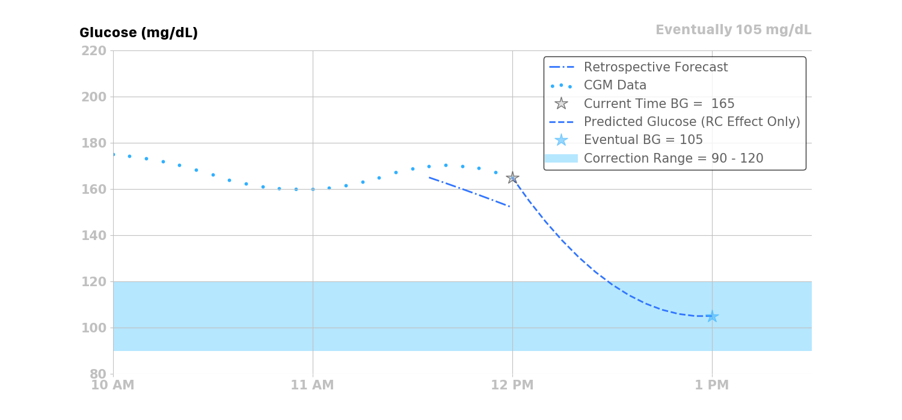

## Glucose Prediction

Loop uses a model predictive control (MPC) algorithm to maintain glucose in a correction range by predicting the contributions from four individual effects (insulin, carbohydrates, retrospective correction, and glucose momentum) at any time *t* to recommend temporary basal rate corrections and boluses.

$$ BG[t] = Insulin[t] + Carb[t] + RetrospectiveCorrection[t] + Momentum[t] $$

Note that the [Momemtum](#glucose-momentum-effect) term does not just add to the other effects as implied in the simple formula above; it is blended with the other terms as described in more detail in the [Momemtum](#glucose-momentum-effect) section below).

You can see the individual contributions of these effects by tapping on the glucose chart on Loop's main screen to view the  [Predicted Glucose Chart](loop-3/displays-v3.md#predicted-glucose-chart){: target="_blank" }. *Loop* updates this glucose prediction every five minutes when a new CGM value has been received and the pump's status has been updated.

Just a note, this whole page is fairly technical. While perhaps not the most interesting topic for many readers, if you are seeking the detailed view of the *Loop* algorithm this discussion is quite useful. If you want a more surface understanding, the overview, bolus and temporary basal recommendations pages alone are probably sufficient.

## Overview

Before we delve into each of the four individual effects, a general overview figure may be a helpful start. There are four effects summed together to produce Loop's final predicted glucose curve. Each individual effect, along with their combined effect, is illustrated in the figure below.

* Insulin, from boluses and temporary basals, will have a decreasing effect on the prediction
* Carbohydrates will have an increasing effect on the prediction
* Glucose Momentum effect can have a positive or negative effect, depending on how glucose is trending in the most recent CGM values
    * As shown in the example below, glucose is trending slightly upwards at the time of the prediction
    * Therefore, the glucose momentum effect’s contribution is pulling up the overall prediction from the other three effects for a short time
* Retrospective Correction is lowering the prediction, indicating that the recent rise in glucose was not as large as had been predicted by *Loop* in the recent past

The sections below provide detailed information on each of the four contributions.

## Insulin Effect

Most traditional pump users and caregivers are already familiar with the concept of an insulin activity curve, where the insulin’s effect is time-dependent. Insulin takes a little while to affect glucose. The insulin effect typically peaks around one hour after giving insulin and then gradually decays.

The *Loop* app uses an exponential model with insulin activity duration of 6 hours. The rapid-acting (Humalog, Novalog and Apidra types) and ultra-rapid (Fiasp and Lyumjev types) insulin activity curves are modeled as exponential curves to approximately match the shape of the insulin activity curves from insulin labeling, and as observed in both adults and children.

The Afrezza model is added as a non-pump insulin.

The Insulin Type is selected in the Pump Settings screen. All insulin types are modeled by selecting parameters in the exponential model. See also [Insulin Model Customization](../../version/code-custom-edits.md#insulin-model-customization){: target="_blank" } on the Code Customization page.

???+ info "What happened to . . . (Click to open/close)"
    The Walsh model is no longer used - ignore it in the figure below.
    
    The concept of child versus adult for "rapid" acting insulin, i.e., Humalog, Novalog and Apidra, is no longer provided by default. If you prefer to add back in the child model, you must modify a [Build Time Flag](../../version/build-time-flag.md){: target="_blank" }. The child model is included in the figure below

### Insulin Effect Remaining

The amount of insulin effect remaining, or percent of remaining active insulin after an insulin bolus is delivered, is modeled mathematically in *Loop* with an exponential decay curve.

If a user’s insulin sensitivity factor (ISF) is 50 mg/dL (2.7 mmol/L) per 1 unit of insulin and the user gives 2 units of insulin, then the user’s glucose would be expected to drop 100 mg/dL (5.4 mmol/L) within the 6 hours following the insulin delivery. This insulin effect can be visualized in several different ways: the expected active insulin, expected drop in glucose every 5 minutes after delivery, and the expected cumulative drop in glucose. The figures below use the Rapid Acting - Adult insulin model.

### Active Insulin

This figure shows that 2 units of insulin are given initially, and the corresponding active insulin (i.e., insulin on board IOB) decays according to the curve below.

The active insulin at any time is the product of original insulin delivered and the percent of insulin activity remaining. Knowing the expected active insulin over the next 6 hours, and the insulin sensitivity factor (50 mg/dL, in this case), *Loop* can calculate the expected drop in glucose from that dose of insulin as shown in the figure below.

NOTE: ISF is also a function of time, as set in the ISF schedule in therapy settings or in accordance with any overrides. *Loop* uses the ISF that applied at the time of an insulin dose to predict the expected change in glucose due to the insulin effect, and sums the effect from all still-active doses.

### Expected Change in Glucose for Each *Loop* Interval

Lastly, taking the first derivative (i.e., the rate of change) of the cumulative drop in the glucose curve yields the expected change in glucose over the insulin activity duration. For each dose of insulin given, *Loop* calculates the expected discrete drop in glucose at each 5-minute period for the insulin activity duration, as shown below.

The insulin effect for a given dose can be expressed mathematically:

$$ \Delta BG_{dose}[t] = \mathit{IS}\mathit{F}[t_{dose}] \times IA_{dose}[t] $$

where $\Delta BG_{I}$ is the expected change in glucose due to insulin with the units (mg/dL/5min), ISF is the insulin sensitivity factor (mg/dL/U) at the time of the relevant dose, and IA is the insulin activity (U/5min) at time *t*. Insulin activity can also be thought of as a velocity or rate of change in insulin in the blood as it acts on glucose. Insulin activity explicitly accounts for active insulin from temporary basals and boluses, and implicitly accounts for scheduled basal which is assumed to balance out with EGP.

### Insulin Effect on Glucose Over Time

For this example, assuming a user’s glucose was 205 mg/dL at the time of insulin delivery, *Loop* would predict a drop in glucose due to the two units delivered at 12 pm as shown in the figure below.

### Treatment of Scheduled Basal Rates

In traditional basal/bolus pump therapy, basal rates are set to accommodate the user's endogenous glucose production (EGP) that causes glucose to rise. If a user's basal settings were exactly right in traditional pump therapy, the user would have perfectly flat glucose all day, all other factors being equal.

In reality, people with type 1 diabetes, and their caregivers, know that basal settings are never exactly right. Every day is a little different, and a myriad of factors that affect glucose (e.g., including stress, hormones, sleep, etc.) may affect insulin needs. Some people have different basal profiles to accommodate these variations. Some people regularly tune and adjust their basal rates, and/or do so at their endocrinology clinic visits.

Since the *Loop* algorithm assumes that the user-set basal rates are correct, it calculates the effect of insulin relative to scheduled basal rates. If basal rates are not entirely correct, *Loop* can compensate a bit through the retrospective correction and glucose momentum effects, discussed later in this page. Similarly, the *Loop* algorithm accomodates discrepanies in carbohydrate amounts and absorption times as will be disussed later in [Carbohydrate Effect](#carbohydrate-effect).

The insulin delivery chart below displays a bar-graph history of the temporary basal rates enacted by Loop. The display is relative to the scheduled basal rates entered in the *Loop* settings. A rate displayed in this chart as +0 would indicate that no temporary basal rate was set and that the basal rate being delivered was the scheduled basal rate. Positive values indicate a temporary basal rate was set above the scheduled basal rate (i.e., more insulin delivered), and negative values indicate that a temporary basal rate was set below the scheduled basal rate (i.e., less insulin delivered).

For example, if the user’s scheduled basal rate is 1 U/hr, and *Loop* gives a temporary basal rate of 3 U/hr, then it will calculate the expected drop in glucose due to +2 U/hr of insulin.

Similarly if *Loop* sets a temporary basal rate of 0 U/hr for 1 hour, then the insulin effect will also be relative to the current scheduled basal rate of 1 U/hr, and *Loop* would predict the user’s glucose to increase by the amount of change from -1 U/hr of insulin. If the user’s ISF is 50 mg/dL, then *Loop* would predict glucose to rise 50 mg/dL over the insulin activity duration (6 hours).

Here is a real-world example where *Loop* is setting many temporary basal rates over the course of the day. The light orange bars are the temporary basal rates delivered and the solid orange line is the active insulin at any given time during the day.  

### Total Active Insulin (combining boluses and temporary basal rates)

Loop will combine or stack the active insulin of all the discrete (individual) boluses and temporary basal rates over the past insulin activity duration (6 hours), to predict the active insulin for the next 6 hours. 

The active insulin taking into account boluses and variations from scheduled basal basal rates are visually represented for the user by Loop’s insulin charts:

### Total Insulin Effect (combining boluses and temporary basal rates)

The sum of all doses' effects on glucose are shown for the user in the 'Insulin' curve in the predicted glucose screen.

The total insulin effect at time *t* is the sum of effects from each active dose or temporary basal rate:

$$ \Delta BG_{I}[t] = \sum_{dose=1}^{n} \Delta BG_{dose}[t] $$

## Carbohydrate Effect

Carbohydrates will raise glucose, but the speed and degree to which they impact glucose are dependent on the type of carbohydrates.

* High glycemic index (GI) carbohydrates will raise glucose quickly over a shorter time
    * Foods like candy, juice, and fruits tend to be high GI foods
* Low GI foods will raise glucose more slowly over a longer period
    * Foods like pizza, burritos, and quesadillas are usually lower GI foods
* Digestion issues like gastroparesis may also contribute to variations in carbohydrate absorption
* If the Looper is using one or more adjunctive therapy drugs such as Metformin, GLP-1, SGLT2i or Pramlintide, the expected absorption time for typical meals may need to be increased and prebolus times may need to be reduced

Because carbohydrate absorption can be quite variable, *Loop* has a model that dynamically adjusts the expected remaining time of carbohydrate absorption. To start with, *Loop* allows the user to input a rough guess of how long they think the food or drink will take to absorb. The user’s guess is used as a middle of the road estimate, and Loop’s algorithm will shorten or lengthen it based on observed glucose change.

For all carbohydrate entries, *Loop* assumes carbohydrates will not start absorbing for 10 minutes, so there is a 10-minute period of no absorption that is modeled prior to the absorption modeled in the next sections.

### Linear Carbohydrate Absorption

!!! important "Loop no longer uses Linear Absorption"
    The *Loop* app now uses a non-linear rather than linear absorption model for carbohydrates. This provides an improved prediction and thus better control. However, it complicates the explanation.

    The simpler-to-explain linear model documentation found here provides insight into how carbohydrate absorption is handled. Just remember that the actual calculations inside the *Loop* app use non-linear asborption and has done so since *Loop* version 2.0, see [Non-Linear Carb Model Introduced as Default](../../version/releases-version2.md#non-linear-carb-model-introduced-as-default){: target="_blank" }

Loop takes a conservative view of how fast the remaining carbohydrates will absorb.  Because it is safer to under-deliver insulin for long-duration meals, *Loop* starts out at a minimum rate of absorption based on extending the entered carbohydrate duration by 50%. Said another way, the minimum carbohydrate absorption rate is the total number of grams of carbohydrates over 150% of the entered duration.

Using this initial minimum absorption rate, the remaining carbohydrates are modeled to absorb linearly. For example, if the user enters a 72g carbohydrate meal, and selects an estimated absorption time of 4 hours, then *Loop* will assume a 12g/hr absorption rate for the next 6 hours. This rate can be termed the minimum absorption rate, which can be represented mathematically as:

$$ MAR[t] = \frac{CA[t]}{1.5 \times d} $$

where MAR is the minimum absorption rate (g/hr), CA is the number of carbohydrates (g) and d is the expected duration (hr) it will take the carbohydrates to absorb.

### Dynamic Carbohydrate Absorption

The linear model above is modulated by an additional calculation that uses recently observed glucose data to estimate how fast carbohydrates have been absorbing. The expected change in glucose due to insulin effects alone is compared to the actual observed changes in glucose. This difference is termed the insulin counteraction effect (ICE):

$$ 
\mathit{IC}\mathit{E}[t] = \Delta BG_{O}[t] - \Delta BG_{I}[t] 
$$

where, ICE (mg/dL/5 min) is the insulin counteraction effect, $\Delta BG_{O}$ is the observed change in glucose (mg/dL/5min) at time *t*, and $\Delta BG_{I}$ is the modelled change in glucose due to insulin alone (i.e. the insulin effect as described above mg/dL/5min).

Insulin counteraction effects are caused by more than just carbohydrates, and can include exercise, sensitivity changes, or incorrectly configured insulin delivery settings (e.g., basal rate, ISF, etc.). However, since the effect of carbohydrates is often dominant (after insulin), *Loop* can still make useful ongoing adjustments to its carbohydrate model by assuming that the increase in glucose is mainly carbohydrate absorption in the period following recorded meal entries.  

The insulin counteraction effect is converted into an estimated carbohydrate absorption amount by using both the carbohydrate-to-insulin ratio and the insulin sensitivity factor that were current at the time of a recorded meal entry.

$$ AC[t] = \mathit{IC}\mathit{E}[t] \times \frac{CIR[t_{meal}]}{\mathit{IS}\mathit{F}[t_{meal}]} $$

where AC is the number of carbohydrates absorbed (g/5min), ICE is the insulin counteraction effect, CIR is the carbohydrate-to-insulin ratio (g/U) at the time of the relevant meal entry, and ISF is the insulin sensitivity factor (mg/dL/U) at the time of the relevant meal entry.

If multiple meal entries are active (i.e., still absorbing), the estimated absorption is split between each carbohydrate entry in proportion to each carbohydrate entry’s minimum absorption rate. For example, if 72g carbohydrates with an expected absorption time of 4 hours was consumed at 12 pm, and another 72g of carbohydrates with an expected absorption time of 2 hours was consumed at 3 pm, then the minimum absorption rate (see MAR equation above) would be 12 g/hr and 6 g/hr respectively, or 1 g/5min and 0.5 g/5min.

$$ MAR[t = 12pm] = \frac{ 72g }{ 1.5 \times 4hr } = 12 \frac{ g }{ hr } = 1 \frac{ g }{ 5min } $$

$$ MAR[t = 3pm] = \frac{ 72g }{ 1.5 \times 2hr } = 24 \frac{ g }{ hr } = 2 \frac{ g }{ 5min } $$

The combined carbohydrate effect for these two meals is shown in the graphic below. The example in this section uses the linear absorption model, shown in the top part of the graphic. The subtle difference for the non-linear model, which is actually used in the *Loop* modeling, is shown in the bottom part of the graphic.

If we further expand this example, by assuming the following at 4pm:

* that there are still carbohydrates left to be absorbed from both meals,
* that the estimated insulin counteraction effect (ICE) is $+15 \frac{mg/dL}{5min}$, and
* the user’s CIR is $10 \frac{g}{U}$ and the ISF is $50 \frac{mg/dL}{U}$,

then the estimated amount of carbohydrates absorbed at 4pm would be 3g:

$$ AC[t = 4pm] = 15 \frac{mg/dL}{5min} \times \frac{10 \frac{g}{U}}{50 \frac{mg/dL}{U}} = 3 \frac{g}{5min} $$

Those 3g of carbohydrates would then be split amongst the meals proportional to their minimum absorption rates:

$$ \text{Proportion to Meal1} = \frac{MAR_{meal1}}{MAR_{meal1} + MAR_{meal2}} = \frac{12}{12+24}=\frac{1}{3} = 33.3\% $$

$$ \text{Proportion to Meal2} = \frac{MAR_{meal2}}{MAR_{meal1} + MAR_{meal2}} = \frac{24}{12+24}=\frac{2}{3} = 66.6\% $$

resulting in 1g of absorption being attributed to Meal 1 and 2g attributed to Meal 2.

### Minimum Carbohydrate Absorption Rate

If the dynamically-estimated carbohydrate absorption of a meal entry up to the current time *t* is less than what would have been absorbed using the minimum absorption rate, then the minimum absorption rate is used instead. This is to ensure that meal entries expire in a reasonable amount of time.

### Modeling Remaining Active Carbohydrates

After the estimated absorbed carbohydrates have been subtracted from each meal entry, the remaining carbohydrates (for each entry) are then predicted to decay or absorb using the minimum absorption rate. *Loop* uses this prediction to estimate the effect (active carbohydrates, or carbohydrate activity) of the remaining carbohydrates. The carbohydrate effect can be expressed mathematically using the terms described above:

$$ \Delta BG_{C}[t] = MAR[t] \times \frac{\mathit{IS}\mathit{F}[t_{meal}]}{CIR[t_{meal}]} $$

## Retrospective Correction Effect

!!! note ""

    The retrospective correction effect allows the *Loop* algorithm to account for effects that are not modeled with the insulin and carbohydrate effects, by comparing historical predictions to the actual glucose.

In addition to the modeled effects of insulin and carbohydrates, there are many other factors that affect glucose (e.g., exercise, stress, hormones, etc.). Many of these effects are active for a period of time. By observing its own prediction error, *Loop* can estimate the magnitude of these effects and, by assuming that they will continue for some short period of time, incorporate them into the model to improve prediction accuracy.

To do this, *Loop* calculates a retrospective prediction with a start time of 30 minutes in the past, ending at the current time. *Loop* compares the retrospective prediction to the actual observed change in glucose, and the difference is used to determine a glucose velocity or rate of difference:

$$ BG_{vel}=\frac{1}{6} \times \left(BG[0] - RF[0]\right) $$

where BG*vel* is a velocity term (mg/dL per 5min) that represents the average glucose difference between the retrospective prediction (RF) and the actual glucose (BG) over the last 30 minutes. This term is applied to the current prediction from the insulin and carb effects with a linear decay over the next hour. For example, the first prediction point (t=5) is 100% of this velocity, the prediction point one-half hour from now is adjusted by approximately 50% of the velocity, and points from one hour or more in the future are not affected by this term.

The retrospective correction effect can be expressed mathematically:

$$ \Delta BG_{\mathit{R}\mathit{C}}[t] = BG_{vel} \times \left(1-\frac{t-5}{55}\right) $$

where BG is the predicted change in glucose with the units (mg/dL/5min) at time *t* over the time range of 5 to 60 minutes, and the other term gives the percentage of BG*vel* that is applied to this effect.

The retrospective correction effect can be illustrated with an example: if the BG*vel* over the past 30 minutes was -10 mg/dL per 5min, then the retrospective correction effect over the next 60 minutes would be as follows:

| Minutes relative to now (*t=0*) | Percent of $BG_{vel}$ Applied to RC Effect | $\Delta BG_{\mathit{R}\mathit{C}}[t]$ |
|---------------------------------|--------------------------------------------|---------------------|
| 5                               | 100%                                       | -10                 |
| 10                              | 91%                                        | -9.1                |
| 15                              | 82%                                        | -8.2                |
| 20                              | 73%                                        | -7.3                |
| 25                              | 64%                                        | -6.4                |
| 30                              | 55%                                        | -5.5                |
| 35                              | 45%                                        | -4.5                |
| 40                              | 36%                                        | -3.6                |
| 45                              | 27%                                        | -2.7                |
| 50                              | 18%                                        | -1.8                |
| 55                              | 9%                                         | -0.9                |
| 60                              | 0%                                         | 0                   |

The example below that shows the retrospective correction effect when the BG*vel* over the past 30 minutes was -3 mg/dL/5min.

## Integral Retrospective Correction Effect

!!! note ""

    The integral retrospective correction effect allows the *Loop* algorithm to account for longer term effects that are not modeled with the insulin and carbohydrate effects, by comparing historical predictions to the actual glucose.

When Integral Retrospective Correction (IRC) is enabled in settings under Algorithm Experiments, this replaces the Retrospective Correction (RC).

* When _IRC_ is enabled the equation in [Glucose Prediction](#glucose-prediction) is modifed to:

$$ BG[t] = Insulin[t] + Carb[t] + IntegralRetrospectiveCorrection[t] + Momentum[t] $$

The Retrospective Correction section of the [Predicted Glucose Chart](../../loop-3/displays-v3.md#predicted-glucose-chart) is updated when _IRC_ is enabled, as shown in the graphic below. The `Integral effect`, inside lower blue rectangle, is the difference between the _IRC_ and _RC_ calculations.

{width="400"}
{align="center"}

## Glucose Momentum Effect

!!! note ""

    The glucose momentum effect incorporates a prediction component based on the assumption that recent glucose trends tend to persist for a short period of time. In other words, the best predictor of the future is the recent past.

The glucose momentum portion of the algorithm gives weight or importance to recent glucose to improve the near-future prediction. *Loop* calculates the slope of the last 3 continuous CGM readings (i.e., the last 15 minutes) using linear regression. Using multiple points helps filter out noise in the CGM data while still responding fast to changing situations. That momentum slope (Mslope) is the approximate or average rate of change over the last 15 minutes, though it is normalized to 5 minutes so that the units are (mg/dL/5min).

The momentum slope is then blended into the next 20 minutes of predicted glucose from the other effects (i.e., insulin, carbohydrates, and retrospective correction effects). This, in essence, makes the next 20 minutes of glucose prediction more sensitive to recent glucose trends. The blending of the recent trend slope into the next 20 minutes is weighted so that the first prediction point (5 minutes into the future) is highly influenced by the slope, and the influence of the slope gradually decays over the 20 minute time period. The momentum effect can be expressed mathematically as:

$$ \Delta BG_{M}[t] = M_{slope} \times \left( 1 - \frac{t-5}{15} \right) $$

NOTE: The term $\left(\frac{t-5}{15}\right)$ is also applied to the combined insulin, carbohydrates, and retrospective correction effects to get the delta glucose prediction.

The momentum effect can be illustrated with an example: if the last 3 glucose readings were 100, 103, and 106 mg/dL, then the slope would be 3 mg/dL per 5 minutes (0.6 mg/dL per minute). The amount of that recent trend or slope applied to the next 20 minutes of predictions (i.e., the next 4 predictions from the other effects) is roughly 100% (3 mg/dL per 5 min) at 5 minutes, 66% (2 mg/dL per 5 min) at 10 minutes, 33% (1 mg/dL per 5 min) at 15 minutes, and 0% (0 mg/dL per 5 min) at 20 minutes.

Also, if the combined effect from the insulin, carbohydrates, and retrospective correction is assumed to be a constant 6 mg/dL/5min over the next 20 minutes, then the expected overall effect and the predicted glucose can be calculated as follows.

|Minutes relative to now (*t=0*)|Percent of Slope Applied to Momentum Effect|Momentum Effect (3mg/dL/5min)|Percent of Other Effects Applied Overall Effect|Other Effects (Insulin, Carbohydrate, and Retrospective Correction)|Overall Effect (mg/dL/5min)|Predicted BG (mg/dL)|
|-------|-------|-------|-------|-------|-------|-------|
|5|100%|3|0|6|3|109|
|10|66.6%|2|33.3%<|6|4|113|
|15|33.3%|1|66.6%|6|5|118|
|20|0%|0|100%|6|6|124|

This example is illustrated in the figure below.

It is also worth noting that *Loop* will not calculate glucose momentum in instances where CGM data is not continuous (i.e., must have at least three continuous CGM readings to draw the best-fit straight line trend). It also will not calculate glucose momentum when the last three CGM readings contain any calibration points, as those may not be representative of true glucose momentum trends.

## Predicting Glucose

As described in the momentum effect section, the momentum effect is blended with the insulin, carbohydrate, and retrospective correction effects to predict the change in glucose:

$$ \Delta BG[t] = \Delta BG_{M}[t] + \left(\Delta BG_{I}[t] + \Delta BG_{C}[t]+ \Delta BG_{\mathit{R}\mathit{C}}[t] \right) \times min\left(\frac{t-5}{15}, 1\right) $$

Lastly, the predicted glucose BG at time *t* is the current glucose BG plus the sum of all glucose effects $\Delta BG$ over the time interval $[t_{5}, t]$:

$$ \widehat{BG}[t] = BG[t_{o}] + \sum_{i=5}^{t} \Delta BG[t_{o+i}] $$

Each individual effect along with the combined effects are illustrated in the figure below. As shown, glucose is trending slightly upwards at the time of the prediction. Therefore, the glucose momentum effect’s contribution is pulling up the overall prediction from the other three effects for a short time. Retrospective correction is lowering the current prediction, indicating that the recent rise in glucose was not as great as had been predicted in the recent past.

## Algorithm Section Menu

* [Algorithm Overview](overview.md)
    * [Bolus Recommendations](bolus.md)
    * [Glucose Prediction](prediction.md)
    * [Automatic Dosing Adjustments](auto-adjust.md)
