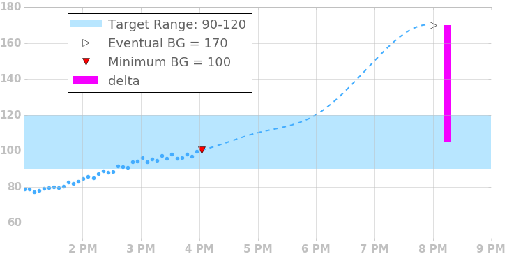
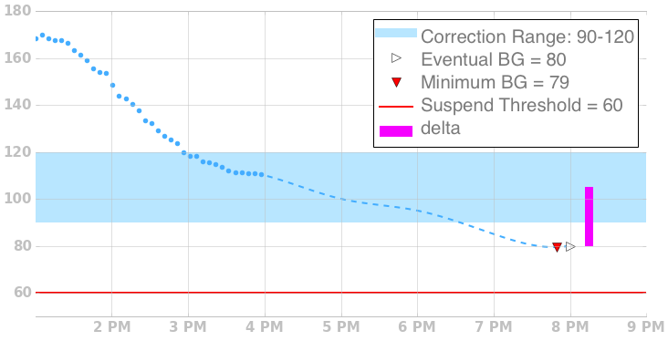
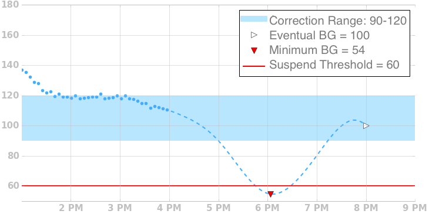

# Temp Basal Adjustments

If blood glucose is predicted to stray outside of the desired target range, Loop will adjust the basal rate temporarily in an attempt to keep actual blood glucose in range.  To illustrate how it does this, we’ll go through a few examples.

### Eventual BG Above Target Range

When eventual BG is predicted to go above the current target range, Loop will calculate a delta from eventual bg to the midpoint of the target range.  Using the currently scheduled insulin sensitivity factor, loop calculates a temporary basal rate above your currently scheduled basal rate that would deliver, over 30 minutes, enough insulin to bring glucose levels back into range, capped at the max basal rate.

### Eventual BG Below Target Range

When eventual BG is predicted to go below the current target range, Loop will calculate a delta from eventual bg to the midpoint of the target range.  Using the currently scheduled insulin sensitivity factor, loop calculates a temporary basal rate below your currently scheduled basal rate that would reduce insulin delivery, over 30 minutes, enough to bring glucose levels back into range.  It will reduce delivery to zero if needed.

### Temporary Excursion Below Range

If the prediction has a temporary excursion below range, but Eventual BG is in range, Loop will revert to using your normal basal schedule, as long as Minimum BG is above the guard.

### Minimum BG Below Minimum BG Guard

If Minimum BG drops below Minimum BG Guard, Loop will zero temp your pump regardless of where Eventual BG is.
