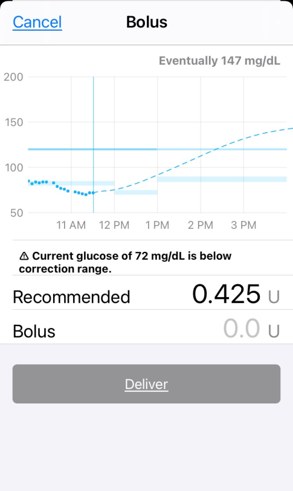

# Bolus

To start a bolus entry, tap on the double orange triangles (circled below) in the toolbar at the bottom of the Loop status screen.

{width="300"}
{align="center"}

The Loop app will open to the Bolus screen. This looks similar to the [Meal Bolus](carbs.md#meal-bolus) screen, but doesn't list the meal entry. If Loop predicts you need more insulin, there will be a recommended value. In this example, the current glucose is below the correction range, but the prediction is well above the range. Loop allows you to dip below the correction range but its recommended bolus will be limited by your Suspend Threshold. Check back once your blood glucose (BG) starts to rise and there will probably be a bigger recommendation.

You can tap on the `Recommended` line and that value will be transferred to the Bolus line or tap on 0.0u on the `Bolus` row and type in your desired bolus amount. As soon as a value is entered on the `Bolus` row, the Deliver button turns blue and can be tapped to deliver that amount via your pump.

{width="300"}
{align="center"}

## Correction Bolus

Loop reassesses your insulin needs every time a new BG reading is detected, typically every 5 minutes. If Loop predicts that your BG will be above the high end of your correction range at the end of the Duration of Insulin Activity (DIA) and that your BG will not dip below the suspend threshold at any point during that time period, it will calculate a Correction Bolus. Loop will not give an alert when a correction bolus is being recommended, the bolus entry tool must be clicked to check for one. The Loop pill in Nightscout will display when Loop is recommending a correction bolus.

* If your `Dosing Strategy` is set to `Temp Basal` (default)
    * Loop will provide increased temporary basal rates until it has delivered enough insulin to bring predicted BG into range
    * The increased temporary basal rates are subject to your Delivery Limits.
      

* If your `Dosing Strategy` is set to `Automatic Bolus`
    * Loop will recalculate the correction bolus at each successive loop interval, i.e., every 5 minutes
    * Loop will then automatically deliver 40% of that new correction value
    * Each automatic bolus is subject to your Delivery Limits

## Bolus Status Line

{width="900"}
{align="center"}

!!! warning "Lock Phone During Bolus"
    Once the bolus has started, you should lock your phone to avoid inadvertently cancelling a bolus.

When the phone is in portrait mode, a bolus status line will appear below the Heads Up Display when Loop has a bolus in progress. The "starting bolus" indicator is shown in the left screenshot above - this is when Loop is communicating with the RileyLink. Once the message has been sent to the RilyLink, even if a response from the pump did not make it back to Loop, the bolused xx of yy with the circle display begins, as shown in the right screenshot above. If you change your mind, just click on the bolus status line while the bolus is in progress to cancel your bolus, as shown in the screenshot below.  (Newer versions of Loop explicitly state: Tap to Stop on this line.) The amount bolused shown in this display is based on time.  Loop reconciles the bolus amount with messages received from the pump once the bolus completes.

{width="300"}
{align="center"}

If you see a 'pump is suspended notice' in the bolus status line after cancelling your bolus, just tap on it to resume pump operations.

## Bolus Failure Notifications

On occasion, you will receive a notification that a bolus may have failed. If your `Dosing Strategy` is set to `Automatic Bolus`, this can happen when an automatic bolus is in progress. In some of these cases, the bolus was delivered. On a Medtronic pump, you should check the pump screen to verify the bolus status before attempting to redeliver a failed bolus.  Omnipod users can hear the clicks if the room is quiet enough.

If you get an uncertain delivery message, you may still see the "bolused xx of yy" display continue for as long as it would have taken to actually deliver the bolus. This display is driven by a timer and logic on the phone. (Loop is not asking the pump repeatedly - "are you done yet?"). You may want to interrupt an uncertain bolus if it is large, evaluate status and then resume with a fresh bolus. Loop should update the status the next time it contacts the pump. It can determine whether that bolus actually went through or not and will update the screen.  Look at the Event History screen (accessed by tapping the Active Insulin or Insulin Delivery plots). Turn your phone to landscape orientation and you should see either "Certain" or "Uncertain" at the end of each Bolus record. (If you tap on the specific record, even more detail is displayed.)

If an "uncertain" delivery is not resolved:

* Make sure the RileyLink compatible device is communicating properly
* With Omnipod, you can execute a [Read Pod Status](../loop-settings/pump-commands.md#read-pod-status) to ensure communication with the pod is working
* [Quit the Loop app](https://support.apple.com/en-us/HT201330) and restart it. (Note - this is different from a power cycle of the phone which remembers settings within an app which was running before the power cycle.)

If that does not resolve the issue, please tap on Loop Settings, Issue Report and email it to yourself. Then [post](../../index.md#stay-in-the-loop) on Facebook or Zulipchat, explain what happened and say you have an Issue Report. Someone should reach out to you.
