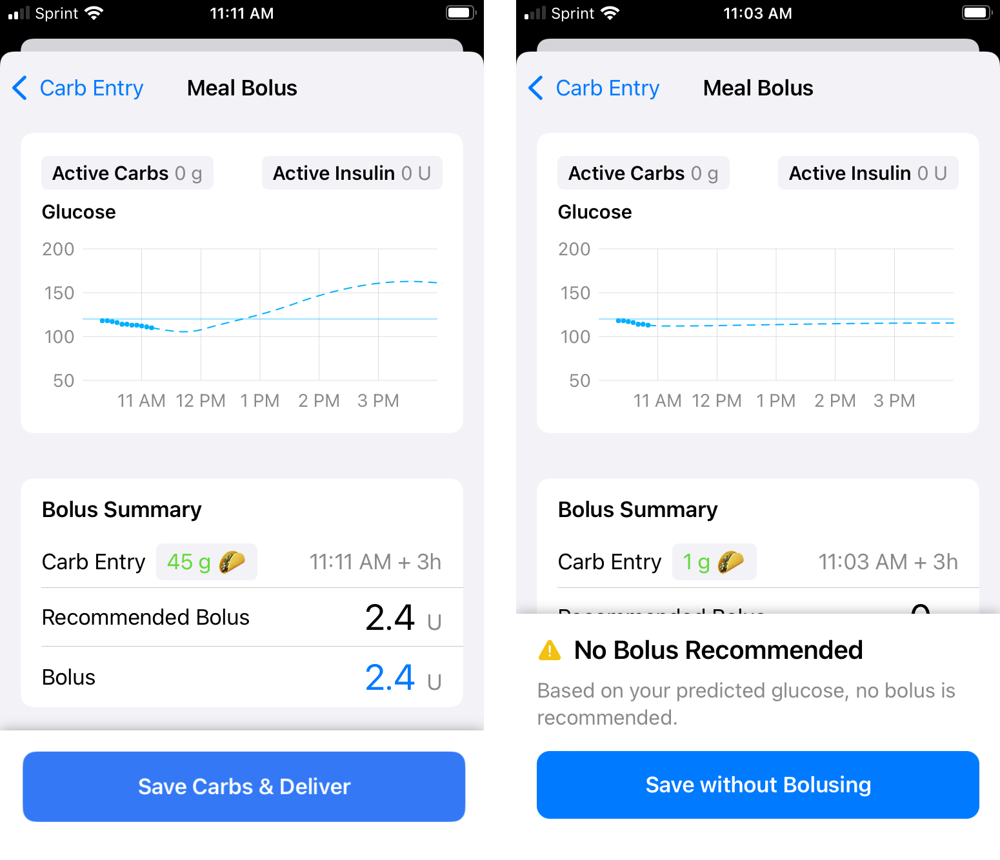
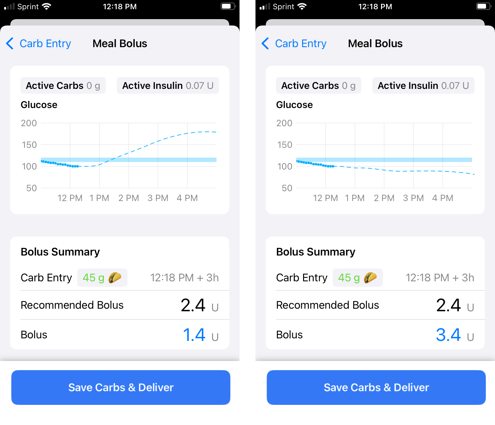

## Meal Bolus

The **Meal Bolus** screen is entered following a carb entry or edit action, the active button might be **Save Carbs & Deliver** or, if no bolus was recommended, **Save without Bolusing**. 

The **Save** refers to saving the Carb entry or Carb edit that led to this screen in addition to saving the amount that might be bolused. It can also refer to saving a fingerstick value entered in the Meal Bolus screen (Loop 3 only).

You can review the carb information at the [Meal Entry](carbs.md) link.

!!! Important "Avoid Double Entry of Carbohydrates"
    Carbohydrates are saved when the `Save Carbs & Deliver` or `Save without Bolusing` button is tapped in the Meal Bolus Screen. Once that the button is tapped, carbohydrates are saved. That is true even if the bolus does not go through to the pump.

    If you see a notification after saving a carbohydrate entry, check carbohydrates entries in the *Loop* app. Do **not** just add the entry again without checking.

### Accept Recommendation

The graphic below shows the Meal Bolus screen after the user entered carbs and tapped continue:

* The left graphic shows a case where a bolus is recommended - tapping on the **Save Carbs & Deliver** button saves the carbs and delivers the bolus
* The right graphic shows a case where no bolus is recommended - tapping on the **Save without Bolusing** saves the carbs
* These graphics are taken from a small phone - the left graphic shows all the information at once whereas the right graphic has an extra information message that requires the user to scroll to see the **Recommended Bolus** and **Bolus** rows
* For both graphics
    * Active Carbs and Active Insulin are displayed above the **Glucose** prediction graph - these are accurate at the time this screen is entered (before carbs or bolus are saved)
    * The Bolus Summary is presented below the **Glucose** prediction graph with three rows:
        * **Carb Entry**, the proposed carbs with the time to add the carbs and the absorption time displayed - to modify that information, tap on the **< Carb Entry** button at upper left
        * **Recommended Bolus** displays what Loop recommends for that proposed **Carb Entry**
        * **Bolus** default display is what Loop recommends, but user can edit that value

{width="900"}
{align="center"}

If a CGM entry arrives while in this screen, a **Bolus Recommendation Updated** modal message will be displayed and must be acknowledged.

### Modify Bolus

This section is a continuation of the information presented in the [Accept Recommendation](#accept-recommendation) section above. In the graphic below, the user overrides the recommended bolus.

* The left side shows a modified bolus less than the recommended bolus
* The right side shows a modified bolus greater than the recommended bolus
* The **Glucose** prediction graph updates with changes to the **Bolus** value, giving the user the opportunity to accept or change their proposed value before tapping **Save Carbs & Deliver**
* At the next Loop cycle, the app modifies insulin delivery based on the saved information
    * For the example with bolus less than recommended amount:
        * Loop will **NOT** begin to automatically increase insulin delivery until the current glucose is above the bottom of the **Correction** range
        * The recommendation to add insulin when the current glucose is below the **Correction Range** is only offered as a manual feature and is limited to an amount predicted to maintain glucose above the **Safety Threshold**
    * For the example with bolus greater than recommended amount:
        * Loop will probably issue an automatic temp basal of 0 U/hr
        * This is a common "super-bolus" scenario; in other words, "borrow" basal for the meal bolus to limit post meal spikes
* Remember - the **Glucose** prediction is what happens if you **Save Carbs & Deliver** and then no further adjustments are made to insulin delivery by Loop

{width="900"}
{align="center"}

## Manual (or Correction) Bolus

To start a bolus entry, tap on the double orange triangles (circled below) in the toolbar at the bottom of the Loop status screen.

{width="300"}
{align="center"}

The Loop app will open to the Bolus screen. This looks similar to the [Meal Bolus](#meal-bolus) screen without the Carb Entry row. Loop considers the Glucose Safety Limit and Predicted Glucose when determining the recommended bolus. 

In the graphic below, the current glucose is under the Correction Range. Loop allows you to dip below the correction range but its recommended bolus will be limited by the glucose prediction and the Glucose Safety Limit. Check back once your glucose starts to rise and there will probably be a bigger recommendation.

When the **Bolus** screen is entered directly from the toolbar, the button choices are **Enter Bolus** if none is recommended, **Deliver** if a value is on the **Bolus** row or **Cancel** using the button on the upper left. The user can also tap on the value on the **Bolus** row to bring up a keyboard to modify that amount. When doing that, the value is automatically set to zero.

The two graphics below are examples of manual bolus screens. 

* In the first graphic, no bolus was recommended
    * If you tap on the **Enter Bolus** button at the bottom, it brings up a screen to enable you to type in an amount and then **Deliver** it. 
    * Alternatively, you can tap the **0** amount in the **Bolus** row and perform the same action as the **Enter Bolus** button
    * If you do not want to override the recommendation, hit the **Cancel** button at upper left.

{width="350"}
{align="center"}

* In the second graphic, a recommended amount is shown
    * If you tap on **Deliver** that recommended dose is delivered
    * If you tap on the value on the **Bolus** row, you can override the amount
    * The amount displayed on the **Bolus** row is modified to 0 U with the first tap - at that point, you may enter a new value or tap **Cancel** using the button at upper left of the screen

{width="350"}
{align="center"}

### Recommended Bolus

Loop updates the glucose prediction every time a new glucose reading is detected, typically every 5 minutes. If Loop predicts your glucose will be above the high end of your Correction Range at the end of the Duration of Insulin Activity (DIA) and the predicted glucose is above the Glucose Safety Threshold, it will provide a Recommended Bolus. Loop will not give an alert when a bolus is being recommended, the bolus entry tool must be clicked to check for one. The Loop pill in Nightscout will display when Loop is recommending a bolus.

* If your **Dosing Strategy** is set to **Temp Basal** (default)
    * Loop will provide increased temporary basal rates until it has delivered enough insulin to bring predicted glucose into range
    * The increased temporary basal rates are subject to your Delivery Limits.

* If your **Dosing Strategy** is set to **Automatic Bolus**
    * Loop will recalculate the correction bolus at each successive loop interval, i.e., every 5 minutes
    * Loop will then automatically deliver 40% of that new correction value
    * Each automatic bolus is subject to your Delivery Limits

## Bolus Status Line

{width="900"}
{align="center"}

!!! warning "Lock Phone During Bolus"
    Once the bolus has started, you should lock your phone to avoid inadvertently cancelling a bolus.

When the phone is in portrait mode, a bolus status line will appear below the Heads Up Display when Loop has a bolus in progress. The "starting bolus" indicator is shown in the left screenshot above - this is when Loop is communicating with the RileyLink. Once the message has been sent to the RilyLink, even if a response from the pump did not make it back to Loop, the bolused xx of yy with the circle display begins, as shown in the right screenshot above. If you change your mind, just click on the bolus status line while the bolus is in progress to cancel your bolus, as shown in the screenshot below.  (Newer versions of Loop explicitly state: Tap to Stop on this line.) The amount bolused shown in this display is based on time.  Loop reconciles the bolus amount with messages received from the pump once the bolus completes.

{width="300"}
{align="center"}

If you see a 'pump is suspended notice' in the bolus status line after cancelling your bolus, just tap on it to resume pump operations.

## Bolus Failure Notifications

On occasion, you will receive a notification that a bolus may have failed. If your **Dosing Strategy** is set to **Automatic Bolus**, this can happen when an automatic bolus is in progress. In some of these cases, the bolus was delivered. On a Medtronic pump, you should check the pump screen to verify the bolus status before attempting to redeliver a failed bolus.  Omnipod users can hear the clicks if the room is quiet enough.

If you get an uncertain delivery message, you may still see the "bolused xx of yy" display continue for as long as it would have taken to actually deliver the bolus. This display is driven by a timer and logic on the phone. (Loop is not asking the pump repeatedly - "are you done yet?"). You may want to interrupt an uncertain bolus if it is large, evaluate status and then resume with a fresh bolus. Loop should update the status the next time it contacts the pump. It can determine whether that bolus actually went through or not and will update the screen.  Look at the Event History screen (accessed by tapping the Active Insulin or Insulin Delivery plots). Turn your phone to landscape orientation and you should see either "Certain" or "Uncertain" at the end of each Bolus record. (If you tap on the specific record, even more detail is displayed.)

If an "uncertain" delivery is not resolved:

* Make sure the RileyLink compatible device is communicating properly
* You can try to turn off Bluetooth and then turn it back on again
* [Quit the Loop app](https://support.apple.com/en-us/HT201330){: target="_blank" } and restart it. (Note - this is different from a power cycle of the phone which remembers settings within an app that was running before the power cycle.)

If that does not resolve the issue, please tap on Loop Settings, Issue Report and email it to yourself. Then [post](../../intro/loopdocs-how-to.md#how-to-find-help) on Facebook or Zulipchat, explain what happened and say you have an Issue Report. Someone should reach out to you.

There are other alert messages that might be displayed if the pump or CGM is not active.  Those are found on the [Loop 3 Displays](../../loop-3/displays-v3.md) page.
