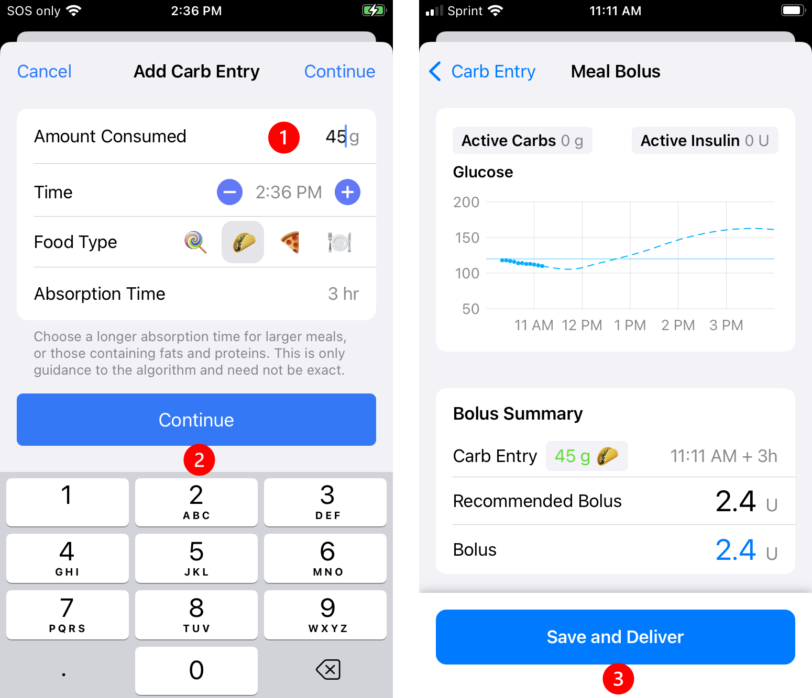
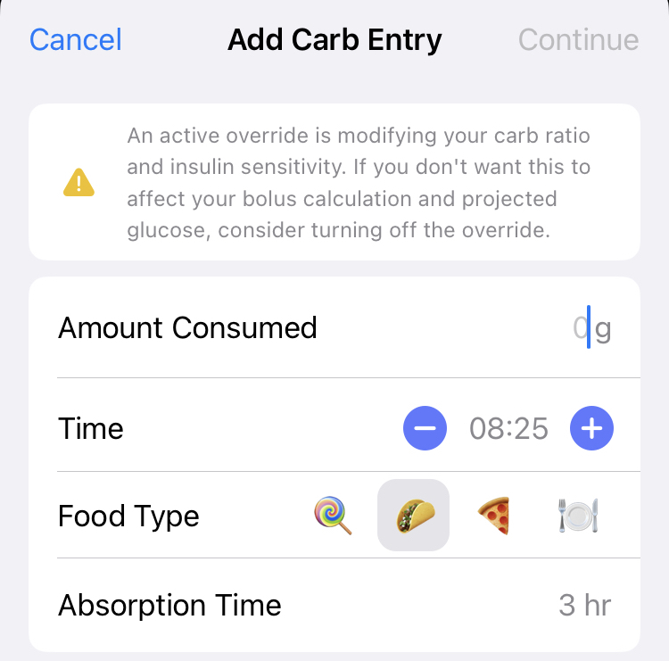
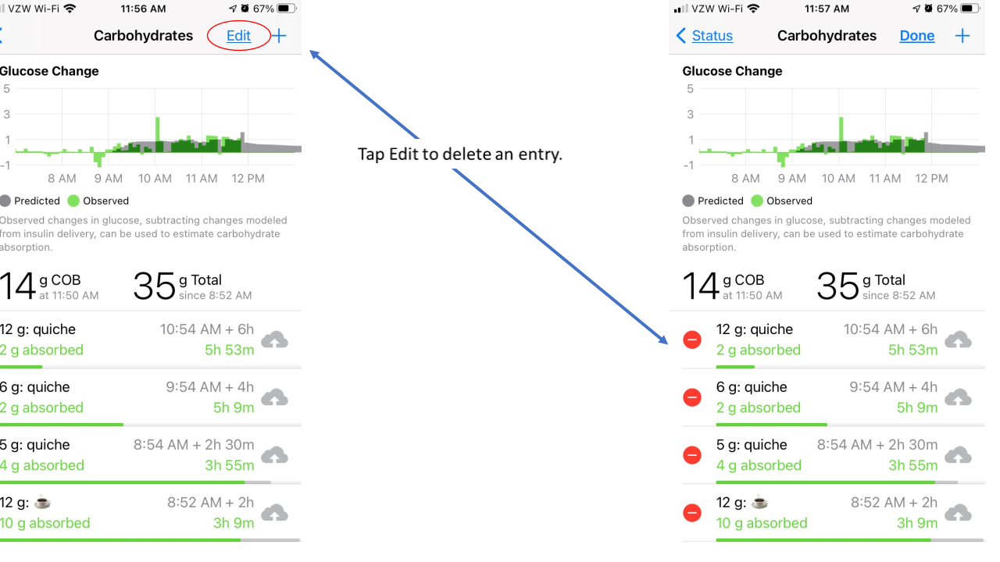
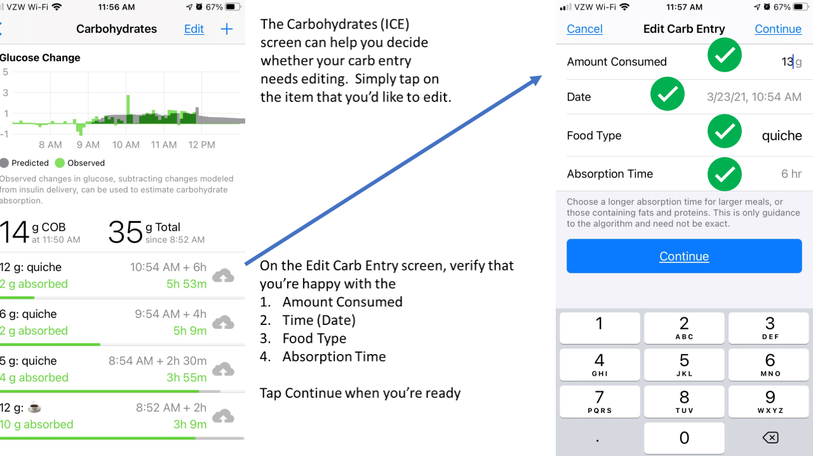

## Meal Entry

### New with Version 3.4.x

The [Favorite Foods](../../loop-3/features.md#favorite-foods){: target="_blank" } feature was added with version 3.4.x. This is an even faster way to enter meals than is described in the next section, Meal Entry - Fast Version.

The graphic in the link above was taken from my Favorite Foods screen. Subsequent to that screen shot, I've renamed Medium to Lunch and Large to Dinner. Note this is a personal solution that works for me; you need to modify your settings to work for you.

For each meal I select Lunch or Dinner, save and accept the bolus.

* If I know I will be eating less than usual (not often), I will edit the carb amount before saving
* If I know I will be eating more than usual, my typical approach is:
    * Accept the normal amount when I prebolus
    * When I sit down to eat, I increase the carb amount by multiples of 15 g, depending on the situation
* I use the fat-protein rise selection but advance the time to 4 hours after dinner

## Meal Entry - Fast Version

!!! tip "Favorite Foods is even faster"
    With version 3.4.x and later, you have access to the Favorite Foods feature. This can make meal entry even faster than this Fast Version section below.

    * See [New with Version 3.4.x](#new-with-version-34x) section above for an example use of this feature

To start a new meal entry, tap on the green plate icon (circled below) in the toolbar at the bottom of the Loop status screen. Your Loop app will open to the **Add Carb Entry** screen.

{width="300"}
{align="center"}

**Loop assumes carbs saved will be absorbed and Loop will adjust recommended insulin, and, when Closed Loop is enabled, Loop will adjust automated dosing based on those carbs.**

* Loop updates the carb estimate dynamically based on your glucose while meal is active
* Approximate entry is "good enough"; better to underestimate carbs than to overestimate
* The Loop recommended bolus can be modified by editing the **Bolus** amount after tapping the **Continue** button on the **Add** or **Edit Carb Entry** screen.

!!! tip "Beginner's Tip"
    * Add some amount of carbs when you normally would dose before or at a meal
        * Make sure the amount of insulin recommended is not more than you expect
        * If the amount seems too large, you might need to reduce Amount Consumed entry or adjust settings
    * Accept the defaults as directed below

### Meal Entry

The steps and graphics in this section are for users of Loop 3.

Tap the meal entry icon on the toolbar to open the **Add Carb Entry** screen:

1. Enter number of grams of carbs in the Amount Consumed row (keyboard appears automatically)
1. Tap continue to advance to the **Meal Bolus** screen (as shown in the graphic below)
1. Tap Save Carbs & Deliver to Save the carbs and Deliver the recommended bolus

The carbs are saved as soon as the [**Meal Bolus**](bolus.md#meal-bolus) screen is completed.

* If no bolus is recommended in the **Meal Bolus** screen:
    * A No Bolus Recommended warning appears with the reason why
    * The blue button on the **Meal Bolus** screen says Save without Bolusing
    * In this case, carbs are saved when the Save without Bolusing button is tapped

{width="600"}
{align="center"}

!!! warning "Carbs are Saved in Meal Bolus Screen"
    Carbohydrates are saved when the `Save Carbs & Deliver` or `Save without Bolusing` button is tapped in the Meal Bolus Screen. Once the button is tapped, carbohydrates are saved. That is true even if the bolus does not go through to the pump.

    If you see a notification after saving a carbohydrate entry, check carbohydrates entries in the *Loop* app. Do **not** just add the entry again without checking.

By tapping on the **Active Carbohydrates** chart on the main Loop display, previously entered carbs can be edited, refer to [Edit Meals](#edit-meals).

## Meal Entry Row by Row

Do you want to know more? This section discusses each row in turn.

### Amount Consumed

When entering the **Add Carb Entry** screen, the number keypad is deployed and when you start typing, that value is entered into the Amount Consumed row.

Tapping on any other row dismisses the number keypad. It can be restored by tapping on the Amount Consumed row.

Some value must be entered into the Amount Consumed row to continue.

Many Loopers increase the carbohydrate amount to cover the expected effect of protein and fat in their meal entry. For simplicity, the rest of this page only refers to carbs because all the figures show carbs or carbohydrates in the menus. You should consider the whole meal, including fat and protein, especially if you eat lower carb.

Loopers who consume mostly carbs in a given meal, might do better entering just the carbs.

### Time

Modifying the Time for a new meal entry from the default value of "now" is optional.

* Each tap on the **&minus;** icon changes the time earlier in 15 minute increments
* Each tap on the **&plus;** icon changes the time later in 15 minute increments
* Tap on the time to bring up a picker wheel for desired time

The 15 minute increments, which are also available on the watch interface, can be handy if the Looper chooses to prebolus.

Reasons to modify the time when entering a meal:

* Meal is planned for the future, e.g., prebolus now (optional)
    * If meal is planned more than 15 minutes from "now", it's a good idea to modify the time to the planned start time
    * In Closed Loop, insulin dosing adjusts for planned carbs while maintaining the Glucose Safety Limit
* Meal was eaten in the past but carbs were not entered
    * Loop does a better job with predictions if you enter the meal at the time it was eaten
    * Entering a previous meal (now) makes Loop think the carbs will all be in the future (not some of them in the past) and can cause too much insulin to be recommended / delivered
* Some foods, like pizza, may need entries to start later with a longer absorption time

Limits for time entry of when meal was consumed:

* The carbs can be entered up to 12 hours earlier or 1 hour later
    * When editing, this limit applies to the time when the carb entry was previously saved

### Food Type

Food Type entries are optional.

The information about the next row: [Absorption Time](#absorption-time) is also important when discussing Food Type entries.

* The first touch of any icon sets the absorption time to the value associated with that icon
    * This includes the 3 icons (Lollipop, Taco, Pizza) on the Food Type row
    * If you touch the plate icon (or the words Food Type), a new set of icons (food emoji) appear as shown in the graphic below
        * Each emoji is associated with Fast, Medium or Slow absorption time
        * The first emojis presented are medium - scroll in either direction to view the fast and slow emojis or tap on the short-cut tabs at the bottom of the screen
        * The emojis under Other have no effect on absorption time and they do not "count" as a first tap; e.g., wine followed by bacon updates absorption time to Slow.
* Any additional icon touches have no effect on selected absorption time
* At any time, the [Absorption Time](#absorption-time) picker can be used to adjust the absorption time

{width="600"}
{align="center"}

!!! tip "Pro Tip"
    * If you want to enter food emojis
        * Verify food absorption time when you are done
        * If you know you want to keep the 3 hour absorption time, tap the taco icon on the main screen before entering food emojis

!!! warning "Loop 3 Absorption Times"
    If you switched to Loop 3 from Loop 2.2.x, please be aware that absorption times for the Lollipop, Taco, Pizza icons have been updated.

    * Loop 3 uses 30 minute, 3 hours and 5 hours

!!! warning "Beware using Lollipop for Complex meals"
    If you select the Lollipop icon for a large complex meal with Loop 3, you tell Loop to expect glucose to rise rapidly (30 min absorption). When that rapid rise does not materialize, Loop may predict an unexpectedly low glucose because the algorithm assumes something must be affecting glucose downward in a strong way.

    If this happens to you, edit the carb entry to have a longer absorption time and Loop will recalculate the prediction.

    🍭 (Fast) is for simple foods often used for low treatments. Some Loopers use it for coffee.

### Absorption Time

Modifying the Absorption Time from the default value of 3 hours is optional.

* If you touch any icon on the main entry or [Food Type](#food-type) row, the absorption time associated with that icon becomes the new absorption time
    * Any additional icon touches have no effect on selected absorption time
* At any time, the Absorption Time picker can be used to adjust the absorption time

Loop uses the absorption time for the carbs, along with your glucose readings, ISF and CR to recommend insulin dosing and to estimate over time the carbs absorbed and carbs expected. See [Algorithm: Prediction](../algorithm/prediction.md) for more details.

Loop assumes a specific model for how those carbs will be absorbed that is spread out over an interval that is 150% of the selected time. This allows for variations in actual absorption.  More information about this model is found in the prediction link above.

Many meals can be entered with the medium (3 hour) default absorption time. Learn by experimenting and modify going forward. Evaluate the CR setting, as well as the entries for Amount Consumed and Absorption Time for adjusting meal entries. The amount of up-front insulin recommended is typically similar up through 3 hours absorption and then begins to decrease as absorption time is increased.

Experiment for yourself - how much does Loop recommend compared to a straight Carbs/CR value? Try this at different times; especially when glucose is nominal and flat compared to low and dropping or high and rising.

* Enter an absorption time and hit continue
* Examine recommended bolus
* Tap the **< Carb Entry** button at upper left
* Modify the absorption time and hit continue
* Repeat to get a feel for the up front bolus under different scenarios

### Continue

Carbs are not saved in the **Add Carb Entry** screen until the Continue button is pressed and the user saves those carbs in the [**Meal Bolus**](bolus.md#meal-bolus)  screen, follow the link for details.

### Large Meal Warning

If the `Amount Consumed` row exceeds 99 grams when the Continue button is tapped, the user is provided with a modal alert from which they can proceed to the Meal Bolus screen, or return to edit `Amount Consumed` if that was not the intended amount.

{width="400"}
{align="center"}

### Override Active Warning

If you have an override active with insulin sensitivity value set to anything other than 100%, a warning message appears at the top of the Add Carb Entry screen.

{width="400"}
{align="center"}

## Automatic Bolus

Loopers who are using the Automatic Bolus Dosing Strategy _should_ still prebolus and/or bolus for meals. The amount of `Recommended` insulin that will appear in the **Meal Bolus** screen will be the full amount of the bolus Loop recommends (not the 40% partial bolus delivered automatically). As discussed above, you can accept this recommendation or enter a different amount, however, and this is **very important**, if your Dosing Strategy is set to Automatic Bolus, by entering less than the recommended amount and tapping `Deliver` or tapping `Save Without Bolusing`, you are telling Loop to deliver the remaining recommended insulin in the future using 40% of the recommended bolus at each successive Loop interval.

!!! warning "Carb Entry Leads to Insulin Delivery"
    Note that this same automatic delivery of insulin in response to entered carbs occurs when Dosing Strategy is set to Temp Basal, but the delivery via temporary basal rates is slower, providing more time for an error to be noticed. By the same token, the Automatic Bolus Dosing Strategy responds more quickly to increases in blood glucose, helping to minimize food spikes.

## Edit Meals

Adjusting a meal entry can be a particularly useful tool when:

* You did not finish an entire meal that you bolused for,
* You did not get to eat the meal at the time you originally expected,
* You ate more servings than originally entered, or
* You suspect your carb count was in error because BGs are rising more/less than expected.

From the main Loop screen, tap on the Active Carbohydrates chart to view the Carbohydrates screen (see graphic below).

To adjust an entry, simply tap on it (do **not** tap the `Edit` button at the top of the screen). You can change the time, modify carb amounts, or adjust absorption times (even mid-meal). To delete an entry, you first tap `Edit` and tap on the red circle to the left of the entry that you would like to delete. It is a little counterintuitive, but the `Edit` button lets you delete, but not edit an entry.

{width="900"}
{align="center"}

For more information on some of the details reported on this screen, review [Dynamic Carb Absorption](#dynamic-carb-absorption)

## Review Carb Absorption

New Loopers, and even experienced Loopers with an unfamiliar meal or activity, should review how Loop reports absorption for the carbs you entered for a meal. If you have perfect dosing for your meal (the mythical flat line), then the carb absorption will match the model perfectly. But sometimes, there might be COB on the **Active Carbohydrates Chart** [Displays: Active Carbohydrate Chart](../../loop-3/displays-v3.md#active-carbohydrates-chart) that doesn't reflect your current situation, and you might need to make an adjustment. Note that while Loop is pretty forgiving on exact values and absorption time, you need to learn what works for you. Some common things to consider are listed below.

* Need to adjust value for carbs or account for fat/protein
* Need to adjust aborption time
* Need to review settings
* Settings, carbs and absorption time are good for this meal but there was more or less activity than normal
* Stress / Hormones / Exercise
* Other effects

You can [Edit](#edit-meals) previously saved carbs so Loop has a better idea of how to adjust predicted glucose moving forward. This can head off a low or a high.

### Check COB Before Adding More

Loop works better when informed that carbs are coming, but if you have a lot of left-over carbs from an earlier entry - wait before adding more carbs for that next snack. If Loop thinks more carbs are expected, it will dose extra insulin to accommodate. Maybe set a timer and check back in half-an-hour or an hour to see if you really need to add more carbs.

!!! tip "Dosing at a Party"
    Example - at a party where Looper is eating small amounts at a time, get some carbs entered to get some insulin up front, but pay attention when clicking add carbs (especially when using the watch and accepting recommended dosing).

### Avoid Double Meal Entries

!!! warning "Be Aware"
    If you have accidentally made duplicate entries for the same meal, click on the Active Carbohydrates chart in the main Loop screen and tap `Edit` to delete the redundant entries. Deleting the meal entry will not impact the insulin that has already been delivered, but it will alert Loop to adjust your BG projection for purposes of calculating future insulin delivery.

## Dynamic Carb Absorption

Loop observes the blood glucose impact of the meal within the 150% absorption time window. Loop calculates how many carbs have been absorbed (regardless of how many you entered) based on your BG pattern and your settings.

You can watch the progression of  Loop's observations of your meal by tapping on the Active Carbohydrates chart at the bottom of Loop's main screen and watching the insulin counteraction effects (ICE) on the Carbohydrates screen. An example of the screen is on the left side of the figure below. An explanation of the dual lines for each entry and the color coding scheme is explained below the figure. Click on the [ICE](ice.md) link for more details and an in-real-life example.  

{width="900"}
{align="center"}

* Top line of each entry for the graphic on the left (above)
    * Amount you entered, time of entry, absorption time entered
* Bottom line of each entry (changes with each CGM reading)
    * Amount absorbed, estimated time when amount you entered will be absorbed
    * Color codes while within the 150% absorption time window
        * Green: amount absorbed is less than 10% above the entered amount
        * Yellow: amount absorbed exceeds 10% above the entered amount
    * Color codes after 150% absorption time window expires
        * Grey: amount absorbed is within 10% of the entered amount
        * Yellow: amount absorbed is exceeds 10% above or below the entered amount

The information available on the Carbohydrates screen disappears for any meals older than 12 hours, so if you're looking for details as to how a particular meal absorbed, you may need to screenshot or otherwise capture this information within that window. Previous entries can be modified or deleted through this screen.

## Medtronic Warning

* Do not enter carbs into your Medtronic pump
    * If you use your Medtronic pump bolus wizard or carb entry screen, the pump will give you insulin but Loop will not know about the carbs
    * The Loop predictions will be off and next time Loop reads the reservoir history on the pump, it will probably command a temporary basal rate of 0.0 U/hr

## Nightscout Entries

With Loop 3, a caregiver can add remote carbs and perform remote bolus through Nightscout, but that requires set-up between the caregiver and Loopers phone and use of the [Remote Carb and Remote Bolus](../../loop-3/features.md#remote-carb-bolus) entries in the Careportal.

If you enter carbs (not remote carbs) into the Careportal, they are not read by Loop and will not be reflected in COB.

* There may be times you want to do this, e.g., you want to indicate a low treatment you don't want Loop to know about

## Carb Absorption Model

For more information about the way Loop models the effects of carbs, insulin, etc., see the [algorithm page](../algorithm/prediction.md).
