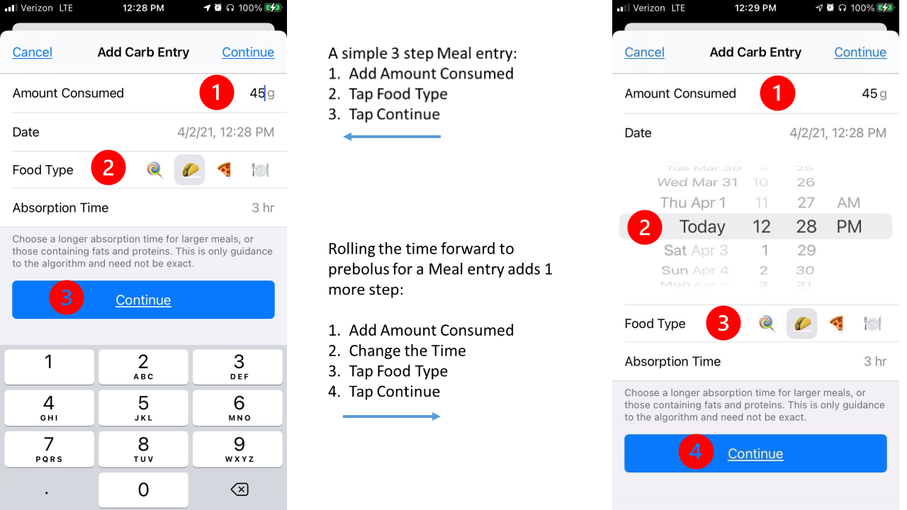
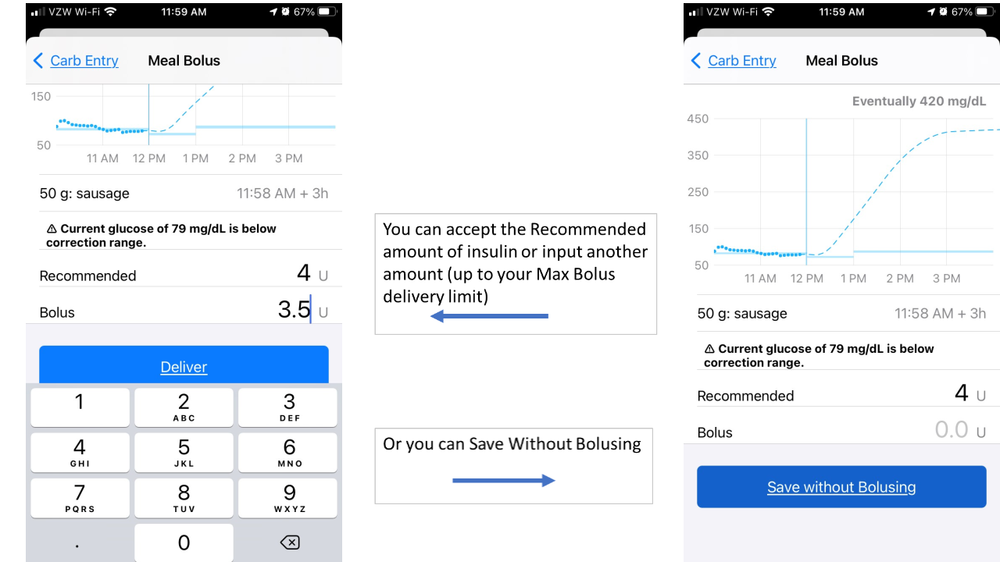

# Meal Entry

To start a new meal entry, tap on the green plate icon (circled below) in the toolbar at the bottom of the Loop status screen. Your Loop app will open to the Add Carb Entry screen.

{width="300"}
{align="center"}

Many Loopers increase the carbohydrate amount to cover the expected effect of protein and adjust the expected absorption time for fat in their meal entry. For simplicity, the rest of this page only refers to carbs because all the figures show carbs or carbohydrates in the menus. You should consider the whole meal, including fat and protein, especially if you eat lower carb.

!!! abstract "Meal Entry - Fast Version"
    There is a lot of information on this page, most of which will become second nature. At first, it may seem incredibly complicated. The short version is here (assuming you accept all the default settings that Loop offers).

      1. Tap meal entry icon on toolbar
      1. Enter number of grams of carbs in the Add Carb Entry screen
      1. Tap continue to advance to the Meal Bolus screen
      1. Tap Recommended line to transfer the value to the Bolus line
      1. Tap Deliver

!!! warning "Things to Know"
    * Do not enter carbs into your Medtronic pump
        * If you use your Medtronic pump bolus wizard or carb entry screen, the pump will give you insulin but Loop will not know about the carbs
        * The Loop predictions will be off and next time Loop reads the reservoir history on the pump, it will probably send your basal rate to zero
    * If you enter carbs in the Nightscout careportal, they will not be detected by Loop
        * There may be times you want to do this, e.g., you want to indicate a low treatment you don't want Loop to know about

## New Meals

The figure below shows step-by-step instructions on initiating the meal entry in Loop. Note that when you tap continue this takes you to the Meal Bolus screen. The carb entry is not saved until you complete the Meal Bolus screen.

{width="900"}
{align="center"}

To start recording your meal, simply enter the desired number of carbs in the `Amount Consumed` line.

The default `Date` is the current date and time, but you can easily scroll the time forward or back.

* If you inadvertently missed recording an earlier meal, just scroll the time back to when that food started to absorb.
* If you want to prebolus some portion of the meal that you're about to eat, just scroll the time forward.
* You can prebolus part of your meal with the current time, and then record a second entry by scrolling the time forward for an hour or two to prebolus a slower absorping item, e.g., a steak that may not start absorbing right away.

Next, you have the option to select your absorption time and select an icon. This is not required - you can just accept the default taco absorption time and keep going. The standard icons and absorption times are listed below. You may have modified these by doing a [Code Customization](../../build/code_customization.md#default-carb-absorption-times).

* The lollipop corresponds to a 2 hour absorption (FAST)
* The taco corresponds to a 3 hour absorption (MEDIUM)
* The pizza corresponds to a 4 hour absorption (SLOW)

If you don't want to use the default taco absorption time, you can tap on the lollipop or the pizza icon to select those absorption times, or manually enter an absorption time between 30 min and 8 hours (method described below). If you want more detail recorded about the meal, there are alternative food icons and even text labels you can select.

The alternative food icons are revealed by tapping anywhere on `Food Type` row that is not a lollipop, taco or pizza icon. These alternative food icons are arranged (scroll left or right) based upon how long each food takes to absorb. From left to right is FAST, MEDIUM, SLOW or OTHER. If you mix two icons from different categories, the absorption time updates to the longest absorption time. With three or more, you should double-check the absorption time and adjust it if necessary. You can also tap on the `abc` that appears in the lower left corner and manually type in your food label.

Note that the lollipop, taco and pizza do not show up on the Nightscout screen whereas the alternative icons and labels are displayed.

Regardless of the choice of icons on the `Food Type` row, you have the option to adjust the `Absorption Time` in half-hour increments from 30 minutes to 8 hours. (Note the dial may go past 8 hours, but it spins back to 8 if you try to exceed that time.) Loop will initially estimate your absorption time at 150% of the time that you enter. As a result, carbs entered using the taco icon will initially be treated as 4.5 hour absorption. More about this later in the [Dynamic Carb Absorption](carbs.md#dynamic-carb-absorption) section.

You do not have to enter all carbs for a meal at the same absorption or eating time. If you want to enter some of the meal's carbs as faster and some as slower, you can log the meal over several individual entries. For example, for meals that have sugary carbs as well as slow acting carbs (Chinese food), you may want to record some carbs as lollipop and some as pizza. Another example would be steak and potatoes, you may want to record the potatoes with a current start time and taco absorption and the steak with a start time of 1-2 hours into the future and a 5 hour absorption time.

When you are done recording a given food entry, press `Continue` and the Meal Bolus tool will open.

## Meal Bolus

{width="900"}
{align="center"}

You can tap on the `Recommended` line and that value will be transferred to the Bolus line, OR tap on 0.0u on the `Bolus` row and type in your desired bolus amount OR `Save Without Bolusing` The `Save Without Bolusing` option is used if you'd like to add to your meal entry or do not want to accept a bolus right now. The meal entry is NOT saved until you either `Deliver` or `Save Without Bolusing`. The graph at the top of the Meal Bolus screen will show your BG prediction based upon your meal entry and desired bolus amount. You can adjust your desired bolus amount or click `<Carb Entry` to adjust your meal entry and then return to Meal Bolus to see how your BG prediction changes. When you're ready to bolus, click `Deliver`. If you start a bolus and plan to add additional meal entries, you will probably need to `Save without Bolusing` for the next entry because Loop will mid-bolus, and you cannot initiate a new bolus while one is in progress. After entering the rest of the meal, don't forget to [bolus](bolus.md) manually.

!!! warning "To Cancel Bolus"
    If you need to modify or cancel a bolus in progress, turn the phone to portait orientation and tap the bolus in progress line right below the heads up display (HUD).  Loop will immediately cancel the in-progress bolus.  If you desire, then you can [bolus](bolus.md) manually to modify the insulin to be delivered via bolus.

    Remember - once the `Deliver` button is tapped, the carb entry associated with that bolus is saved.  Loop will increase insulin delivery based on that entry. So if you canceled a bolus prior to modifying a carb entry, be sure to [edit the carbs](carbs.md#edit-meals) already saved instead of entering a new carb entry.

If your BG is below your correction range, Loop's Recommended bolus will have a small warning above it stating that "Current glucose of xx is below correction range". You can either skip the bolus or enter a portion or all of the Recommended bolus.

If your BG is below your suspend threshold, Loop will not recommend a bolus. If this happens, you can calculate the bolus using your carbohydrate ratio and enter a portion or all of this amount or you can set a 15 minute timer and wait for your BG to start to rise and then reassess when and how much to bolus.

## Automatic Bolus

Loopers who are using the Automatic Bolus Dosing Strategy still typically prebolus and/or bolus for meals. The amount of `Recommended` insulin that will appear in the Meal Bolus screen will be the full amount of the bolus Loop recommends (not the 40% partial bolus delivered automatically). As discussed above, you can accept this recommendation or enter a different amount, however, and this is **very important**, if your Dosing Strategy is set to Automatic Bolus, by entering less than the recommended amount and tapping `Deliver` or tapping `Save Without Bolusing`, you are telling Loop to deliver the remaining recommended insulin in the future using 40% of the recommended bolus at each successive Loop interval.

!!! warning "Carb Entry Leads to Insulin Delivery"
    Note that this same automatic delivery of insulin in response to entered carbs occurs when Dosing Strategy is set to Temp Basal, but the delivery via temporary basal rates is slower, providing more time for an error to be noticed. By the same token, the Automatic Bolus Dosing Strategy responds more quickly to increases in blood glucose.

## Dynamic Carb Absorption

Loop observes the blood glucose impact of the meal within the 150% absorption time window. Loop calculates how many carbs have been absorbed (regardless of how many you entered) based on your BG pattern and your settings. You can watch the progression of  Loop's observations of your meal by tapping on the Active Carbohydrates chart at the bottom of Loop's main screen and watching the insulin counteraction effects (ICE) on the Carbohydrates screen. An example of the screen is on the left side of the figure below. An explanation of the dual lines for each entry and the color coding scheme is explained below the figure. Click on the [ICE](ice.md) link for, more details and an in-real-life example.  

{width="900"}
{align="center"}

* Top line of each entry
    * Amount you entered, time of entry, absorption time entered
* Bottom line of each entry (changes with each CGM reading)
    * Amount absorbed, estimated time when amount you entered will be absorbed
    * Color codes while within the 150% absorption time window
        * Green: amount absorbed is less than 10% above the entered amount
        * Yellow: amount absorbed exceeds 10% above the entered amount
    * Color codes after 150% absorption time window expires
        * Grey: amount absorbed is within 10% of the entered amount
        * Yellow: amount absorbed is exceeds 10% above or below the entered amount

The information available on the Carbohydrates screen disappears for any meals not still active at midnight, so if you're looking for details as to how a particular meal absorbed, you need to screenshot or otherwise capture this information before midnight. Previous entries can be modified or deleted through this screen. To adjust an entry, simply tap on it (you don't need to tap the `Edit Carb Entry` at the top of the screen). You can change a prebolus time, modify carb amounts, or adjust absorption times (even mid-meal). To delete an entry, you first tap `Edit Carb Entry` and tap on the red circle to the left of the entry that you would like to delete. It is a little counterintuitive, but the `Edit Carb Entry` button lets you delete, but not edit an entry.

## Review Carb Decay

New Loopers, and even experienced Loopers with an unfamiliar meal or activity, should review how the carbs you entered for a meal decay over time. If you entered 30 g over 3 hours and after 3 hours, there are 25 g COB left on the [Active Carbohydrates](../loop-settings/displays.md#carbohydrate-chart) chart - you might have messed up something. Some common things to consider are listed below. Note that while Loop is pretty forgiving on exact values and absorption time, you need to learn what works for you.

* Need to adjust value for carbs or account for fat/protein
* Need to adjust aborption time
* Need to review settings
* Settings, carbs and absorption time are good for this meal but there was more or less activity than normal
* Stress / Hormones
* Other effects

The good news is Loop allows you to edit previously entered values. In other words, you can edit the carb entries so Loop has a better idea of how to adjust predicted glucose moving forward. This can head off a low or a high.

### Check COB Before Adding More

Yes, it is important to let Loop know how many carbs are coming, but if you have a lot of left-over carbs from an earlier entry - wait before adding more carbs for that next snack. If Loop thinks more carbs are expected, it will dose extra insulin to accomodate. Maybe set a timer and check back in half-an-hour or an hour to see if you really need to add more carbs. And read the [preceding section](#review-carb-decay).

## Edit Meals

Adjusting a meal entry can be a particularly useful tool when:

* You did not finish an entire meal that you bolused for,
* You did not get to eat the meal at the time you originally expected,
* You ate more servings than originally entered, or
* You suspect your carb count was in error because BGs are rising more/less than expected.  

{width="900"}
{align="center"}

## Avoid Double Meal Entries

!!! warning "Be Aware"
    If you have accidentally made duplicate entries for the same meal, click on the Active Carbohydrates chart in the main Loop screen and tap `Edit Carb Entry` to delete the redundant entries. Deleting the meal entry will not impact the insulin that has already been delivered, but it will alert Loop to adjust your BG projection for purposes of calculating future insulin delivery.

## Third Party Apps

Please see [Loop Permissions](../../build/health.md#loop-permissions).

## Carb Absorption Model

For more information about the way Loop models the effects of carbs, insulin, etc., see the [algorithm page](../algorithm/prediction.md).
