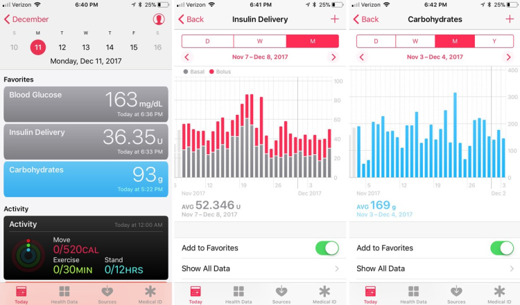

# Health App

Loop app uses the iPhone's Health app to store BGs, insulin, and carbohydrate data. You can check your Health App settings as shown [here](../../build/health.md#loop-permissions).

The figure and description from below are from iOS 12, but with the help of your favorite search engine, you can determine how to get similar plots with iOS 14.

Summaries of your carbohydrates, insulin, and BG results can be found by clicking on the Browse option at the bottom toolbar of the Health app. Blood glucose data are located in the Vitals section, Carbohydrates are in the Nutrition section, and insulin data are in the Other Data section.

If you tap the star on the "add to favorites" slider for the individual data categories (insulin, BGs, carbohydrates), the data from those categories will be added to your Health toolbar's Summary view for easy quick reference and access.

The summary data for the categories can help you follow monthly trends, help identify periods of insulin sensitivity/resistance, evaluate total daily insulin use, breakdown of basal vs bolus insulin, and carbohydrate consumptions.  You can sort your data trends by day, week, month, or year views and scroll back through time in each of those data trends.  You can even quickly use these data for endocrinology appointments discussions...as they provide the endocrinologist with a very quick and useful set of data points directly from your Loop system.

{width="750"}
{align="center"}
