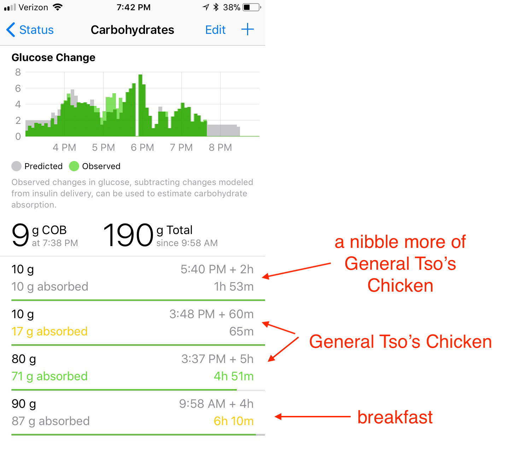
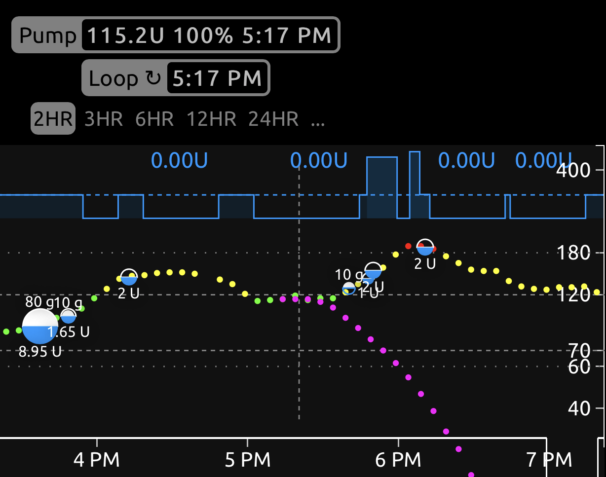

When on *Loop* main screen, tapping on the "Active Carbohydrates" graph will open up the "Carbohydrates" details page that tracks your carb entries for the last 12 hours and how they are absorbed.
It can be helpful to review your meals when monitoring settings, troubleshooting past meal entries, and planning future meal entries.

## Insulin Counteraction Effects

What are *Insulin Counteraction Effects* (*ICE* for short)?

Consider the possible effects that counteract insulin (in other words, make glucose levels go up):

* food
* stress
* illness
* site failure
* basal too low
* someone sat too close to you

As we all know, this list can be long; but on "normal" days, food is the primary reason glucose levels go up. By "normal", we mean basal rates and settings are close to correct, illness is not an issue, and the site is good. We depend on the Loop dynamic carb absorption and other prediction effects to keep glucose in our desired range.

When you have carbs on board, Loop _always_ assigns positive _ICE_ to carbs, not just on a normal day. 
This is how _Loop_ looks at it. 
Keep in mind that in situations where you have other positive _ICE_, like insulin resistance, and carbs on board, _Loop_ will attribute all the positive _ICE_ to carbs until all the entered carbs are considered absorbed. 
At that point, _ICE_ will start driving _RC_ upward.

*Insulin Counteraction Effect* (*ICE*) as explained in [Dynamic Carbohydrate Aborption](../algorithm/prediction.md#dynamic-carbohydrate-absorption) is one very important part of carb absorption as well as a foundational part of [Loop Predictions](../algorithm/prediction.md).

## Glucose Change Display

 The graph at the top of your "Carbohydrates" details page shows the effect *Loop* expects carbs to have on your glucose (gray bars) compared to the actual effect, or *ICE*. The units on the graph are mg/dL/5-min or mmol/L/5-min

- ⬜️: The gray bars represent the effects of carbohydrates on your blood glucose that *Loop* is currently modeling. This will be a combination of dynamically-estimated carb absorption (where meals are absorbing faster than Loop's conservative estimate based on your carb entries) and static absorption based on Loop's conservative, minimum-absorption-rate estimate.  
- 🟩: The green bars represent the observed change in blood glucose compared to Loop's prediction based on insulin alone (or *ICE*).

    !!! info "How *Loop* thinks about carbs" 
        [*ICE*](#insulin-counteraction-effects) is just one important component of how *Loop* thinks about carbs. The other parts are the user-entered data (amount of carbs, and absorption speed).
        
        *Loop* falls back to a default absorption model when the total *ICE* for a meal up to the current time is less than the minimum absorption rate.
        
        In the graphic below, early in the meal timeline, the green bars are below the grey bars. _Loop_ uses the minimum absorption instead of estimating absorption from observed glucose change. For example, if you overestimated the amount of carbs in a meal, the meal absorbs slower than you estimated, or exercise leads to less insulin needs than normal, the grey bars predicted at the start of a meal will be used by _Loop_ throughout. 

    {width="500"}
    {align="center"}

!!! important "When not to Use Glucose Change Display to Understand Meal Absorption?"
    If you know that other non-carb effects are affecting your insulin sensitivity significantly (sickness, exercise, etc), all the info about carb absorption should be considered skewed, and not be used for trying to understand meal absorption.
        
## Practical use

Some practical use of the ICE screen is provided in the [Meal Entries: Review Carb Absorption](carbs.md#review-carb-absorption) section.

!!! tip "Many ways to successfully use Loop"
    You should choose what works for you.

    * Some people plan ahead and try to get their carbs entries "good enough" to not worry about Loop or glucose after they make the initial entry
    * Some people enter typical values for themselves for a given meal and let Loop handle the rest
    * Some people guess and then carb surf if their glucose goes higher than they like

The rest of this page was written by Katie DiSimone before the non-linear carb model was added to Loop in 2019. You may also want to review her blog post from 2017: [Loop: Dynamic Carb Absorption](https://web.archive.org/web/20231130033719/https://seemycgm.com/2017/07/25/loop-dynamic-carb-absorption/).

A lot of the information is still relevant although some of the Loop carb modeling and prediction details have been updated over the years.

Let's take a look at an **example** day using the screenshot below.  

{width="700"}
{align="center"}

When you make a food entry originally, *Loop* will save your entry as you've made it.  On the line below your original entry, *Loop* will also start tracking your food entry assuming a 1.5 times longer carb absorption time.  This helps *Loop* track carbs that may actually be absorbing longer than you expected (part of that whole dynamic carb absorption modeling).  *Loop* will be updating that value of "observed" carb absorption time as well as absorbed carbs as your meal goes on.

So how can we use this information to make our Looping experience better?  The answer is probably best illustrated using a real-world example.  Chinese food...in fact, this Chinese dish.  General Tso's chicken.  As you can see in the recipe, loads of fast carbs with ingredients like hoisin sauce, brown sugar, and cornstarch.  But also slower carbs like chicken.  Rice can be a difficult one because, for us, it acts fast but also seems to have a long tail.

{width="500"}
{align="center"}

It was a busy day and I really didn't want to count carbs.  Ok, even on the slow days I don't want to count carbs.  I just eyeballed the bowl of food and guessed.  As I entered the food in originally, I was still trying to come up with a good guess on the ratio of fast:slow carbs but kid was in a hurry to eat.  My initial guess around 3:30 pm was 70g of carbs at 5 hours absorption (note: it gets edited to 80g in a little bit), we bolused for that and she started to eat.  About 10 minutes later, I decided to add 10g of fast-acting carbs at 1-hour absorption to help with the sauce's speedy carbs.

{width="700"}
{align="center"}

Watching what was going on a little later...glucose levels were rising at a decent clip and I had a feeling I really didn't cover things super well...so I edited the original 70g entry, adding 10g and making it 80g instead.  (That's why there is a 2U bolus around 4:20 pm.)  And of course, around 5:40 pm there was a little bit of nibbling on the leftovers as we put them into the fridge.  We gave 10g for that.  Glucose levels climbed a bit more, not surprising given how we were underestimating fast carbs at this point...but still not so bad at 180 peak glucose.  (Anna gave 2 units of correction at the peak because there was dessert coming later that night and she wanted to be ready for it without too much pre-bolus.)

{width="500"}
{align="center"}

So, how can I use the ["Glucose Change"](#glucose-change-display)  graph to make this meal better?  I can look at the observed carb information and the observed carb entry *Loop* has recorded to adjust my insulin bolusing the next time we eat this meal.

For example, the biggest weakness I had in this (and suspected it even as I did the initial bolus) was that I underestimated the sauce's fast carbs.  I can see this in the observed carb absorption graph having the early green peaks after the meal, and in the way that the observed carb distribution was more like 7:2 vs my original guess of 8:1 (slow:fast carbs).  Overall, it appears that I guess on overall carb content pretty closely (90g vs. 89g observed).  Next time we have General Tso's chicken, I will likely bolus it as 70g at 5 hours and 20g at 2 hours.

{width="700"}
{align="center"}

!!! tip "Check Carbohydrates Page"
    Remember to check your Carbohydrates page at the end of a meal's absorption.   
    By checking in on the meal's observed behaviors, you'll have a good starting point to fine-tuning any new or unknown carb breakdown.

!!! note 
    Remember this conversation is assuming you have basals fairly well set and are not sick.  If other factors could be significantly causing your glucose levels to swing that *Loop* doesn't know about (bad sites, illness, or basal rates that need to be adjusted), they may be attributed in part to [*ICE*](#insulin-counteraction-effects) when they really aren't food-related.  In those cases, address the underlying cause and then use the Carbohydrates page when you've come back to "normal".
