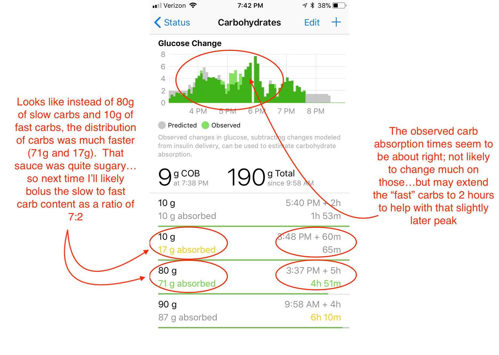

When on *Loop* main page, tapping on the "Active Carbohydrates" graph will open up the "Carbohydrates" details page that tracks your carb entries for the last 12 hours and how they are absorbed.
It is helpful to review your meals.

## Insulin Counteraction Effects

What is *Insulin Counteraction Effects* (*ICE* for short)?

Consider the possible sources of triggers that counteract insulin (in other words, make BGs go up)

* food
* stress
* illness
* someone sat too close to you

As we all know, this list can be long but, on "normal" days food will be the strongest "insulin counteracter".  Food will be the most influence on making BGs go up.  There are also other reasons that BGs climb when we may have expected them to be steady; basals being set too low, failed infusion site, etc.

If we assume that it's a "normal" day (basals are close to correct, illness is not an issue, the site is good), *Loop* will expect most of the upward pressure on BGs are from food.

[*Insulin Counteraction Effect*](#insulin-counteraction-effects) (*ICE*)  is one very important part of carb absorption but also a foundational part of other things, like *Retrospective Correction* (*RC*).

## Glucose Change Display

 The graph at the top of your "Carbohydrates" details page shows how *Loop* expects carbs to effect your BG (gray bars), and also something called [*ICE*](#insulin-counteraction-effects).
 It shows how *Loop* is thinking about Carbohydrate absorption, modeling for carb effects, and _also_ shows [*ICE*](#insulin-counteraction-effects). 

- ⬜️: The gray bars represent the effects of carbohydrates on your blood glucose that *Loop* is currently modeling.  
- 🟩: As a meal is tracked by *Loop*, you'll see green bars of observed carb absorption (including [*ICE*](#insulin-counteraction-effects)).

    !!! info "How *Loop* thinks about carbs" 
        [*ICE*](#insulin-counteraction-effects) is just one important component of how *Loop* thinks about carbs. The other parts are the user entered data (amount of carbs, and absorption speed), and sometimes *Loop* falls back to a default absorption model that isn't based on *ICE* at all, when *ICE* is < minimum absorption rate.  
 
Let's take a look at an **example** day using the screenshot below.  

{width="700"}
{align="center"}

When you make a food entry originally, *Loop* will save your entry as you've made it.  On the line below your original entry, *Loop* will also start tracking your food entry assuming a 1.5 times longer carb absorption time.  This helps *Loop* track carbs that may actually be absorbing longer than you expected (part of that whole dynamic carb absorption modeling).  *Loop* will be updating that value of "observed" carb absorption time as well as absorbed carbs as your meal goes on.

## Practical use

So how can we use this information to make our Looping experience better?  The answer is probably best illustrated using a real-world example.  Chinese food...in fact, This Chinese dish.  General Tso's chicken.  As you can see in the recipe, loads of fast carbs with ingredients like hoisin sauce, brown sugar, and cornstarch.  But also slower carbs like chicken.  Rice can be a difficult one because for us, it acts fast but also seems to have a long tail.

{width="500"}
{align="center"}

It was a busy day and I really didn't want to count carbs.  Ok, even on the slow days I don't want to count carbs.  I just eyeballed the bowl of food and guessed.  As I entered the food in originally, I was still trying to come up with a good guess on the ratio of fast:slow carbs but kid was in a hurry to eat.  My initial guess around 3:30pm was 70g of carbs at 5 hours absorption (note: it gets edited to 80g in a little bit), we bolused for that and she started to eat.  About 10 minutes later, I decided to add 10g of fast-acting carbs at 1-hour absorption to help with the sauce's speedy carbs.

{width="700"}
{align="center"}

Watching what was going on a little later...BGs were rising at a decent clip and I had a feeling I really didn't cover things super well...so I edited the original 70g entry, adding 10g and making it 80g instead.  (That's why there is a 2U bolus around 4:20pm.)  And of course around 5:40pm there was a little bit of nibbling on the leftovers as we put them into the fridge.  We gave 10g for that.  BGs climbed a bit more, not surprising given how we were underestimating fast carbs at this point...but still not so bad at 180 peak BG.  (Anna gave 2 units correction at the peak because there was dessert coming later that night and she wanted to be ready for it without too much pre-bolus.)

{width="500"}
{align="center"}

So, how can I use the ["Glucose Change"](#glucose-change-display)  graph to make this meal better?  I can look at the observed carb information and the observed carb entry *Loop* has recorded to adjust my insulin bolusing the next time we eat this meal.

For example, the biggest weakness I had in this (and suspected it even as I did the initial bolus) was that I underestimated the sauce's fast carbs.  I can see this in the observed carb absorption graph having the early green peaks after the meal, and in the way that the observed carb distribution was more like 7:2 vs my original guess of 8:1 (slow:fast carbs).  Overall, it appears that I guess on overall carb content pretty closely (90g vs. 89g observed).  Next time we have General Tso's chicken, I will likely bolus it as 70g at 5 hours and 20g at 2 hours.

{width="700"}
{align="center"}

!!! tip "Check Carbohydrates Page"
    Remember to check your Carbohydrates page at the end of a meal's absorption.   
    By checking in on the meal's observed behaviors, you'll have a good starting point to fine-tuning any new or unknown carb breakdown.

!!! note 
    Remember this conversation is assuming you have basals fairly well set and are not sick.  If other factors could be significantly causing your BGs to swing that *Loop* doesn't know about (bad sites, illness, or basal rates that need to be adjusted), they may be attributed in part to [*ICE*](#insulin-counteraction-effects) when they really aren't food-related.  In those cases, address the underlying cause and then use the Carbohydrates page when you've come back to "normal".
