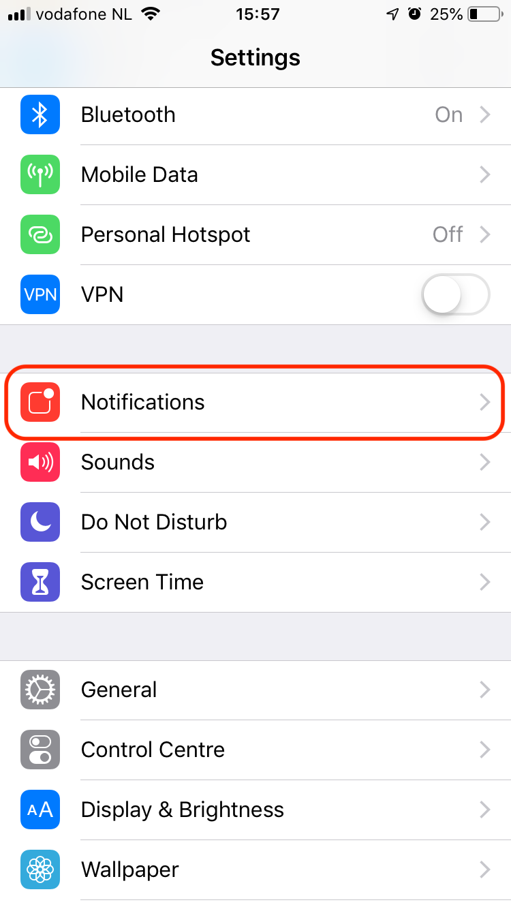
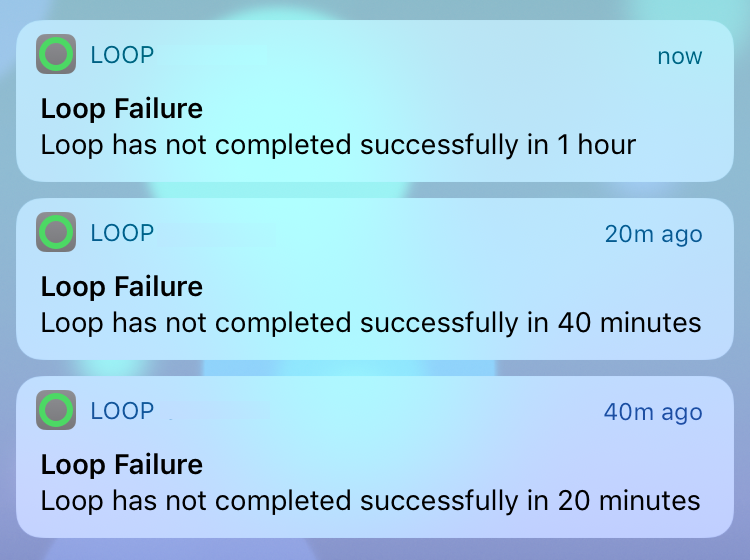
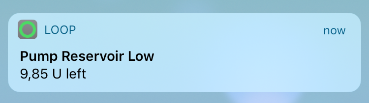
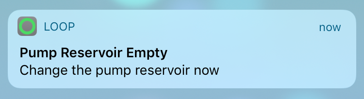

## Loop Notifications

Loop provides discrete notifications on the iPhone and Watch which will appear on the (locked) screen and vibrate, depending on your notification settings of Loop.

## Loop Alert - Unable to Reach Pump

With Loop 3, there is a new modal alert that halts all Loop activity until pump communication can be restored.

{width="350"}
{align="center"}

When you tap on the Learn More button, another screen appears. The only option allowed on the second screen is to give up and discard the pump (or pod) or continue to wait - tap the Back button. The second screen is there if you need to tell Loop you will not be able to restore communication and it should treat the last attempt to send a command as uncertain. Loop will then allow you to add a new pod or new Medtronic pump or switch to a different insulin delivery device. 

**Only do this if bringing your phone and pump into close proximity, waiting a few minutes and then trying the [Reset Loop-to-Pump Communications](../../troubleshooting/red-loop.md#reset-loop-to-pump-communications) suggestions are not successful.**

!!! info "Why Stop all Activity?"
    When communication is interrupted at a critical moment in the communication cycle, Loop cannot provide a reliable calculation for IOB. When that happens a warning screen similar to the graphic above appears on your device. You cannot do anything but wait for Loop to restore communications or give up on that device.

## Loop App Expiration Notification

### Expiration on Settings Screen

At any time, you can tap on Settings and scroll to the bottom of the screen to see when your app will expire.

The graphic below shows the Settings display for a *TestFlight* build (version 3.3 or newer):

{width="300"}
{align="center"}

### Expiration Alert

Notification before an app expires is reported using this protocol:

* When fewer than 20 days remain, you'll get an alert when you open the app but no more frequently than every 2 days
* When fewer than 24 hours remain, you'll get an alert when you open the app, once every hour at most
* Simply tap on the `More Info` button of the alert for more information
    * Build with *Mac*: [Update/Rebuild with *Mac*](../../build/updating.md){: target="_blank" }
    * Build with Browser: [Update/Rebuild with Browser](../../browser/bb-update.md){: target="_blank" }

The graphic below show an example expiration alert for a *Mac* build:

{width="350"}
{align="center"}

> Notification when app expires is available in these versions or newer:
>
> * Build with *Mac*: version 2.2.5 or newer
> * Build with Browser: version 3.3 or newer

### Free (7-day) Loop App Expiration Alert

The expiration notification pattern is the same as for the Paid Loop App. You may want to add an [Expiration Notification Customization](../../version/code-custom-edits.md#expiration-notification-customization) to modify the first appearance and frequency of the notification.

## Omnipod Beeps

Most pod beep alarms are disabled for a more discrete use of pods than is available with the PDM. Only the following audible acknowledgments or alarms are used. Some can be configured in [Omnipod: Notification Settings](../../loop-3/omnipod.md#notification-settings):

- Pod activated acknowledgment when filling the pod with enough insulin when pairing a new Pod.
- Pod expiration advisory alarm, which you can configure between 48 and 72 hours (3 days)
- Pod low reservoir alert
    * Note that the pod may continue delivering after the reservoir reports 0 U
    * The pod will continue until the pod runs out of insulin or 4 U is delivered, which ever comes first
    * Loop will update the actual delivery amounts based on pod reported information
- Pod deactivation acknowledgment
- Pod fault alarm (also called a screamer) when reaching the max life of the Pod: 80 hours (3 days + 8 hours), running out of insulin or a fault/occlusion happens
    * Screamers are silenced using the [Replace Pod](../../loop-3/omnipod.md#replace-pod) row on the pod settings page
    * The one exception is if communications with the pod is lost and cannot be restored - in that case, you will be offered the chance to discard the pod from Loop but will still want to [Silence the Pod](../../faqs/omnipod-faqs.md#what-do-you-do-to-stop-a-screaming-pod)

## Notification settings for Loop

You can customize the way notifications of Loop are behaving in the Settings App of the iPhone:

{width="250"}
{align="center"}

Loop 3 Notifications Settings:

{width="250"}
{align="center"}

Mark **Loop 3** notifications as **time-sensitive** and ask for **immediate delivery**:

- tick the **`Immediate Delivery`** so that notifications are delivered right away
- enable the **`TimeSensistive Notifications`** checkbox 

!!! info  "Notification Delivery"

    You will see the `Notification Delivery` section only if you previously toggled on `Settings / Notifications / Scheduled Summary` in order to receive a summary of notifications at a certain time of the day. If this is not what you want, simply ignore it.

!!! info  "Announce Notifications"

    The `Announce Notifications` section is displayed only if you previously turned on the toggle `Settings / Notifications / Announce Notifications`. Use it if you want Siri to read Loop's notifications out loud on CarPlay, and AirPods...

Make sure **Loop notifications** are **allowed** in your **Focus mode**.
Edit the focus mode to:

- add `Loop` to the list of apps with allowed notifications
- enable the `Time Sensitive Notifications` toggle button

### Taking a Loop Break

If you want to take a break from using Loop but want to keep the app on your phone, you'll want to disable Loop Notifications while you are not using Loop. Otherwise, the [Loop Failure](#loop-failure) messages will drive you crazy. 

When you are ready to resume using Loop, the main screen will remind you to turn those notifications back on.

Another time you might want to disable notifications is if you are testing with a simulated pump. When the app is closed or phone is locked, the simulated pump is inactive and you would get the Loop Failure notifications.

## Loop Failure

At 20, 40, 60, and 120 minutes, there is a Loop Failure notification.
This mostly happens when the connection is lost for a longer period of time between the CGM or the Rileylink and Loop.

{width="250"}
{align="center"}

## Bolus Failure

If Loop detects that a bolus was not able to be delivered, it will provide a notification.  Bolus failures are usually due to stale pump data.  Try fetching recent history from the RileyLink menu to update pump data.  Loop will also notify of partial bolus deliveries.

**Remember: Carbs are saved when you tap `Save and Bolus` following a meal entry - even if the bolus fails.**

{width="250"}
{align="center"}

## Low Reservoir

**Medtronic**  
At 20% and 10% remaining reservoir volume, there is a Low Reservoir notification.

**Omnipod**  
Select your desired notification level for low reservoir
[Omnipod: Notification Settings](../../loop-3/omnipod.md#notification-settings) 

{width="250"}
{align="center"}

## Empty Reservoir

* Loop 2 will notify when the reservoir is empty.

{width="250"}
{align="center"}

* Loop 3 reports No Insulin on the [Heads-Up-Display](../../loop-3/displays-v3.md#pump-status-icon).

{width="125"}
{align="center"}

**Omnipod**
After the reservoir reports 0 U, the pod attempts to deliver insulin when requested.

* After 4 U are delivered, the pod alarms and must be changed
* If during the attempt to deliver the 4 U (below zero), the pod runs out of insulin, the pod alarms and must be changed
* In both cases, the pod reports it is out-of-insulin

## Low Battery (Medtronic)

Loop will notify when battery levels have approximately 8-10 hours of battery life remaining.

## Remote Notifications

Loop does not have a remote notification to other devices.  If you are a remotely monitoring parent, you will want to read [here](https://nightscout.github.io/nightscout/setup_variables/#pushover){: target="_blank" } about setting up pushover alerts using your Nightscout site if you want proactive notifications of looping related information.

## LoopFollow

Many people use additional apps to assist in following a loved one or to support a loved one who needs help waking up to alarms. One of the more popular options is LoopFollow, written by a parent of a Looper. There are several features to assist in remote monitoring with a variety of options for the source of data.

For more information, please read the [LoopFollow](https://www.loopandlearn.org/loop-follow) documentation. You can build LoopFollow using the same [Build Select Script](../../build/build-app.md#build-select-script) you used to build the Loop app or using the [GitHub Browser Build Method](../../browser/other-apps.md).
