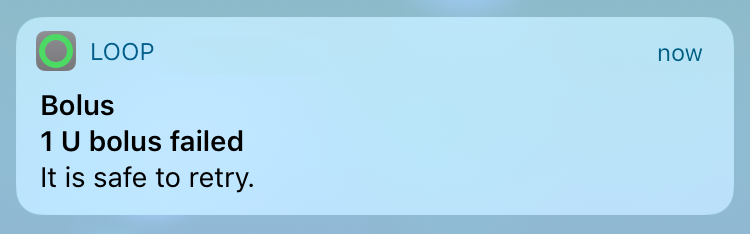

# Loop Notifications

Loop provides discrete notifications on the iPhone and Watch which will appear on the (locked) screen and vibrate, depending on your notification settings of Loop.

## Omnipod

Most beep alarms are disabled for a much more discrete use of the omnipod. Only the following audible acknowledgments or alarms are currently used:

- Pod activated acknowledgment when filling the pod with enough insulin when pairing a new Pod.
- Pod expiration advisory alarm at 72 hours/3 days (which you can silence in the [pod status  settings](../loop-settings/omnipod-pump.md#status))
- Pod empty reservoir (which you can silence in the [pod status  settings](../loop-settings/omnipod-pump.md#status))
- Pod deactivation acknowledgment
- Pod fault alarm (also called a screamer) when reaching the max life of the Pod: 80 hours (3 days + 8 hours) or a fault/occlusion happens. (which you can silence using the [replace pod](../loop-settings/omnipod-pump.md#pod-commands)) command in the pod settings page)

## Notification settings for Loop

You can customize the way notifications of Loop are behaving in the Settings App of the iPhone:

{width="250"}
{align="center"}

Settings of Loop:

{width="250"}
{align="center"}

## Loop Failure

At 20, 40, 60, and 120 minutes, there is a Loop Failure notification.
This mostly happens when the connection is lost for a longer period of time between the CGM or the Rileylink and Loop.

{width="250"}
{align="center"}

## Bolus Failure

If Loop detects that a bolus was not able to be delivered, it will provide a notification.  Bolus failures are usually due to stale pump data.  Try fetching recent history from the RileyLink menu to update pump data.  Loop will also notify of partial bolus deliveries.

{width="250"}
{align="center"}

## Low Reservoir

**Medtronic**  
At 20% and 10% remaining reservoir volume, there is a Low Reservoir notification.

**Omnipod**  
At <30U, <20U, <10U  

{width="250"}
{align="center"}

## Empty Reservoir

Loop will notify when the reservoir is empty. Loop will notify you every minute with this notification.

**Omnipod**  
Normally you will have 5-30 minutes to replace the pod, but do know the pod can [scream](https://soundcloud.com/eelke-jager/1f-nibble-f) at any moment from this point on.

{width="250"}
{align="center"}

## Pod Expiration (Omnipod)

You can customize the time of notification when to replace your pod any time from 1 hour up to 71 hours (3 days - 1 hour) [after staring a new pod](../loop-settings/omnipod-pump.md#expiration-reminder) or you change the time later in the [pod configuration settings]../loop-settings/omnipod-pump.md#configuration).
The expiry alarm will always sound when the pod reaches a running full 3 days (72 hours) which you can silence [in the pod status settings](../loop-settings/omnipod-pump.md#status).

{width="250"}
{align="center"}

## Low Battery (Medtronic)

Loop will notify when battery levels have approximately 8-10 hours of battery life remaining.

## Remote Notifications

Loop does not have a remote notification to other devices.  If you are a remotely monitoring parent, you will want to read [here](../../nightscout/pushover.md#pushover) about setting up pushover alerts using your Nightscout site if you want proactive notifications of looping related information.
