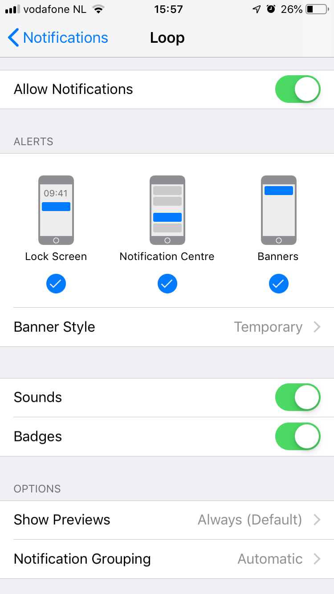

## Loop Notifications

Loop provides discrete notifications on the iPhone and Watch which will appear on the (locked) screen and vibrate, depending on your notification settings of Loop.

## Loop App Expiration Notification

Profile expiration notification is a new feature.

{width="250"}
{align="center"}

* When fewer than 20 days remain until profile expiration, you'll get a notification when you open the app but no more frequently than every 2 days
* When fewer than 24 hours remain, you'll get a notification when you open the app, once every hour at most
* Simply tap on the `More Info` button of the notification to go directly to the [LoopDocs Updating](../../build/updating.md) page.

### Free (7-day) Loop App Expiration Notification

The expiration notification pattern is the same as for the Paid Loop App. You may want to add an [Expiration Notification Customization](../../build/code_customization.md#expiration-notification-customization) to modify the first appearance and frequency of the notification.


## Loop App Expiration Date

If you want to see the expiration date at any time, tap on Settings, then tap on Issue Report.  The expiration date is near the top of the report (to the right of ```profileExpiration```).  If you don't see that, time to rebuild to get that feature. Once you've viewed the expiration date, tap Settings to back out of the Issue Report display. The time is in GMT, so adjust to your own time zone if you procrastinated until the last minute.

{width="250"}
{align="center"}

If you are running Loop v2.2.4 or older, you might be surprised by a ["Loop" is No Longer Available](../../troubleshooting/loop-crashing.md#expired-app) display when the app reaches its expiration date.  

* Workaround is to add a notice to your calendar when you build the app initially so you know that the one year app lifetime is nearing the end
* This is still a good idea even with automated notifications to set your own desired alert window
* If you are running Loop v2.2.4 or older, you can use this method to determine [Loop Expiration date](https://www.loopandlearn.org/loop-expiration-date/).


## Omnipod

Most beep alarms are disabled for a much more discrete use of the omnipod. Only the following audible acknowledgments or alarms are currently used:

- Pod activated acknowledgment when filling the pod with enough insulin when pairing a new Pod.
- Pod expiration advisory alarm at 72 hours/3 days (which you can silence in the [pod status  settings](../loop-settings/omnipod-pump.md#status))
- Pod empty reservoir (which you can silence in the [pod status  settings](../loop-settings/omnipod-pump.md#status))
- Pod deactivation acknowledgment
- Pod fault alarm (also called a screamer) when reaching the max life of the Pod: 80 hours (3 days + 8 hours) or a fault/occlusion happens. (which you can silence using the [replace pod](../loop-settings/omnipod-pump.md#pod-commands)) command in the pod settings page)

## Notification settings for Loop

You can customize the way notifications of Loop are behaving in the Settings App of the iPhone:

{width="250"}
{align="center"}

Settings of Loop:

{width="250"}
{align="center"}

## Loop Failure

At 20, 40, 60, and 120 minutes, there is a Loop Failure notification.
This mostly happens when the connection is lost for a longer period of time between the CGM or the Rileylink and Loop.

{width="250"}
{align="center"}

## Bolus Failure

If Loop detects that a bolus was not able to be delivered, it will provide a notification.  Bolus failures are usually due to stale pump data.  Try fetching recent history from the RileyLink menu to update pump data.  Loop will also notify of partial bolus deliveries.

{width="250"}
{align="center"}

## Low Reservoir

<font color ="orange">**Medtronic**</font>  
At 20% and 10% remaining reservoir volume, there is a Low Reservoir notification.

<font color ="orange">**Omnipod**</font>  
At <30U, <20U, <10U  

{width="250"}
{align="center"}

## Empty Reservoir

Loop will notify when the reservoir is empty. Loop will notify you every minute with this notification.

<font color ="orange">**Omnipod**</font>  
Normally you will have 5-30 minutes to replace the pod, but do know the pod can [scream](https://soundcloud.com/eelke-jager/1f-nibble-f) at any moment from this point on.

{width="250"}
{align="center"}

## Pod Expiration (Omnipod)

You can customize the time of notification when to replace your pod any time from 1 hour up to 71 hours (3 days - 1 hour) [after staring a new pod](../loop-settings/omnipod-pump.md#expiration-reminder) or you change the time later in the [pod configuration settings]../loop-settings/omnipod-pump.md#configuration).
The expiry alarm will always sound when the pod reaches a running full 3 days (72 hours) which you can silence [in the pod status settings](../loop-settings/omnipod-pump.md#status).

{width="300"}
{align="center"}

## Low Battery (Medtronic)

Loop will notify when battery levels have approximately 8-10 hours of battery life remaining.

## Remote Notifications

Loop does not have a remote notification to other devices.  If you are a remotely monitoring parent, you will want to read [here](https://nightscout.github.io/nightscout/setup_variables/#pushover) about setting up pushover alerts using your Nightscout site if you want proactive notifications of looping related information.

## Loop Follow

Many people use additional apps to assist in following a loved one or to support a loved one who needs help waking up to alarms. One of the more popular options is Loop Follow, written by a parent of a Looper. There are a number of features to assist in remote monitoring with a variety of options for the source of data.


For more information, please read the [Loop Follow](https://github.com/jonfawcett/LoopFollow#loop-follow) documentation. You can build Loop Follow using the same [Build Select Script](../../build/step14.md#build-select-script) you used to build the Loop app. (It's one of the options in the menu.)

Please note that Jon Fawcett makes clear distinction between his DIY (free) support and his business, Custom Type One. However, both are supported with the same Facebook group, [CustomTypeOne Support (Loop Follow, SugarPixel, Loop Patches)](https://www.facebook.com/groups/loopfollow/).
