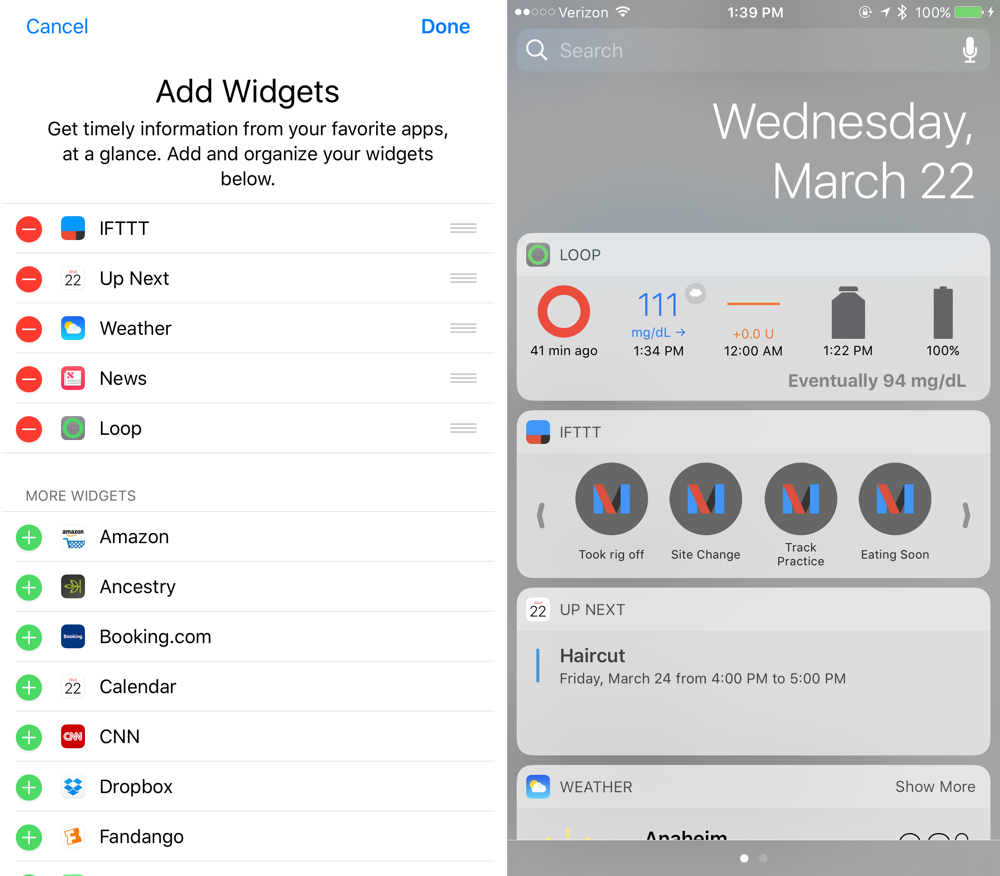

## Loop 3

An updated new-style Loop-dev widget is in process. There are a lot of updates with widgets. With the advent of iOS 16, you can add widgets that show up on the lock screen without need to swipe to view. There is work in progress on this - please be patient.

## Old-Style Loop Widget

Loop 2.2.x and Loop-dev both include an old-style widget.

With older versions of iOS, the widget is available in the Today view of your iPhone.  Swipe right on your iPhone home screen and your widgets will be available.  The Loop widget may be at the bottom of your widget list.  Scroll down to the bottom of the screen and press the `edit` button.  That opens an "Add Widgets" screen.  If you hold and drag the three horizontal lines on the Loop widget row, you can drag it up to the order you'd like it to appear on your widget list.

{width="600"}
{align="center"}

With newer version of iOS, the old-style widgets cannot be moved to the top of the screen. The example graphic below shows the new-style Dexcom G6 widget above the old-style Loop 3 widget.

{width="300"}
{align="center"}

!!! info "New to Loop or never added a widget before"

    * There is a difference in behavior between "new-style" Widgets and "old-style" Widgets
        * New-Style Widgets: always appear at the top of your Today View, can be changed by long-pressing on one and then dragging around, or can be added with the &plus; button in edit mode
        * Old-Style Widgets, like that available with Loop: use a different method to install
    * Make sure your phone is unlocked, then swipe from the Home Screen to get to Today View
        * You can't edit the screen if you start from a locked phone
    * Start the Edit mode (where all of the icons are shaking), either by long-pressing on one of the new-style widgets, or by scrolling all the way to the bottom of Today View and pressing Edit.
    * Scroll all the way to the bottom again to find and select the button labeled "Customize"
    * Now you can configure (add, remove, rearrange) the "old-style" widgets for your screen.
    * The Loop widget should appear in the list available there.

Experienced Looper who already had a widget should not need to modify anything to see it.
