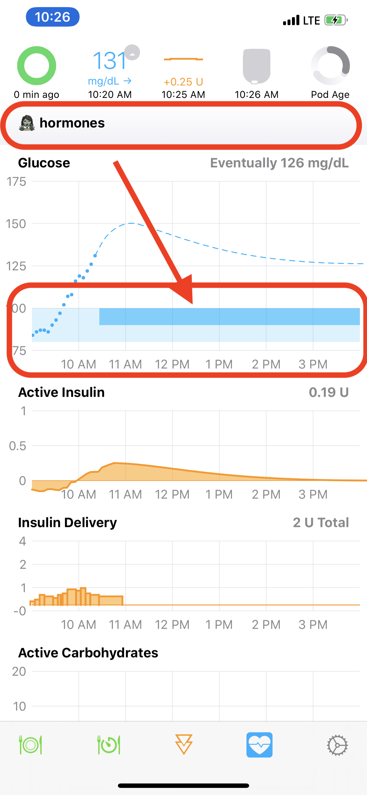

## New Loopers - Please Read

**Please do not use this feature until you understand it.**

Many new Loopers interpret Loop Overrides as a one-for-one replacement for manual pump options where a temporary basal was applied for a particular activity. Although Loop Overrides can help in a situation where you previously used a temporary basal rate, overrides are more powerful.

!!! danger "Changing Insulin Sensitivity is NOT like Manual Pump Temp Basal Change"
    Loop Overrides are **not** the same as adjusting temp basal on a manual pump. The easiest way to restrict basal rates with an automated system is to raise your correction target temporarily. In some cases, you may need to also adjust sensitivity, but begin just by changing that target.

    When you modify insulin sensitivity, you are affecting **basal rates**, **carb ratios** and **insulin sensitivity factors** for the duration of the override.

    A common mistake is to think selecting a 10% override is like selecting 10% basal rate with a manual pump. THIS IS NOT TRUE. You have told your automatic control system to modify all your settings by a factor of 10!

## Manual Temp Basal

Sometimes you need to set a manual temp basal and you need it to keep working whether you are near your gear. There's a function for that with Loop 3.

* Pods: use the [Manual Temp Basal](../../loop-3/omnipod.md#manual-temp-basal) setting
* Medtronic: select Open Loop and use your Medtronic pump temp basal feature

## How Overrides Work

Overrides let Loop know selected settings are modified for the duration of the override. The override can change either the correction range or the overall insulin needs or both. When you set an override on insulin needs, the override adjusts basal schedule, ISF, and CR together. Examples where this can be helpful include hormone cycles, steroid medications and/or exercise.

Override presets are (1) optional and (2) can be configured within Loop's workout icon (the little blue heart icon in the Loop toolbar). Once override presets are created, they can be turned on/off by using the workout icon as well.

{width="450"}
{align="center"}

### Features of an Override

Overrides allow you to specify:

* an overall insulin needs adjustment
* a correction target range
* a duration in 15 minute increments (or indefinite)
* a start time

The override only works when your Loop gear is with you. For example, if Loop sets a zero temp basal rate based on an override and then you leave your gear behind; at the end of half an hour, your pump will resume scheduled insulin delivery.

{width="300"}
{align="center"}

The **target range** replaces the correction range target for the duration of the override.

* If the target range is left blank, your scheduled correction range continues to be in effect
* If the target range is specified, that range is used instead of your scheduled correction range

The **overall insulin needs** is applied to your basal rates, insulin sensitivities and carb ratios for the duration of the override.

* If the insulin needs is left at 100%, no change is made to basal rates, ISF or CR
* If you set an overall insulin needs adjustment _below_ 100%, you are telling Loop you are more insulin sensitive and need a lighter touch.
    * Loop uses basal rates decreased from scheduled rates
    * Loop uses ISF and CR numbers increased from settings
* If you set an overall insulin needs adjustment _above_ 100%, you are telling Loop you are less insulin sensitive and need a heavier touch.
    * Loop uses basal rates increased from scheduled rates
    * Loop uses ISF and CR numbers decreased from settings
* While the override is active, the modified basal rates, ISF and CR are applied for **every** automated or manual insulin delivery (aside from the modified basal) and meal entry
    * Those ISF and CR numbers are associated with the carbs and/or insulin delivered during the override
    * As the carbs and/or insulin "ages" during their absorption-time/duration-of-action, Loop maintains the sensitivity value associate with those during-the-override entries

For an override to be accepted:

* You must change either insulin needs or target range
* A named override can be saved and used again
    * To save the override, you must supply a name and an icon
    * Named overrides can be set to occur at a scheduled time
* A Custom override is used only once
* Any override can be edited while it is active

### Future Override

When an override is scheduled to start in the future, it can have an effect earlier than you might think. The closed loop automated insulin increase or restriction at each cycle is calculated to map your predicted glucose to the desired target range over the duration of insulin action (6 hours). If the future override has a higher target, that higher target is factored into the Loop calculations.

Example:

* At 10 pm, you set an override with a higher correction range target to start the following morning at 6 am
* At approximately midnight, Loop will begin taking that future target into account in the dosing for each Loop cycle
* By the time you awaken at 6 am, Loop should have your glucose in that higher target range
* The sensitivity changes, if any, associated with that override do not affect the Loop prediction until the scheduled start time for the override

## How Overrides Do NOT Work

Overrides will work while you are Looping. Sounds obvious, right? But, the thing to remember is that the adjustments (multipliers) that overrides make are not saved back to your Medtronic pump or Omnipod. They only exist in the Loop app.

!!! warning "If you walk away from iPhone and/or RileyLink..."

    If you stop Looping (i.e., walk away from your gear or glucose reading is stale), your existing temp basal will complete the remainder of whatever is left of its original 30 minutes and you will return to scheduled basal rates in your Therapy Settings. Your adjusted needs as set-up in any override will not continue if your Loop is not running properly. So you cannot set a 50% override and then hop in the ocean for a 2-mile swim without your iPhone and RileyLink and expect decreased basals of 50%. Just be aware that in situations where you need prolonged lower basals while away from Looping gear, you will need to edit your scheduled basals or use a [Manual Temp Basal](../../loop-3/omnipod.md#manual-temp-basal) setting.

### Avoid Extreme Insulin Needs Setting

There have been users who select a 10% overall insulin need. This is NOT the same as choosing a 10% temporary basal with the PDM. This changes your basal rates, ISF and CR by a factor of 10!

!!! warning "Scenario for 10% Sensitivity"

    * User really wants insulin reduced and chooses 10% insulin need
    * User doesn't think about the 10% and enters carbs while override is active
        - Loop suggests a tiny bolus and user accepts
            - User goes high because CR was 10 times higher than Therapy Setting Value
            - User stays high because ISF is also 10 times higher than Therapy Setting Value
                - Automated corrections are 10% of typical corrections
                - Basal supplied is 10% of Therapy Setting value
        - OR
        - Loop suggests a tiny bolus and user manually boluses the amount they know the food needs
            - User glucose may be normal BUT
                - Loop predicts a negative eventual glucose (prediction only - this will never happen)
                - Loop immediately withholds all basal until prediction normalizes

Instead of selecting 10%, raise your correction range with a moderate needs adjustment. Loop tends to suspend insulin delivery via temp basals with the next CGM reading.

With Loop 3, there is now a warning message in the meal entry screen when an override is active with an insulin sensitivity other than 100%. The user can decide whether to proceed with the meal entry with the override active.

If you feel the need to immediately halt insulin delivery, consider a [Manual Temp Basal](../../loop-3/omnipod.md#manual-temp-basal) or suspend command to the pump. If you choose to suspend, be sure to pay attention to the reminder to resume insulin delivery later.

!!! tip "Extreme Athletes"
    There are athletes who do need those extreme sensitivity changes and know how to use them appropriately. This typically involves extreme or prolonged exercise.

## Create an Override Preset

To create an override preset, tap on the workout icon. Then click the &plus; sign in the upper right corner to start a new preset entry.

You must select an emoji, name the preset and modify either the sensitivity or target range or both to save your new preset

* Pick an emoji
* Enter a name for the preset
* Optional: change insulin needs
    - Default is 100% - no change to your settings
    - You may use the picker wheel or [Select 1% Sensitivity](#select-1-sensitivity) increments
* Optional: enter a target range
    - If you do not enter a target range, Loop will use your existing scheduled target range
* Select whether you want the override to run indefinitely or for a finite time

When you've made your selections, save the preset using the "Save" button in the upper right corner.

### Select 1% Sensitivity

!!! warning "Not Available in 2.2.x"
    This feature is only available in Loop 3 or later.

    * Not available in Loop 2.2.x

The selectable Overall Insulin Needs values are not limited by the default picker values of 10%.

* When adjusting Needs, press and hold the "orange" bar, highlighted by the red rectangle in the graphic below
* Move your finger left and right to adjust by 1%
* Release to select desired level

{width="200"}
{align="center"}

## Activate an Override

To enact your override preset, tap on the workout icon toolbar and select an override from your list of saved presets, create a new one or use the custom override for one-time use.

{width="300"}
{align="center"}

The heart will be highlighted in a blue square while active and the [HUD Status Row](../../loop-3/displays_v3.md#hud-status-row) will indicate the active override name. The Glucose Chart will show a darker blue bar indicating the active target range and duration.

{width="300"}
{align="center"}

### Schedule an Override

You can set up a future start time when selecting a saved override by tapping on the calendar icon to the right of the override. Adjust the "Start time" row. Tap the "Enable" button in the top right corner.

A [Future Override](#future-override) can be very helpful, for example, to set an exercise override the night before your workout. You'll wake up with less insulin on board and at your desired exercise targets.

## Deactivating an Override

Tap the heart icon to turn off your override at any time. This happens without confirmation, so be sure to lock your phone when you have an override running to avoid accidentally turning it off.

Override presets with a finite duration will automatically deactivate when the duration is over.

## Apple Watch

Saved overrides can be turned on and off by tapping on the blue heart icon on your watch.

## Editing an Active Override

Tap on the active override in the [HUD Status Row](../../loop-3/displays_v3.md#hud-status-row) with the phone in portrait orientation. This brings up a screen to edit the override currently running.

This only affects this override during the current period. It is not saved to that named override. For example, you can extend the duration or modify the needs value or target value based on a temporary situation.

!!! info "Higher Priority Messages"
    If the HUD Status Row is displaying a higher priority message, you must wait for that message to complete before you'll be able to edit an active override. If you want to edit an active override, you can choose to cancel an active bolus and edit the override immediately.  The edited override will then be in effect for the next Loop cycle or manual recommendation.

    HUD Status Row messages with higher priority:

    * Bolus starting, in-progress or canceling
    * Pump suspended
    * No recent glucose

## Remote Overrides

You can also use your Nightscout site to activate/deactivate your Loop's override presets. To accomplish this, you will need to do some legwork as outlined on [this page for how how to set up Remote Overrides in Nightscout](../../nightscout/remote-overrides.md) and you will need to be using a paid Apple developer account. Remote overrides require Apple Push Notifications service, and that is only available on paid accounts.
