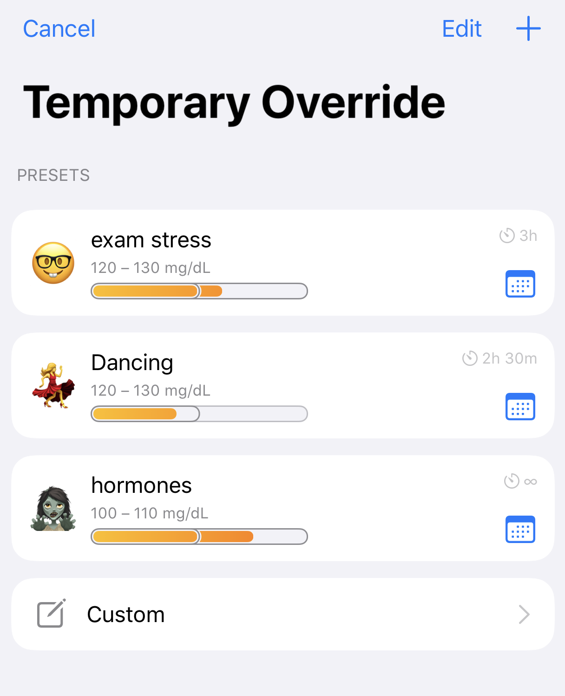

# Overrides

Overrides were developed as a method of letting Loop know that you have a situation affecting your overall insulin needs, without needing to manually edit your basal schedule/ISF/carb ratios individually. Examples where this can be helpful include hormone cycles, steroid medications, exercise, and other situations which may temporarily (either shorter or longer term) affect your underlying insulin needs.

Override presets are (1) optional and (2) can be configured within Loop's workout icon (the little blue heart icon in the Loop toolbar). Once override presets are created, they can be turned on/off by using the workout icon as well.

{width="450"}
{align="center"}

## How Overrides Work

Overrides allow you to specify an overall insulin needs adjustment, a target range, and a duration for the override with each preset. The overall insulin needs adjustment is an adjustment to your scheduled basal rates, carb ratios, and insulin sensitivities. In other words, the overall insulin needs selection will affect boluses, temp basals, and correction recommendations.

Notice the fine-print below the orange bar showing the overall adjustment graphic..."Basal, bolus, and correction insulin dose amounts are increased by 20%" in the example with a 120% overall insulin needs adjustment. So, 100% overall needs means no multiplier will be applied to your basal, insulin sensitivities, or carb ratio...but you could still use a 100% preset simply to define a different target range for a period of time.

Recapping: If you set an overall insulin needs adjustment below 100%, you are telling Loop that you are more insulin sensitive and will need a lighter touch with all things insulin. If you set an overall insulin needs adjustment above 100%, you are telling Loop that you are less insulin sensitive and will need a more aggressive touch with all things insulin.

{width="300"}
{align="center"}

## How Overrides Do NOT Work

Overrides will work while you are Looping. Sounds obvious, right? But, the thing to remember is that the adjustments (multipliers) that overrides make are not saved back to your Medtronic pump or Omnipod. They only exist in the Loop app.

!!! danger "If you walk away from iPhone and/or RileyLink..."

    If you stop Looping (i.e., walk away from your gear or glucose reading is stale), your existing temp basal will complete the remainder of whatever is left of its original 30 minutes and you will return to scheduled basal rates in your Therapy Settings. Your adjusted needs as set-up in any override will not continue if your Loop is not running properly. So you cannot set a 50% override and then hop in the ocean for a 2-mile swim without your iPhone and RileyLink and expect decreased basals of 50%. Just be aware that in situations where you need prolonged lower basals while away from Looping gear, you will need to edit your scheduled basals.

### Avoid Extreme Insulin Need Setting

There have been users who select a 10% overall insulin need. This is NOT the same as choosing a 10% temporary basal with the PDM. This changes your basal rates, ISF and CR by a factor of 10!

!!! warning "Scenario for 10% Sensitivity"

    * User really wants insulin reduced and chooses 10% insulin need
    * User doesn't think about the 10% and enters carbs while override is active
        - Loop suggests a tiny bolus and user accepts
            - User goes high because CR was 10 times higher than Therapy Setting Value
            - User stays high because ISF is also 10 times higher than Therapy Setting Value
                - Automated corrections are 10% of typical corrections
                - Basal supplied is 10% of Therapy Setting value
        - Loop suggests a tiny bolus and user manually boluses the amount they know the food needs
            - User glucose may be normal BUT
            - Loop predicts a negative eventual glucose (prediction only - this will never happen)
            - Loop immediately withholds all basal until prediction normalizes

Instead of selecting 10%, raise your correction range with a moderate needs adjustment. Loop tends to suspend insulin delivery via temp basals with the next CGM reading.

If you feel the need to immediately halt insulin delivery, consider a Manual Temp Basal (Loop dev only) or suspend command to the pump and setting a reminder in your phone to resume insulin delivery later.

!!! tip "Extreme Athletes"
    Loopers should understand the extreme values and use them appropriately, typically for extreme or prolonged exercise.

## Create an Override Preset

To create an override preset, tap on the workout icon. Then click the &plus; sign in the upper right corner to start a new preset entry.

You must select an emoji, name the preset and modify either the sensitivity or target range or both to save your new preset

* Pick an emoji
* Enter a name for the preset
* Optional: change insulin needs
    - Default is 100% - no change to your settings
    - You may use the picker wheel or [Select 1% Sensitivity](#select-1-sensitivity) increments
* Optional: enter a target range
    - If you do not enter a target range, Loop will use your existing scheduled target range
* Select whether you want the override to run indefinitely or for a finite time

When you've made your selections, save the preset using the "Save" button in the upper right corner.

### Select 1% Sensitivity

The selectable Override Sensitivity values are not limited by the default picker values of 10%.

* When adjusting Sensitivty, press and hold the "orange" sensitivity bar, highlighted by the red rectangle in the graphic below
* Move your finger left and right to adjust sensitivity by 1%
* Release to select desired level

{width="200"}
{align="center"}

## Activate an Override

To enact your override preset, tap on the workout icon toolbar and select an override from your list of saved presets, create a new one or use the custom override for one-time use.

{width="300"}
{align="center"}

The heart will be highlighted in a blue square while active and the [HUD Status Row](../../loop-3/displays_v3.md#hud-status-row) will indicate the active override name. The Glucose Chart will show a darker blue bar indicating the active target range and duration.

{width="300"}
{align="center"}

### Schedule an Override

You can setup a future start time when selecting a saved override by tapping on the calendar icon to the right of the override. Adjust the "Start time" row. Tap the "Enable" button in the top right corner.

A future override can be very helpful, for example, to set an exercise override the night before your workout. Set your exercise override to activate 2 hours before you wake up for your 5 am spin class. You'll wake up with less insulin on board and at your desired exercise targets, without needing to set an alarm even earlier.

## Deactivating an Override

Tap the heart icon to turn off your override at any time. This happens without confirmation, so be sure to lock your phone when you have an override running to avoid accidentally turning it off.

Override presets with a finite duration will automatically deactivate when the duration is over.

## Apple Watch

Saved overrides can be turned on and off by tapping on the blue heart icon on your watch.

## Editing an Active Override

Tap on the active override in the [HUD Status Row](../../loop-3/displays_v3.md#hud-status-row) with the phone in portrait orientation. This brings up a screen to edit the override currently running.

This only affects this override during the current period. It is not saved to that named override. For example, you can extend the duration or modify the needs value or target value based on a temporary situation.

!!! info "Higher Priority Messages"
    If the HUD Status Row is displaying a higher priority message, you must wait for that message to complete before you'll be able to edit an active override.

    HUD Status Row messages with higher priority:

    * Bolus starting, in-progress or canceling
    * Pump suspended
    * No recent glucose

## Remote Overrides

You can also use your Nightscout site to activate/deactivate your Loop's override presets. To accomplish this, you will need to do some legwork as outlined on [this page for how how to setup Remote Overrides in Nightscout](../../nightscout/remote-overrides.md) and you will need to be using a paid Apple developer account. Remote overrides require Apple Push Notifications service, and that is only available on paid accounts.
