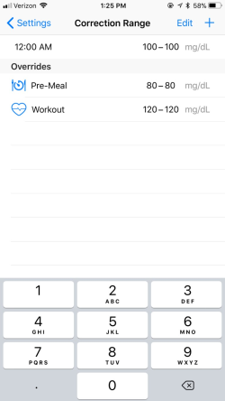
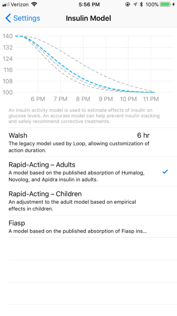
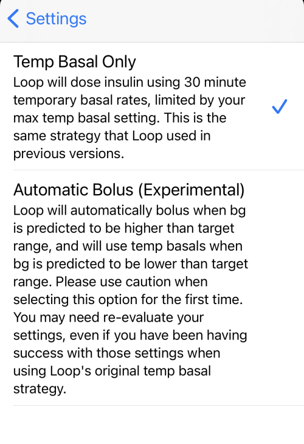

# Configuration

This page will cover two general parts of the Loop's settings, circled in red in the screenshot below. The headings will match the flow of the screen, top to bottom.

* The first circled section covers your Loop's closed/open loop status and Loop's Issue Report.

* The second circled section is the configuration section. This section contains a lot of really important settings that control how your Loop will calculate your predicted BG curve. Given the importance of your predicted BG curve to Loop's actions, please make sure you read over this page carefully to know how to navigate the selections and entries.

{width="350"}
{align="center"}

## Closed/Open Loop

The Closed Loop switch controls whether Loop automatically enacts its recommended temporary basal adjustments (closed loop mode) or whether you have to manually tap to enact the recommendations (open loop mode). In addition to the visual indicator on this switch discussed below, the [Loop's status icon on the main screen](displays.md#loop-status) will also appear differently depending on the mode selected. Open loop mode will have an incomplete circle for the Loop's status icon.

### Open Loop Mode

{width="400"}
{align="center"}

When the Closed Loop switch is in the (Off&nbsp;&nbsp;&nbsp;&nbsp;&nbsp;   ) position, Loop WILL NOT enact recommended temp basals automatically. Instead, Loop will display recommended temp basals on the main status display, just above the blood glucose graph. This is called **open loop**, and is a good way to understand how Loop will function, and what type of recommendations it would make. If you click on the recommended temp basal line while in open loop mode, Loop will implement the temp basal.

### Closed Loop Mode

{width="400"}
{align="center"}

When the Closed Loop switch is in the (&nbsp;&nbsp;&nbsp;&nbsp;&nbsp;   On) position, Loop WILL automatically enact recommended temp basals on the configured insulin pump. This is known as **closed loop**. Typically, Loop will show the recommended temp basal just above the blood glucose graph prior to automatically enacting it. It may take a minute or so for the Loop to enact the recommended basal. Once the temp basal has been enacted successfully on the pump, the recommended temp basal will disappear from the screen and the new temp basal rate will be represented in the insulin delivery graphs.

## Issue Report

If you run into problems or errors with your Loop, an Issue Report can be used to help identify where the problem is occurring. The Issue Report is automatically generated and you can share it via email. Frequently, if you seek help with a technical problem, an Issue Report will provide insight for the developers and troubleshooters. Please email yourself an Issue Report anytime you are questioning Loop actions or displays. You can then use that Issue Report later to help debug the problem.

## Select BG Units

!!! info "Before you continue further, a word about BG units"

    Entries into the configuration section will be available in mg/dL or mmol/L automatically, based upon how your blood glucose values are received. By default they are set to mg/dL, however once CGM values arrive in mmol/L these Loop settings can be entered in mmol/L. **If you are planning to use mmol/L, be sure to wait to set your entries until after you have started to receive CGM values in Loop.** If you do these in the wrong order, then your charts and entries may have incorrect units.

## Correction Range

The correction range is your blood glucose range that you would like Loop to correct to. Correction range is not necessarily the same target blood glucose range that you have discussed with your endocrinologist; generally the doctor's range may be much wider. For example, you may keep a correction target of 100-110 for Loop to aim to, but use a desired BG target range of 80-180 when discussing things with your endo about "time in range".

{width="250"}
{align="center"}

Click the + in the upper right corner to add correction BG range(s). You can have multiple ranges based on time of day, but the first setting of the day needs to begin at midnight.

Correction ranges can be a single number, such as 100-100 mg/dL, or a range such as 100-120 mg/dL. Generally speaking, if you choose to use a range, keeping the range between about 10-30 mg/dL between the lowest and highest value is a good starting place.

### Pre-Meal Range

Below the Correction Range entry is a section called "Overrides" with a Pre-Meal setting. While active, the pre-meal targets will replace the usual correction range for Loop's temp basal recommendations. If a pre-meal range is not entered in this section, the icon will remain grey and unusable on the main screen's toolbar.

The pre-meal override target can be used to as an easy way to get a small amount of insulin delivered before a meal in order to help control post-meal blood glucose spikes.

If your normal target is 100-110 mg/dL and pre-meal target is 80-80 mg/dL, for example, Loop will give you an extra push to get you to the lower target number before the meal. This early insulin brings you into the meal with a mini-prebolus. The pre-meal target, when activated by pressing on the icon, will stay active for one hour, until carbs are entered, or until it is manually cancelled...whichever comes first.

Loop will adjust any insulin bolus as needed based on the extra insulin provided during this pre-meal time.

## Suspend Threshold

The suspend threshold must be set up for successful configuration of Loop. **Your Loop will not turn green without setting this value.** This value affects both bolus and basal recommendations by Loop.

### Bolus

* If you are trying to bolus a meal while any part of the predicted BG curve is below this suspend threshold value, Loop will not recommend a bolus.  Instead, you will need to wait until your prediction curve is above the suspend threshold value in order to bolus.

### Basal

* If your current or any point on your predicted BG curve is below the suspend threshold, Loop will always recommend a temporary basal rate of 0 U/hr.

Reasonable settings for suspend threshold will depend on user preference, but recommended not set lower than 65 mg/dL.

## Basal Rates

!!! danger ""

    **Note: You cannot enter basal rates until you first add a pump in Loop settings.** Your basal rates will be initially populated when you walk through the `Add Pump` part of the setup at the beginning of this setup guide.  

Only one basal schedule may be set in each Loop app. The basal increments are available according to the increments of the particular pump/pod you are using. Not all pumps provide the same increments for basal deliveries. Basal schedule must start at midnight and cannot contain rates of 0 U/hr.

To edit a line in your basal schedule, tap the line and adjust the time and/or amount.  To remove a line, select Edit in the top right and delete it.  If tapping the line doesn't work, try closing and re-opening the app.  When finished editing, click on the `Save to Pump...` or `Sync With Pod` button, depending on which pump you are using.

!!! info ""

    If you make any basal edits and use the `Cancel` button to go back to the menu without successfully saving/syncing to pump/pod, the changes you made will not be saved. Loop makes saving/syncing to pump a mandatory step to successfully editing basal rates. If you get an error message while trying to save/sync the edited basal rates, please retry until successful.

## Delivery Limits

The maximum basal rate and maximum bolus settings are collectively referred to as Delivery Limits. This section will have been initially populated when you finished the `Add Pump` part of the setup previously. For safety, similar to basal schedule, you must keep these values the same on both the Loop app and within the pump/pod settings. If you edit these settings in Loop app, always use the `Save to Pump...` or `Sync With Pod` button, depending on which pump you are using.

### Maximum Basal Rate

Maximum basal rate will cap the the maximum temporary basal rate that the Loop is allowed to enact to meet your correction range. Typically, Loop users set their maximum basal rate around 3-4 times their highest scheduled basal rate. When you are first beginning to use Loop, it is wise to start conservative (low) in setting your maximum basal rate. If your settings are incorrect in other areas (basal rates, insulin sensitivity, carb ratio, etc), you may need time to identify where settings need to be adjusted. This process is easier if Loop is given less latitude to set high basal rates. Gradually increase your maximum basal rate as your comfort and confidence in Loop increases. If you need help with your settings adjustment, head over to LoopTips for some [initial settings help](https://loopkit.github.io/looptips/settings/settings/)

#### **Maximum Bolus**

Enter your desired single bolus maximum here. For safety, don't set a maximum bolus limit any higher than your typical large meal bolus.

## Insulin Model

There are four insulin models to choose from; Walsh, Rapid-Acting Adults, Rapid-Acting Children, and Fiasp. If you want to read the nitty-gritty discussion that went into the development of the Rapid-Acting and Fiasp curves (collectively called "exponential insulin models"), you can see that in GitHub [here](https://github.com/LoopKit/Loop/issues/388#issuecomment-317938473).

**We highly recommend selecting one of the exponential insulin models (in other words, not the Walsh model).**

A common new Loop user error is to select Walsh model in order to easily shorten their insulin duration (DIA) to one like they used prior to Looping. This almost invariably leads to insulin stacking. If you would like to read more about why the duration of insulin action is important in Loop vs how you've traditionally used it, please click [here](https://seemycgm.com/2017/08/09/why-dia-matters/) to read a blog post about the subject. In summary, choosing Walsh curve just to shorten your DIA will lead to insulin stacking and less than desired bolusing recommendations.

You can click on each model and see what each model's insulin activity curve looks like, active one selected in blue.

{width="350"}
{align="center"}

The differences between the three exponential models (two Rapid-Acting and Fiasp) models has to do with the timing of the peak insulin activity timing. Not surprising, since Fiasp is marketed as the "faster acting" insulin. Currently all the exponential models are defaulted to an insulin duration of 6 hours, but the peak activity of the curves differs:

* Rapid-acting adult curve peaks at 75 minutes
* Rapid-acting child curve peaks at 65 minutes
* Fiasp peaks curve peaks at 55 minutes

## Dosing Strategy

This configuration setting gives you the ability to select the Dosing Strategy. (If you do not see this setting, then you are running Loop v2.2.4 or older.) If you tap on that Dosing Strategy, it reveals a selection screen, shown in the graphic below, with some explanation.  Note that this Dosing Strategy feature was available for more than a year in the automatic-bolus branch.  Users who have been using the automatic-bolus feature should update as soon as possible to get the other improvements recently added, [Loop Releases](../../faqs/release-faqs.md).

{width="350"}
{align="center"}

The Automatic Bolus selection causes Loop to provide 40% of the recommended dose as a bolus at the beginning of each Loop cycle (when a CGM reading comes in). This is a faster method of getting the recommended insulin delivered. When Loop delivers extra insulin, the scheduled basal rate continues unchanged.

Both Temp Basal Only and Automatic Bolus strategies restrict basal rates to reduce the amount of insulin delivered when appropriate.

### Temp Basal Only

1. When your blood glucose (BG) is at or above target, Loop determines the amount of Recommended Bolus based upon your settings.  Subject to your Delivery Limits, Loop will deliver the Recommended Bolus over 30 minutes using positive temp basals (i.e., increase over your scheduled basal rate) to increase your IOB. This decision is re-evaluated during every Loop interval.
1. When your blood glucose (BG) is below target, negative temp basals (i.e., reduction of your scheduled basal rate) are used to reduce your IOB. This decision is also re-evaluated during every Loop interval.

You can manually bolus at any time by pressing the Bolus icon in the center of Loop’s Main Screen.

## Automatic Bolus

When you first starting Loop, we encourage you to leave automatic boluses disabled until you are sure your settings are dialed in.  To enable automatic boluses, click on Settings – Dosing Strategy – Automatic Bolus.  This Automatic Bolus checkbox turns-off positive temporary basal so that:

1. When your blood glucose (BG) is at or above target, you receive 40% of the Recommended Bolus at every Loop interval.
1. When your blood glucose (BG) is below target, negative temp basals (i.e., reduction of your scheduled basal rate) are used to reduce your IOB. This decision is re-evaluated during every Loop interval (same as with the Temp Basal Only dosing strategy).

As with all Loop versions, you can manually bolus at any time by pressing the Bolus icon in the center of Loop's Main Screen.  Any bolus recommendation that you see when you press the Bolus icon will be 100% of the Recommended Bolus.

## Carb Ratios

Click the + in the upper right to add carb ratios for various times of day. Loop works best if you have [tested and optimized](https://loopkit.github.io/looptips/settings/settings/) your carb ratio settings for accuracy.

!!! warning "Beware of other apps writing carbs to Health app"

    If you are using a third-party app (such as Spike or MyFitness) that can write carbohydrates to the phone's Health app, you will need to double-check permissions to make sure Loop doesn't read those carb entries.  Confirm Loop permissions in Health to only `write` and not `read` carbs.  See see [Loop Permissions](../../build/health.md#loop-permissions).

## Insulin Sensitivities

Insulin Sensitivity Factor (ISF) is the same term as Correction Factor used in some clinics and endocrinology offices. ISF represents the drop in blood glucose levels expected from one unit of insulin. Click the + in the upper right to add insulin sensitivities for various times of day. Loop works best if you have [tested and optimized](https://loopkit.github.io/looptips/settings/settings/) your ISF settings for accuracy. Insulin sensitivities can change for many reasons including waiting too long to change your infusion set. Loop will not auto-detect changes in ISF.

Incorrectly set ISF is the most common cause of roller coaster BGs for new Loop users. You will need to raise (increase) your ISF value/number to help smooth a roller coaster BG trend. You can read about that topic more over in LoopTips [here](https://loopkit.github.io/looptips/settings/settings/#3rd-insulin-sensitivity-factor).

## Next Step: Loop Services

You have completed the required configurations and settings in your Loop app. If you have a Nightscout site you'd like to connect Loop to, please continue on to the [Loop Services page](services.md).

If you are not integrating with a Nightscout site and don't want any optional logging services connected, then please proceed to the [Loop's displays page](displays.md). Understanding the Loop displays can be a valuable tool to understanding your Loop's actions, and also for troubleshooting, if you are having issues.
