## Loop Displays

This section of the docs describes the Loop displays available and what information they offer.  Information about Loop's actions (or inactions) can often be found simply by looking at the visuals presented in the app. (Page last updated for Loop v2.2.4.) For Loop 3, refer to [Loop 3 Displays](../../loop-3/displays-v3.md).

## Status Screen

The Status Screen is the main root navigation screen in Loop. It is broken up into 3 main display areas; Heads Up Display (HUD), Charts, and Toolbar. The HUD is the top area of the screen. This shows the status of the last time loop ran, current BG Reading, current temp basal, and current pump information. The next area is the charting area. This includes, glucose trend and prediction, Active Insulin, Insulin Delivery, and Carbohydrates. The final display area is the toolbar which has buttons for Carbs, Pre-Meal, Bolus, Overrides, and Settings.

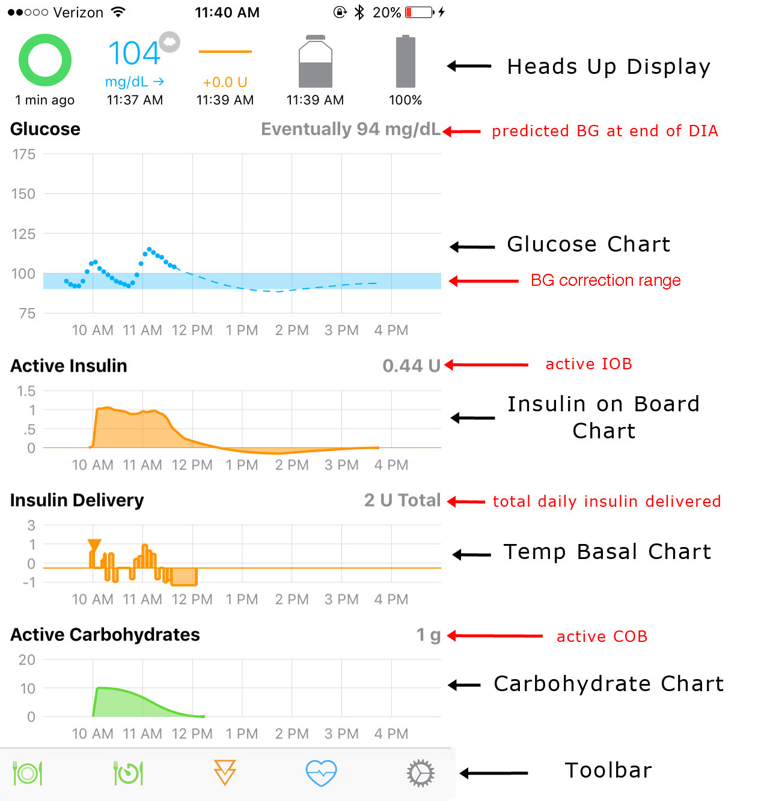{width="550"}
{align="center"}

### Heads Up Display

The Heads Up Display (HUD) is a very useful quick reference guide to your Loop's status. Every 5 minutes, Loop updates CGM and pump/pod data. Loop timestamps the HUD data with the last data point that came in. If a timestamp goes older than 5 minutes old, that is a valuable indicator to where your Loop is failing to get the needed information. The HUD's first three icons, from left to right, are the same no matter whether you are using a Medtronic pump or Omnipod; status of the last time loop ran, current BG Reading, and current relative temp basal. The last two icons will change depending on what type of pump you are using.

Medtronic users: The last two icons are the most recent (1) pump/reservoir status and (2) pump percentage battery remaining. [Details below](displays.md#reservoir-medtronic-users)

{width="400"}
{align="center"}

Omnipod users: The last two icons are the most recent (1) pod status and (2) hours of pod use. [Details below](displays.md#reservoir-omnipod-users)

{width="400"}
{align="center"}

#### Loop Status

The Loop Status is the colored circle in the upper left corner of the main Loop display.  There are four colors that are typically displayed.

| 

 ||
|---|---|
||A grey circle indicates the Loop is warming up and hasn’t yet completed its initial loop.  When the Loop is first activated, it may take about 15-20 minutes to complete the first Loop, and the grey circle will be displayed.  It needs CGM data to be gathered, so be patient.  When it finally completes its first loop, the circle will turn green.  If you can't get your grey loop to turn green, please see the [Yellow and Red Loop troubleshooting page](../../troubleshooting/red-loop.md)  for tips.|
||A green circle indicates the Loop has been successfully completed within the last 5 minutes.  The time since the loop last completed will be displayed under the circle.|
||A yellow circle indicates the Loop has not completed in the last 5-15 minutes.  It is not unusual to have a few instances of yellow circles throughout a day of looping.  They can be caused by temporarily getting too far away from RileyLink or iPhone (more than about 3-10 feet depending on conditions), CGM failing to read or being in ???, radio frequency “noise” interference, and such.  Generally, most yellow circles will self-resolve without needing any special troubleshooting.|
|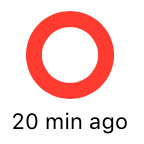|A red circle indicates the Loop has not completed in over 15 minutes.  This is not a typical state, and you should troubleshoot why Loop is not completing.  Please review the [Yellow and Red Loop troubleshooting page](../../troubleshooting/red-loop.md) for tips on how to get your green Loop back.  Clicking on the red circle will also pop-up the last error message to help guide your troubleshooting.|
|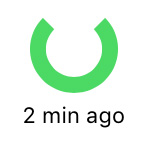|When the circle is notched and not complete, that means the Loop is operating in “open-loop” mode.  When the “closed-loop” setting is turned on, the loop status will show a completed circle.|

!!! info "Fun Fact"
    The loop status icon will pulse slightly when Loop is communicating with the pump.  The pulsing will stop when the communication has completed (green loop) or given up (yellow or red loop).

#### Glucose

| 

 ||
|---|---|
|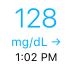|The current BG reading from the CGM will display, including trending arrow and time the reading was taken.  If the BG is being read straight from the G5/G6 transmitter or G4 receiver, no special symbols will appear.|
|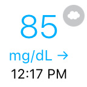|If the BG is being read from the Dexcom Share Servers, a small cloud icon will be in the corner of the BG reading.  Internet access is required to run in this mode.|
|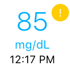|When you first start Loop, there may be a small yellow alert next to the BG.  This should go away within a short period of time (around 5 minutes or less).  If the yellow alert remains, something may be wrong with fetching BG data.  You can try restarting the Loop app (double tap home button, up-swipe on the app to close it) to see if BG data will resume.    **Special note for Dexcom G5/G6 users**>, a yellow alert will appear when calibration is needed.  The alert will clear once the calibration is given, but typically Loop will work IF the yellow alert is only for a needed G5/G6 calibration.|

#### Temp Basal

| 

 ||
|---|---|
|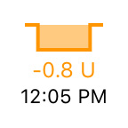|The temp basal will display the enacted temp basal change relative to the scheduled basal.  So if the scheduled basal was 1.0 units per hour and Loop has set a temp basal of 0.2 units per hour, the temp basal icon will display -0.8 U, as shown in the graphic to the left.|

#### Reservoir (Medtronic Users)

| 

 ||
|---|---|
|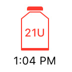|The reservoir icon will remain grey and plain until insulin volume decreases.  At 25% reservoir volume remaining, the reservoir icon will turn yellow.  At 10% reservoir volume remaining, the reservoir icon will turn red.  The remaining units will be displayed when it gets to these lower thresholds.|

#### Battery (Medtronic Users)

| 

 ||
|---|---|
||For x54 pumps, the battery icon will show 100/75/50/25% increments just as the pump does.  As the battery level decreases, the icon will turn from grey to yellow to red.  For x22, x23 pumps, the battery icon will read discrete % values.    The warning colors/levels on Loop's battery indicator work in conjunction with the type of battery selected.  If you change battery types, please make sure to update your battery selection in the Loop app settings.     The pump's on-screen battery indicator is not a good indicator of remaining battery life for the purposes of looping.  Loop's pump communications will fail from low battery levels sooner than the insulin delivery will fail.  The Loop's battery level warnings are designed to give you approximately 8 hours of notice before the pump battery will need changing.|

#### Reservoir (Omnipod Users)

| 

 ||
|---|---|
|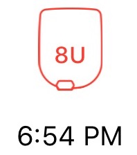|The pod icon will remain grey and plain until insulin volume decreases.  At 50 units or less insulin remaining, the reservoir icon will turn yellow. At 20 units or less remaining, the reservoir icon will turn red.  The remaining units will be displayed when it gets to these lower thresholds.   When the reading is 0 units, there may be up to 4 units of insulin available but don't count on it. If the pod senses insulin can no longer be delivered, the pod will have a sustained audible alarm (the scream). Tapping Replace Pod in Loop->Pod->Settings should silence the alarm.|

#### Pod Age (Omnipod Users)

| 

 ||
|---|---|
|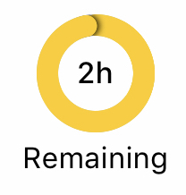|The pod's age, typically a 3-day lifespan, is represented by three equal segments of the pod age icon. As the pod ages, the segments are converted to a darker grey color. At 54 hours old, the pod age icon will turn yellow. At 72 hours old, the pod age icon will turn red, the pod will begin the periodic warning beep, and the pod age icon will show a "replace pod" message in the HUD.   When you reach 80 hours of pod use, the pod will have a sustained audible alarm (the scream) and stops all insulin delivery. Tapping Replace Pod in Loop->Pod->Settings should silence the alarm.|

## Charts

There are several charts that help you navigate your Loop actions.  Clicking on each of the charts will also open up additional information.

### Glucose Chart

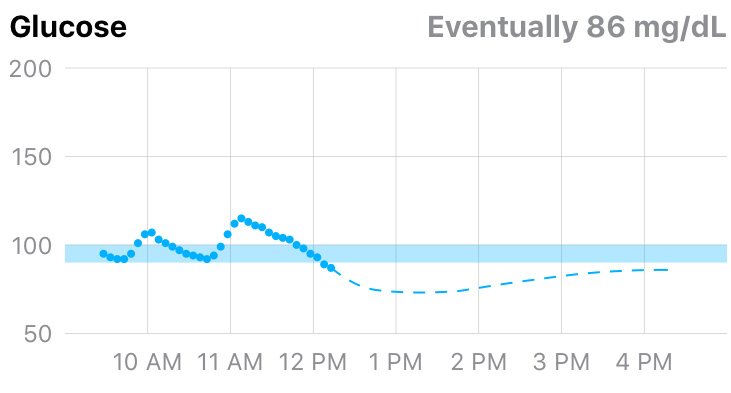{width="400"}
{align="center"}

The glucose chart displays BG values in your preferred units. (If not, quit and restart Loop app on your phone.) The vertical scale of the chart is calculated on the fly by Loop to be as useful as possible while including the highest and lowest readings in the chart.

The horizontal axis is set to go forward from the current time until your DIA (insulin duration) forward (so you can see what Loop thinks BG will be eventually). It then goes back in time as far as it can, based upon the width in pixels of your screen. Note, if you turn your device to landscape mode you will have more screen real estate and thus will be able to see further back in time.

The BG correction range is shown as a blue bar on the glucose chart.  Single-value range BG range (such as 100-100 mg/dL), will have a narrower blue range.  When a temporary override range is enabled, a darker blue bar where the overrides are set will be displayed, as well as the normal correction range in lighter blue.

!!! warning ""
    If you have a crazy negative prediction - it is likely that you set an [override](../features/overrides.md) with a tiny Overall Insulin Needs setting. Don't do that again. Best approach: Do not panic - this is a prediction only; not reality. Open the loop until the prediction settles down. In future, do not choose a tiny Overall Insulin Needs setting to force less insulin, simply increase the correction range in your override - Loop will reduce your basal rate at the next cycle (within 5 minutes).

The eventual BG displayed on the right side of the chart does NOT take into account a recently enacted temp basal.  In other words, if you are above BG range and Loop just enacted a high temp basal to help, the eventual BG does not reflect the expected lowering of BGs that would result from that recently enacted temp basal.  Loop waits until the insulin has actually been delivered before it "uses" the insulin in its calculations for BG impacts.  If you suspended your pump or had a "no delivery" alarm shortly after the temp basal was started, you would want that accurately reflected in the insulin on board and associated eventual BG.

If you tap on the Glucose Chart itself, it will open the Predicted Glucose chart described below.

### Predicted Glucose Chart

The predicted glucose view is a great way to gain insight into the various components’ importance in Loop’s prediction of eventual BG.

{width="300"}
{align="center"}

The graph at the top of this view will match your Glucose Chart. Below this chart you will see a very detailed explanation of all of the variables that Loop takes into account in predicting your future BG value. Each of those effects (including Carbohydrates, Insulin, Glucose Momentum and Retrospective Correction) includes details of the calculation used. You can tap on any of the entries to turn them off and on for visualization. The resulting changes can be viewed by the changes in the dashed lines.

Note - these elements are not turned on and off in the Loop predictions. They just modify the graph so you can view the relative effects.

### Active Insulin Chart

{width="400"}
{align="center"}

The Active Insulin chart displays the total insulin contribution from both temp basals and boluses.  Active IOB can be either positive and negative IOB.  Negative IOB results from the suspension of normally scheduled basals.  The active insulin displayed in the upper right corner of the chart does NOT include insulin contributions from a recently enacted temp basal or bolus until the (for Medtronic) pump’s reservoir volume is read and confirms a drop in reservoir volume (confirming the insulin has actually been delivered). The opposite is true for Omnipods. If a message is sent from Loop, it assumes the pod got the message and enacted it - even if the acknowledgement is not received.  Later, when communication is restored, if a command was not enacted by the pod, the Event History is updated.

**Medtronic Only**: So long as you have Event History as the Preferred Data Source in Loop settings, primed insulin deliveries (e.g., cannula fills or manual primes) will not be counted towards IOB.

### Insulin Delivery Chart

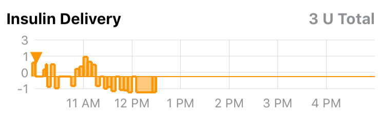{width="400"}
{align="center"}

The Insulin Delivery chart displays a history of the temp basals enacted by Loop.  The display is relative to the scheduled basal rates entered in the Loop settings.  So, a rate displayed in this chart as `+0 units` would indicate no temp basal was set, and Loop defaulted to the scheduled basal rate.  Individual boluses are indicated by an orange triangle on the chart (shown in the graphic above, near the left-most time).  The total insulin delivered since midnight, including all basals and boluses **AND (Medtronic Only) priming insulin**, is given in the upper right corner of the graph.

Please be patient for a bolus delivery to appear.  There is a lag time from when you press the “deliver” bolus button to when the orange triangle is drawn sometimes.  The insulin has to be delivered and then the (Medtronic Only) pump reservoir needs to be read to confirm delivery, before the triangle will appear and IOB will be added.  Occasionally, the bolus may be temporarily rendered (drawn) as a very high temp basal rate vs. a (triangle) discrete bolus event.  This does NOT mean that the Loop actually enacted a high temp basal rate...only that the bolus is being **drawn** on the chart in the equivalent of a high temp basal rate.

### Reservoir and Event History

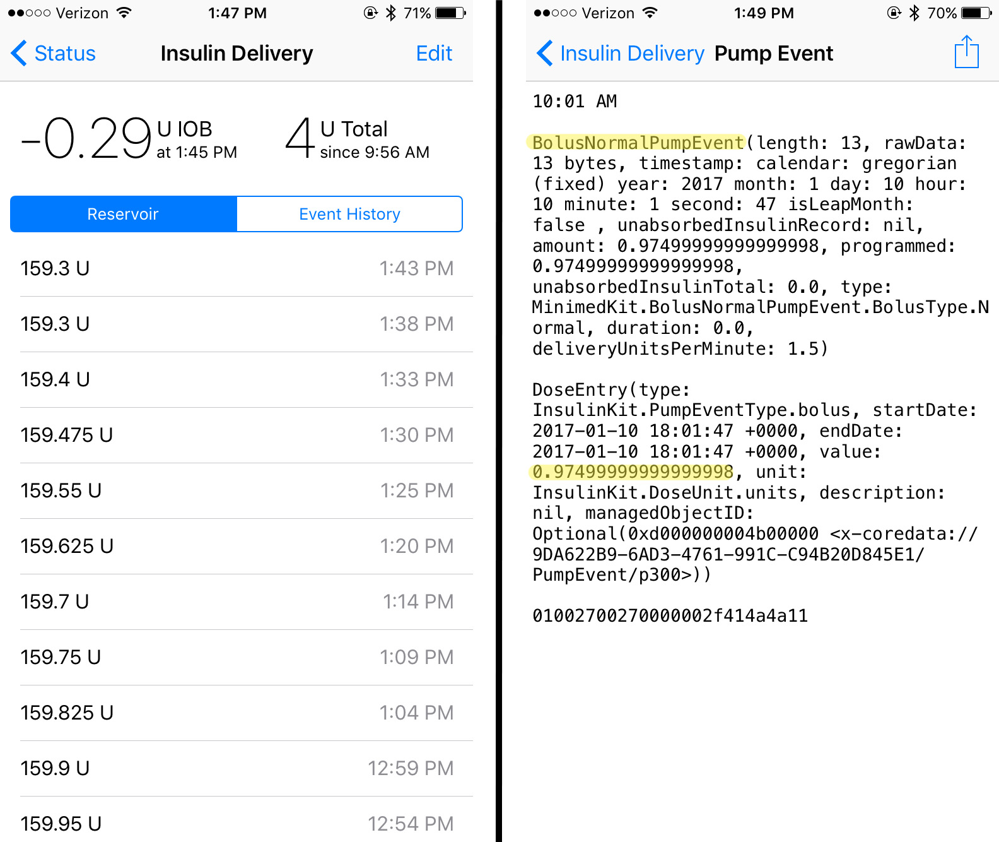{width="500"}
{align="center"}

Clicking on either the Active Insulin or Insulin Delivery charts will open your Insulin Delivery history.  The top of the screen will display the current IOB and the total insulin delivered for the day since midnight (or since the time the loop became active if you started Loop after midnight). There are two viewing options; Reservoir or Event History.  

* Reservoir: **Omnipod** users should not worry about the reservoir display. Pods do not report or track insulin remaining until their reservoirs get below 50 units remaining. If your pod has more insulin than that - you'll see the reservoir history from the previous pod - ignore that. **Medtronic** users will have reservoir history displayed in 5-minute increments, unless Loop has been having communication issues.

* Event History: Event history is a detailed accounting of all pump/pod actions. Both Medtronic and Omnipod users will have a detailed record of event history. If you tap on an event, you get more detail. Turn your phone to landscape to improve readability.

### Active Carbohydrates Chart

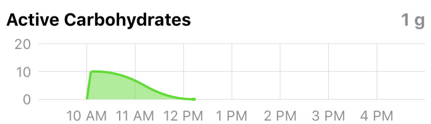{width="400"}
{align="center"}

The Carbohydrate chart displays the carbs used by Loop to predict BG changes.  The active COB is displayed in the upper right corner of the chart.  Clicking on the chart will open the Carb Entries history and you can edit/delete any previous entries through that screen.  Please read the [Carb Entry page](../features/carbs.md) for more information about editing carb entries.

{width="300"}
{align="center"}

For more information about the Insulin Counteraction Effects information found in the Carb History, please see [here](../features/ice.md).

## Tool Bar

{width="400"}
{align="center"}

The toolbar is where your inputs to the Loop behavior take place.  The individual components of the toolbar are, left to right:

* **Carb entry tool**- click on this tool to enter carbs into the Loop app.  Loop will not read carb entries from a Medtronic pump or Nightscout, so you must use the carb entry tool in Loop app in order to have carbs accounted for by the Loop.  Detailed info regarding how to enter, save, and edit carb entries can be found in the [Carb Entry page](../features/carbs.md).

* **Pre-meal range** - click this tool to set the [Pre-Meal temporary override range](../features/premeal.md). (If you have not configured a pre-meal range under Loop Settings, this icon will be inactive - some people prefer this to avoid accidently tapping it.) This range will remain in effect (1) for 60 minutes, (2) until a carb entry is saved, or (3) until the range is toggled off manually or by tapping on the override icon, whichever comes first.  The background coloring of the Pre-Meal range will turn green when active and there will be a dark blue line on the BG chart indicating where the override range is enabled.

* **Bolus tool** - click on this tool to bring up the bolus tool.  Normally, this screen will automatically open on its own and function as a bolus wizard when a meal is saved on the carb entry tool screen.  But you can click on this icon anytime to manually bolus. During rapidly rising BGs, where Loop doesn't have an adequate temp basal rate to cover the pace at which BGs are rising, you may try clicking on the bolus tool to see if Loop is recommending a correction bolus to help control the BG spike. Or if you want to trade bolus now for basal later (super bolus), you can enter a bolus greater than Loop recommends - Loop will set zero Temp Basal next cycle. For more information about the Bolus tool features and use, see the [Bolus page](../features/bolus.md).

* **Overrides** - click this tool to set an [Override](../features/overrides.md).

* **Loop Settings** - click on this tool to make changes to any of your [Loop settings](../overview.md#configurations).

## Next Step: Pump Settings

The pump attached to Loop has a screen to display status and command options. For Loop 2, these are documented in [Loop 2 Pump Settings](pump-commands.md).
