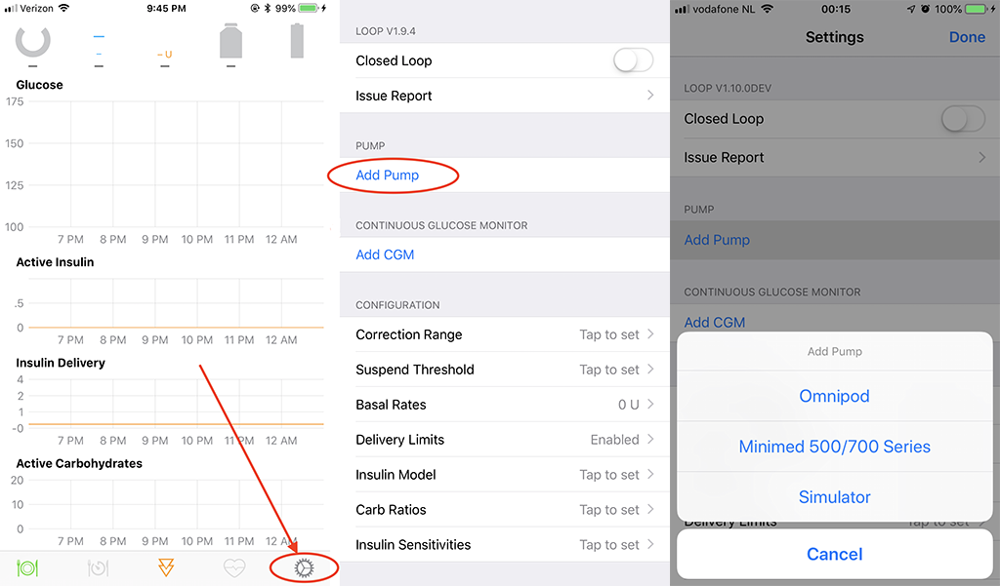
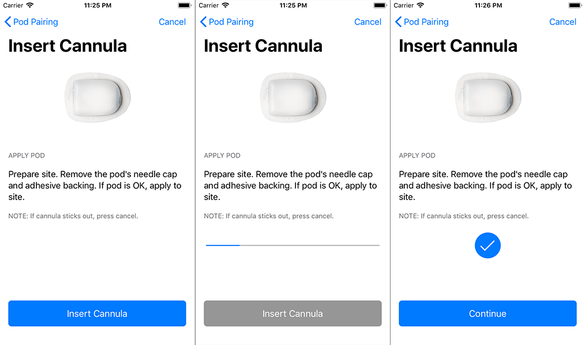

## Omnipod Users

Your Loop app will have a lot of blank spots until you input some basic settings. The beginning step is to add a pump to your Loop app. If you are using an Omnipod pump, you can follow along for the rest of this page. If you are using a Medtronic pump, please head over to [Loop 2 Add Medtronic Pump](mdt-pump.md) page instead.

## Select Pump Type

Let’s start by clicking on the Loop Settings button in the toolbar at the bottom of your Loop app. It looks like a little gear. On the settings screen that opens, click on `Add Pump` and select the **Omnipod** option.

{width="650"}
{align="center"}

## Select RileyLink

!!! warning ""
    New RileyLink compatible devices won't have a name listed next to their slider at first. The name will only be displayed after connecting the device to Loop for the first time. So, if all you see in the device list is a little toggle and no "RileyLink" name...go ahead and switch that toggle. The default device name will appear after that toggle is green.

    You can later [personalize](rileylink.md) the default device name once it is connected to Loop.

{width="400"}
{align="center"}

A list of all RileyLink compatible devices in the nearby area will display in the RileyLink Setup screen. Select your RileyLink by sliding the toggle to display green and then press the blue `Continue` button at the bottom of the screen. If your RileyLink does not appear, make sure it is charged and turned on: slide the recessed switch toward the case's keyring.

## Delivery Limits and Basals

The next screen will offer two areas where you will need to enter information:

* **Delivery Limits:** Tapping on Delivery Limits presents a screen where you enter your Maximum Basal Rate and your Maximum Bolus.

    * Your Maximum Basal Rate limits how aggressive your Loop app can be in setting temporary basal rates to treat high blood glucose.
    * The recommended value for new users is about 3 times their highest scheduled basal rate.
    * Your Maximum Bolus entry limits the size of a single bolus.
    * The recommended value for new users is the largest bolus typically used for meals.    

* **Basal Rates:** Enter your scheduled basal rates, beginning at midnight. Consistent with Omnipod use, the scheduled basal rates have a maximum of 24 entries, no 0 u/hr entries are allowed, and the rate increments are 0.05 u/hr.

    * Start by tapping the &plus; at the top right of the Basal Rates screen to enter the first value.  
    * Tap &plus; to add rows as needed.
    * When you are done, hit the `Back` button at the upper left.
    * Note - once a pod is paired to the Loop app, you will press `Sync to Pod` instead of `Back` to save your basal rates - you only see `Back` when no pod is paired.
    * To delete a basal rate or rearrange the order, first tap `Edit` on upper right and then use standard Apple gestures (for your phone iOS) to delete or move rows.
    * You will not be able to move or delete the row for midnight.
    * You will not be able to add another row if the last row is for 11:30 pm

{width="650"}
{align="center"}

When you finish entering these values, press the blue `Continue` button on the bottom of the Pod Settings screen to continue with the next steps of Pod setup.

## Pair Pod

!!! danger "Max Fill is 200 Units"
    When you fill the Pod do not exceed 200 units.

    If you overfill the pods, you may get a pod fault right after priming.

!!! info "Pod Filling and Insertion"
    The Pod filling and insertion instructions are the same with the Loop app as they are for the PDM.  These videos: [Filling a Pod with Insulin](https://youtu.be/qJBN6rlvn_Y){: target="_blank" } and [Inserting the Cannula](https://youtu.be/ss1vpsmaLoI){: target="_blank" }, may be useful.  You will use your phone and RileyLink compatible device instead of the PDM.  Be sure to keep the phone and RileyLink close during pairing and insertion because the Pod uses a low-power mode during these activities.

1. Fill the Pod with insulin until it beeps (minimum fill is 80 units)
1. Place the Pod about 6 inches from the RileyLink compatible device with the phone within a few feet
1. Click the `Pair` button
1. Loop checks on the radio signal strength (RSSI) reported by the pod when it starts to pair and if it is not within the optimum range, it will ask you to move the RileyLink closer or further away and try again.
1. Wait while the progress bar for priming completes
1. Press the `Continue` button when the blue checkmark confirms priming is complete

{width="650"}
{align="center"}

## Insert Cannula

1. Prepare your insertion site
2. Remove the Pod's needle cap and adhesive backing
3. If the cannula is safely tucked away, apply the Pod to your desired infusion site. If cannula is sticking out, press `cancel` in the upper right corner of the screen and try a new Pod. (Report this issue to Insulet; it is a Pod problem.)
4. Press the `Insert Cannula` button.
5. Listen to the clicks filling the cannula, wait for insertion and the progress bar to complete. The number of clicks to insertion is not consistent. The cannula will deploy before the progress bar is completed.
6. Confirm cannula has deployed: you should feel it and there is a pink slide that can be seen on the outside of the pod as shown in this video: [Inserting the Cannula](https://youtu.be/ss1vpsmaLoI){: target="_blank" }.
7. Proceed to the Expiration Reminder screen to accept or modify the default reminder.

{width="650"}
{align="center"}

## Expiration Reminder

Finish the setup using the default expiration reminder time (2 hours before a full 3-days of usage). You can modify that expiration reminder at any time, see [Expiration Reminder](pump-commands.md#expiration-reminder). The notification will come from Loop; your Pod will not beep at this time. Setup is complete and your Pod is ready for use when you press the `Continue` button.

!!! info "Range"
    Now that the priming and insertion steps are complete, the Pod is in normal power mode, so the [range](../../faqs/rileylink-faqs.md#range) between the Pod and RileyLink compatible device is increased.

{width="650"}
{align="center"}

## Pod Settings

After the Pod setup is complete, you will be on the Pod Settings screen. The information on this screen is described in [Omnipod Pump Commands](pump-commands.md#omnipod-commands).

## Next Step: Add CGM

Congrats! You've added your Pod to your Loop app. Now, click on the `Done` button in the upper right corner of your Pump Settings screen to take you back to Loop Settings. Your next step is to [Loop 2 Add CGM](cgm.md) to your Loop app. After all, without CGM data, your Loop app won't loop.
