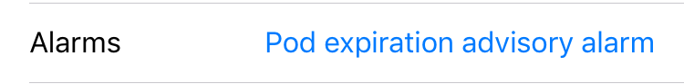

# Pump Settings

To bring up the Pod/Pump Settings display, tap on the reservoir icon in the Heads Up Display or the image of the pump in the Loop settings screen.

## Change Time Zone

The basal rates stay at the pump time even if the user and their phone change time zones or when daylight savings time occurs.  To bring the pump into the same time zone as the phone, use this command in Loop. (Medtronic users - do NOT adjust time on your pump - always go through Loop.)

Select the Pod/Pump Settings display, scroll down to the Change Time Zone line, example shown in the graphic below.  You can leave the time zone offset unchanged or touch it to change to the current time zone.  Note that the 24 hour configuration pattern for basal rates, insulin sensitivity factor, carb ratio and correction range are aligned with the time zone shown on this line.

{width="250"}

Once the Change Time Zone command is tapped, Loop no longer shifts the 24 hour configuration pattern to the old time zone. Some behavior depends on whether the pump is an [Omnipod](#change-time-zone_1) or [Medtronic](#change-time-zone_2).

## Omnipod Commands

To bring up the Pod Settings display, tap on the Pod Age icon on the Heads Up Display or the image of the Omnipod in the Loop settings display to reach the Pod Settings display.

This screen provides important information about your Pod and allows you to issue some commands to the Pod through Loop. There were some recent modifications made to the layout and underlying information for some of the rows.

* Enable/Disable Confirmation Beeps: moved up to the Configuration section; beeps for all manual pod operations; uses a more efficient implementation

* Suspend/Resume: Pod will beep every 5 minutes when suspended; the beeps can be silenced by tapping on the Alarms line

{width="250"}
{align="center"}

### Pod Information

The first section has the (72 hour) Pod expiration date/time and how long the Pod has been active. These are determined when the Pod is activated by injecting insulin into the reservoir and uses pod active time.

#### Bolus Delivery

This line reports the % progress of any ongoing bolus. This line reports `None` unless a bolus is actively being delivered when you enter Pod Settings. This line may not update until you tap on the refresh symbol to the right of the Pod image, or exit and re-enter the Pod Settings screen.

{width="250"}

#### Basal Delivery

This line reports

* _schedule_ for scheduled basals
* _U/hour_ for a 30 minute Temporary Basal
* _suspended_ if the Pod is suspended

{width="250"}

#### Alarms

This line displays Alerts or Alarms; tapping on it, or on the accompanying banner displayed in the HUD, acknowledges the alert

* If your Pod is beeping an alert, this line will display information about the alert. Tapping on the alert clears or "snoozes" the alert status.
* If your Pod is screaming, it's time to change it.  Tapping on this line stimulates an immediate reading of the actual error (normally this happens at the next CGM reading).
* There was overwhelming preference during initial testing to minimize the "beeping" of Pods. You can turn on additional beeps by enabling [Confirmation Beeps](pump-commands.md#enable-confirmation-beeps). These are the Loop Notifications and Pod beeps you should expect with the default (confirmation beeps disabled) setting:
    * Expiration Reminder - Loop notification only, no Pod beeps
    * 72 Hours Expiration - Loop notification and Pod beeps (Pod beeps continue  once per hour until alert is acknowledged)
    * 79 Hour Alert - Loop notification and Pod beeps (Pod beeps continue every 15 minutes until alert is acknowledged)
    * Pod Suspended (v2.2.5 or later): Pod beeps once per 5 minute unless this alarm is cleared

{width="250"}

#### Reservoir

Pods do not report the volume of insulin remaining in the reservoir until there are less than 50 units remaining. So, typically you will see "50+ U" in this line for quite a while with a new Pod.

{width="250"}

#### Insulin Delivered

This line is the basal and bolus insulin delivered by the Pod since the cannula was inserted. It is obtained by taking the reported Pod insulin delivery and subtracting the amount used to prime the Pod and fill the cannula upon insertion (about 3&nbsp;U).

{width="250"}

### Pod Commands

This section contains commands the typical user will use.

### Suspend Delivery

This command will suspend all insulin delivery; basals, temp basals, and boluses in progress. When you press suspend delivery, all insulin delivery stops indefinitely and the display changes to say `Resume Delivery`. (If the display does not update, tap the refresh screen icon at the top of the screen to the right of the Pod image.)

{width="250"}

A banner notice will appear on the Loop's main screen when phone is in portrait mode when insulin delivery is suspended. Unless you are running v2.2.4 or earlier, a pod beep is initiated with a frequency of every 5 minutes.  This can be silenced by acknowledging the alarm.

{width="250"}

You will need to press `Tap to Resume` in the banner or the `Resume Delivery` button in the Pod Settings to resume your scheduled basal rate and let Loop get back to action. If a bolus delivery was interrupted by the Suspend Pod command, it will not be resumed.

!!! info ""
    When you resume delivery, the 24 hour Pod basal rate schedule is sent to the Pod. Be sure the Phone, RileyLink and Pod stay close until the message exchange is complete.  

#### Enable Confirmation Beeps

This turns confirmation beeps on for the Pod. The Pod beeps when you enable this, but is silent when you disable it.

* Bolus Acknowledgement - the Pod beeps when it has received and accepted the bolus command from Loop (manual or automatic) and then beeps again when the bolus is completed.
* Other - all the manual commands you can issue to the Pod will have an associated confirmation beep when the message is received by the pod, such as updating the basal rate, requesting Pod status, canceling a bolus, suspending or resuming delivery.

#### Expiration Reminder

With the Expiration Reminder you can set a convenient time to get a notification to replace your Pod. Loop sets the default to 70 hours, i.e., two hours before the full 3 days that Insulet guarantees. The allowed range of values is between 1 hour and 24 hours prior to the Pod expiration at 72 hours of Pod life. If you select a date/time outside this range, Loop will modify your selection to the closest allowed value.

As with the PDM, Loop allows the Pod to continue operating after expiration until it reaches the maximum allowed 80 hours of life, at which time, the Pod shuts down and alarms.  Loop detects this message the next time it tries to communicate with the Pod. In the event your Pod runs out of insulin before that time, then you will get a "Pod empty" notification.

!!! info ""
    The glitch in setting the Expiration Reminder in v2.2.4 is now fixed.

    Loop v2.2.4 has a "glitch" in setting the Expiration Reminder.  Tap on the line (can't change time), scroll the entire display up or down until the line no longer is visible and then scroll it back. The Expiration Reminder display should now look like the graphic below. The expiration reminder time can now be selected.

{width="250"}

#### Change Time Zone

Use the [`Change Time Zone`](#change-time-zone) command to align your configuration settings with the current time zone. Note that this updates your basal schedule on your Pod. If you start a new Pod session without modifying the time zone here, the original time zone will be used for the new Pod. Please wait until you see `Succeeded` appear on the page to ensure the command has successfully been received by the Pod.

!!! info ""
    Make sure the phone, RileyLink compatible device and Pod are kept in close proximity until this command has completed. The time zone is updated by Loop issuing the 24-hour basal rate schedule to the Pod based on the current time.

{width="250"}

#### Replace Pod

This command deactivates a Pod prior to replacing it. Once you tap `Replace Pod`, another screen appears for you to confirm that you mean it.

{width="250"}

### Devices

This allows access to the [RileyLink](rileylink.md) screen for each connected RileyLink compatible device.

### Pod Diagnostics

This section is labeled Diagnostics, but many Pod users make use of this section.

#### Read Pod Status

This command requests the status of the Pod and reports some of the returned information.

* The line labeled `Pulses` reports the total number of pulses of insulin delivered by that Pod since activation (adding insulin to the reservoir). To convert this to units of insulin, multiply by 0.05 units/pulse. If you compare this report (for your Pod) to the `Insulin Delivered` line in Pod settings, for your Pod at the same time, the difference is the insulin used to prime the Pod and fill the cannula at insertion.

* The line label `RSSI` reports the Received Signal Strength Indicator (RSSI) between the RileyLink compatible device and the Pod. The RSSI is a positive number with a larger number indicating a stronger signal strength detected by the Pod.

    {width="250"}

#### Play Test Beeps

This command requests the Pod emit a beep pattern. If you hear it, you know the commands are getting to the Pod. A message appears on your screen to indicate Loop got or did not get an acknowledgement from the Pod.

#### Read Pulse Log

This command reads the pulse log (diagnostic), displays it on the screen and saves the result in the log file. It takes some time, so keep your gear close until command completes. This can be extracted by sending the pulse log to yourself using the send-to icon at the top right of the screen.  It is also included in the Issue Report. If you are having communication issues, you can provide this report to an expert who may be able to provide assistance. [Post](../../index.md#stay-in-the-loop) for help in either zulipchat or a Facebook group to request assistance and you'll get information about how to get that log file submitted.

#### Test Command

This verifies communication with the Pod. Loop reports success or failure.  Use Get Pod Status if you want to see the some of the information returned from the Pod.

### Pod Details

This section provides some Pod identifying information. The Lot number and TID number are the tiny number stamped on the Pod that Insulet might ask you to report if you happen to call in this Pod for an appropriate failure.

## Medtronic Commands

Medtronic commands are found in the Pump Settings screen shown in the graphic below. The top sections is configured at the time the pump is connected to Loop and can only be modified by deleting the pump and adding a pump. This screen is the same as for earlier versions with the addition of the `Use MySentry` row.

{width="250"}
{align="center"}

### Suspend Delivery

This command will suspend all insulin delivery; basals, temp basals, and boluses in progress. When you press suspend delivery, all insulin delivery stops indefinitely and the display changes to say `Resume Delivery`.

A banner notice will appear on the Loop's main screen when phone is in portrait mode when insulin delivery is suspended.

You will need to press `Tap to Resume` in the banner or the `Resume Delivery` button in Pump Settings to resume your scheduled basal rate and let Loop get back to action. If a bolus delivery was interrupted by the Suspend Pod command, it will not be resumed.

### Change Time Zone

During normal operation, Loop automatically keeps phone time and pump time aligned. In the case of time-zone or daylight savings time changes, Loop allows the differences to persist until the user chooses to [`Change Time Zone`](#change-time-zone) and accounts for time zones when performing insulin delivery accounting.

### Pump Battery Type

The type of battery used in the Medtronic pump affects how Loop interprets the [battery level for the pump](../features/battery.md#pump-battery).

### Preferred Data Source

Leave the Preferred Data Source set to on Event History for proper functioning of Loop.

**Event History must be selected for Nightscout to display temp basals, carbs, and boluses from Loop.**  Event History must also be selected in order for prime events to be detected and NOT contribute to IOB during site changes. Please just leave the Preferred Data Source on Event History.

### Use MySentry

This is a new option. If you don't see this row, consider updating your Loop app.  Using the MySentry feature on some Medtronic pumps when using an OrangeLink causes the batteries to die quickly.  This option allows you to turn off MySentry within the Loop app.

{width="250"}
{align="center"}

### Devices

This allows access to the [RileyLink](rileylink.md) screen for each connected RileyLink compatible device.
