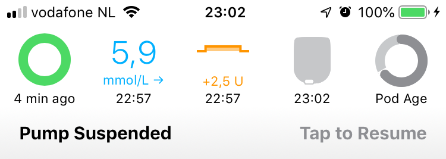
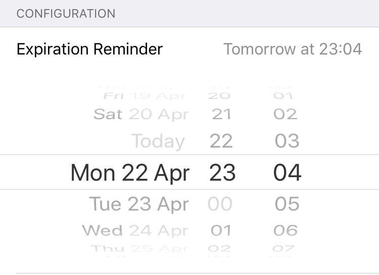

# Pump Commands

Initially, Loop was written to interact with Medtronic pumps. Then as Omnipod was added to Loop, the underlying code structure was reorganized to have "pump modules" and "CGM modules". This will make it easier, in future, to drop in new "modules" to Loop. This history is provided as a partial explanation as to why the [Medtronic Pump Command](pump-commands.md#medtronic-commands) commands are embedded in the RileyLink screen, whereas the Omnipod pump commands are in the [Pod Settings](pump-commands.md#omnipod-commands) display.

## Change Time Zone

For both Medtronic and Omnipod, use the Loop `Change Time Zone` command to update time.

* **Medtronics**: Tap on the reservoir icon in the Heads Up Display or the image of the pump in the Loop settings screen
* **Omnipod**: Tap on the Pod Age icon in the Heads Up Display or the image of the Omnipod in the Loop settings screen

    Scroll down to the Change Time Zone line, example shown in the figure below.  You can leave the time zone offset unchanged or touch it to change to the current time zone.  Note that the 24 hour configuration pattern for basal rates, ISF, CR and correction range are aligned with the time zone shown on this line.

    {width="250"}

Once the Change Time Zone command is tapped, Loop no longer shifts the 24 hour configuration pattern for basal rates, ISF, CR and correction range to the old time zone

* **Medtronics**: The time is updated on the Medtronic pump, which aligns the scheduled basal rates configured in Loop to the current time zone
* **Omnipod**: The basal rates as configured in Loop are sent to the Omnipod for the current time zone

## Omnipod Commands

To bring up the Pod Settings display, tap on the Pod Age icon on the Heads Up Display or the image of the Omnipod in the Loop settings display to reach the Pod Settings display.

This screen provides important information about your Pod and allows you to issue some commands to the Pod through Loop. There were some modifications made to the layout and underlying information for some of the rows with Loop v2.2.5.  Both Loop v2.2.4 and Loop v2.2.5 versions are shown in the graphic below.

Other than re-ordering, what is different under the hood with v2.2.5?

* Expires: The expected time for pod expiration (72 hours); pod time drifts over the life of a pod; expiration time is updated to account for that based on pod active clock

* Pod Active Clock: reports the active time as far as the pod is concerned; reports hr and min up to 80 hr 0 min; previous versions switched to days/hours after 24 hours

* Enable/Disable Confirmation Beeps: moved to the Configuration section; beeps for all manual pod operations; uses a more efficient implementation

* Suspend/Resume: Pod will beep every 5 minutes when suspended; the beeps can be silenced by tapping on the Alarms line

{width="500"}
{align="center"}

### Pod Information

The first section has information regarding how long the Pod has been active and the (72 hour) Pod expiration date/time. These are determined when the Pod is activated by injecting insulin into the reservoir and using actual time to estimate these values.

!!! info ""
    The Pod has an internal timer that keeps track of minutes that the Pod has been active.  This timer may have a slight drift with respect to actual time, so the 72 hour expiration beeps or the 80 hour Pod shutdown may be a few minutes before or after you expect it, based on this reported expiration date/time.

    The displayed values take this drift into account starting with Loop v2.2.5.

#### Bolus Delivery

This line reports the % progress of any ongoing bolus. This line reports `None` unless a bolus is actively being delivered when you enter Pod Settings. This line may not update until you tap on the refresh symbol to the right of the Pod image, or exit and re-enter the Pod Settings screen.

{width="250"}

#### Basal Delivery

This line reports

* _schedule_ for scheduled basals
* _U/hour_ for a 30 minute Temporary Basal
* _suspended_ if the Pod is suspended

{width="250"}

#### Alarms

This line displays Alerts or Alarms; tapping on it, or on the accompanying banner displayed in the HUD, acknowledges the alert

* If your Pod is beeping an alert, this line will display information about the alert. Tapping on the alert clears or "snoozes" the alert status.
* If your Pod is screaming, it's time to change it.  Tapping on this line stimulates an immediate reading of the actual error (normally this happens at the next CGM reading).
* There was overwhelming preference during initial testing to minimize the "beeping" of Pods. You can turn on additional beeps by enabling [Confirmation Beeps](pump-commands.md#enable-confirmation-beeps). These are the Loop Notifications and Pod beeps you should expect with the default (confirmation beeps disabled) setting:
    * Expiration Reminder - Loop notification only, no Pod beeps
    * 72 Hours Expiration - Loop notification and Pod beeps (Pod beeps continue  once per hour until alert is acknowledged)
    * 79 Hour Alert - Loop notification and Pod beeps (Pod beeps continue every 15 minutes until alert is acknowledged)
    * Pod Suspended (v2.2.5 only): Pod beeps once per 5 minute unless this alarm is cleared

{width="250"}

#### Reservoir

Pods do not report the volume of insulin remaining in the reservoir until there are less than 50 units remaining. So, typically you will see "50+ U" in this line for quite a while with a new Pod.

{width="250"}

#### Insulin Delivered

This line is the basal and bolus insulin delivered by the Pod since the cannula was inserted. It is obtained by taking the reported Pod insulin delivery and subtracting the amount used to prime the Pod and fill the cannula upon insertion (about 3&nbsp;U).

{width="250"}

### Pod Commands

This section contains commands the typical user will use.

#### Suspend Delivery

This command will suspend all insulin delivery; basals, temp basals, and boluses in progress. When you press suspend delivery, all insulin delivery stops indefinitely and the display changes to say `Resume Delivery`. (If the display does not update, tap the refresh screen icon at the top of the screen to the right of the Pod image.)

{width="250"}

A banner notice will appear on the Loop's main screen when phone is in portrait mode when insulin delivery is suspended. (With v2.2.5, a pod beep is initiated with a frequency of every 5 minutes.  This can be silenced by acknowledging the alarm.)

{width="250"}

You will need to press `Tap to Resume` in the banner or the `Resume Delivery` button in the Pod Settings to resume your scheduled basal rate and let Loop get back to action. If a bolus delivery was interrupted by the Suspend Pod command, it will not be resumed.

!!! info ""
    When you resume delivery, the 24 hour Pod basal rate schedule is sent to the Pod. Be sure the Phone, RileyLink and Pod stay close until the message exchange is complete.  

#### Enable Confirmation Beeps

This turns confirmation beeps on for the Pod. The Pod beeps when you enable this, but is silent when you disable it.

* Bolus Acknowledgement - the Pod beeps when it has received and accepted the bolus command from Loop (manual or automatic) and then beeps again when the bolus is completed.
* Other - most of the commands you can issue to the Pod will have an associated confirmation beep, such as updating the basal rate, requesting Pod status, canceling a bolus, suspending or resuming delivery.

#### Expiration Reminder

With the Expiration Reminder you can set a convenient time to get a notification to replace your Pod. Loop sets the default to 70 hours, i.e., two hours before the full 3 days that Insulet guarantees. The allowed range of values is between 1 hour and 24 hours prior to the Pod expiration at 72 hours of Pod life. If you select a date/time outside this range, Loop will modify your selection to the closest allowed value.

As with the PDM, Loop allows the Pod to continue operating after expiration until it reaches the maximum allowed 80 hours of life, at which time, the Pod shuts down and alarms.  Loop detects this message the next time it tries to communicate with the Pod. In the event your Pod runs out of insulin before that time, then you will get a "Pod empty" notification.

!!! info ""
    The glitch in setting the Expiration Reminder in v2.2.4 is fixed in v2.2.5.

    Loop v2.2.4 has a "glitch" in setting the Expiration Reminder.  Tap on the line (can't change time), scroll the entire display up or down until the line no longer is visible and then scroll it back. The Expiration Reminder display should now look like the graphic below. The expiration reminder time can now be selected.

{width="250"}

#### Change Time Zone

Use the `Change Time Zone` command to align your configuration settings with the current time zone. Note that this updates your basal schedule on your Pod. If you start a new Pod session without modifying the time zone here, the original time zone will be used for the new Pod. Please wait until you see `Succeeded` appear on the page to ensure the command has successfully been received by the Pod.

!!! info ""
    Make sure the phone, RileyLink compatible device and Pod are kept in close proximity until this command has completed. The time zone is updated by Loop issuing the 24-hour basal rate schedule to the Pod based on the current time.

{width="250"}

#### Replace Pod

This command deactivates a Pod prior to replacing it. Once you tap `Replace Pod`, another screen appears for you to confirm that you mean it.

!!! info ""
    With Loop v2.2.5, you no longer need to first tap `Suspend Delivery` and then `Replace Pod`.

    In earlier versions of Loop, the scheduled basal rate was assumed after Pod was removed. By first tapping `Suspend Delivery` and then tapping `Replace Pod` the Loop and Apple Health record for basal delivery is more accurate. This is especially important if a longer delay is planned prior to placing a new Pod on your body.

{width="250"}

### Pod Devices

This allows access to the [RileyLink](rileylink.md) screen for each connected RileyLink compatible device.

### Pod Diagnostics

This section is labeled Diagnostics, but many Pod users make use of this section.

#### Read Pod Status

This command requests the status of the Pod and reports some of the returned information.

* The line labeled `Pulses` reports the total number of pulses of insulin delivered by that Pod, converted to units (each pulse is 0.05&nbsp;U of insulin). If you compare this report (for your Pod) to the `Insulin Delivered` line in Pod settings, for your Pod at the same time, the difference is the insulin used to prime the Pod and fill the cannula at insertion.

* The line label `RSSI` reports the Received Signal Strength Indicator (RSSI) between the RileyLink compatible device and the Pod. The RSSI is a positive number with a larger number indicating a stronger signal strength detected by the Pod. (Older versions of Loop may not report this information on this screen.)

    {width="250"}

#### Play Test Beeps

This command requests the Pod emit a beep pattern. If you hear it, you know the commands are getting to the Pod. A message appears on your screen to indicate Loop got or did not get an acknowledgement from the Pod.

#### Read Pulse Log

This command reads the pulse log (diagnostic), displays it on the screen and saves the result in the log file. It takes some time, so keep your gear close until command completes. This can be extracted by sending the pulse log to yourself using the send-to icon at the top right of the screen.  It is also included in the Issue Report. If you are having communication issues, you can provide this report to an expert who may be able to provide assistance. [Post](../../index.md#stay-in-the-loop) for help in either zulipchat or a Facebook group to request assistance and you'll get information about how to get that log file submitted.

#### Test Command

This verifies communication with the Pod. Loop reports success or failure.  Use Get Pod Status if you want to see the some of the information returned from the Pod.

### Pod Details

This section provides some Pod identifying information. The Lot number and TID number are the tiny number stamped on the Pod that Insulet might ask you to report if you happen to call in this Pod for an appropriate failure.

## Medtronic Commands

The Medtronic commands are inside the RileyLink screen.

Tap on the reservoir icon on the Heads Up Display or the image of the pump in the Loop settings screen. From that pump screen, scroll down to the section labeled `DEVICES` to view the list of connected RileyLink compatible device(s). Tap on the name of a device with a green slider by it to view the RileyLink Menu for that device.

The figure below shows the `COMMANDS` section of the [RileyLink Menu](rileylink.md)  for  Medtronic pumps.

{width="450"}

There are several commands that Loop can issue to a Medtronic pump. Most are simply for gathering information from the pump.

The frequency used by the device to communicate with the pump is reported along with the time at which it was tuned.  If you tap on that line, Loop will do a manual tune, but this should not be necessary.  If Loop hasn't communicated with the pump in 2 cycles, it will automatically tune the frequency.

There is a Change Time button here, but since it is also found in the pump screen, you are more likely to tap it there.  Both buttons do the same thing. See (Change Time]

### Other commands

MySentry Pair, Fetch Recent History, Fetch Enlite Glucose, Get Pump Model, Send Button Press, Read Pump Status, and Read Basal Schedule are all ways of asking the pump for information you might be interested in. They are not part of setting up the Loop and will not affect Loop operations.

Enable Diagnostic LEDs, Discover Commands, and RileyLink Statistics are commands that are sometimes used by developers to aid in app troubleshooting and debugging. They don't impact Loop operations.

#### MySentry Pair

MySentry Pair is for x23 and x54 pumps only, and you will have completed this pairing command as part of the original [Add Pump](mdt-pump.md) process. The MySentry pairing process adds a specific ID to your pump in the pump's Connect Devices, Other Devices menu. This pairing allows Loop to get information from x23 and x54 in an efficient manner. If that is not done, Loop will only be green every other loop. If you ever want to re-pair MySentry, you can follow the directions as shown in the RileyLink command screen. You do not have to worry about this command if you are using an x15 or x22 model pump, as they do not have MySentry.

#### Fetch Recent History

Fetch Recent History polls the pump for recent pump events such as boluses, temp basals, primes, rewinds, etc.  The amount of information transmitted for a Fetch Recent History is usually quite large and, as a result, may be more prone to an early failure before it succeeds. If the first Fetch Recent History fails, sometimes it is helpful to use the Send Button Press command to sort of "wake up" the pump in preparation for communications.

#### Fetch Enlite Glucose

Fetch Enlite Glucose is only useful for Medtronic CGM users. The Fetch Enlite Glucose command will pull the recent glucose values saved in the pump history. Dexcom users do not store any glucose data in the pump.

#### Get Pump Model

Get Pump Model returns the pump's model.

#### Send Button Press

Send Button Press can be useful to see if the communication between the device and pump is working. If successful, the screen on the pump will light up and Loop will confirm the button press with a `success` message. If pump comms are failing, sending a successful button press can help "wake up" a pump that perhaps has not been communicating well.

#### Read Pump Status

Read Pump Status is also nice quick pump read for reservoir volume, pump battery voltage, and pump status (bolusing or suspending). For x23 and x54 pump users, this command will provide the exact pump battery voltage instead of the 25/50/75/100% levels that are reported otherwise.

#### Read Basal Schedule

Read Basal Schedule will pull the active basal pattern from the pump so you can review what the current settings are without using pump menu.

#### Enable Diagnostic LEDs

Enable Diagnostic LEDs will turn on more LED flashes on the RileyLink while it is operating. You will see more blue flashing lights as the RileyLink communicates with the pump. If you tried turning on this feature and decide later that you just don't want to see so many flashing lights, simply reboot the RileyLink by turning the power switch off/on.  This will reset the LEDs.

#### Discover Commands

Ignore the Discover Commands row.

#### RileyLink Statistics

RileyLink Statistics tracks how long your device has stayed successfully operating and gives the developers some useful information about the stability of the RL operations. It really doesn't provide much to the average Loop user, however.
