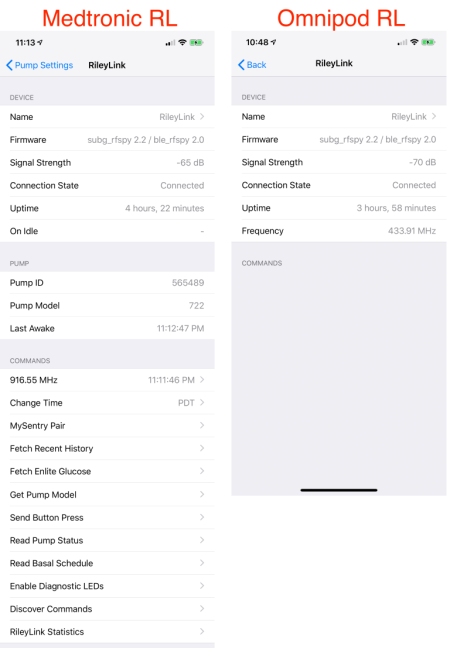
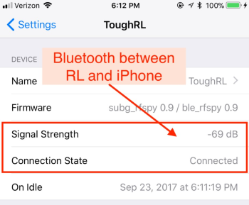

# Device Menu

The Device menu to view details about your RileyLink compatible device is accessed by clicking on the image of your connected pump in Loop settings. From that pump screen, scroll to the section labeled `DEVICES` and you will see the name(s) of your connected device(s).

!!! danger "Helpful Tip"
    As soon as you connect the device initially - it is strongly encouraged that you rename it from the default name for that device, e.g., RileyLink or OrangeLink or EmaLink. In the Device menu, tap on the Name line and enter your desired name. The new name may need to sit for a few seconds before exiting back out of the naming screen for it to be transferred and saved in the device. The device must be connected and on to change its name.

Depending on which pump you have connected to your Loop app, your Device menu will look different. On the left below is the typical Device menu when using Medtronic pump, and on the right is with an Omnipod. As you can see, both have in common a section called "Device", but after that only the Medtronic pumps will have additional commands in the Device menu.

{width="450"}
{align="center"}

## Device

The settings under the Device section are mostly for your information only. The two most important lines are the Connection Status and Signal Strength. You can also send a few manual commands to the Medtronic pump to verify that Loop and the pump are communicating. The manual commands for Omnipod are all located in the Omnipod menu, not in the device menu.

* The Connections Status should say `connected` if the device is connected to the iPhone's Bluetooth. If the status says `connecting` or `disconnected` then you should toggle the iPhone's BT and/or power cycle the device to help reconnect.

* The Signal Strength is the strength of the Bluetooth signal between the iPhone and the device.  It is **not** the signal strength of the radio communications with the pump/pod.  This is reported as a negative number so a -50&nbsp;dB signal is stronger than -80&nbsp;dB. As you move the device and iPhone closer/farther apart, you will be able to see the signal strength change. In a pinch, this can be used to help locate a lost device in the house or at the park after dark.

{width="350"}
{align="center"}

## Medtronic Device Menu

The rest of this page covers the additional items found only on the Medtronic Device menu.

### Pump

The Pump ID and Pump Model will be automatically filled in from your pump.

### Commands

There are several commands that Loop can issue to a Medtronic pump. Most are simply for gathering information from the pump.

The frequency used by the device to communicate with the pump is reported along with the time at which it was tuned.  If you tap on that line, Loop will do a manual tune, but this should not be necessary.  If Loop hasn't communicated with the pump in 2 cycles, it will automatically tune the frequency.

There is a Change Time button here, but since it is also found in the pump menu, you are more likely to tap it there.  Both buttons do the same thing - update your pump to match the current time at the current timezone.

### Other commands

MySentry Pair, Fetch Recent History, Fetch Enlite Glucose, Get Pump Model, Send Button Press, Read Pump Status, and Read Basal Schedule are all ways of asking the pump for information you might be interested in. They are not part of setting up the Loop and will not affect Loop operations.

Enable Diagnostic LEDs, Discover Commands, and RileyLink Statistics are commands that are sometimes used by developers to aid in app troubleshooting and debugging. They don't impact Loop operations.

**MySentry Pair** is for x23 and x54 pumps only, and you will have completed this pairing command as part of the original [Add Pump](mdt-pump.md) process. The MySentry pairing process adds a specific ID to your pump in the pump's Connect Devices, Other Devices menu. This pairing allows Loop to get information from x23 and x54 in an efficient manner. If that is not done, Loop will only be green every other loop. If you ever want to re-pair MySentry, you can follow the directions as shown in the RileyLink command screen. You do not have to worry about this command if you are using an x15 or x22 model pump, as they do not have MySentry.

**Fetch Recent History** polls the pump for recent pump events such as boluses, temp basals, primes, rewinds, etc.  The amount of information transmitted for a Fetch Recent History is usually quite large and, as a result, may be more prone to an early failure before it succeeds. If the first Fetch Recent History fails, sometimes it is helpful to use the Send Button Press command to sort of "wake up" the pump in preparation for communications.

**Fetch Enlite Glucose** is only useful for Medtronic CGM users. The Fetch Enlite Glucose command will pull the recent glucose values saved in the pump history. Dexcom users do not store any glucose data in the pump.

**Get Pump Model** simply returns the pump's model.

**Send Button Press** can be useful to see if the communication between the device and pump is working. If successful, the screen on the pump will light up and Loop will confirm the button press with a `success` message. If pump comms are failing, sending a successful button press can help "wake up" a pump that perhaps has not been communicating well.

**Read Pump Status** is also nice quick pump read for reservoir volume, pump battery voltage, and pump status (bolusing or suspending). For x23 and x54 pump users, this command will provide the exact pump battery voltage instead of the 25/50/75/100% levels that are reported otherwise.

**Read Basal Schedule** will pull the active basal pattern from the pump so you can review what the current settings are without using pump menu.

**Enable Diagnostic LEDs** will turn on more LED flashes on the RileyLink while it is operating. You will see more blue flashing lights as the RileyLink communicates with the pump. If you tried turning on this feature and decide later that you just don't want to see so many flashing lights, simply reboot the RileyLink by turning the power switch off/on.  This will reset the LEDs.

**Discover Commands** just ignore this menu item.

**RileyLink Statistics** tracks how long your device has stayed successfully operating and gives the developers some useful information about the stability of the RL operations. It really doesn't provide much to the average Loop user, however.
