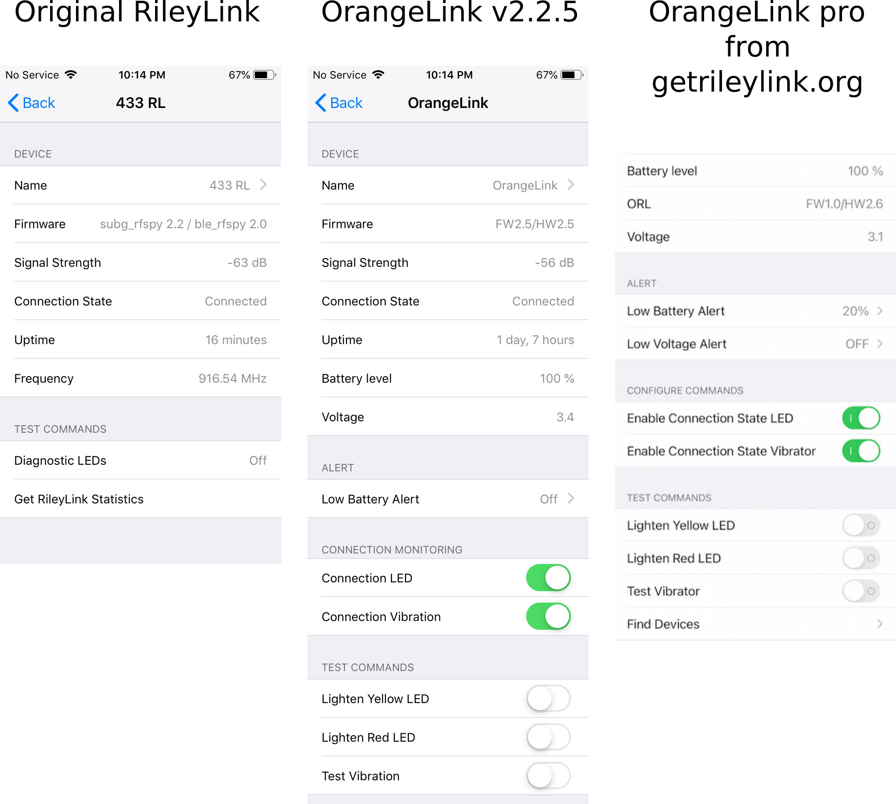

# RileyLink

The RileyLink (or compatible device) screen is accessed by clicking on the image of your connected pump in Loop settings or the Reservoir (Medtronic) or Pod Age (Omnipod) in the Heads Up Display to bring up the associated pump screen. From that screen, scroll down to the section labeled `DEVICES` to view the list of connected RileyLink compatible device(s). Tapping on a name with a green slider by it takes you to the RileyLink screen for that device.

!!! danger "Helpful Tip - Personalize Your Device"
    As soon as you connect the device initially - it is strongly encouraged that you rename it from the default name for that device, e.g., RileyLink or OrangeLink or EmaLink. Tap on the device as directed above, then tap on the Name line and enter your desired name. The new name may need to sit for a few seconds before exiting back out of the naming screen for it to be transferred and saved in the device. The device must be connected and on to change its name.

The name at the top center is whatever you named your RileyLink compatible device. With Loop v2.2.5, the RileyLink screen is the same regardless of the pump you are using. Some features available with OrangeLink were added to v2.2.5. For now, the EmaLink battery stats are not displayed. The left two graphics were taken from Loop v2.2.5 using an original RileyLink and an OrangeLink (not pro).  The version on the right is from the [getRileyLink.org](https://getrileylink.org/product/orangelink#patch) page with the patch they provded.

{width="600"}
{align="center"}

## Device

The lines under the Device section provide information on the device. The two most important lines are the Connection Status and Signal Strength.

* The Connections Status should say `connected` if the device is connected to the iPhone's Bluetooth. If the status says `connecting` or `disconnected` then you should toggle the iPhone's BT and/or power cycle the device to help reconnect.

* The Signal Strength is the strength of the Bluetooth signal between the iPhone and the device.  It is **not** the signal strength of the radio communications with the pump/pod.  This is reported as a negative number so a -50&nbsp;dB signal is stronger than -80&nbsp;dB. As you move the device and iPhone closer/farther apart, you will be able to see the signal strength change. In a pinch, this can be used to help locate a lost device in the house or at the park after dark.

{width="350"}
{align="center"}
