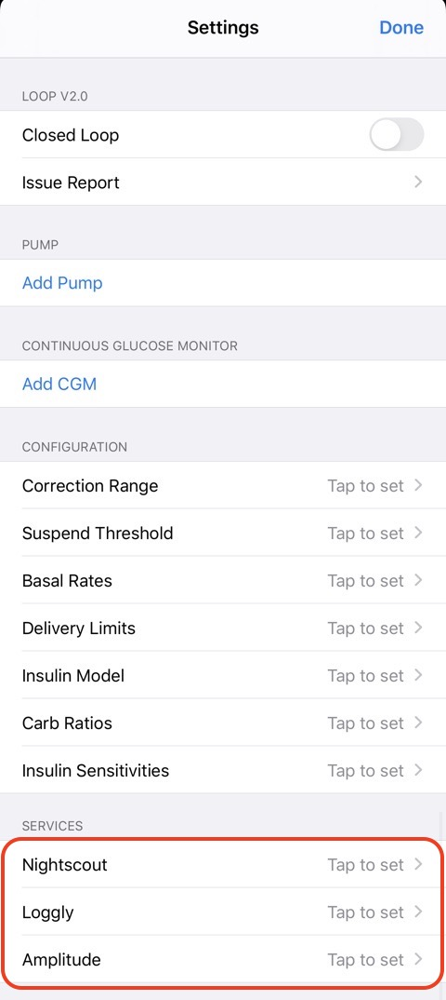
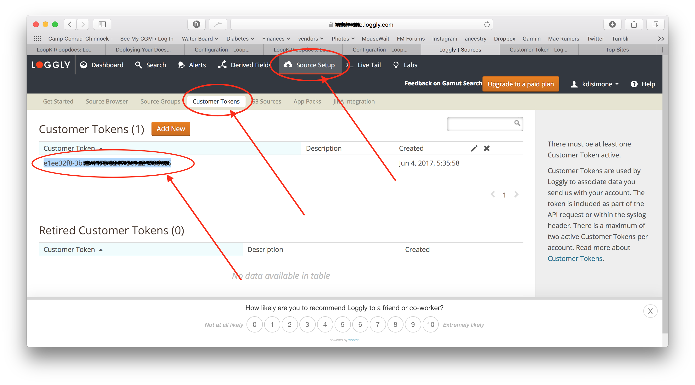

## Loop Services

Near the bottom of your Loop settings screen is a section called "Services".

!!! question "Sevices are Optional"
    * Loop will work whether you use these or not.
    * Nightscout is highly recommended by experienced Loopers but can be added later - you don't need it to get started.

* For Loop 2.2.x, the services listed in the graphic below can be added by clicking on the `Tap to set` arrow.

* Click for [Loop 3 Services](../../loop-3/services.md)

{width="350"}
{align="center"}

## Nightscout

There is a whole section in LoopDocs about Nightscout. Please follow this link to the [Using Nightscout with Loop](../../nightscout/overview.md) section of LoopDocs. That also has the links you might need to the official [Nightscout Documentation](https://nightscout.github.io/) (different website).

If you have an existing Nightscout site, it's still a good idea to review that section, but here's the quick summary of how to add your Site URL and API_SECRET to have your Loop data transmitted to your Nightscout site. If you can’t remember your API_SECRET, it can be found under Settings, Reveal Config Vars for Heroku sites (or Application Settings, Connection Strings for Azure sites).

The two most common errors in filling out this section are:

1. Failure to use `https://`  in the site URL.  If you use `http://` (see how that doesn't have the "s" at the end?), you will get an error message about an App Transport Security policy.
2. Having a trailing slash on the end of the URL (or an embedded space). If you copy and paste from a web browser, make sure to delete the trailing slash on the URL entry.

!!! tips "More Tips about Nightscout"
    * One family had an app configured to block some websites for their child's phone and accidentally blocked their Nightscout URL - took them a while to figure out that mistake.
    * If you use T1pal (paid Nightscout Service)
        * Sign in to T1pal
        * Select `Configure my Nightscout`
        * Select `Uploaders`
        * Use the copy button for URL and paste into Loop
        * Repeat for API_SECRET

## Loggly

[Loggly](https://loggly.com) is a free logging service. If you sign up for an account, you'll need to go under Source Setup and then Customer Tokens. Copy and paste your customer token into your Loop App settings for Loggly.

{width="500"}
{align="center"}

## Amplitude

[Amplitude](https://amplitude.com) is a remote event monitoring service and can be used to quickly identify errors and events with Loop. Amplitude stores the events and allows you to view those events as points in time. To retrieve the details of the events you will need to look at corresponding mLab data entries to get a complete picture of the issues. If you sign up for a free account with Amplitude, you will be given an API Key that you can enter here to have Loop integration setup.

{width="500"}
{align="center"}

## Next Step: Loop Displays

Great job, almost finished! Now that you have completed your services, let's move onto understanding your Loop Displays.

* Loop 2.2.x - click on this link for [Displays](displays.md)

* Loop 3 - click on this link for [Displays](../../loop-3/displays_v3.md). 

Loop displays is a valuable tool for understanding your Loop and a great page to review when troubleshooting.
