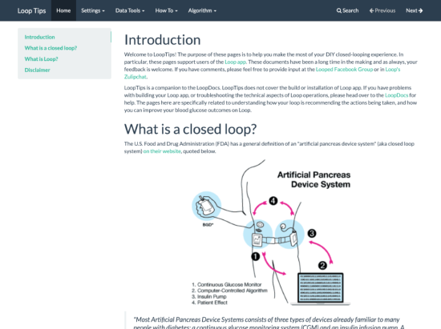

# Loop Tips

These docs are a great resource for the technical aspects of building your Loop app.  However, they don't really cover in detail a lot of the frequently asked questions about *USING* Loop.

Things such as:

* How to enter low treatments while using Loop?
* What to discuss with your Endo?
* What data reports might be useful?
* How to deal with failed sites?
* What about pizza boluses?
* What do I do when I shower or swim?

All of those usability questions and more are addressed over in the companion site called [Looptips](https://looptips.org).  

Please head over to Looptips in order to read some really helpful tips to make your Looping easier.

{width="550"}
{align="center"}
