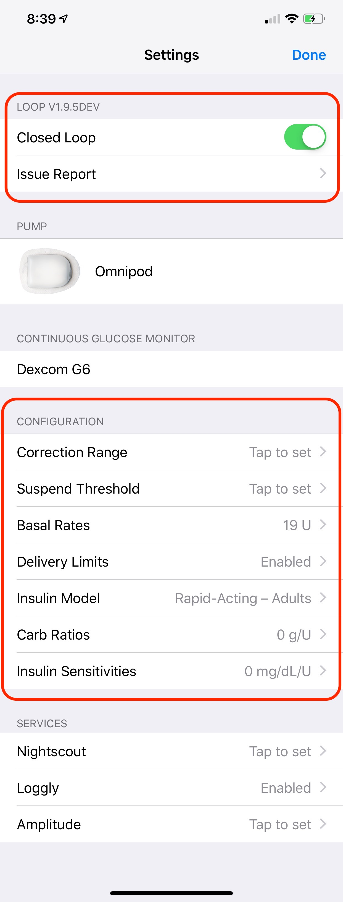

# How to Set Up Your Loop App

This section of LoopDocs, under the general menu tab "Set up App", goes through all the important information about the process to properly set up all your needed information. You will need to work through the steps listed in the headings under this page one by one. Please follow along with each page's information to make sure that you don't miss any valuable information about your Loop's settings and function.

## Permissions

Make sure that Loop has permission to send you notifications. For example, you will want to know if Loop has stopped working for more than 20 minutes.

Make sure Loop has permission to access Bluetooth devices.  You'll need that for your CGM and to connect a pump to Loop.

## Health Permissions

Set up App: Step 1 should have been completed when Loop built on your phone.  Confirm that the [Health Permission](../build/health.md) settings are correct. Note that the Carbohydrate read permission should be turned off; this is new information.

## Add Pump

Set up App: Step 2 is to select and configure your insulin pump. There are separate pages for setting up a Medtronic (MDT) pump or an Omnipod Eros pump (aka "pods"). Click on one of the pages to go straight to that page's guide.

[Add Medtronic Pump](loop-settings/mdt-pump.md)

[Add Omnipod Pump](loop-settings/omnipod-pump.md)

{width="250"}
{align="center"}

## Add CGM

Set up App: Step 3 is to add a [CGM source](loop-settings/cgm.md) for your Loop app. If you are wondering which CGMs are supported natively by Loop, check [Build Step 4](../build/step4.md).

{width="250"}
{align="center"}

## Configurations

Set up App: Step 4 is to configure Loop's settings. Within this section, you will be entering many settings that you are already familiar with such as basal rates, carb ratios, and insulin sensitivity factor (aka correction factor). There are also several new terms that you may be unfamiliar with like insulin model selection, suspend threshold, and override ranges. Make sure to refer to the [Configurations Setup Guide](loop-settings/configurations.md) while entering values - DO NOT GUESS.

{width="250"}
{align="center"}

## Services (Optional)

Set up App: Step 5 enables the optional selection of [Services](loop-settings/services.md). The most popular of those services is Nightscout; but the other logging sites listed also can store information about your Loop errors and messages. All of these services are optional; not using these services will not affect your ability to Loop.

{width="250"}
{align="center"}

## Loop Displays

After you are done entering your settings, you will need to familiarize yourself with Loop's various information displays. The [Displays](loop-settings/displays.md) page will help you recognize what all the icons, graphs, and data mean.

## RileyLink menu

Tapping on a connected RileyLink name brings up another menu showing displays and commands which provide useful information for your Loop. Check out the [RileyLink Menu](loop-settings/rileylink.md) for information.
