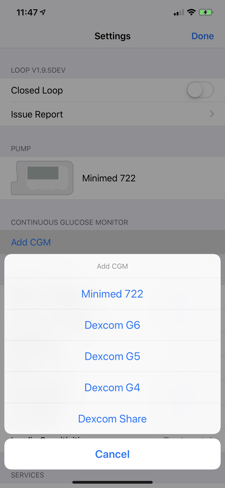
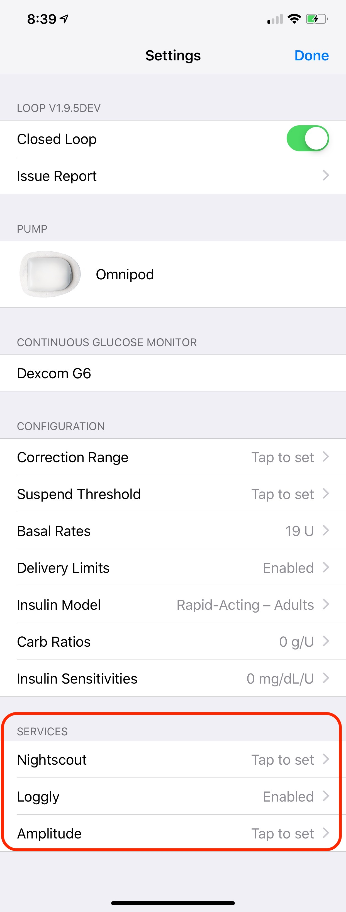

# Loop 2 Set Up Overview

This section of LoopDocs will be maintained during the transition to Loop 3. These pages are specific to Loop 2.2.x and some forks based off that older version, such as FreeAPS. 

**Be aware that older versions and forks will probably not be updated as the Apple environment changes.**

With Loop 2.2.x, you must manually step through every Loop setting and fill out the appropriate values. If you miss some, you may get errors in the app. If this happens to you, review every setting carefully.

You need to work through the steps listed in the headings under this page one by one. Please follow along with each page's information to make sure that you don't miss any valuable information about your Loop's settings and function.

You can work through each page completely and click on the link at the bottom of the page to proceed to the next page. Or you can use the back button on your browser to return to this page and click on the link for the page of interest.

## Permissions

Make sure that Loop has permission to send you notifications. For example, you will want to know if Loop has stopped working for more than 20 minutes.

Make sure Loop has permission to access Bluetooth devices.  You'll need that for your CGM and to connect a pump to Loop.

## Loop 2 Health Permissions

Follow the instructions on the [Loop 2 Health Permission](../build/health.md) page. Note that the Carbohydrate read permission should be turned off after enabling all.

## Loop 2 Add Pump

Select and configure your insulin pump. There are separate pages for setting up a Medtronic (MDT) pump or an Omnipod Eros pump (aka "pods"). Click on one of the pages to go straight to that page's guide.

[Loop 2 Add Medtronic Pump](loop-settings/mdt-pump.md)

[Loop 2 Add Omnipod Pump](loop-settings/omnipod-pump.md)

{width="250"}
{align="center"}

## Loop 2 Add CGM

Follow direction on the [Loop 2 Add CGM](loop-settings/cgm.md) page. If you are wondering which CGMs are supported natively by Loop, check [Compatible CGM](../build/step4.md).

{width="250"}
{align="center"}

## Loop 2 Configurations

Configure Loop's settings. Within this section, you will be entering many settings that you are already familiar with such as basal rates, carb ratios, and insulin sensitivity factor (aka correction factor). There are also several new terms that you may be unfamiliar with like insulin model selection, suspend threshold, and override ranges. Make sure to refer to the [Loop 2 Configurations](loop-settings/configurations.md) while entering values - DO NOT GUESS.

{width="250"}
{align="center"}

### Loop 2 Services (Optional)

You are not required to use services although many Loopers use Nightscout. If you do not yet have Nightscout configured and want to add it later, just return to the [Services](loop-settings/services.md) page when you are ready. Note that Loop 3 and Loop 2 use the same documentation page for Services. Services can be added at any time.

{width="250"}
{align="center"}

## Loop 2 Displays

After you are done entering your settings, you should familiarize yourself with the information displays. The [Loop 2 Displays](loop-settings/displays.md) page will help you recognize and begin to understand what all the icons, graphs, and data mean.

It is a good idea to remain in [Open Loop](loop/open-loop.md) while becoming familiar with the app.

## Loop 2 Pump Settings Screen

The pump settings screens for Loop 3 were updated. The older interface used by Loop 2 is documented at [Loop 2 Pump Settings](loop-settings/pump-commands.md)

## RileyLink Screen

The documentation for Loop 3 and Loop 2 is the same for the RileyLink screen. This screen is only available after configuring a pump that uses a RileyLink Compatible Device.

After a pump that uses a RileyLink is connected to the app, tap on a RileyLink name in the pump settings screen to bring up the displays and commands found on the [RileyLink Menu](loop-settings/rileylink.md) screen.
