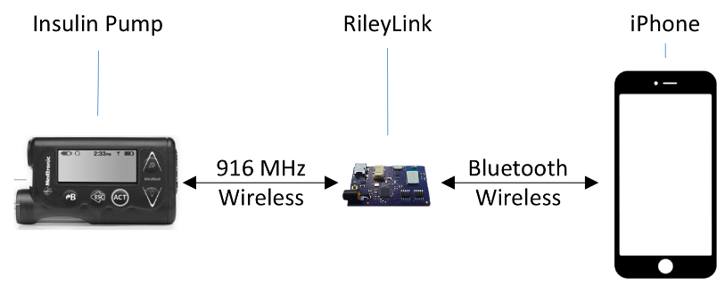

## RileyLink

The RileyLink is an open-source hardware device that can bridge Bluetooth Low Energy (BLE) to 916MHz wireless communication. What does that mean to you? It means RileyLink is the communication highway between your insulin pump, CGM, and iPhone.

**Loop will not work without the RileyLink.**

The RileyLink is available as a set of PCB files and software, with instructions on how to build your own RileyLink hardware module.  All this can be found here: [RileyLink Github](https://github.com/ps2/rileylink)
If you aren’t up to the task of building your own RileyLink (and most of us aren’t), community members periodically do a production run of RileyLinks. You can place an order here: [RileyLink order site](https://getrileylink.org)

### Waiting for RileyLink

Yes, waiting for RileyLink to arrive is extremely difficult.  PLEASE be patient, since Loop CANNOT work without RileyLink.

If you're really dying to do something while RileyLink ships, consider these things below.

FIRST AND FOREMOST:  Get used to Medtronic pump and start using it before Loop.  Sometimes switching pumps will lead to a change in your settings (basals, boluses, etc) simply by the way the new cannula delivers insulin.  It's a great idea to use your Medtronic pump and sets before you ever begin Loop so that you can have one less variable when you do start looping.  At least you can check if you need to adjust basals, etc when you change to Medtronic pumping.  Same with Dexcom.  If you are new to Dexcom, start using it before Loop.  Get to familiar with things like compression lows, sensor variability, and calibration timing before Loop use.

But, if you're familiar with your medtronic pump and dexcom, here's some ideas:

1.  Program your pump with your basal patterns
2.  Make the pump settings required for Loop to work
3.  Update your iPhone's iOS, if needed, and back it up
4.  Update your Apple's OS X, if needed.
5.  Update your Apple Watch's OS (3.1)
6.  Download Xcode from the Apple App Store on your Apple computer (this takes more time than you'd expect)
7.  Sign up for a Developer Account, if you intend to.  Confirm your enrollment by checking your email afterwards.
8.  Install Carthage (see Build page)
9.  Download Loop source code (see Build page) and get started with Loop building
10. Make customizations (see Build page)
11. Build Loop app onto your iPhone
12. Fill in the pump settings in your Loop app
13. Set up a Nightscout site or update your existing site (optional)
14. Bookmark the Loop Docs page for future reference
15. Join Gitter and/or Facebook group

BUT, then you must wait.  You can't go any further with Loop operations until you get the RileyLink.  However, if you do all those things above while you wait...you will be ready to go as soon as the postman knocks on your door with the delivery.
