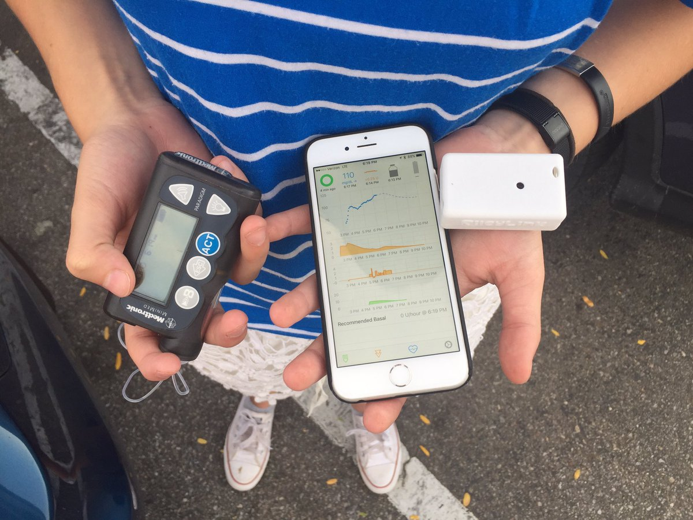

# FAQs about getting started

There are lots of new users coming to Loop trying to find out information about Omnipod potentially being supported on Loop. You probably have a lot of questions.

## Is Omnipod supported on Loop?

No, not yet. Omnipod has been in the process of being "hacked" for several years now and this has been a tremendous amount of work. The work has been fruitful...but it is not ready for public release yet. When it is ready, we promise to update these documents with instructions and information about Omnipod Loop.

## Which pods will work with Loop?

The Loop system described in these documents (aka DIY Loop) will work with Eros pods...these are the current pods on the market in wide release.  The newer DASH pods will not be compatible with DIY Loop.  Tidepool has begun a process to bring [DIY Loop through FDA approval](https://tidepool.org/blog/tidepool-delivering-loop) and Insulet has been announced as the [first pump partner for that project](https://diatribe.org/omnipod-first-insulin-pump-partner-tidepool-loop). The Tidepool Loop will be using DASH pods, no RileyLink required.  If you would like to stay informed about Tidepool Loop progress, you can fill out an interest form [here](https://tidepool.org/loop). 

Summary:
DIY Loop + Eros pods + RileyLink
Tidepool Loop +DASH pods (no RileyLink)

## Do I need a PDM still with Omnipod Loop?

No, pods are monogamous little creatures. They will pair with only one device at a time for safety reasons...so a pod is either paired with a PDM or your Loop app on your iPhone. When Loop is ready for Omnipod, it will not use a PDM...and in fact you cannot use a PDM for a pod that has been activated with Loop.

## What do I need to Loop?

Loop has both hardware and software requirements.  In general, to use Loop you need to have seven components.

- [Compatible insulin pump](https://loopkit.github.io/loopdocs/setup/requirements/pump/)
- [Compatible CGM](https://loopkit.github.io/loopdocs/setup/requirements/cgm/)
- [RileyLink](https://loopkit.github.io/loopdocs/setup/requirements/rileylink/)
- [Compatible iPhone/iPod Touch](https://loopkit.github.io/loopdocs/setup/requirements/iphone/)
- [Apple computer running High Sierra/Mojave macOS 10.13.6/10.14 or later](https://loopkit.github.io/loopdocs/setup/requirements/computer/)
- [Xcode (a free Apple application)](https://loopkit.github.io/loopdocs/setup/build/installing/#setup-xcode)
- [Apple Developer Membership](https://loopkit.github.io/loopdocs/setup/requirements/appledev/)

## Can I download Loop from the App store?

No. Loop is not available for download. You must build your own Loop app.

But don't worry, building your Loop app is actually quite easy and that's what these docs are all about. The harder part will be having the patience to read all the documents you before start.  New Loop users are so excited to get started that they skip reading all the great info that these docs contain.  So, as you begin the build...please include time to read the documents that follow what happens AFTER you successfully build your Loop app.

If you have any questions, these docs have a nice search feature in the dark blue top menu bar that may help you find your answers pretty quickly too.

## Can I use an android phone for Loop?

No, this is purely iPhone or iPod touch.

## Do I have to be "tech-smart" to build Loop?

No. You do not need any experience in code or computers to build Loop. If you have already owned an Apple computer and iPhone, you already have the required level of experience. Beyond that, simply read the directions slowly and diligently...all the information you will need are in these documents.

## How long does it take to build Loop?

The answer is varied, but a few hours from start to finish, depending on where you are starting.

If you'd rather break it up into several days of shorter efforts, the advent calendar way of building Loop can be done like this:

Day 1 (15 minutes): Order a RileyLink from [GetRileyLink.org](https://getrileylink.org))
Day 2 (30 minutes or less): Update macOS on your computer and install Homebrew on your computer.
Day 3 (20 minutes): Setup an Apple Developer account (wait for enrollment confirmation email)
Day 4 (1-2 hours): Download and setup Xcode (basically this step is one that you can walk away from since the download just chugs along while you go do other things) 
Day 5 (50 minutes): Build Loop app using Xcode

## Does Loop cost money?

Yes, there are some costs, beyond the obvious costs of owning a a pump and CGM.

The [RileyLink kit](https://getrileylink.org/) costs $150. This is a one-time cost and many people still have their original RileyLinks from nearly 3 years ago running just fine. There is a [lipo battery](https://getrileylink.org/product/850lionbattery/) that may need to periodically be swapped out after a couple years of use, and that is approximately $15. I highly recommend purchasing two RileyLinks when financially feasible, to have one as a backup in case of accidental damage.

The Apple Developer License can be done for free, however, you will have to rebuild your Loop app every 7 days. That could get very tedious. The $99 annual Apple developer program enrollment is an excellent investment.

There are no other costs, ongoing or initial, to Loop use.

## Do I need to own my own Apple computer?

You don't have to own your own Apple computer, but you do need to at least borrow one and it would be really good to have longer term ability to borrow that computer again.

If you are borrowing an Apple computer, you should ask the person to (1) update to at least High Sierra or Mojave and (2) [download Xcode for free](https://developer.apple.com/xcode/) before you get together to build your Loop app.  The updates and download of Xcode can take a couple hours depeding on the person's internet speed...so best to do those steps well ahead of time to save trouble.

## How often do I need to get on the computer for Loop?

The short answer is (1) when you first build and (2) once per year minimum after that. (If you decide to use a free Apple Developer Account, you will need to get on the computer every 7 days.)

The longer answer is that Loop code is updated periodically to include new features and bug fixes.  When those updates are released, you'll need access to an Apple computer again to update your Loop app.  Loop updates are not available through the iPhone's app store...instead you do the app upate yourself with [update instructions here](https://loopkit.github.io/loopdocs/setup/update/updating/). In general, probably a few times a year there are updates to Loop released that you'd want to take the time to install.

## Can I use someone else's Apple Developer account?

Technically, yes...however there are major drawbacks. The person's developer account can only be "linked" to a limited number of build computers. So one person "loaning out" their developer license to a lot of people will quickly exceed the number of allowed computers. In those cases, that person will be told they need to revoke the certificates on some computers (essentially dropping old ones to make room for new ones). When they do that, they may have forgotten that about your Loop app on your computer. When they revoke your computer's certificate (and they can do that without you knowing through their developer portal), your Loop app will immediately stop working and not even open.

You Loop app will also die immediately if their developer account is not renewed or expires. Your Loop updates will also not be able to be built unless that person maintains the developer license agreement updates.

Moral of the story, out of all the way to save money...borrowing someone's developer account is not a good place to save money.

## How can I find a compatible pump? supplies?

There is a [whole section on that topic over on the pump page]((https://loopkit.github.io/loopdocs/setup/requirements/pump/#finding-a-medtronic-pump).

## Can I pay someone else to do this?

NOOOO...you really need to figure this out yourself. This is an automated insulin delivery system and you really need to know how to build and operate this yourself.

## What if I lose my phone or RileyLink?

You go back to old school pump use until you buy a [new iPhone and can rebuild](https://loopkit.github.io/loopdocs/setup/build/new-iphone/) or get a new RileyLink.

## What about other pumps? When will they Loop?

Hey now...let's be grateful for what we have first. The ability to use Loop is the effort of tremendous amounts of effort, time, and sacrifice by volunteers. Cracking the pump's for Loop use is a large undertaking. If and when another set of people spend a large amount of time figuring out other pumps, then they could conceivably be added to Loop.  But, you don't need to let us know that you'd love to see more pumps compatible with Loop.  So would we..there is just an awful lot of work that needs to happen and it is not easy nor quick.
