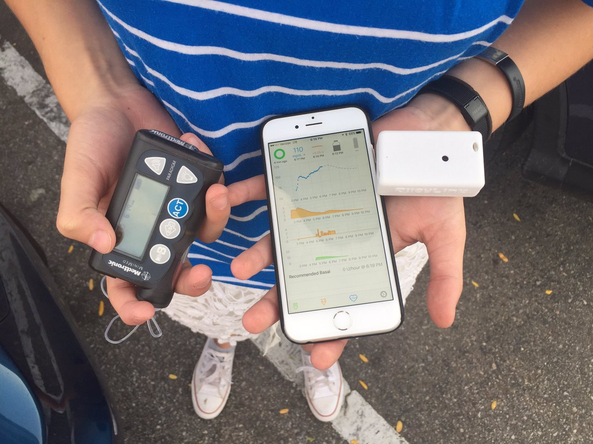

# General Requirements

Loop has both Hardware and Software requirements.  In general, to use Loop you need to have six components.

- Compatible insulin pump
- Compatible CGM
- RileyLink
- Compatible iPhone/iPod Touch
- Apple computer running High Sierra macOS 10.13.4 or later
- Xcode (a free Apple application)

You will need to be able to install software on your computer and sign up as an Apple Developer to install the Loop app to your iPhone. You do not have to own an Apple computer to run Loop on a day-to-day basis, but you will need access to an Apple computer anytime you need to build or update your Loop app. For the most part, if you are comfortable with installing Apple software programs on your computer, you will have no problem building and running Loop. There are detailed step-by-step instructions included in these docs.  You should be doing this yourself so you can understand how to fix it when it breaks. You may want to help another person get set up on Loop, and that is noble, but you will serve them much better if you support them doing the work themselves, rather than doing it for them.   

# Build Overview

Building your Loop app is actually quite easy.  The harder part will be having the patience to read all the documents you should before starting a closed loop.  New Loop users are so excited to get started that they skip reading all the great info that these docs contain.  So, as you begin the build...please include time to read the documents that follow what happens AFTER you successfully build your Loop app.

If you have any questions, these docs have a nice search feature that may help you find your answers pretty quickly too.

The basic installation involves:

1. Making sure you have macOS High Sierra and the application Xcode
2. Downloading the Loop code
3. Adding your Apple developer account to Xcode
4. Signing your app with your Apple developer account
5. Pressing a "build" button to install the Loop app onto your iPhone
6. Entering the needed settings into Loop app to start using the looping features
