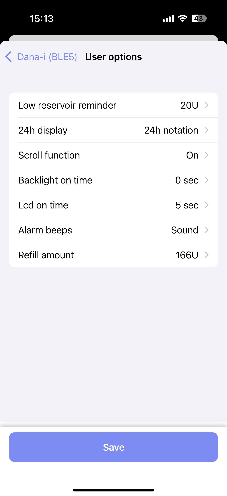

# Dana (RS/-i) FAQ

## Q: Help I frequently encounter signal loss or orange loops

First of all, lets check you CGM, since the dana driver trusts your CGM to provide a heartbeat.

If you are using an internet CGM (like NightScout remote CGM, Dexcom Share), you lack a heartbeat inside the *Loop* app.
You must look into one of the heartbeat modes of the Dana driver:

- Continuous mode - [Please read this paragraph before activating it](#continuous-bluetooth-mode). This mode will keep a connection at all times, this will decrease your pump's & phone's battery life by a bit
- Background sound - [link](#background-sound). This mode will keep loop alive by playing soundless music in the background. This has a big impact on your phone's battery, but little to no impact on your pumps battery life.

If you are running a bluetooth CGM, it might be worth to look into [continuous heartbeat mode](#continuous-bluetooth-mode).
Some Dexcom users have reported to have less issue/orange loops using the continuous mode, then in normal mode.

Please note that orange loops aren't nice, they are also not fully preventable.
If you are experiencing issues with orange loops, please post your issue and the Dana logs on Loop's Zulip forums.

{width="250"}
{align="center"}

## Q: Help I see double insulin entries in the *Loop* app

{width="250"}
{align="center"}

First, check the pump time against the time of your phone.
Go to the bottom of the pump settings and check if there is no bigger gap between `Pump time` and `Checked at` of 10 seconds.
If there is, use the `Manual sync pump time` button to fix the issue.

If this issue keeps happening, and the `Nightly pump time sync` feature is disabled, please re-enable it.
This feature is enabled by default and will sync the pump time during the first Loop cycle of the day (somewhere between 00:00 and 00:05).
This will prevent the time drift of the pump.

If the issue is still happening, you can disable `Bolus syncing` by long pressing the `Battery level`, and then disable the feature.
Please note, you will have to enter a bolus manually into the *Loop* app, whenevery you do a bolus outside the *Loop* app.
Disabling this feature will prevent the Dana driver of syncing a newly found bolus back to the *Loop* app.

{width="250"}
{align="center"}

## Q: Help I just found out my pump screen doesn't work

First of all, do not panic :)

The Dana driver has a few tricks to work around this issue, but always check with your insurance or Dana distributor to see if you can get a replacement pump.

Now for the tricks, the Dana driver has the following available for you:

- All the user settings in the pump can be changed via the *Loop* app.
Go to the pump settings -> User options to see all the settings which can be changed.
You can check your display settings here, just to make sure the screen isn't broken, or you can your reservoir level for example.

{width="250"}
{align="center"}

- The Dana driver also allow you to do blind reservoir refill or cannula changes.
You will get a full wizard based on the type of refill you want to do!

{width="250"}
{align="center"}

## Heartbeat modes

### Background sound

An extra feature available for the Dana pumps is the background sound.
This feature was developed in order to keep the *Loop* app running in the background.

Normally, your CGM will have an active Bluetooth connection, which prevent the *Loop* app from being put into a suspended state.
But when you are planning on using a CGM, like [NightScout remote CGM](../loop-3/add-cgm.md#nightscout-remote-cgm), [Dexcom Share](../loop-3/add-cgm.md#dexcom-share-as-a-cgm), etc, you rely on a active internet connection, and not on an active Bluetooth connection.

In order to activate, follow these steps:

1. Activate the [UIBackgroundMode - audio](https://developer.apple.com/documentation/bundleresources/information_property_list/uibackgroundmodes):
    * When [building with Mac](../build/overview.md), go to the LoopWorkspace Xcode project and select the Loop project.
    Go to "Targets" -> "Loop" -> "Signing & Capabilities" and scroll down to "Background modes".
    Enable the checkbox for "Audio, AirPlay, and Picture in Picture".
    Then rebuild the app and go to step 2.
    

    * When [building with Browser](../browser/bb-overview.md), you will need to make a change to the GitHub Actions workflow.
    Go to your LoopWorkspace fork on GitHub and press `.` on your keyboard.
    You will be redirected to a `github.dev` page with the code of your LoopWorkspace.
    Now go to ".github" -> "workflows" -> "build_loop.yml".
    Scroll down till you see the `- name: Fastlane Build & Archive` command.
    Just before this command, add the following to this script ([example](https://github.com/bastiaanv/LoopWorkspace/commit/67a1e42b9b771550afc14adf914ff98c37d96e67)):

    ```
    - name: Update entitlement background sound
      run: sed -i -e 's/<string>bluetooth-central<\/string>/<string>bluetooth-central<\/string><string>audio<\/string>/g' Loop/Loop/Info.plist
    ```

    * To save your changes to the "build_loop.yml", go to the Source Control tab on the left (should show up with a blue 1, see image below).
    Enter a message and press the green "Commit & Push"-button.
    By pressing this button, GitHub will automatically make a new browser build for you and push it to TestFlight
    

2. After you have done the onboarding of the pump (see steps above), go to the pump settings.
    Scroll down the "Pump name" and long-press this row.
    A modal should pop-up with the question, whether you want to toggle Silent tones.
    
    In order to activate this feature, the modal should say something like: `Yes, Enable silent tones`.
    When it says: `Yes, Disable silent tones`, it will disable the background sounds.
    {width="250"}
    {align="center"}

3. Done!
    Every time you put the *Loop* app in the background, it will play a toneless sound, which prevents it from suspending the *Loop* app
        
### Continuous bluetooth mode

This mode replicates how a CGM works: it keeps the bluetooth connection open even though no commands are being executed.

#### How to unblock the pump's UI
If you want to replace the reservoir or want to interact with the pump's UI, you have three options to temporarily disable *Continuous bluetooth mode*:

- Disable bluetooth on your phone (not recommended)
- Kill the *Loop* app (not recommended)
- Using the disconnect feature (recommended)

To use the disconnect feature, go to the Dana pump settings and use the *Disconnect from pump* button.
You will get prompt to set a notification reminder.
This reminder will be sent to you if you haven't reconnected the pump within the given time.
This feature is fully optional, but is recommended.

{width="400"}
{align="center"}

#### How to enable Continuous bluetooth mode
Now that you know what the risks are of this feature and how to unblock the pump's UI, can we talk about enabling the feature.
Go to the Dana settings and long press the Firmware version row.
You will be prompted to enable or disable the feature, choose `Yes, Switch to continuous mode` and the feature has been enabled!

{width="250"}
{align="center"}