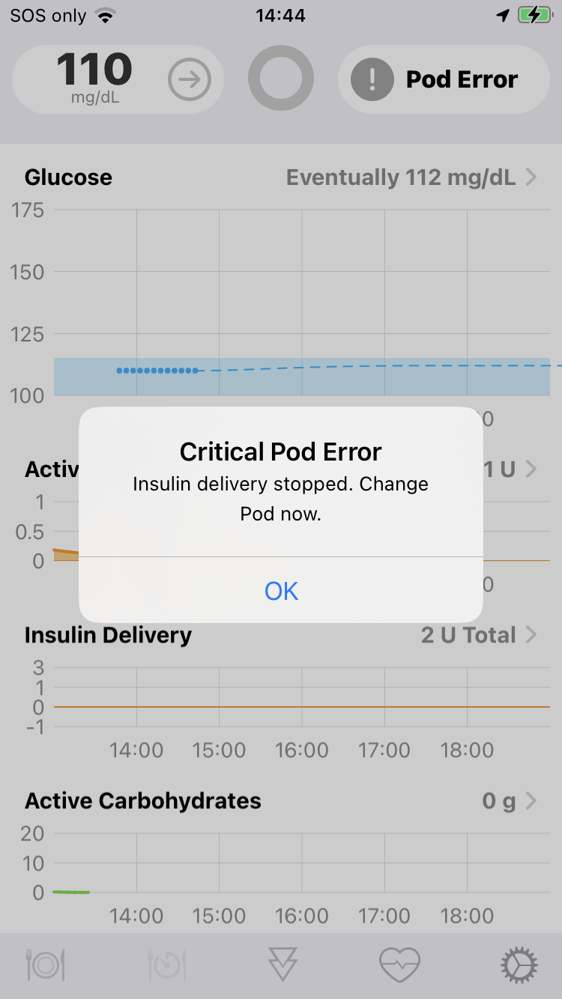
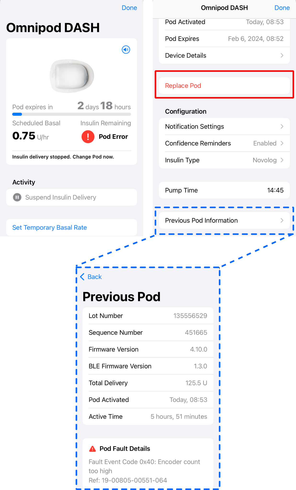

## Screamers

Pod faults are typically noticed by hearing a high-pitched continuous tone coming from the pod.

Loop will pick up the fault the next time it exchanges messages with the pod:

* every 3 minutes for DASH
* every 5 minutes for Eros

Once Loop detects the fault, you will get a Critical Pod Error modal message on the screen that you must acknowlege along with a `Pod Error` indicator shown in the HUD:

{width="250"}
{align="center"}

!!! tip "Normal High-Pitched Tone"
    There are 2 cases in which you hear the high-pitched continuous tone that are not Faults.

    1. Modal Alert says `Empty Reservoir`, Pod icon displays `No Insulin`
    2. Modal Alert says `Pod Expired`, Pod icon displays `Pod Expired`

### Stop that Noise

The first action people want to take is to make that noise stop. 

* Tap on the Pod icon and then the `Replace Pod` row and deactivate the pod
    * The `Replace Pod` row is highlighted in red in the graphic below
    * Once the pod has been dealt with and you have a new one in place, it's time to get the details for the Pod Fault

### Capture the Fault

* Tap on the Pod icon and scroll all the way down and tap on the `Previous Pod Information` row, highlighted in dashed-blue in the graphic below
    * If there was a Fault, the information is found at the bottom of the screen
    * For any pod, the information about that pod is always available

{width="500"}
{align="center"}

### Report the Fault

Faults should be reported to Insulet. They may not give you a replacement, but it is important they be informed so they can determine if certain lots are having more failures than others. This helps them improve the quality of the pods.

* Take a screen shot of the Fault Information
* Insulet needs the following:
    * The `Lot number` (Eros found on the screen, DASH is different)
        * The DASH lot number needed by Insulet is the one found on both the box the pod came from and the paper cover from the pod tray
        * The electronic lot number reported by DASH pods to Loop is not helpful to Insulet
    * The `Sequence number` (also on the pod in tiny print)
    * The `Active time` (how long you wore the pod)
    * The `Ref code` - for the example above, the Ref code is: 19-00805-00551-064
    * They will also ask where on your body the pod was placed

!!! tip "Extra Information"
    The extra information, e.g., `Fault Event Code 0x40: Encoder count too high`, is only useful for the curious or the developers. Do not report that to Insulet.

    The `0x40` is the hex version of the `-064` decimal value found at the end of the Ref code.

### Report 049 (0x31) to Developers, Not Insulet

The sole exception to reporting to Insulet is if you get a fault ending in `049` in the Ref code or with the notation `Fault Event Code 0x31: Incorrect pod state for command`. That particular fault is only seen if there is a mistake in Loop. This happened rarely in earlier versions but should be fixed by the time version 3.4.0 is released. If you do get an 0x31 (049) fault - report that to the Loop developers and include a Loop Report (Loop, Settings, Support, Issue Report).

## Known Pod Fault Codes

The currently known pod faults are listed here on the openomni wiki page: [Pod Fault codes](https://github.com/openaps/openomni/wiki/Fault-event-codes)

## Ways to Reduce Likelihood of a Fault

The *Loop* app will put a higher battery load on a pod than the PDM due to its regular and repeated communications. A pod with lower battery level appears to be more likely to fault for conditions like static electricity and occlusions/pump issues the *Loop* app is not directly causing, like decimal fault codes 052, 061, 064 and 066. Pods always perform safety checks and if a potential problem is found, the pod will end itself by screaming and halt all insulin delivery.

DASH pods have additional Fault Codes associated with the pod Bluetooth communications. The `0xCB`, `-203` decimal, seems to be pretty common. These should be reported to Insulet for their records.

None of the ways listed here are guaranteed to prevent a screaming pod, but they could be worth considering.

* Keep the Loop app up to date; newer versions might include improvements to reduce pod battery load
* Maintain a wider correction range (10 to 20 mg/dL; 0.5 to 1.1 mmol/L) instead of a single number
* Loop Version 3, for Eros pods when used with a RileyLink Device that has a lot of communication errors, will send many repeated messages trying to resolve uncertain communications
    * Make sure your RileyLink Device is working well
    * Use a 433 Mhz RileyLink for Eros Pods and ensure the antenna is not loose or pinched

## Replacement Pod Situations

!!! abstract "Help Insulet Improve their Quality Control"
    Insulet is aware that pods are used by the DIY community. You can be honest about your use and might receive replacement pods. If your pod fails early, it is worth informing Insulet for their troubleshooting records even if you do not get a replacement.

You can always call Insulet tech support if a pod has a clear failure on the pod, such as:

* A cannula was sticking out when the end cap was removed.
* Visual inspection of the pod's cannula window indicating the cannula insertion was not successful.
* Leaking or kinked cannula was causing insulin delivery issues.
* The adhesive was not working properly when trying to place it on your body.
* The pod begins to scream during filling, pairing, priming or insertion

If the pod fails during use with Loop, a replacement might still be possible. The software which communicates with the pod isn't developed or supported by Insulet. Generally speaking, asking for replacement for failed pods on the third day of pod life is a bit of a reach for the DIY community. We acknowledge that Looping may be a contributor in certain faults, especially by the third day.
