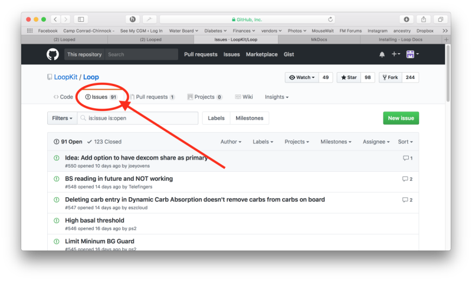

After you have been using Loop for a while, there's a potential that you will run across a behavior or issue that you wonder if it is normal or intended.  When that happens, there are a few things that we'd recommend doing to resolve the issue.

## Use Automatic Time on Loop Phone

If you have modified the Loop time (not changed time zone, but turned off automatic time and manually changed the time), please read: [Loop Phone Must be on Automatic Time](../faqs/time-faqs.md#the-loop-phone-must-be-on-automatic-time).

## Gather information

### Screenshots

**Take a screenshot of your Loop main display screen**, or other screens such as the display when you touch a red loop icon that may help you or troubleshooters better understand your issue.  A lot of times a picture is worth a thousand words.  Being able to see recent Loop basal adjustments, predicted BG curve and carb entries really help fill in the full story of the current Loop status.  If you didn't manage to get a screenshot when the issue was happening, you can also go to Nightscout and scroll back over the previous 48 hours to obtain much of the same information.  Try to capture a Nightscout screen from the time period in question.

### Check the Docs

Loop docs are updated regularly.  If you built your Loop app awhile ago, chances are good that more information has been updated and changed since you last read them.  Please use the search tool - if there's an error message - search for it. Scan the topics in the `Troubleshoot` tab of LoopDocs and look for a page that may be applicable.  The FAQs pages are definitely worth reviewing too.

### `Issue Report`

Use the [`Issue Report`](../loop-3/settings.md#issue-report){: target="_blank" } command under Loop Settings to generate a Loop Report. This has a lot of detailed information that may help you or a mentor understand your problem.

The Loop Report (a text file) contains important information about actions and status that can be very useful for troubleshooters...particularly with unexplained behaviors.  The upper right corner of the Loop Report includes a button so that you can email the Loop Report to yourself (or others).

## Check Resources

### GitHub Issues

Check the current list of [GitHub Loop Issues](https://github.com/LoopKit/Loop/issues) for known issues.  Many times other users have noticed the same issue previously and opened an Issue so that more information can be added to help develop a solution.  If you see the same issue has already been reported, please add it to the open issue instead of creating a new one.

There is a nice search feature on GitHub issues - type a keyword into the box next to Filters: where it says "is:issue is:open" in the graphic and the display will show just those open issues that contain the keyword in the title.

{width="800"}
{align="center"}

### Zulipchat and Facebook

Search in [Zulipchat]( https://loop.zulipchat.com), [Looped Facebook Group](https://www.facebook.com/groups/TheLoopedGroup) or [LoopandLearn Facebook Group](https://www.facebook.com/groups/LOOPandLEARN).  Quite possibly someone else has already posted about the same issue and perhaps a resolution has already been provided.  

## Ask for Help

If you can't find any information in LoopDocs, GitHub Issues, Zulipchat, or Facebook...PLEASE post and ask for help.  GitHub Issues list is an EXCELLENT place to post issues of unexpected Loop behavior (that you believe are errant or need improvement).  However, if you are just seeking clarifications on Loop, but don't necessarily expect that there's a problem with the underlying code, then Facebook and Zulipchat are a better place.  For example, Zulipchat and Facebook are great for asking about bolus strategies or exercise target use...those aren't really code issues.

When you post, provide a description along with any screenshots of the issue you are having and include the version of Loop you are running and the iOS on your device.  (Tap on Loop-Settings and look at the top of the screen to get the Loop version number).  You don't necessarily have to tag any particular person, the community is fairly active in replying to messages.

**Post in only one place - the same volunteers monitor various sites.**
