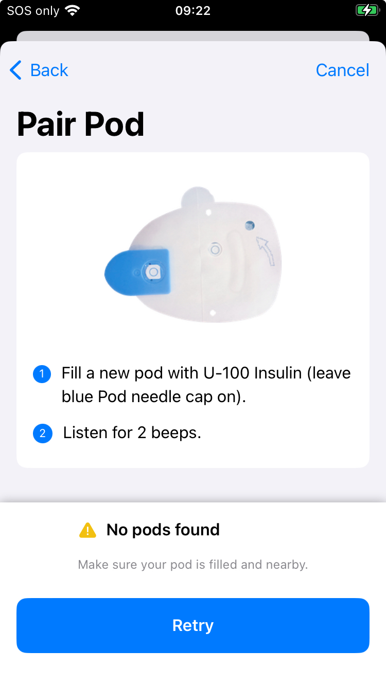
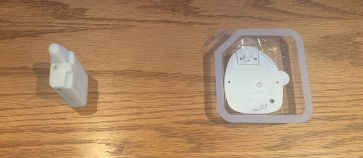

## Pod Not Found

Have you seen an error message during the pairing process for a new pod? The most common message is `No pods found`, as shown below. Make sure no other active pods are anywhere near the phone. Reposition the pod and the phone and if using one, the RileyLink, and then try again.

{width="300"}
{align="center"}

## Is it the right kind of Pod?

The DASH pods have a blue needle cap. The Eros (and the Omnipod 5) pods have a clear needle cap. Make sure the pod you are trying to pair is the right type.

## Did the Pod Beep?

The instructions from Insulet say fill with U-100 insulin. That is the strength of your insulin, 100 U per mL of solution. The Insulet directions say to inject between 85 and 200 U of insulin. In other words, between 0.85 and 2.0 mL of fluid. If you did not hear the pod beep as you filled it - the pod might be defective or you may not have added enough insulin.

!!! tip "Inject slowly"
    Some users are able to get the pods to beep with smaller amounts by very slowly injecting the insulin.

## The app crashed after pairing started and before cannula insertion

Sometimes the *Loop* app will crash while a new pod is being setup. This is rare but can happen. There are several parts to the setup process:

1. Pair the pod to the app
2. Prepare for and start to prime the pod
3. Insert the cannula

### Updates for Version 3.4

The Omnipod code was upgraded with version 3.4 to be more robust if your *Loop* app quits, a build is installed or the app is swiped up during pod setup.

There are initial **pairing** steps: exchange of encryption keys, assign the pod ID and perform a final connection step that must be completed while the app is in contact with the pod. Once those initial commands happen, then the pod can reconnect to the *Loop* app even if the app quit before priming starts.

* After the restart, if the main screen indicates Finish Setup in the Pump Status icon, you can continue with that pod
    * Tap on Finish Setup to be taken to the appropriate screen
* After the restart, if the main screen indicates No Pod in the Pump Status icon then the pod was not fully paired to the app
    * Tap on No Pod and try to Pair Pod
    * If the pod pairs, then the interruption happened before pairing started - you got lucky
    * If you get the message no pod is found, then you are out of luck
        * In this case, move the first pod far away from the phone; you want to avoid the possibility of interference with the new pod
        * Fill a new pod and pair the new pod
        * Once the new pod is operating, be sure to go to the first pod and disable the sound - it will continue beeping until it starts to scream: [What do you do to stop a screaming pod?](../faqs/omnipod-faqs.md#what-do-you-do-to-stop-a-screaming-pod){: target="_blank" }

## Why do pod pairings fail?

When the pod is paired to a new device, the pod is using low-power mode. That's one reason why placement is important. And you can only have one pod that is not yet paired in the room. Try to get your first pod working before giving up and trying a new one.

Sometimes it is the pod, so if you do need to try a new one, move the one that did not pair far away from your phone.

!!! warning "Move Logically"

    Let's walk through the pod pairing/replacement process from the very beginning to make sure that we have all the important steps clearly identified even before you attempt to press that **Pair** button.

### Step 0: Check your Loop version

There are fixes and improvements to reduce various pairing problems and to automatically recover from them when they do occur. Update regularly to take advantage of improvements; see [Current Release](../version/releases.md#current-release){: target="_blank" }.

### Step 1: Verify the RileyLink (Eros Pods Only)

For DASH pods, skip ahead to [Deactivate old Pod](#step-2-deactivate-old-pod).

For Eros pods, let's make sure everything is ok as far as the RileyLink goes:

1. RileyLink is charged and nearby, and
2. RileyLink has a green LED light lit (indicating a Bluetooth connection with your iPhone), and
3. Try toggling the RileyLink off/on at its physical switch if the green light is not on.

Read this page to understand the information you should see on your phone if your RileyLink Device is working properly:

* [RileyLink Display](../loop-3/rileylink.md){: target="_blank" }

## Step 2: Deactivate old Pod

Make sure old pod was deactivated. If you cannot communicate with the old pod in order to deactivate it, try the steps in [Reset Loop to Pump Communications](red-loop.md#reset-loop-to-pump-communications){: target="_blank" }.

If you were not able to deactivate the old pod, you need to Discard the old pod. After several failures to deactivate, Loop offers to Discard the pod. This just tells Loop that the pod is no longer connected to the app.

You must still get that pod (that would not deactivate) away from your vicinity. Put it in a microwave or throw it over the fence into the neighbor's backyard (kidding, obviously...but outside trashcan is a good idea). Before disposing of it, however, be sure to silence it: [What do you do to stop a screaming pod?](../faqs/omnipod-faqs.md#what-do-you-do-to-stop-a-screaming-pod){: target="_blank" }.

## Step 3: Start new pairing process

You've deactivated your old pod successfully...great! As the first part of pairing a new pod, Loop will prompt you to fill the new pod with insulin. Once a new pod is powered-up by the insertion of at least 85 units of insulin, the pod will emit reminder beeps every 5 or 10 minutes until the entire pod pairing process has completed. This pairing process must be completed within 60 minutes of beeps starting, or the pod will give up and never pair. These activation reminder beeps do not actually indicate that any pod communication is being attempted, just that the activation has not yet been completed and your 60 minute timer is counting down.

!!! important "Max Pod fill is 200 U"
    If you put more than 200 U in a pod, you will probably get a pod fault during priming.

Hopefully, your pod pairing continues uneventfully at this point. You'll press the **`Pair`** button and the pod pairs, primes, and the cannula insertion is successful. BUT, if not...you'll want to keep reading to find out how to recover.

!!! important "One beeping pod at a time, please"

    **It is very important to not have two pods giving reminder beeps at the same time** as this can cause even more confusion for you and for Loop. Continue to work with a single pod at a time, retrying the **`Pair`** attempts multiple times if needed as described in Step 4. 

    If you cannot get the pairing to complete with the single beeping pod (after trying the procedures described below a few times with multiple **`Pair`** attempts during each try), then you should completely abandon that pod before attempting to use another pod. "Completely abandon" means move that failed-to-pair-no-matter-what-you-tried pod far, far away from you or put it in a not-turned-on-but-door-is-closed microwave. You do not want that beeping-but-not-pairing pod to be able to plague your next pod's communications with Loop during the fresh pairing process.

    If you do need to try another pod. Once the new pod is operating, be sure to go to the first pod and disable the sound - it will continue beeping until it starts to scream: [What do you do to stop a screaming pod?](../faqs/omnipod-faqs.md#what-do-you-do-to-stop-a-screaming-pod){: target="_blank" }

## Step 4: Check the Pod Placement

### DASH

The DASH pod can be left in the tray and placed right next to the phone. If the first attempt to pair shows the "No pods found" message, place the tray on top of the phone or move the pod a little further away from the phone, then try again.

If you see the [Verbose Message, Hard to Interpret](#verbose-message-hard-to-interpret) Pairing exception message as shown in the link above, you need to toggle Bluetooth on the phone:

* In your phone settings, turn off Bluetooth
* Turn on Bluetooth
* Try again

Still not working, reboot the phone and try again.

If none of those steps work, it may be the pod. But try everything one more time before giving up.

### Eros with RileyLink

The placement of the pod and the RileyLink relative to each other is a critical variable because the pod operates in a low-power radio mode during pairing.

**How close should they be?** Most people assume "the closer the better", but it has been measured that if the RileyLink and pod are *too close together*, the RileyLink may not be able to pick up the pairing response. The current recommendation is for the RileyLink to be placed a few inches to the side of the pod being paired.

{width="600"}
{align="center"}

!!! info "If **Pair** fails, move a bit and RETRY"

    * If the **Pair** operation is not succeeding, try repositioning the relative placement of the RileyLink and the pod multiple times. A little closer together if you had them far apart? A bit farther apart if they were really close? RileyLink on its side? Try standing it up with the antenna pointed to the ceiling.
    * If the pairing is still unsuccessful with multiple repositioning attempts, move yourself, the RileyLink, and the pod to another area/room (preferably away from other radio frequency signals that might be interfering), and try **Pair** again. Again don't be shy to try repositioning the RileyLink and pod's relative position, if needed, in this new area/room too.
    * If you have another available RileyLink, you can also try pairing using that RileyLink instead.

## What about other pod start-up failures?

If you have a pod that has already started the priming operation and then has problems either finishing the priming operation or the cannula insertion, review [the app crashed after pairing started and before cannula insertion](#the-app-crashed-after-pairing-started-and-before-cannula-insertion) to see if you can save the pod.

If a pod begins to alarm (has a fault) during priming or cannula insertion, the pod is no good and it should be deactivated and disposed of properly.

## What about that insulin?

If you have the misfortune of losing a pod during pairing, you can opt to not waste the insulin in that pod. Simply use the same syringe and same fill port on the pod to suck the insulin OUT of the loser pod.

If you do that, good practice is to make sure that you get that loser pod far away from the process as you go forward. Mark a big "X" on the failed pod and put it in a microwave, or very far away from you, so that it can't interfere with subsequent pod pairing attempts.
