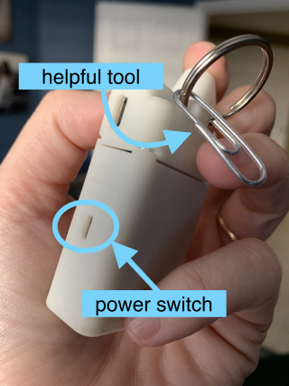
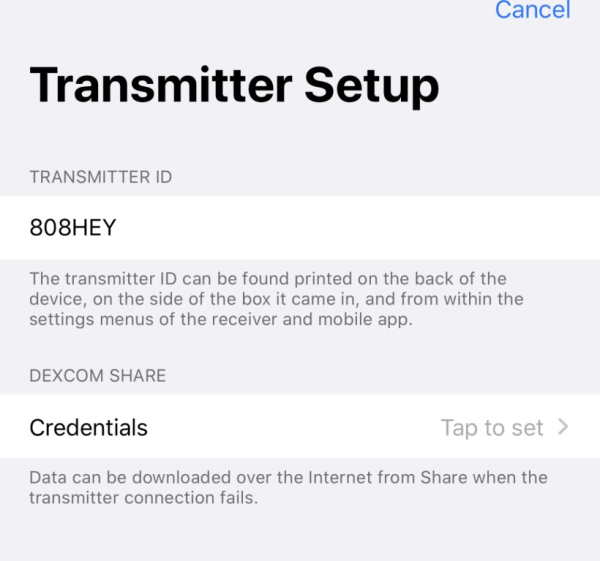

## Red Loop Overview

This page provides help if your Loop icon is red and Loop is not working or only working sometimes.

Clicking on the Loop icon on the main screen tells you the last time Loop completed, but you need to look at the [Pump Status Icon](../loop-3/displays-v3.md#pump-status-icon) and the [Glucose Status Icon](../loop-3/displays-v3.md#glucose-status-icon) for more information. For example, when Glucose is stale (more than 15 minutes old), the Glucose icon shows "- - -". For example, when the Pump is having a communication issue, you will see a No Signal icon.

!!! warning "Omnipod Users"

    Do not pull a pod when there is a red loop. 
    
    * Usually the problem is with Loop, not the pod
    * A new pod won't fix a Loop (Bluetooth or RileyLink communication problem)

    There are a few times when it is the pod - but try all the steps on this page **first**.

!!! warning "Medtronic Users"
    You must select Insulin Type on your pump settings screen after updating from Loop 2 to Loop 3 and completing the onboarding. Without an insulin type, closed loop will not work.

A Red Loop icon means that Loop has not completed a cycle for 15-minutes or more and this is normally because of a communication break-down with one of the systems listed below.

## Typical Causes for Red Loop

Some of the reasons listed below cause Loop to go Red and stay Red until you fix it.  Others will cause intermittent Red Loops that come and go.

1. [Reset Loop-to-Pump Communications](#reset-loop-to-pump-communications)
1. [Continuous Glucose Monitor (CGM)](#cgm-values-are-not-being-collected-by-loop)
1. [Apple Health](#apple-health)
1. [Background App Refresh](#background-app-refresh) is not enabled for Phone, Loop and/or CGM
1. [Nightscout](#nightscout) (optional service)
1. [Phone Storage is Full](#phone-storage-is-full)
1. [Lost Pod Information](#lost-pod-information)

### Lost Pod Information

We have not seen this issue since the update of the *Loop* app from version 2 to version 3 when the method for saving data was updated. Some other applications in the open-source sets of codes might still have this issue. (It was reported in iAPS, for example.) The warning below is left in LoopDocs but if you are running *Loop* version 3.x.x, you do not need to worry about reboots.

* Before attempting to resolve a red-loop with a phone reboot; please review this section. It can affect the stored CGM information as well as the stored pump information.

!!! warning "Be Careful with Phone Reboots with Loop 2"

    If you are using an Omnipod, then before rebooting the phone, make sure it is absolutely necessary - try all other methods first. Be prepared to check that the pod is still communicating with Loop following the reboot. If this rare event happens to you, please report it, save and post a Loop Report and be prepared to put on a new pod and possibly re-enter your CGM information.
    
    This could happen to someone using a Medtronic pump, but the consequence is less of a concern because the pump information is not modified as frequently as for Omnipod users.

### Reset Loop-to-Pump Communications

If the indication is one of these (or something similar), it can probably be fixed by resetting the Loop-to-Pump communication. For DASH, this is Bluetooth only. For Eros or Medtronic, it is a combination of Bluetooth and the RileyLink compatible device.

* pump history is too old
* no rileylink could be found
* pod cannot be reached
* the `Unable to Reach Pump` modal screen is visible

Do these steps until one of them fixes the issue:

* Turn off Bluetooth on your phone and then turn it right back on again.
* Close your Loop app (upswiping it in the iPhone's app selector) and reopen it.
* Eros or Medtronic: Turn your RileyLink off/on at its physical power switch located on the side of the RileyLink.
    * If you have a different device, make sure you know how to power-cycle the device.
    * For RileyLink (without wireless charging) use a small pointy object to carefully move the slider away from the charging port and then back up towards the charging port. A paperclip on the keyring can provide the help you need to reach the switch in the recessed case, and double as a [screaming pod silencer tool](../faqs/omnipod-faqs.md#what-do-you-do-to-stop-a-screaming-pod).

    {width="300"}
    {align="center"}

This should restore a green Loop within 5 minutes. If you're impatient and are using pods, you can tap on [Play Beeps](../loop-3/omnipod.md#play-beeps). With Medtronic, you can attempt to suspend/resume the pump. If this is successful, you've established communication again.

Last thing to try is:

#### Power cycle your phone.

* This suggestion is last because of a rare, intermittent issue with an older version of the *Loop* app in which power cycling the phone does not load the latest version of saved information
* This was fixed with Loop 3
* Click on the [Lost Pod Information](#lost-pod-information) link for more information

If this was not successful, check out the [Pump is Not Responding](#pump-is-not-responding) section.

### CGM Values Are Not Being Collected by Loop

#### New Transmitter

If you recently changed a transmitter, you need to also update your Loop settings to reflect the new transmitter ID. Go to the CGM section of Loop settings and `Delete CGM` (it's a button on the bottom of that page). Then use the `Add CGM` in Loop settings to include the new transmitter ID.

If you fail to update your Transmitter ID in Loop and you also left Share Credentials in Loop (not recommended), you will see messages such as: `Failed to decode SGV` when the Share server cannot be reached. That's your notice to update the Transmitter ID (or if you think you already did - check for typos in data entry).

#### Delete Share Account

Finally, we see a lot of errors reported because people have problems with their Share server information in Loop app. **Please delete your Share account information from within Loop settings.** In other words, the credentials portion of the Share account info, as shown in the screenshot below, should say `Tap to Set` and not have your account info. It is unnecessary to have this portion filled out as local, non-internet spying of a transmitter is the preferred CGM source anyways. In fact, by leaving this information out, it will help you remember to change your transmitter ID when you change transmitters because CGM data won't appear in Loop. By not including Share account in Loop, you will prevent yourself from accidentally becoming internet dependent.

{width="450"}
{align="center"}

### Apple Health

Make sure both the Loop app and the Dexcom app have permission to write to Apple Health by checking the [Apple Health Permissions](../faqs/apple-health-faqs.md#how-do-i-modify-apple-healthkit-permissions).

In the early days of iOS 14, there were problems with the Apple HealthKit.  The consequence is that some people's database was corrupted.  If you tap on the Heart Icon on your phone to go to Apple Health and display data and it is very slow to respond - or never responds, you probably need to get rid of a corrupted database and start fresh.  Be sure to go Open Loop if this is needed. Please get help from your favorite [Loop Social Media](../intro/loopdocs-how-to.md#how-to-find-help) group or from Apple support in this case.

### Background App Refresh

If you have not enabled background app refresh on your phone, then Loop is likely to stop communicating as soon as the phone is locked.

1. Phone Settings -> General -> Background App Refresh -> enable
1. Then scroll down until you find Loop and make sure the green slider is enabled
1. While you are there - check your CGM app as well

For iOS 15 and later, there is a new feature described by [Dexcom](https://www.dexcom.com/faqs/what-are-the-recommended-iphone-settings){: target="_blank" }

1. Phone Settings -> Screen Time -> choose Always Allowed -> select an app, tap the plus icon to add to Always Allowed list
    - add Dexcom
    - add Loop

2. In addition, with the addition of Focus modes (for iOS 15, 16 and 17), you may need to explicitly allow the *Loop* app access for notifications for modes such as Sleep, Personal and Do Not Disturb modes.

### Nightscout

If you added your Nightscout URL to Loop and are uploading information to Nightscout, make sure the communication is working properly.  For short-term interruptions, Loop will store information to upload to Nightscout later.  But if too much information builds up, Loop can slow down and in some cases have a Red Loop.

1. Check to see that internet service (WiFi or Cell) is operating
1. Check that Nightscout database size isn't full (more details below)
1. If Red Loops are resolved by removing the Nightscout URL from Loop; you need to figure out if it's the connection or the database or some other issue

If you opted for the free DIY Nightscout, you will need to clean your database once or twice a year. Follow the [Nightscout Database cleanup steps](https://nightscout.github.io/troubleshoot/troubleshoot/#database-full){: target="_blank" }. Make sure you are periodically checking your database size (and that the **dbsize** keyword is in your [ENABLE list](../nightscout/update-user.md#editadd-config-vars) and cleaning it.

### Phone Storage is Full

This was reported by a user in November 2021. His phone storage was almost full and the reported error messages for Loop was:

*  `Sqlite Error: A Sqlite Error Occurred: (13) Database or Disk is Full`

The error message from Dexcom was not as helpful.  If you see this, check your phone storage:

* `The Dexcom G6 app has stopped working. Please delete the app from your device and redownload it from the App Store`

Solution: clear up space on your phone.

## Other Reasons for Red Loop

### Pump is Not Responding

The first step is to make sure the phone and if needed, the RileyLink compatible device, is not so far away from the pump or pod that they cannot communicate. Assuming you've addressed this, then you can move on to other steps.

**Omnipod Loopers**:

If the pod is screaming, it should still be able to communicate with Loop, but sometimes you need to restore communication so you can deactivate the pod and quiet it. Follow the steps below, just do it with the added "noise".

The [Reset Loop-to-Pump Communications](#reset-loop-to-pump-communications) steps almost always fix the issue. It is possible that the pod really had stopped communicating, but try everything else before burning another pod.

**Medtronic Loopers**: If the pump is not responding with "decoding" errors or various other messages about pump responses. Try the following:

1. Change pump battery. Low pump battery will cause radio communications to fail.
1. Use the `Change Time` command in the pump menu to update the pump's clock. If you've accidentally changed the pump's time in the pump itself or if the pump time has drifted, this will get the Loop app and pump time back in sync.
1. If using a x23 or x54 pump, try deleting all the IDs under the "Other Devices" submenu in the pump's "Connect Devices" menu.  Then go to the RileyLink menu and use the MySentry pairing command to get a fresh ID issued. Follow the directions listed in the MySentry pairing command's screen to scan for devices. A fresh ID can help prevent recurring red loops for x23 and x54 users, particularly if they started to occur after a recent Loop update.
1. Make sure the following are checked in the pump:
    * Your pump cannot be suspended.  Resume insulin deliveries.
    * Temp basal type must be set to unit/hour, not percent, in pump's Basal menu.

## Resolving Frequent Red Loops

Here are some things to check if you have frequent red loops:

* Try deleting your [Nightscout](#nightscout) account from Loop settings and see if your Loop stops having red loops. If it does, then you'll need to assess what's going wrong in your Nightscout site and fix it. Most of the time, your database is getting too big and cleanup is required.

* Is your [RileyLink battery plugged in all the way](../faqs/rileylink-faqs.md#rileylink-assembly) on the board? One Looper recently posted that her RileyLink battery connection needed to be reseated after several years of service.

* Has your RL been fully charged? Try charging your RL for an hour or two, make sure the red light comes on while charging. Try a new charger or cable.

* Oddly, some people have found that turning off Siri integrations for Loop and Dexcom apps in your iPhone settings has helped. This may be coincidental, but if you're still having trouble, you might want to try it.

* Check for sources of wireless interference. If you have a certain environment that seems to have more drops than others, it is likely that there is a source of wireless communication interfering with your Loop. Lots of Medtronic Loopers in a room together will often interfere with each other and get "cross-talk" red loop error messages. If it is a bedroom at night causing problems, try moving other wireless devices such as routers or baby monitors farther away from where you and your RileyLink compatible device.

* In some cases, you may need to clean out [Apple Health](#apple-health), or even reset your phone to factory defaults and reload all your personal information and then rebuild the Loop app. Before you do this, you may want to Post for Help (next section).

## Posting for Help

Before you post on Looped group for help with a red loop, please make sure you've [reset the RileyLink / Phone](../build/rileylink.md#rileylink-compatible-devices).

Before you post for help, please also check your Nightscout status including database size. This step is often overlooked and yet solves a lot of problems.

When posting for help, include two screenshots of Loop's main screen; one with the red loop's error message and the other just the plain Loop main screen. Include a detailed description of what you have tried doing from the troubleshooting list above. For example, state if you've double checked the transmitter ID, deleted the Share account info from Loop settings so that we can rule out some of the causes of CGM issues.

## What Else?

There are a few other things to consider:

* RileyLink is broken
* Battery has failed
* OrangeLink has firmware 2.6

### RileyLink is Broken

How can you tell if your RileyLink has a problem? The answer is mostly within the LED lights that display on the board. Some information is listed below, but also review the [FAQs at getrileylink.org](https://getrileylink.org/faq){: target="_blank" }.

If you have a different RileyLink compatible device, please check the appropriate site for troubleshooting help.

**Red light**: comes on during charging and will turn off/on periodically, while still plugged in, after charge is complete.

**Green light**: Indicates an active BT connection with the phone. You want the green light to stay on all the time on the RileyLink. If the green light is not on, then make sure your iPhone's bluetooth is still switched on.

**Blue light**: The blue light will flash off/on periodically when the RileyLink and pump are actively communicating...it should NOT be always on. If your blue light is stuck on, that is an indication of a problem on the board. Try looking for signs of damage or debris that may be causing a short on the board. Clean the board with rubbing alcohol [(unplug the battery first](https://youtu.be/s2qNPLpfwww){: target="_blank" }). If you still can't get the blue light off, then contact GetRileyLink for help or check out [RileyLink Compatible Devices](../build/rileylink.md#rileylink-compatible-devices) for replacement options.

### Battery has Failed

Both [RileyLink](https://getrileylink.org/faq){: target="_blank" } and [EmaLink](https://github.com/sks01/EmaLink/wiki/Battery-swelling){: target="_blank" } use LiPo batteries.  If they stop holding charge for as long as they used to, or if they swell (often first noticed as bowing of the case), stop using the battery and replace it as soon as possible.

[OrangeLink](https://getrileylink.org/faq){: target="_blank" } uses regular batteries, so just change them out.

### OrangeLink Firmware

One version of the OrangeLine firmware did not communicate well with Loop (or Android APS).

If you have FW 2.6 on your OrangeLink or OrangeLink Pro, please [upgrade to FW 3.2](../faqs/rileylink-faqs.md#orangelink-firmware) as soon as possible.
