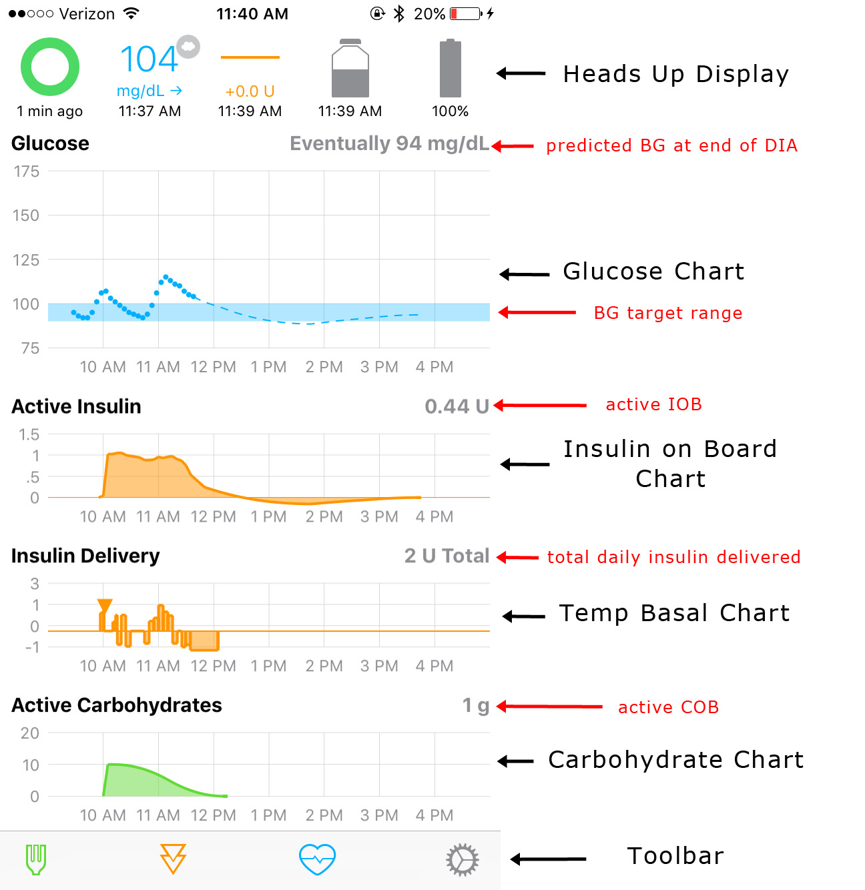

# Loop Displays

This section of the docs will go over the Loop displays available and what information they offer.  Information about your Loop's actions (or inactions) can often be found simply by looking at the visuals presented in the app.  

## Status Screen
The Status Screen is the main root navigation screen in Loop.  It is broken up into 3 main display areas; Heads Up display (HUD), Charts, and Toolbar. The HUD is the top area of the screen.  This shows status of the last time loop ran, current BG Reading, current temp-basal, current insulin reservoir volume remaining, and current pump percentage battery remaining. The next area is the charting area. This includes, glucose trend and prediction, Active Insulin, Insulin Delivery, and Carbohydrates.  The final display area is the toolbar which has buttons for Carbohydrate, Insulin Bolus, Workout Mode, and Settings.

### Heads Up Display

#### Loop Status
The Loop Status is the colored circle in the upper left corner of the main Loop display.  There are four colors that are typically displayed.  

A grey circle indicates the Loop is warming up and hasn’t yet completed its initial loop.  When the Loop is first activated, it may take about 15-20 minutes to complete the first Loop, and the grey circle will be displayed.  It needs CGM data to be gathered, so be patient.  When it finally completes its first loop, the circle will turn green.  If you can't get the loop to turn grey, try reading the Use guide for Green Loop.

A green circle indicates the Loop has been successfully completed within the last 5 minutes.  The time since the loop last completed will be displayed under the circle.

A yellow circle indicates the Loop has not completed in the last 5-15 minutes.  It is not unusual to have a few instances of yellow circles throughout a day of looping.  They can be caused by temporarily getting too far away from RileyLink or iPhone (more than about 3-10 feet depending on conditions), CGM failing to read or being in ???, radio frequency “noise” interference, and such.  Generally, most yellow circles will self-resolve without needing any special troubleshooting.

A red circle indicates the Loop has not completed in over 15 minutes.  This is not a typical state, and you should troubleshoot why Loop is not completing.  Please review the Use sections' Green Loop page for troubleshooting tips.   If you have Nightscout integration, you can also use the Loop Pill to help troubleshoot.  Clicking on the red circle will also popup the last error message to help guide your troubleshooting.

When the circle is notched and not complete, that means the Loop is operating in “open loop” mode.  When the “closed loop” setting is turned on, the loop status will show a completed circle.

The loop status circle will pulse slightly when RileyLink is giving the pump a new temp basal setting.  The pulsing will stop when the temp basal has been set by the pump.

#### Glucose

The current BG reading from the CGM will display, including trending arrow and time the reading was taken.  If the BG is being read straight from the G5 transmitter or G4 receiver, no special symbols will appear.  

If the BG is being read from the Dexcom Share Servers, a small cloud icon will be in the corner of the BG reading.  Internet access is required to run in this mode.

When you first start Loop, there may be a small yellow alert next to the BG.  This should go away within a short period of time (around 5 minutes or less).  If the yellow alert remains, something is wrong with fetching BG data.  You can try restarting the Loop app (double tap home button, upswipe on app to close) to see if BG data will resume.  Loop will not work when a yellow BG alert is shown (**note G5 exception below**).

!!! note ""
    For Dexcom G5 users, a yellow alert will appear when a calibration is needed.  The alert will clear once the calibration is given, but typically Loop will work IF the yellow alert is only for a needed G5 calibration.

#### Temp Basal

The temp basal will display the enacted temp basal change relative to the scheduled basal.  So if the scheduled basal was 1.0 units per hour and Loop has set a temp basal of 0.2 units per hour, the temp basal icon will display -0.8 U (as shown in the graphic to the left).

#### Reservoir

The reservoir icon will remain grey and plain until insulin volume decreases.  At 25% reservoir volume remaining, the reservoir icon will turn yellow.  At 10% reservoir volume remaining, the reservoir icon will turn red.  The remaining units will be displayed when it gets to these lower thresholds.

#### Battery

For x23, x54 pumps, the battery icon will show 100/75/50/25% increments just as the pump does.  As the battery level decreases, the icon will turn from grey to yellow to red.  For x22 pumps, the battery icon will read discrete % values.  

## Charts

There are several charts that help you navigate your Loop actions.  Clicking on each of the charts will also open up additional information.

### Glucose Chart

The glucose chart displays BG values in your preferred units. The vertical scale of the chart is calculated on the fly by Loop to be as useful as possible while including the highest and lowest readings in the chart.

The horizontal axis is set to go forward from the current time until your DIA forward (so you can see what Loop eventually thinks BG will be). It then goes back in time as far as it can based upon the width in pixels of your screen. Note, if you turn your device to landscape mode you will have more screen real estate and thus will be able to see further back in time. If you would like to see further back in time you can use Nightscout or you can modify your Loop Graph hours (see the customizations available when you build your Loop app).

The target BG range is shown as a blue bar on the glucose chart.  If you have a single-value target BG range (such as 100-100 mg/dl), no blue range will appear.

The eventual BG displayed in the right side of the chart does NOT take into account a recently enacted temp basal.  In other words, if you are above BG target and Loop just enacted a high temp basal to help, the eventual BG does not reflect the expected lowering of BGs that would result from that recently enacted temp basal.  Loop waits until the insulin has actually been delivery before it "uses" the insulin in its calculations for BG impacts.  If you suspended your pump or had a "no delivery" alarm shortly after the temp basal was started, you would want that accurately reflected in the insulin on board and associated eventual BG.

If you tap on the Glucose Chart itself, it will open the Predicted Glucose chart

### Predicted Glucose Chart

The predicted glucose view is a great way to gain insight into the various components’ importance in Loop’s prediction of eventual BG. The graph at the top of this view will match your Glucose Chart. Below this chart you will see a very detailed explanation of all of the variables that Loop takes into account in predicting your future BG value. Each of those effects (including Carbohydrates, Insulin, Glucose Momentum and Retrospective Correction) includes details of the calculation use. You can tap on any of the entries to turn them off and on for visualization. The resulting changes can be viewed by the changes in the dashed lines.

Additionally, at the bottom of this screen there is a setting to “Enable Retrospective Correction”. By enabling it, it will more aggressively increase or decrease basal delivery when BG movement doesn’t match the carbohydrates and insulin-based model.  You can read more about this setting in the Algorithm section of these docs.

### Active Insulin Chart

The Active Insulin chart displays the total insulin contribution from both temp basals and boluses.  Active IOB can be either positive and negative IOB.  Negative IOB results from the suspension of normally scheduled basals.  The active insulin displayed in the upper right corner of the chart does NOT include insulin contributions from a recently enacted temp basal or bolus until the pump’s reservoir volume is read and confirms a drop in reservoir volume (confirming the insulin has actually been delivered).

### Insulin Delivery Chart

The Insulin Delivery chart displays a history of the temp basals enacted by Loop.  The display is relative to the scheduled basal rates entered in the Loop settings.  So, a rate displayed in this chart as “+0 units” would indicate no temp basal was set, and Loop defaulted to the scheduled basal rate.  Individual boluses are indicated by an orange triangle on the chart (shown in the graphic above, near the left-most time).  The total insulin delivered, including all basals and boluses, is given in the upper right corner of the graph.

Please be patient for a bolus delivery to appear.  There is a lag time from when you press the “deliver” bolus button.  The insulin has to be delivered and then the pump reservoir needs to be read to confirm delivery, before the triangle will appear and IOB will be added.  On large boluses, the time to actually deliver the bolus may be several minutes.

### Reservoir and Event History

Clicking on either the Active Insulin or Insulin Delivery charts will open your Insulin Delivery history.  The top of the screen will display the current IOB and the total insulin delivered for the day since midnight (or since the time the loop became active if you started Loop after midnight).  There are two viewing options; Reservoir or Event History.  

Loop’s default is to use actual reservoir volumes for determining the insulin delivered.  When there is a gap of 30 minutes or more in reservoir history, Loop classifies these readings as “not continuous” and therefore unreliable for the purposes of determining insulin deliveries.  Therefore in those instances, Loop will rely on the event histories to determine insulin deliveries during the non-continuous times.  

The reservoir volume history can also be intentionally edited to cause a “not continuous” instance.  Please see the Priming and Site Changes section of these docs for important information regarding IOB considerations during those activities, and how a “not continuous” edit may help resolve erroneous IOB.

### Carbohydrate Chart

The Carbohydrate chart displays the carbs used by Loop to predict BG changes.  The active COB is displayed in the upper right corner of the chart.  Clicking on the chart will open the Carb Entries history and you can edit any previous entries through that screen.

## Tool Bar

The tool bar is where your inputs to the Loop behavior take place.  The individual components of the tool bar are discussed in further detail in separate sections of the docs.
