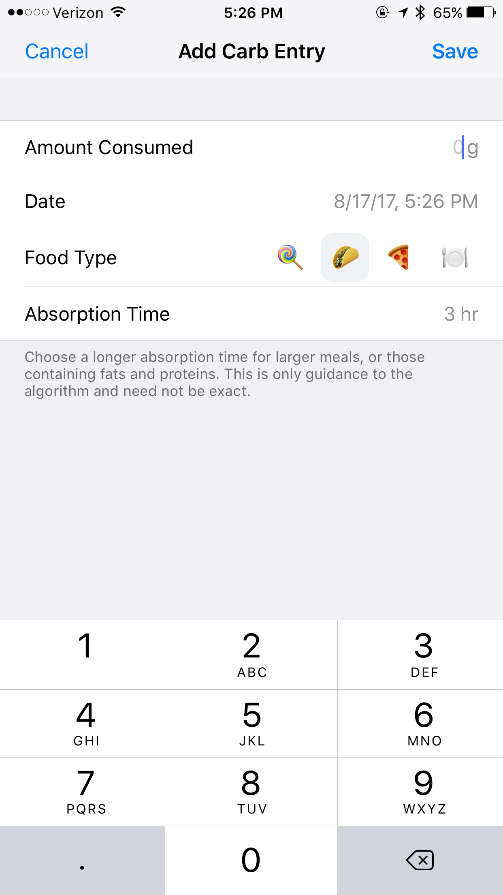
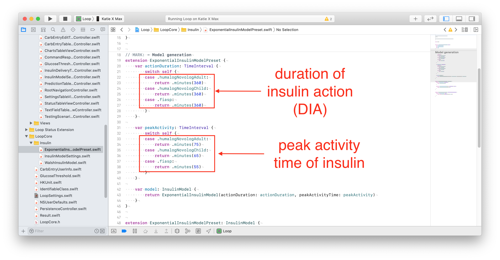

## Build then Customize

For new Loopers, please build the code before you make any changes. Start with Open Loop and familiarize yourself with the interface.  Later, you can make the customization(s) you desire and build again.  The second build will be much easier than your first build.

These customizations require you modify the *Loop* app code and then build the app after making these customizations. This page supports version 3 and greater for the *Loop* app.

## Customization Options

Read about the customizations on this page before applying them.

!!! warning "You take responsibility"
    You are responsible when you decide to use customizations.

    Be sure to report what changes you made if you need to ask for assistance with your app.

Some customizations are the same for everyone and have been prepared for easy use. Refer to the build method that you use for information about applying these prepared changes - the same set is available for both build methods.

* [Customize with Browser](../browser/custom-browser.md)
* [Customize with *Mac*](../build/custom-mac.md)

Other customizations require that you create your own personalized version.

* On this page are instructions for what modifications are required to your code to achieve a **personalized customization** (regardless of build method)
* On [Version: Build-Time Flag](../version/build-time-flag.md){: target="_blank" } are details about how to change the default settings for the build-time flags by editing the `LoopConfigOverride.xcconfig` file.

## Instructions for Finding the Lines

The instructions on this page identify the module, `Key_Phrase` or file and line numbers required to locate the code you need to modify.

!!! question "Why do I have to jump between pages?"
    * The code changes are defined on this page
    * The method to make code changes depends on build method and are found at:
        * [Custom Edits with Browser](../browser/edit-browser.md){: target="_blank" }
        * [Custom Edits with *Mac*](../build/edit-mac.md){: target="_blank" }

!!! info "Line numbers may change"
    Every effort will be made to update the line numbers as the code is updated, but there may be times where the screenshots and line numbers differ from the current version of Loop code.

    * You may notice some customizations list line numbers for different branches

    * If you cannot identify a line that looks exactly like the example - do not guess - go to your favorite social media group and ask for help

    * Sometimes there is a bigger change than just line numbers. The git software is really good about finding the "right" code that is just at a different line number. When you see the notation `Stable: Changed on date`, that means you must select the correct version when making your personal customization depending on which version you are modifying.
        * With the release of 3.4.x, no customizations fall into this category
        * The notation is kept to handle future changes that might happen when development start again

This page is broken into two halves:

* [Custom Edits Required](#custom-edits-optional):
    * The first half of this page is for customizations that require you to edit your own code

* [Custom Edits Optional](#custom-edits-optional):
    * The second half of this page provides instructions for some of the prepared customizations included in the [*Loop and Learn*: Customization Select Script](https://www.loopandlearn.org/custom-code)
    * Some people prefer to make all their own edits

For each customization, you will be given landmarks to find the correct location in the code. You can choose to search using the `Key_Phrase` or navigate to the file in the folder structure and look for the line number. 

### Key_Phrase

``` { .txt .copy title="Example of a Key_Phrase" }
use the copy button at right, paste into search
The copy button for this exampe is just for practice
Do not paste the result anywhere
```

To search using the `Key_Phrase` (see graphic above for an example):

* A copy button is available when you hover your mouse in the right-hand side
of the block below the title `Key_Phrase`;  click on it to copy the phrase into your paste buffer
* You can paste this into the search function of the tool you are using if desired (warning, you may have to hit back-space to remove a return character from the pasted text)
* Alternatively, navigate to the required file using Module, Folder, File and line number

### Module, Folder, File

Each customization provides the Module, Folder and File bullet below the key phrase.

  * Module: Loop
  * Folder: Loop/subfolder1/subfolder2/etc.
  * File: filename.swift, line number(s)
  * Stable: "Yes" or "Changed on date: Version #"

Each customization will show the original line of code that you will be changing. 

There may be a figure illustrating the change.

Below the figure, the original, and in some cases, the modified code will be displayed as text.

* Sometimes that line is long and you may need to use the scroll bar to see the entire line in LoopDocs
* In most cases, an example customization is shown to assist you in deciding how to edit the line to meet your needs

### What does `Stable` mean?

The line starting with `Stable` was previously used to indicate when code changes were sufficient to require a different customization. With the release of 3.4.x, all customizations show `Stable: Yes`. 

* A few have an additional notation of when they were last changed
* All customizations are currently identical for `main` and `dev`
* Instructions for older versions of the customization are removed from this page.

??? tip "More Information about `Stable` (Click to open/close)"
    Some customizations have not changed for a very long time (stable since 2.2.x days).

    It was not until version 3.2.3 that we started adding a notation as to when the required customization code changed.

#### Not Stable List

At the current time, all customizations are stable. It has been more than a year since the last code modification that required a customization change. So this section is empty.

## Custom Edits Required

### Default Carb Absorption Times

{width="200"}
{align="center"}

In prior versions of the *Loop* app, for example version 2.2.x, the lollipop (fast) icon was set for 2 hours, taco (medium) icon for 3 hours, and pizza (slow) icon for 4 hours. This is modified for `the *Loop* app` to 30 minutes, 3 hours and 5 hours respectively. Some people prefer different values.

If you want to change this to 2, 3 and 5 hours - that is available as a standard customization using the [*Loop and Learn*: Customization Select Script](https://www.loopandlearn.org/custom-code/#custom-list)

??? question "Do you want to know more? (Click to open/close)"
    The developers did this because they expect fast to only be used for rapid-acting low treatments. The medium and slow values are for moderate and higher-fat or large meals.

``` { .txt .copy title="Key_Phrase" }
defaultCarbAbsorptionTimes: CarbStore.DefaultAbsorptionTimes
```

* Module: Loop
* Folder: Loop/LoopCore
* File: LoopCoreConstants.swift
* Line: 19
* Stable: Yes

For example, if you wanted to change `fast` to be slightly longer, the edit would be as follows:

_Code Before Modification

    public static let defaultCarbAbsorptionTimes: CarbStore.DefaultAbsorptionTimes = (fast: .minutes(30), medium: .hours(3), slow: .hours(5))

_Code After Modification

    public static let defaultCarbAbsorptionTimes: CarbStore.DefaultAbsorptionTimes = (fast: .hours(1.5), medium: .hours(3), slow: .hours(5))

Note that if you change `fast` from 30 minutes to 1.5 hours, you must also change the indication before the parentheses.

### Adjust Maximum IOB for Automatic Dosing

With version 3.2.0, a new safety feature was added. This limits automatic dosing so IOB is no more than two times the $\mathit{maximumBolus}$ set in your Delivery Limits. (The term automatic dosing refers to insulin the app automatically delivers above your scheduled basal rate.) Manual Bolus, where you initiate the bolus yourself, is not subject to this limit. Please read [How do Delivery Limits Affect Automatic Dosing?](../faqs/algorithm-faqs.md#how-do-delivery-limits-affect-automatic-dosing) for detailed information on how this safety feature works.

The default value ($\mathit{2*maximumBolus}$) used for this feature is good for the majority of people who use the app. However, there are some individuals who might need to limit the size of any single bolus independent from the maximum IOB they want to set for their app. This is particularly true for those who find large boluses give rise to tunneling and the insulin leaks out along the cannula.

``` { .txt .copy title="Key_Phrase" }
automaticDosingIOBLimit = maxBolus
```

* Module: Loop
* Folder: Loop/Managers
* File: LoopDataManager.swift, line: 1690 (main), 1796 (dev)
* Stable: Yes

The following example is for someone who limits a single bolus to 5 U but frequently needs to achieve an IOB of 15 U for meals. They want that level of IOB to be reached with automatic bolusing. In that case, they may want to modify the factor used to calculate $\mathit{automaticDosingIOBLimit}$.

Original Code:
```
let automaticDosingIOBLimit = maxBolus! * 2.0
```

Modified Code Example:
```
let automaticDosingIOBLimit = maxBolus! * 3.0
```

Because the automatic bolus amount is also limited by the partial application factor, it still takes a few cycles to reach the higher IOB of $\mathit{3*maximumBolus}$; but they can get there without manual intervention.

### Adjust Percent Bolus for Automatic Bolus

If you are mostly happy with the Dosing Strategy of Automatic Bolus but wish it delivered more or less insulin during every Loop interval, then this customization is for you.

> With the release of version 3.4.x, there is another option. If you choose to enable [Glucose Based Partial Application](../loop-3/features.md#glucose-based-partial-application-gbpa){: target="_blank" }, then the percent of the recommended bolus automatically provided adjusts from 20% to 80% depending on your glucose level. You may decide this works well enough for you that this customization is no longer desired. Please give this new feature a try.

This customization changes the percent of the recommended bolus used for automatic delivery. The method for calculating that recommendation is not changed by this modification.  The default value is 40% (0.4).  It is recommended you take small changes of 0.1 at a time.  Once you modify it once and try it out for a while, it’s easy to go back and change it again.

**Change just the number and double check that the value is less than 1.**

``` { .txt .copy title="Key_Phrase" }
let bolusPartialApplicationFactor
```

* Module: Loop
* Folder: Loop/Loop/Models
* File: LoopConstants.swift
* Line: 53
* Stable: Yes

_Code Before Modification_

    static let bolusPartialApplicationFactor = 0.4

_Code After Modification to 50% of recommended insulin_

    static let bolusPartialApplicationFactor = 0.5

!!! warning "Do not exceed 1.0"
    This number should never be bigger than 1 (you’d be getting more than Loop recommends). If you think you need more than 1, consider your settings and meal entries.


### Pods: Add Extra Insulin on Insertion

The default value is 0.0 U of extra insulin.  If you use this customization, start with a small number and work your way up. If you are coming from manual podding and routinely gave yourself an extra bolus with your PDM at pod change time, you may not need nearly as much with Loop - be conservative.

Note that Loop does not include the amount of insulin in the prime or insertion steps in your IOB. The pod reports every pulse that it delivers to Loop. If you look in the Pod Settings insulin delivered row, that is the total delivered by the pod minus the (prime plus insertion) amounts. The only way to know that you successfully made this change is to count the clicks.  Normal insertion is 0.5 U (0.5 U / 0.05 U per click = 10 clicks). So if you add 0.35 U to the "extra" value, you should get 0.35 / 0.05 = 7 extra clicks. In other words, 17 total clicks after you press insert.

This code change is found in one location for Eros Pods (called Omnipod throughout the app) and DASH Pods (called Omnipod Dash throughout the app). I tend to change both files, but if you're only using one kind of pod, that is really not necessary.

``` { .txt .copy title="Key_Phrase" }
let cannulaInsertionUnitsExtra
```

* Module: OmniBLE (DASH) or OmniKit (Eros)
* DASH or Eros Pod (the *Loop* app only)
    * Folder: OmniBLE/OmniBLE/OmnipodCommon (DASH)
    * Folder: OmniKit/OmniKit/OmnipodCommon (Eros)
    * File: Pod.swift, Line 82 (DASH); Line 87 (Eros); 
* Stable: Yes

_Code Before Modification_

    public static let cannulaInsertionUnitsExtra = 0.0 // edit to add a fixed additional amount of insulin during cannula insertion

_Code After Modification to add 0.35 U_

    public static let cannulaInsertionUnitsExtra = 0.35 // edit to add a fixed additional amount of insulin during cannula insertion

### Modify the Guardrails

### Glucose Guardrails

This code limits the absolute and recommended values for the Glucose Safety Limit and the Correction Ranges. The absolute range cannot be exceeded. The recommended range indicates values that show up as black on the picker wheel. Numbers outside the recommended range are yellow. Numbers at the min or max of the absolute range are displayed as red.

``` { .txt .copy title="Key_Phrase" }
Guardrail(absoluteBounds:
```

* Module: LoopKit
* Folder: LoopKit/Extensions
* File: Guardrail+Settings.swift
* Line: 12 for suspendThreshold
* Line: 26 for correctionRange
* Stable: Yes
    * Last Changed on 2024 Feb 19

??? info "Update Details (Click to open/close)"
    This update, merged on 2024 Feb 19 was part of a larger fix to a problem when glucose units were mmol/L. The user could not select two values (min and max) that were the same and equal to the reported absolute range. This was a rounding problem going between mmol/L and mg/dL that has now been resolved. Part of the resolution was to modify the mg/dL absolute ranges to preserve the previously reported mmol/L absolute ranges.

_Code Before Modification_

    static let suspendThreshold = Guardrail(absoluteBounds: (66.1)...(110.9), recommendedBounds: (73.1)...(80.9), unit: .milligramsPerDeciliter, startingSuggestion: 80)

and

    static let correctionRange = Guardrail(absoluteBounds: (86.1)...(180.5), recommendedBounds: (99.1)...(115.9), unit: .milligramsPerDeciliter, startingSuggestion: 100)

Modify the absoluteBounds to change the allowed ranges or the recommendedBounds to change the color of the numbers on the picker wheel.

Loop automatically converts from mg/dL to mmol/L. So you must enter values reasonable for mg/dL (18 times higher than for mmol/L).

### Modify Guardrails for Insulin Sensitivity Factor (ISF)

Similar to the instructions for glucose guardrails above, but use this `Key_Phrase` and modify the absoluteBounds row, next line.

``` { .txt .copy title="Key_Phrase" }
static let insulinSensitivity = Guardrail(
```

* Module: LoopKit
* Folder: LoopKit/Extensions
* File: Guardrail+Settings.swift, line: 81
* Stable: Yes

### Modify Guardrails for Carb Ratio (CR)

Similar to the instructions for glucose guardrails above, but use this `Key_Phrase` and modify the absoluteBounds row, next line.

``` { .txt .copy title="Key_Phrase" }
static let carbRatio = Guardrail(
```

* Module: LoopKit
* Folder: LoopKit/Extensions
* File: Guardrail+Settings.swift, line: 88
* Stable: Yes


### Adjust Future Carbs Time Interval

The *Loop* app limits to 1 hour the amount of time in the future that carbs can be entered.

* The [*Loop and Learn*: Customization Select Script](https://www.loopandlearn.org/custom-code) has a customization that changes this to 4 hours in the future
* If you want something other than 1 hour or 4 hours, you must create a personal customization

* Module: Loop
* Folder: Loop/Loop/Models
* File: LoopConstants.swift, Line 28
* Stable: Yes
    * Last changed 2023 Aug 20

``` { .txt .copy title="Key_Phrase" }
static let maxCarbEntryFutureTime
```

Default shown below:

_Code Before Modification_

    static let maxCarbEntryFutureTime = TimeInterval(hours: 1)

Change the maxCarbEntryFutureTime to the number of hours in the future you desire. Remember that Loop may increase insulin dosing for future carbs - make sure that they actually arrive. 

### Adjust the Watch Crown Sensitivity

The rate of change of the carb and bolus entry pickers when using the digital crown can be altered as can the rotation required to confirm a bolus on the watch. If you are running an older series watch - you may want to make these customizations. When I switched from Series 3 to Series 7 watch - it was amazing. I got a graph on the main watch screen I didn't even know existed and the bolus acceptance was a breeze!

* This customization is provided from code inspection and one test - use with care.

### Digital Crown Adjustments

First - try it with no customization. Then make small changes.

This key phrase will indicate three different files in the same folder as shown in the graphic below - you can adjust each in turn as you desire. When you click on the line, the quantity you change is a few lines below where you find the `Key_Phrase`, except for the CarbAndDateInput file.

``` { .txt .copy title="Key_Phrase" }
.digitalCrownRotation
```

* Module: Loop
* Folder: Loop/WatchApp Extension/Views/Carb Entry & Bolus
* Stable: Yes

{width="800"}
{align="center"}

#### Modify Bolus Confirmation Motion

* File: BolusConfirmationView.swift, line 59
* Initial Value for `scalingRotationBy` is 4
* Decrease to require less motion to confirm bolus (use whole numbers only), start with 3

#### Modify Bolus Picker Sensitivity

* File: BolusInput.swift, line 51
* Initial Value for `rotationsPerIncrement` is 1/24
* A change to 1/12 increases the change in picker value for a given motion

#### Modify Carb and Time Picker Sensitivity

* File: CarbAndDateInput.swift, line 68
* Initial Value for `rotationsPerIncrement` is 1/24
* A change to 1/12 increases the change in picker value for a given motion

### Expiration Notification Customization

An expiration notification feature has been added to Loop. You get a notification when you open the Loop app to alert you that the expiration is approaching.

* Read [Loop App Expiration Notification](../operation/features/notifications.md#loop-app-expiration-notification){: target="_blank" } to see the expiration reminder

If you prefer a different notification time and frequency, there are two lines you can modify:

* Module: Loop
* Folder: Loop/Managers
* File: ProfileExpirationAlerter.swift
    * Line 16: modify how long before expiration you get the FIRST notification
    * Line 28: modify how frequently you will be notified
* Stable: Yes

``` { .txt .copy title="Key_Phrase" }
expirationAlertWindow: TimeInterval
```

``` { .txt .copy title="Key_Phrase" }
 minimumTimeBetweenAlerts: TimeInterval
```

{width="600"}
{align="center"}

Default code for line 16:
```
    static let expirationAlertWindow: TimeInterval = .days(20)
```

Example modifications to First Notification:

* 30 days: change `.days(20)` to `.days(30)`
* 12 hours: change `.days(20)` to `.hours(12)`

Default code for line 28:

```
    let minimumTimeBetweenAlerts: TimeInterval = timeUntilExpiration > .hours(24) ? .days(2) : .hours(1)
```


Modify Frequency of Repeated Notifications (Three Values):

* This phrase: ```> .hours(24) ? .days(2) : .hours(1)```
* Rewritten as: ```> Time_A ? Frequency_A : Frequency_B```, means:
    * Use Frequency_A if there is more time between now and the expiration date than Time_A
    * Use Frequency_B if there is less time between now and the expiration date than Time_A

You can enter Time or Frequency as ```.days(value)```, ```.hours(value)``` or ```.minutes(value)```.

Free App Users:

An example change that a Free Loop App user (who has to build once a week) might choose is:

```
     > .hours(4) ? .days(10) : .hours(2)
```
Combined with an ```.hours(12)``` on line 16, they would get notified at 12 hours, 4 hours and 2 hours before expiration on the day of expiration and only when the app is opened. Since you'll be building once a week, you can play around with these values until you are happy.

### Enable Child Model

Please see the [Build-Time Flag](build-time-flag.md) page for this customization.

### Insulin Model Customization

Each exponential model has 3 parameters that can be adjusted:

* actionDuration: Duration of insulin activity (minutes)
* peakActivity: Peak of insulin activity (minutes)
* delay: Delay before insulin begins to acts after delivery starts (minutes)

Please read the nitty-gritty discussion that went into the development of the "exponential insulin models" in this [Comment](https://github.com/LoopKit/Loop/issues/388#issuecomment-317938473).

If you wish to customize these values, please make sure you know what you are doing.  This is not a modification recommended for Loop novices.

``` { .txt .copy title="Key_Phrase" }
MARK: - Model generation
```

* Module: LoopKit
* Folder: LoopKit/LoopKit/Insulin/ << NOTE new location
* File: ExponentialInsulinModelPreset.swift
* Lines:
    * actionDuration (19 to 32)
    * peakActivity (34 to 47)
        * delay (49 to 62)
* Stable: Yes

{width="750"}
{align="center"}

This *Loop* table of default values is provided for convenience. The times are all in minutes.

|Model|DIA|Peak|Delay|
|---------|---------|---------|---------|
|rapidActingAdult|360|75|10|
|rapidActingChild|360|65|10|
|fiasp|360|55|10|
|lyumjev|360|55|10|
|afrezza|300|29|10|

### Loop Logo

!!! warning "*Mac* Instructions"
    This can be done with Build with Browser but the instructions might need to be adjusted for that case.

If you want an app logo other than the default green circle for your Loop app, you can easily customize this.  To make it easy to generate the correct sizes of icons, you can use a site like [appicon.build](http://www.appicon.build/) or [appicon.co](https://appicon.co/) and just drag and drop your source image. The source image needs to be 1024 pixels x 1024 pixels.  The site will email you a zip file or automatically download a set of files.  Highlight and copy the contents of the Appicon.appiconset that you are sent, including the Contents.json file

1. Navigate to the LoopWorkspace folder
1. Open the OverrideAssetsLoop.xcassets folder
1. Open the AppIcon.appiconset folder
1. Delete the contents of the Appicon.appiconset and copy/paste your new images and Contents.json file.
1. Rebuild your app

You may see a yellow warning that there are “unassigned children” depending on the images the app icon generator tool produced. The unassigned children alert will not prevent your app from building, it’s simply because there are more sizes of images than Loop app uses.  You can just leave the unassigned children alone (wow...how often do you get to say that phrase?).

And now you'll be the proud new owner of a custom Loop icon.

## Custom Edits Optional

The customizations listed below are incorporated into the [*Loop and Learn*: Customization Select Script](https://www.loopandlearn.org/custom-code).

You can use that script or make your own edit by following these directions.

### Disable Authentication for Bolusing

Depending on your iPhone Settings and model, you may have Face ID or Touch ID enabled.  Those security features will also be used to authenticate bolus delivery in Loop.  You can choose to disable authentication (i.e., not require Face ID, Touch ID, or passcode for bolusing) through the following code customization.

!!! warning "Safety Measure"
    If you disable this, you are removing an important safety feature.

    In addition to authenticating every manual bolus, this helps to protect against sleep bolusing and pocket bolusing.

    For the *Loop* app, this controls the authorization requirement to modify Therapy Settings as well as to confirm bolus delivery.

``` { .txt .copy title="Key_Phrase" }
canEvaluatePolicy(.deviceOwnerAuthentication
```

* Module: LoopKit
* Folder: LoopKit/LoopKitUI/Extensions/
* File: Environment+Authenticate.swift, Line 20
* Stable: Yes

_Code Before Modification_

    if context.canEvaluatePolicy(.deviceOwnerAuthentication, error: &error) {

_Code After Modification_

    if false && context.canEvaluatePolicy(.deviceOwnerAuthentication, error: &error) {

### Modify Override Insulin Needs Picker

Some people want finer settings on the override insulin needs picker (5% instead of 10%) and may want to limit the overall range for overrides – especially for children.

!!! tip "1% Settings Available without Customization"
    The Override Insulin Needs values are not limited by the default picker values of 10%.

    * [Select 1% Insulin Needs](../operation/features/overrides.md#select-1-insulin-needs)

Any override more than a factor of 2 from 100% can cause Loop predictions to be wrong – especially if a carb count is entered. (An [override](../operation/features/overrides.md) is NOT the same as a manual temp basal - it changes insulin sensitivity factor and carb ratio in addition to the basal rate needed for zero change in IOB for the duration of the override.)

!!! danger "A Sensitivity of 0% is NOT Valid"
    Do not set the lower level of the sensitivity range to be 0%.

    If you configure to allow that and someone chooses it, they will be telling Loop to divide by zero in some of the calculations. They will see NaN (not a number) in Loop predictions until that override is removed and will continue to see that for the full duration of insulin action (6 hours).

This example customization changes the lower bound for sensitivity to 50% (factor of 2 smaller than 100%) and provides 5% steps. This is the same as the prepared customization offered by the *Loop and Learn* team.

``` { .txt .copy title="Key_Phrase" }
let allScaleFactorPercentages
```

* Module: LoopKit
* Folder: LoopKit/LoopKitUI/Views
* File: InsulinSensitivityScalingTableViewCell.swift, Line 19
* Stable: Yes

_Code Before Modification_

    private let allScaleFactorPercentages = Array(stride(from: 10, through: 200, by: 10))

_Code After Modification to 50% to 200% by steps of 5%_

    private let allScaleFactorPercentages = Array(stride(from: 50, through: 200, by: 5))

### Modify Maximum and Warning Carb Entry

Version 3.x of the *Loop* app has both a `maxCarbEntryQuantity` and a `warningCarbEntryQuantity`, found adjacent to each other in the code. The warning value is the level at which you are asked if you really meant to enter that amount:

``` { .txt .copy title="Key_Phrase" }
let maxCarbEntryQuantity =
```

* Module: Loop
* Folder: Loop/Loop/Models
* File: LoopConstants.swift, line 18
* Stable: Yes

_Code Before Modification_

    static let maxCarbEntryQuantity = HKQuantity(unit: .gram(), doubleValue: 250) // cannot exceed this value

    static let warningCarbEntryQuantity = HKQuantity(unit: .gram(), doubleValue: 99) // user is warned above this value

#### `"low_carb_limit"`

This first example might be used by a parent for a child with very small carb entries. It is provided as one of the prepared customizations supplied by the [*Loop and Learn* Customization as `"low_carb_limit`"](https://www.loopandlearn.org/custom-code/#custom-list).

_Code After Modification to enable the warning at lower levels and limit maximum_

    static let maxCarbEntryQuantity = HKQuantity(unit: .gram(), doubleValue: 99) // cannot exceed this value

    static let warningCarbEntryQuantity = HKQuantity(unit: .gram(), doubleValue: 49) // user is warned above this value

#### `"high_carb_limit"`

This second example might be used by a person who routinely enters large meals and does not want to be warned with every meal. It is provided as one of the prepared customizations supplied by the [*Loop and Learn* Customization as `"high_carb_limit`"](https://www.loopandlearn.org/custom-code/#custom-list).

_Code After Modification to warn if entry is between 201 and 300g_

    static let maxCarbEntryQuantity = HKQuantity(unit: .gram(), doubleValue: 300) // cannot exceed this value

    static let warningCarbEntryQuantity = HKQuantity(unit: .gram(), doubleValue: 200) // user is warned above this value

