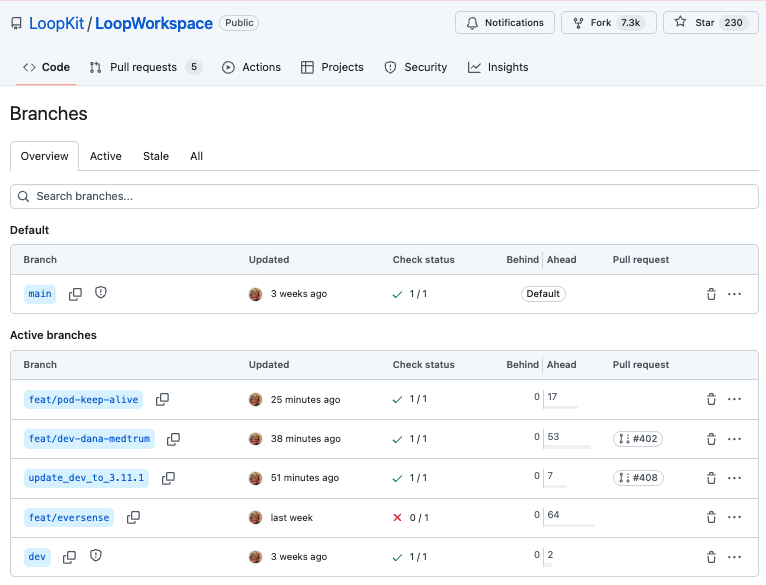
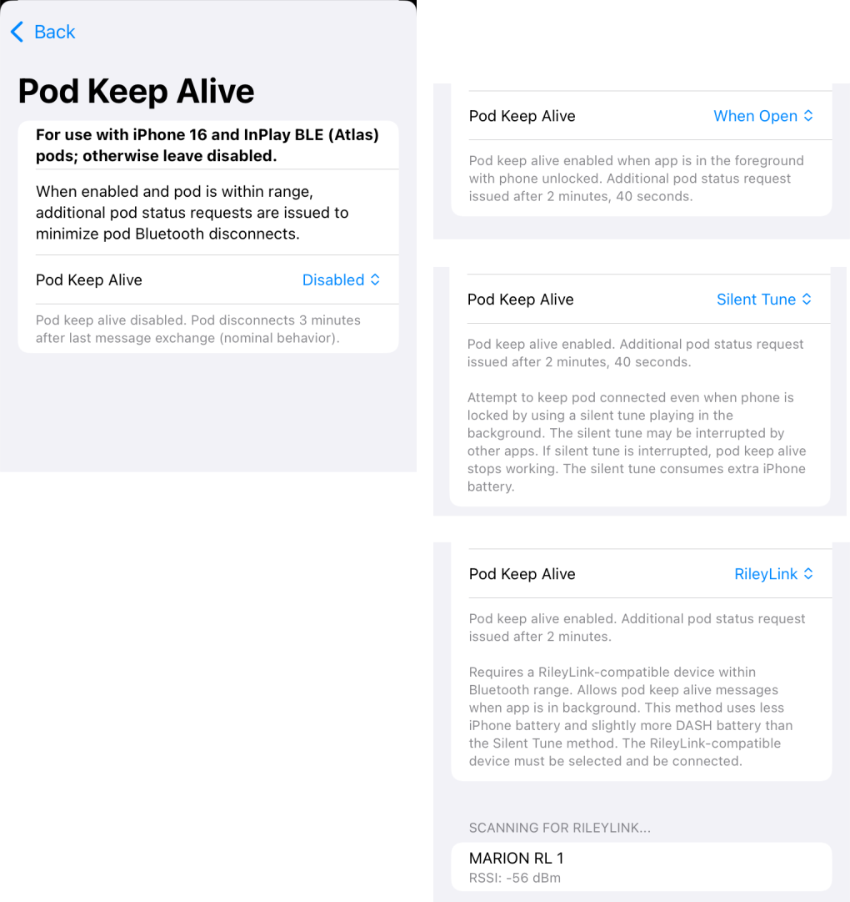

## Overview

The early history of the *Loop* app was touched on in the introductory [*LoopDocs* Overview: Development History](../intro/overview-intro.md#development-history) section.

The [*Loop* Releases](../version/releases.md) page lists releases since version 2.0 in reverse chronological order.

The next version of the *Loop* app is developed using branch(es), independent of the released *Loop* version, which is found in <span>the `main` branch</span>. <span>The `dev` branch</span> is used by the developers to push out changes for users to test. You should only test a development branch if you are willing to be both an active participant with the developers to monitor announcements and provide feedback and to build frequently to obtain the latest feature or bug-fix that is being tested. If you are willing to help out - this is the way the next release of *Loop* is improved.

If you choose to use `dev`, you accept that this code is not released.

Please read this entire page before using any version of *Loop* other than the released code.

## Updates in `dev`

This section provides an overview of changes to `dev` compared to `Loop v3.10.0`. 

A few days after v3.10.0 was released, the dev branch was updated to be identical to main except for version number of 3.11.0. Work leading to the next update for `dev` is found in the `update_dev_to_3.11.1` branch.

Please check the [development channel in zulipchat](https://loop.zulipchat.com/#narrow/channel/144182-development) for notifications when an update to the `dev` branch is expected so you will be prepared. Do this **before** you install a `dev` build from TestFlight.

### Branches

In addition to the main and dev branches, which are tightly controlled and only updated through a formal pull request and approval process, there are also some feature and update branches. These branches are subject to more frequent updates, so users testing these branches should follow along in zulipchat for information.

* The `update_dev_to_M.m.#` is where the next version of dev is tested before becoming part of `dev` and later being released at `main`
* The branches starting with `feat/` have one or more special features, like support for new pumps, CGM or the keep-alive work-around for Atlas DASH pods with by iPhone 16

The graphic below shows the `main` and `dev` branches along with some feature branches and an update branch.

> {width="750"}
{align="center"}


??? tip "Updates in Progress (Click to open/close)"
    * Sometimes there is a work-in-progress branch, `update_dev_to_M.m.#` used to collect new items in preparation for the next `dev` branch. This allows people to test and comment on the updates before they land in the `dev` branch.
    * There are also feature branches for items like new pumps and new CGMs:
        * The feature branches typically spin off of `dev`, but if a `updates_dev_to_ . . .` branch is in work, it is merged into the feature branches as items get included

#### Table of Active Branches

The table below lists active branches. Note that updates may occur and be announced in zulipchat a day or two before updates propogate to *LoopDocs*.

| <div style="width:140px"> branch | version # | <div style="width:140px">last updated | comments |
|:--|:--|:--|:--|
| main | 3.10.0 | 10 Jan 2026 | release|
| dev | 3.11.0 | 11 Jan 2026 | same as main, except version number |
| [update_dev_to_3.11.1](#update-to-dev-3111) | 3.11.1 | 02 Feb 2026 | collect updates for the next version of dev <br>Details are in [PR 408](https://github.com/LoopKit/LoopWorkspace/pull/408) |
| [feat/pod-keep-alive](#feature-branch-pod-keep-alive-feature)<br>- SHA `783d390` | 3.11.1 | 02 Feb 2026| - uses the OmniBLE pod-keep-alive branch to support users of iPhone 16 phones with InPlay BLE (-Atlas) DASH pods<br>  - SHA for OmniBLE is `9992773`<br>**Please read [Feature Branch: Pod Keep Alive Feature](#feature-branch-pod-keep-alive-feature)** |
| [feat/dev-dana-medtrum](#feature-branch-medtrum-and-dana-support) <br>- SHA `0282e18` | 3.11.1 | 02 Feb 2026 | - adds experimental support for Dana and Medtrum pumps<br>- this branch is ready for expert testers to evaluate and report back<br>  - SHA for DanaKit is `dbe63ae`<br>  - SHA for MedtrumKit is `f21d808` |
| [feat/eversense](#feature-branch-eversense-support) <br>- SHA `41d63dd` | 3.11.0 | 24 Jan 2026 | - adds experimental support for Eversense (includes Dana and Medtrum pumps support too)<br>- this branch is ready for expert testers to evaluate and report back<br>  - SHA for Eversense is `a478d8f` |

!!! important "Eversense Support"
    The Eversense CGM is now supported by the *Loop* app in a feature branch. To simplify maintenance, the branch which supports Eversense also supports the two new pumps: Dana and Medtrum.

    The branch which support Evensense E3 and E365 CGM is simply called `feat/eversense`.

??? question "What is SHA? (Click to Open/Close)"
    SHA-1 means Secure Hash Algorithm 1. This is used to generate an alphanumeric code to identify which version of a repository is used. 

    Each time you save a change to your&nbsp;<span translate="no">GitHub repository</span>, a unique SHA-1 is created. That identifier is used to tell *GitHub* a specific change that you want applied or identifies a specific version for that <code>repository</code>. These work for any compatible <code>fork</code> from the original&nbsp;<span translate="no">GitHub repository</span>.

    The SHA-1 20-character value is abbreviated as SHA and typically only the first 7 or 8 characters are presented to identify the commit for a particular repository.

### How to Build Feature Branches

For full instructions on building different branches, review these pages:

* [Browser Build: Build a Version in Development](../browser/build-dev-browser.md#build-development-version){: target="_blank" }
* [Mac Xcode: Build a Version in Development](../build/build-dev-mac.md#build-other-branches){: target="_blank" }

For Browser Build, use the page linked above to add the desired branch name (from the table above) to your fork. In other words, where the directions indicate the `dev` branch, you substitute the branch name of interest.

For Mac Xcode build, the lines you need to copy and paste into a Terminal window are explicitly provided below:


``` { title="Download and build the feat/pod-keep-alive branch" }
/bin/bash -c "$(curl -fsSL \
  https://raw.githubusercontent.com/loopandlearn/lnl-scripts/main/BuildLoop.sh)" \
   - feat/pod-keep-alive
```

``` { title="Download and build the feat/dev-dana-medtrum branch" }
/bin/bash -c "$(curl -fsSL \
  https://raw.githubusercontent.com/loopandlearn/lnl-scripts/main/BuildLoop.sh)" \
   - feat/dev-dana-medtrum
```

``` { title="Download and build the feat/eversense branch" }
/bin/bash -c "$(curl -fsSL \
  https://raw.githubusercontent.com/loopandlearn/lnl-scripts/main/BuildLoop.sh)" \
   - feat/eversense
```

### Version Number Plan

Please see [`Loop` Version Numbering](releases.md#loop-version-numbering) for the current method for version numbering for the `main` and `dev` branches.

The idea of having a feature branch is not new for the *Loop* app but hasn't been used for a few years. At this point, we have several feature branches.

The version number in the feature branch will match either the `dev` branch version number or a work-in-progress update to the `dev` branch which uses the naming convention `update_dev_to_M.m.#`.

* In other words, the feature branch is up to date with other changes to `dev` or `update_dev_to_M.m.#` with the added support for the specific feature
* Each feature has an associated repository that contains the feature
    * When updates to the feature are added, the SHA for the feature branch and the SHA for the submodule(s) which support that feature will be reported in the table above and can be found by examining the LoopWorkspace repository for that feature branch

### Update to dev 3.11.1

Details are in [PR 408](https://github.com/LoopKit/LoopWorkspace/pull/408).

### Feature Branch: Pod Keep Alive Feature

The experimental `pod-keep-alive` branch has a new "Pod Keep Alive" option at the bottom of the "Omnipod DASH" screen. This is intended to assist users who have both an [iPhone 16 and DASH pods with a InPlay BLE (Atlas) board](../faqs/omnipod-faqs.md#iphone-16-and-atlas-or-inplay-dash-pods){: target="_blank" }. No action is taken automatically unless both these cases are detected to be true.

It was tested for LoopWorkspace and Trio.

The concept is by choosing one of the Pod Keep Alive choices, the app sends a getStatus to the pod before the 3 minute disconnect happens. Therefore, so long as you and the pod stay close to the phone, the pod will be connected for any command (either manual or automatic) including bolus, temp basal, modify scheduled basal rates, suspend, or deactivate.

The selection for Pod Keep Alive is found at the bottom of the Pod settings screen.

The default value is Disabled. The graphic below shows the Pod Keep Alive screen that allows the user to choose an option.

{width="650"}
{align="center"}

There are 4 choices for Pod Keep Alive:

1. [Disabled](#disabled) (default)
2. [When Open](#when-open)
3. [Silent Tune](#silent-tune)
4. [RileyLink](#rileylink)

#### Disabled

When Pod Keep Alive is disabled, the code behavior is unchanged from the nominal OmniBLE code.

!!! warning "Automatic Change for iPhone 16 and Atlas DASH pod"
    If your app has Pod Keep Alive set to disabled and you have an **iPhone 16** and the pod you just paired is an **InPlay (Atlas) pod**, the configuration **automatically** switches to **When Open**. 
    
    The Pod Keep Alive configuration remains at **When Open** until you change it manually.

All three criteria must be true or no automatic change to the setting takes place:

* iPhone 16
* pair a new pod that is InPlay BLE (Atlas)
* Pod Keep Alive is Disabled

Note that during the time from pair to insert, the app keeps the screen open and unlocked unless you manually lock it.

This means you can take all the time you need between pair/prime and insert. As long as you don't manually lock the phone or move it out of range of the pod, the pod stays connected until you insert the cannula.

Once the pod is inserted, the phone auto-lock timing is restored to the value the user has selected.

#### When Open

When the app is open, it will send a getStatus to the pod 2:40 (mm:ss) after the last pod message was exchanged. This means the pod does not disconnect from BLE and remains available to the phone.

This is true as long as the phone and pod are in-range while the app is open with phone unlocked.

> If the pod moves out of Bluetooth range, the pod disconnects. With iPhone 16 it might take several seconds to minutes before the app reconnects to the pod once it is back in range. This can cause disruptions until the reconnect happens.

#### Silent Tune

A silent tune is played in the background which keeps the app alive even when the phone is locked. This will increase the battery usage on the phone.

While Silent Tune is selected, the app will send a getStatus to the pod 2:40 (mm:ss) after the last pod message was exchanged. This means the pod does not disconnect from BLE and remains available for commands from the app so long as the phone and pod stay within Bluetooth range.

> If the pod moves out of Bluetooth range, the pod disconnects. With iPhone 16 it might take several seconds to minutes before the app reconnects to the pod once it is back in range. This can cause disruptions until the reconnect happens.

#### RileyLink

For those who have a RileyLink (OrangeLink, EmaLink, etc), you can use that instead of the Silent Tune but you must keep the link with the phone.

While RileyLink is selected, the app is triggered by the RileyLink one minute heartbeat. The app will send a getStatus to the pod 2:00 (mm:ss) after the last pod message was exchanged. This means the pod does not disconnect from BLE and remains available for commands from the app so long as the phone and pod stay within Bluetooth range.

> If the pod moves out of Bluetooth range, the pod disconnects. With iPhone 16 it might take several seconds to minutes before the app reconnects to the pod once it is back in range. This can cause disruptions until the reconnect happens.

> If the phone moves out of RileyLink range, then the app is not triggered by the RileyLink heartbeat and the pod disconnects from BLE at the 3 minute cadence. With iPhone 16 it might take several seconds to minutes before the app reconnects to the pod once it is back in range. This can cause disruptions until the reconnect happens.


### Feature Branch: Medtrum and Dana Support

**Updates are believed to have fixed the active insulin issues reported for both Dana and Medtrum, but this should be tested by experts to confirm pumps are working well with Loop.**

!!! important "Experts Only"
    Please only use the `feat/dev-dana-medtrum` branch if you are prepared to follow along in zulipchat and are willing to test an experimental branch to help test and resolve issues.

    * Please ensure you have the latest version of this branch by synching before you build:
        * `feat/dev-dana-medtrum`
        * Mac-Xcode: type `git pull --recurse` to update an existing clone or download a fresh copy
        * Browser Build, the Build Loop action, with the `feat/dev-dana-medtrum` branch selected should automatically sync your fork for you


### Feature Branch: Eversense Support

There is a new feature branch available, `feat/eversense` which supports the Eversense E365 and E3 transmitters. In addition to Eversense support, this branch also has the same pump support as the `feat/dev-dana-medtrum` branch.

For anyone who tests this branch with Eversense,  if there are issues with your use of Loop with Eversense please report in this [zulipchat channel](https://loop.zulipchat.com/#narrow/channel/144182-development/topic/Eversense.20CGM/with/569969251). 

Be sure to include:

* a description of your issue
* your phone model
* iOS version on your phone
* which version of code you are running (branch name and SHA)
* share your Eversense logs (at bottom of the Loop Eversense screen)

If you prefer to create an issue directly at the Eversense repo, create it here:

* [https://github.com/bastiaanv/EversenseKit/issues](https://github.com/bastiaanv/EversenseKit/issues)

> Note

> * This was tested using an E365 transmitter attached to a small vial containing a sensor in glucose solution
> * This enabled testing the Eversense behavior with Loop on a test phone
> * No testing with the E3 (3-month, 90-day) sensor has been performed

## Older updates

### Updates from v3.8 to v3.10

The updates developed in the `dev` branch before the release of v3.10.0 are found in these PR.

*   [Update dev to 3.9.5](https://github.com/LoopKit/LoopWorkspace/pull/394)
*   [Update dev to 3.9.4](https://github.com/LoopKit/LoopWorkspace/pull/367)
*   [Update dev to 3.9.3](https://github.com/LoopKit/LoopWorkspace/pull/358)


### Updates from v3.6 to v3.8

The updates developed in the `dev` branch before the release of v3.8.0, are provided in reverse chronological order.

#### v3.7.7

The changes are to maintenance scripts and to translations with no change to the function of the code:

* There are some updates to translated strings that people who use Loop in other languages may notice
    * The DanaKit pump translations now work
    * Parts of the Favorite Foods sections are now translated
    * Many common keys used in more than one submodule are linked so they only need to be translated one time to appear in the app
* With v3.6.2, the method to Add Identifiers when using Browser Build for the *Loop* app changed. 
    * The new method requires the time-sensitive capability be added manually
    * This change was captured in LoopDocs but not in testflight.md
    * The instructions found in testflight.md were updated
* For developers who might want to know, this update included
    * conversion to use String Catalogs for localization in the submodules with associated tweaks to Xcode configuration
    * updates to the CircleCI configurations

#### v3.7.6

* Updated some localization (strings translated to different languages)
    * Added scripts to make localization more streamlined
* Cleaned up some code
    * Fixed a bolus problem with iOS 26
    * Discarded some unneeded files
    * Updated to Xcode 16.4 for browser build and CircleCI quality testing

#### v3.7.5

* Added support for Dana-i and DanaRS-v3 pump models

#### v3.7.0 through v3.7.4

* `dev` v3.7.x was same as [`main` v3.6.x](releases.md#loop-v364).

### Updates from v3.4 to v3.6

All updates are reported in [`Loop 3.6.0`](releases.md#loop-v360){: target="_blank" }

Check [Version History](releases.md#loop-3-version-history) for minor updates found in 3.6.x.

### Updates from v3.2 to v3.4

Features new with v3.4, originally in the Updates in `dev` section before the release, have been inserted into the appropriate part of the *LoopDocs* website (indicated by the up-right arrow after the link). The links below are left to assist people in finding the features.

* [Support for Libre Sensors](../loop-3/add-cgm.md#libre){: target="_blank" }
* [Pump or CGM Simulator on Phone](simulator.md#pump-or-cgm-simulator-on-phone){: target="_blank" }
* [Algorithm Experiments](../loop-3/settings.md#algorithm-experiments){: target="_blank" }
    * [<span translate="no">Glucose Based Partial Application</span> Factor](../loop-3/features.md#glucose-based-partial-application-gbpa){: target="_blank" }
    * [<span translate="no">Integral Retrospective Correction</span>](../loop-3/features.md#integral-retrospective-correction-irc){: target="_blank" }
* [Favorite Foods](../loop-3/settings.md#favorite-foods){: target="_blank" }
* [<span translate="no">TestFlight Expiration Warning</span>](../operation/features/notifications.md#loop-app-expiration-notification){: target="_blank" }

- - -

## What are Git Branches?

There is a lot of discussion about *branches* with *Loop* but the concept is simple. Basically, they are all slightly different versions of *Loop*...kind of like different edits of the same book.

To really understand what branches are, we should probably explain a little more about the software and how development works.  You can watch a 30-minute long, classic Katie DiSimone [video explanation about branches](https://www.youtube.com/watch?v=cWqvYs4Azt0&t=4s) created when *Loop* Version 2.0 was newly released. Keep in mind while watching the video:


Details that are different:

* The way the code is organized has changed: see [LoopWorkspace](loopworkspace.md){: target="_blank" }
* The default branch name used to be `master` - but is now `main`
* `carthage` is no longer used to determine which submodules (frameworks) are pulled in to build Loop (see [LoopWorkspace](loopworkspace.md))

The information in this video is still generally useful with the last half focused on automatic-bolus - the automatic-bolus dosing strategy has now been incorporated into <span>*Loop* `main` branch</span>. *Loop* has moved on to using only one stable branch (`main`), with `dev` suggested for developers/testers.

### `Loop` GitHub Information

*Loop* developers own an account in *GitHub* called [LoopKit](https://github.com/LoopKit).  Within that account, the developers have several <code>repositories</code> that support *Loop* in particular. A repository&#8203; is like a book...let's think of it like a cookbook for now. Within the `LoopKit` account, there are `repositories` for Loop&#8203; itself, *LoopDocs*, and various other supporting "frameworks" that are <span>helper &#8203;repositories&#8203; for *Loop*</span> to build correctly. For example, Loop&#39;s &#8203;repository&#8203; has a lot of info about the app itself; the outward-facing things that you interact with. How information is put to you and taken in from you...that's in *Loop* <code>repository</code> code. But, there's more than just a user interface for Loop. *Loop* has to do a lot of complex work like Bluetooth communications, algorithm math, pump communications, etc. The *Loop* app has help from frameworks to do those other parts. `CGMBLEkit`&nbsp; for some of the transmitter parts of *Loop*, `RileyLink_ios` for the pump managers (talking to the pumps and decoding their information), `LoopKit` for the algorithm about carbs and insulin curves, etc.

When you build *Loop*, you actually start with LoopWorkspace which points to all the other repositories needed for a complete *Loop* app.

### *Loop* as a Cookbook

So let's imagine *Loop* as a cookbook. The developers are the authors/chefs of the recipes (code) in the cookbook. The authors spend countless hours testing new recipes, taste testing, and documenting improvements. They send the drafts to the editor, who makes suggestions and eventually, the cookbook is finalized. There are no grammar issues, and no typos, the photos are beautiful and the recipes are yummy. They publish the book and you see a gorgeous final product on the shelves. That is called a release&#8203, and it is the `main` branch. This book has been well-tested and is super stable. Every time you cook with those recipes, you know exactly what you're getting and lots of people have had a chance before you to make sure that it all tastes good. The `main` branch is stable and tested.

But then...the chefs/developers go on a trip. They are inspired by new cuisine and want to add new recipes to the old cookbook. (Things like Omnipod&#8203; support and the overrides are new "recipes" that were developed since the last `main` release, for example.) But, the process of developing a recipe is arduous. There was a lot of trial and error involved. Lots of tweaking ingredients (code). The editors try out the new recipes and offer feedback (similar to the [Issues List on GitHub](https://github.com/LoopKit/Loop/issues)). While the recipes are being developed, they have a version of the old cookbook that gets marked up...edited in pencil a lot. Scribbles and notes in the side. Revisions happen frequently because that's what testing new recipes is all about. These marked-up versions of the cookbook are called the `dev` branch. Short for "development" branch. Like the name sounds...this is where new developments are happening, new recipes, and tweaks.

After much testing and tweaking, eventually, the recipes get the flavors right (bugs in code are squashed) and enough people have provided feedback and careful observations of results...that the book goes to the publishing house for the next printing. The cookbook is republished with an updated edition number and new recipes are highlighted. When this happens in *Loop*,  <span>Loop&#39;s `main` branch</span> is updated with the new features coming from `dev` (aka, the `dev` branch is merged into the `main` branch). When that happens, the `main` branch gets another `release` version. At this point, `dev` and `main` are identical. They remain so until the development team for *Loop*&nbsp; starts working on the next batch of improvements, which could be in the next hour or even days later, but then the cycle starts again.  The developers will start editing the code again and dropping those edits in the `dev` branch for further development.

## What's going on in the `dev` branch?

The `dev` branch is where the next version of *Loop* is being developed and tested.

If you choose to build *Loop* using a `dev` branch, you need to be aware that the `dev` branch may update code frequently and unannounced in the traditional sense that most users in the  *Looped* group or *Instagram* would see. Developers are not helped by people being in a `dev` branch if those users mistakenly think of it as a stable `main` branch with lots of detailed docs to go with it. People should only use a `dev` branch build if they EDUCATE themselves on the expectations and how to properly manage `dev` information and updates. People using the `dev` branch should also have regular access to a computer to be able to rebuild quickly if a new bug/fix is identified.

If you choose to use a `dev` build, you can stay abreast of developments in a number of ways...but they will all require you to do some legwork and keep yourself informed. This is not a situation where you should expect a fancy *Loopdocs* page updated regularly with current "`dev` updates"...that's just not the way the `dev` branch works (at least normally). There is, however, an attempt to organize that status of development in the [Updates in `dev`](#updates-in-dev) section.

### Subscribe to the Zulipchat channels

Use [Zulipchat](https://loop.zulipchat.com) forums for *Loop*.  
This forum has several streams of conversations (`streams`) depending on interest. I highly recommend following all the streams so you do not miss conversations.  You can select by stream and by topic within a stream to focus on a given conversation.  

!!! tip "Zulip Chat Streams"
    - If you are using the **dev** branch, you **must** be in the **[#development](https://loop.zulipchat.com/#narrow/stream/144182-development)** stream.  
    - If you want to know when **LoopDocs** gets updated, follow the **[#documentation](https://loop.zulipchat.com/#narrow/stream/270362-documentation)** stream.  
    - **Code changes** are called commits in GitHub.  
      The **[#github](https://loop.zulipchat.com/#narrow/stream/144191-github)** stream will have an automated post whenever a new commit is made and it will give a brief line description of the commit.

{width="650"}
{align="center"}

You can also go directly to the git commit history for each of the branches if you'd like. Note that `LoopWorkspace` is the card-catalog for all the books (repositories) used by Loop.

- [`LoopWorkspace` **`main`** branch: git commit history](https://github.com/LoopKit/LoopWorkspace/commits/main)
- [`LoopWorkspace` **`dev`** branch: git commit history](https://github.com/LoopKit/LoopWorkspace/commits/dev)

If you click on the commit, you can see exactly what changes to the code were made. It's an interesting learning experience. In red is the old code, and in green is the updated code. The line numbers and file names of the edited code are also there to help.)

{width="550"}
{align="center"}

I don't expect many of you would understand exactly what the edits mean, or how the new code might function. However, I bring up the topic of git commit history so that you can use that to realize just how often the `dev` branch is updated. Go ahead and look at the number and frequency of commits in that branch.  That's why no one would want to maintain a documentation list of the changes in the `dev` branch. It's just too much of a moving target.

### Watch the `Loop Repository` and `Issues List`

Open the [`Loop repository`](https://github.com/LoopKit/Loop) and subscribe to the `Issues`. 

You can choose to watch the `repository` so that you get emails when new `Issues` are reported. This is a good way to find out if other people are reporting odd behavior that you are wondering about. If you use `dev` and wonder about something you are seeing in *Loop*, you can check [`Issues` list](https://github.com/LoopKit/Loop/issues) to see if others are noticing the same. If so, you can help by capturing information and reporting it. Not super helpful to just say "Yeah, me too..." but better if you can attach screenshots, `Issue Reports` from *Loop* settings, and a thorough description of the problem you are seeing. Be a part of the solution by thoughtfully providing information to help debug.

{width="650"}
{align="center"}

### Become familiar with your data sources

Another useful thing if you'll be on `dev` branches undergoing a lot of active change...know how *Loop* works and where to look for additional information about what you are seeing. For example, if you see an IOB value that looks odd, you should know to look at the insulin deliveries stored in the *Health* app.

### Generate an Issue Report and a Critical Event Log

!!! tip "Issue Report vs Loop Issue"
    The action in the *Loop* app where you select `Issue Report` generates a human-readable LoopReport file that you can share which has a lot of useful information.

    The `Loop Issue` mentioned in [Watch the `Loop Repository` and `Issues List`](#watch-the-loop-repository-and-issues-list) is a website at GitHub where known Issues with the *Loop* app are kept in permanent storage.

    The names are similar, but the activity is quite different.

Know how to generate an `Issue Report` and `Export a Critical Event Log` when you see a problem so you can provide that if asked. 

* An `Issue Report` is a log file generated by the *Loop* app that has a lot of information the developers can parse to figure out what *Loop* was doing when you were having a problem. Some items go back 84 hours (pump and cgm messages), others are limited to a few hours (decision arrays) and some items are overall status (build version number and phone model / iOS).
* A `Critical Event Log` contains a zip of 7 individual zips. Each zip is for one day and contains the complete set of data used for Loop decision making. The event log goes back 7 full days.

To issue these reports:

* `Loop Settings` and then scroll almost to the bottom and select `Issue Report` and thenm share
* `Loop Settings` and then scroll almost to the bottom and select `Export a Critical Event Log` and then share

### Create a Debug Report

This 6-minute long, classic Katie DiSimone video shows how to [capture debugging logs](https://youtu.be/Ac4MguvUO7M). If you are testing a new branch, this is a valuable skill to assist developers in identifying problems. In addition to showing you how to generate and save the debug text information, the video explains how to create a <code>gist</code> with the debug information using your *GitHub* account and file an official Issue on the *Loop* *GitHub* <code>repository</code>. This may be required in some cases.  But start by chatting directly on [Zulipchat](https://loop.zulipchat.com) with the developer. What you are experiencing may already be known. If the developers need you to open a new `Issue`, they will say so on *Zulipchat*.


## `Repositories` and Code

If you're a developer looking for direct links to the **code and documentation** in *GitHub*:

* [`LoopWorkspace`](https://github.com/LoopKit/LoopWorkspace)
* [`LoopDocs`](https://github.com/LoopKit/Loopdocs)

For more information on **how to contribute code to the *Loop* project**, please review:

  * [How to Contribute to Open Source](https://opensource.guide/how-to-contribute/)
  * the [LICENSE](https://github.com/LoopKit/Loop/blob/main/LICENSE.md)
  * the  [CODE_OF_CONDUCT](https://github.com/LoopKit/Loop/blob/main/CODE_OF_CONDUCT.md)

If you want to contribute **code improvements**, please join [*Loop Zulipchat*](https://loop.zulipchat.com) and be sure to subscribe to all the channels. Meet the developers and testers who make this app, and learn about what is coming next.
