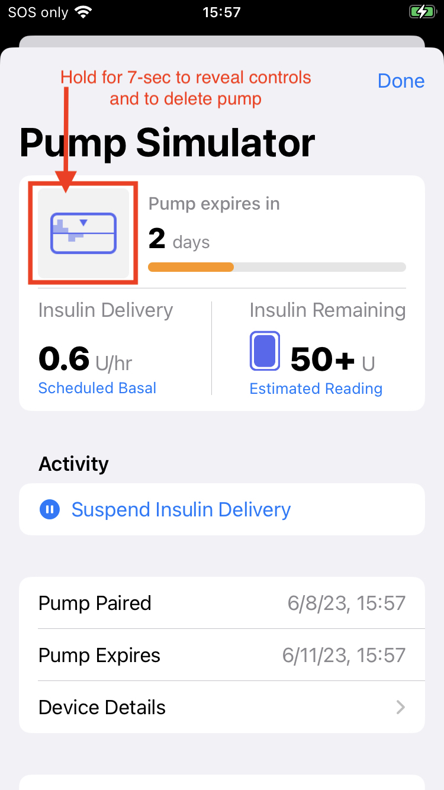
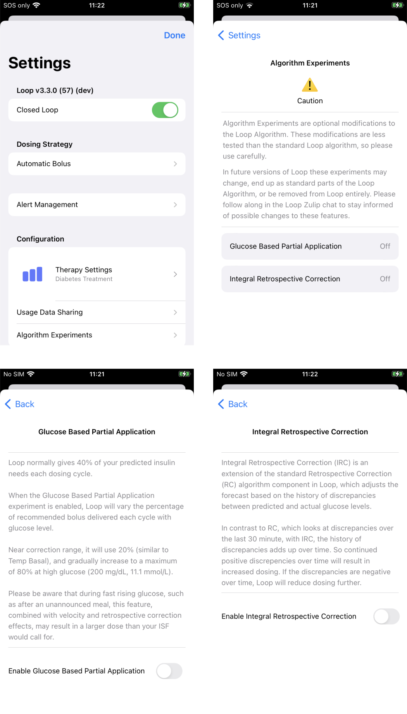

## Loop Development

The early history of Loop was touched on in the introductory [LoopDocs Overview: Development History](../intro/overview-intro.md#development-history) section.

The [Loop Releases](../version/releases.md) page lists releases since version 2.0 in reverse chronological order.

The next version of Loop is developed using branch(es), independent of the released Loop version, which is found in the main branch. The dev branch is used by the developers to push out changes for users to test. You should only test a development branch if you are willing to be both an active participant with the developers to monitor annoucements and provide feedback, and to build frequently to obtain the latest feature or bug-fix that is being tested. If you are willing to help out - this is the way the next release of Loop is improved.

If you choose to use dev, you accept that this code is not released.

Please read this entire page before using any version of Loop other than the released code.

## Updates in dev

This section is an early look at what has been added to dev since Loop 3.2.x and will probably be in the next release. After the release, some of the content and graphics in this section will move to the [Releases](releases.md) page or the appropriate documentation section.

### Support for Libre Sensors

[LibreTransmitter](https://github.com/dabear/LibreTransmitter#libretransmitter-for-loop) support was merged into dev in July 2023.

If you are using the GitHub Browser Build, please review: 

* [GitHub Build: One-Time Changes](../gh-actions/gh-update.md#one-time-changes): New steps and dates at which the new steps were added

### Simulators for Pump and CGM

The simulators for the Pump and CGM for dev show a new format when first selected. The initial view is a demonstration screen showing a typical CGM or Pump display. In order to view behind the scenes, to modify settings and to delete the simulator, you must press and hold (long-press) on the top of the display. Any where in the top third works for the long-press, but I like to touch the card as shown in the pump example below. If you've counted to 10 and the display has not updated yet, then return to main Loop screen, return to simulator screen and try again.

{width="500"}
{align="center"}

### Algorithm Experiments

Two algorithm experiments have been added to dev. These are Glucose Based Partial Application and Integral Retrospective Correction. They can be viewed on the Loop Settings screen just below Therapy Settings and Usage Data Sharing as shown in the graphic below:

{width="650"}
{align="center"}

### Glucose Based Partial Application (GBPA):

* Originally proposed as [Loop PR 1988](https://github.com/LoopKit/Loop/pull/1988)
* It is only used when Automatic Bolus (AB) is selected for Dosing Strategy
* This modification **does not affect the recommended dose**, only the speed with which the recommended dose is automatically delivered

When AB is selected and GPBA is enabled, the percentage of the recommended dose delivered per Loop cycle ranges from 20% to 80% based on glucose level and user selected correction range. (Without GBPA enabled, AB uses a fixed 40% percentage regardless of glucose level.)

* Partial Application = 20% when glucose level at or below 10 mg/dL (0.6 mmol/L) above the users correction range lower value (including overrides)
* Partial Application increases linearly from 20% to 80% up to a glucose level of 200 mg/dL (11.1 mmol/L)
* Partial Application is 80% when glucose level is above 200 mg/dL (11.1 mmol/L)

#### Insulin Delivery of Recommended Dose: GPBA

This is an area that confuses a lot of people so we're going to go through Automatic Bolus in some detail. For this section and the next section (on Temp Basal), the recommended dose is unchanged - the different methods only change how soon that recommended dose is delivered.

Loop makes a prediction and decides on a recommended dose based on your settings and your glucose values, IOB and COB. For this example, Loop recommends 1 U. Future glucose values match Loop's prediction perfectly, so for each successive 5-minute update, Loop agrees with the prior prediction.

* **This does not mean Loop keeps recommending 1 U**
* **Instead, at each CGM value, Loop recommends 1 U minus the amount of "extra" insulin you got the previous cycles**

So let's make a table of what happens over half an hour. For this table we use the pod smallest increment of 0.05 U. The 0 in the Minutes column is when Loop makes that recommendation initially.

The first table shows you the Automatic Bolus amounts delivered (**in this ideal example**) for differing application factors. Notice that boluses in rows for higher application factors start out higher for the first row, but go to zero (indicated by a dash) faster as that factor increases.

_Incremental Dose (amount given in one cycle) for GBPA when initial recommendation is 1 U_

| Minutes | 20% | 40% | 60% | 80% |
|--:|--:|--:|--:|--:|
|0|0.20|0.40|0.60|0.80|
|5|0.15|0.25|0.25|0.15|
|10|0.15|0.15|0.10|0.05|
|15|0.10|0.10|0.05|  - |
|20|0.10|0.05|  - |  - |
|25|0.05|  - |  - |  - |
|30|0.05|  - |  - |  - |

The second table adds up the rows from the first table so you can see how long it takes to get that 1 U "extra" dose via automatic bolus with differing application factors. For rows after a column reaches 1 U, a dash is inserted into the table to make it obvious that all the "extra" has been delivered (**for this ideal example**).

_Sum of Dose (extra since time 0) for GBPA when initial recommendation is 1 U_

| Minutes | 20% | 40% | 60% | 80% |
|--:|--:|--:|--:|--:|
|0|0.20|0.40|0.60|0.80|
|5|0.35|0.65|0.85|0.95|
|10|0.50|0.80|0.95|1.00|
|15|0.60|0.90|1.00|  - |
|20|0.70|0.95|  - |  - |
|25|0.75|0.95|  - |  - |
|30|0.80|0.95|  - |  - |

But what happened to the 20% and 40% columns - they did not make it to 1 U. That is because pods can only deliver increments of 0.05 U. For application factors (AF) of 40% or smaller, the requested dose of AF * 0.05 U is smaller than a pod will deliver. (The 60% only reaches 1 U because of special treatment in Loop that allows tiny doses down to 0.03 U to be rounded up to 0.05 U.)

#### Insulin Delivery of Recommended Dose: Temp Basal

To finish this discussion, consider the case of Temp Basal. Once again this example uses 1 U of recommended dose. Using Temp Basal, Loop increases the scheduled basal by (2 * 1) U/hr for half an hour. The table below compares Temp Basal and Automatic Bolus using a 20% partial application factor. Note this is an ideal example ignoring some pump details. For example Medtronic delivers Temp Basal a little sooner than Pods. The difference at 0 minutes highlights that Automatic Bolus provides the partial dose as soon a Loop recommends it, whereas Temp Basal spreads it out.

_Sum of Dose (extra since time 0) for Temp Basal and GBPA of 20% when initial recommendation is 1 U_

| Minutes | Temp Basal | GPBA 20% |
|--:|--:|--:|
|0|0.00|0.20|
|5|0.15|0.35|
|10|0.30|0.50|
|15|0.50|0.60|
|20|0.65|0.70|
|25|0.80|0.75|
|30|1.00|0.80|

Notice that the GPBA using 20%, which was selected to be similar to Temp Basal for lower glucose values, delivers sooner at first, but by the end of half an hour, the Temp Basal column shows the full 1 U, whereas the GPBA of 20% column does not. This is because the basal program inside the pump keeps track of how much is delivered to reach the **rate** requested. But of course, in real life, the Loop estimate is updated with each new CGM reading, so as updated predictions suggest more insulin, the threshold to deliver it will be reached eventually.

### Integral Retrospective Correction (IRC):

* Originally proposed in [Loop Issue 695](https://github.com/LoopKit/Loop/issues/695)
    * This was tested in a few forks but not included into dev until recently
    * Initial merge into dev: [Loop PR 2008](https://github.com/LoopKit/Loop/pull/2008)
* Updated with a modification to limit stacking of IRC with Glucose Momentum: [Loop PR 2028](https://github.com/LoopKit/Loop/pull/2028)
* Integral Retrospective Correction, when enabled:
    * changes the Loop prediction model and thus can affect the recommended dose
    * applies to both Dosing Strategies: Temp Basal or Automatic Bolus

Refering to the [Algorithm: Prediction](../operation/algorithm/prediction.md) page:

* When IRC is disabled (default), the equation used to predict glucose continues to be:

$$ BG[t] = Insulin[t] + Carb[t] + RetrospectiveCorrection[t] + Momentum[t] $$

* When IRC is enabled that equation changes to:

$$ BG[t] = Insulin[t] + Carb[t] + IntegralRetrospectiveCorrection[t] + Momentum[t] $$

Note that the Momemtum term does not just add to the other effects; it is actually more complicated (and also more challenging to describe in simple math terms).

The Retrospective Correction section of the [Predicted Glucose Chart](../loop-3/displays_v3.md#predicted-glucose-chart) is updated when IRC is enabled, as shown in the graphic below. The `Integral effect`, inside lower blue rectangle, is the difference between the IRC and RC calculations.

{width="400"}
{align="center"}

The IRC term is described in this (updated) [comment](https://github.com/LoopKit/Loop/issues/695#issue-310265141) including plots and equations. Some of the information in that comment is repeated below: [Important points about IRC](#important-points-about-irc).

If you want to look at the code, the version (as of 14-Aug-2023) is found in LoopKit/LoopKit:

* RetrospectiveCorrection code: [StandardRetrospectiveCorrection.swift](https://github.com/LoopKit/LoopKit/blob/675655b833bcd5aef2391c47562b57a213bfffb4/LoopKit/RetrospectiveCorrection/StandardRetrospectiveCorrection.swift)
* IntegralRetrospectiveCorrection code: [IntegralRetrospectiveCorrection.swift](https://github.com/LoopKit/LoopKit/blob/675655b833bcd5aef2391c47562b57a213bfffb4/LoopKit/RetrospectiveCorrection/IntegralRetrospectiveCorrection.swift)

#### Important points about IRC:

1. Known risk factors compared to standard Loop: 
    * With IRC turned on, Loop will likely increase insulin corrections in response to persistent discrepancies between observed and predicted glucose motion, which may increase the risks of hypoglycemia
    * IRC may also lead to increased oscillations ("roller-coaster") in glucose responses
    * Both of these risk factors are higher if the user's setting value for Insulin Sensitivity (ISF) is too low
    * Increasing ISF setting value tends to mitigate these risks but it is impossible to offer any guarantees for anything around T1D

2. Compared to standard RC, IRC is more likely to improve glucose control in the following scenarios:
    * Glucose remaining high or decreasing slower than expected due to temporarily reduced insulin sensitivity or due to poor site absorption
    * Glucose trending low faster than expected due to temporarily higher insulin sensitivity
    * Glucose spikes due to unannounced meals
    * Glucose remaining high (or trending low) on tail ends of meals where carbs entered were underestimated (or overestimated)
    * Glucose remaining elevated due to unannounced protein+fat effects
    * Glucose staying above (or below) the correction range due to too low (or too high) basal rate settings

3. In some scenarios IRC does not differ from standard Loop RC

    * Regardless of the current glucose level, neither RC nor IRC is adding to the glucose forecast during the times when the absorption rate of announced carbs is greater than the minimum absorption rate.
    * Neither RC nor IRC effects depend on glucose level; both depend on discrepancies between predicted and actual glucose responses.

4. Please do not expect immediate or very substantial improvements in blood glucose control. A one-time success after turning IRC on does not really mean that IRC "works" - this could just as well be a temporal coincidence. Some ways to decide if IRC could be safe and effective for you include:
    * Responses to unannounced meals - spikes should in general be somewhat lower than with standard Loop, but there should also be no follow-up lows
    * Nighttime responses over a few weeks - highs or lows should be less frequent compared to standard Loop; at the wake-up time blood glucose should in general be closer to the correction range.

### Browser Build Updates

The dev branch has a few updates already merged with a few more planned to make the GitHub Browser Build more automatic.

Only the App Group ID must be added to the Identifiers, which simplifies the First-Time Configure Identifiers step. The other App services are automatically added with dev branch.

* [GitHub Build for dev](../gh-actions/gh-update.md#github-build-for-dev): How to use GitHub Browser build for dev branch
* [GitHub Build: One-Time Changes](../gh-actions/gh-update.md#one-time-changes): New steps and dates at which the new steps were added

## What are branches?

There is a lot of discussion about "branches" with Loop but the concept is simple. Basically, they are all slightly different versions of Loop...kind of like different edits of the same book.

To really understand what branches are, we should probably explain a little more about Loop's code and how development works.  You can watch a 30-minute long, classic Katie DiSimone [video explanation about branches](https://www.youtube.com/watch?v=cWqvYs4Azt0&t=4s) created when Loop Version 2.0 was newly released. Keep in mind while watching the video that "master" was the old name for the main branch. The information in this video is still generally useful with the last-half focused on automatic-bolus - the automatic-bolus dosing strategy has now been incorporated into Loop main branch. Loop has moved on to using only one stable branch (main), with dev recommended for developer/testers.

### Loop GitHub Information

Loop developers own an account in GitHub called [LoopKit](https://github.com/LoopKit).  Within that account, the developers have several "repositories" that support Loop in particular. A repository is like a book...let's think of it like a cookbook for now. Within the LoopKit account, there are repositories for Loop itself, LoopDocs, and various other supporting "frameworks" that are helper repositories for Loop to build correctly. For example, Loop's repo has a lot of the info about the app itself; the outward facing things that you interact with. How information is put to you and taken in from you...that's in Loop repository code. But, there's more than just a user interface for Loop. Loop has to do a lot of complex work like Bluetooth communications, algorithm math, pump communications, etc. The Loop app has help from frameworks to do those other parts. CGMBLEkit for some of the transmitter parts of Loop, RileyLink_ios for the pump managers (talking to the pumps and decoding their information), LoopKit for the algorithm about carbs and insulin curves, etc.

When you build Loop, in the background, Loop pulls those other frameworks (7 in total) into the build process using "Carthage".  Carthage is like a personal shopper. You give it a shopping list (the cartfile in Loop code is that shopping list) and it goes and fetches that for you during the build process. Sometimes your computer has an old shopping list...and that can cause build errors. Hence the "carthage update" fix in the Build Errors page...that command updates the shopping list to get the right versions of those frameworks.

{width="650"}
{align="center"}

Anyways...so now you know about the general structure of Loop and LoopKit in GitHub. Now we can discuss Loop itself a little deeper.

So let's imagine Loop as a cookbook. The developers are the authors/chefs of the recipes (code) in the cookbook. The authors spend countless hours testing new recipes, taste testing, documenting improvements. They send the drafts to the editor, who makes suggestions and eventually the cookbook is finalized. There are no grammar issues, no typos, the photos are beautiful and the recipes are yummy. They publish the book and you see a gorgeous final product on the shelves. That is called a "release" and it is the main branch. This book has been well-tested and is super stable. Every time you cook with those recipes, you know exactly what you're getting and lots of people have had a chance before you to make sure that it all tastes good. Main branch is stable and tested.

But then...the chefs/developers go on a trip. They are inspired by new cuisine and want to add new recipes to the old cookbook. (Things like omnipod support and overrides are new "recipes" that were developed since the last main release, for example.) But, the process for developing a recipe is arduous. Lots of trial and error involved. Lots of tweaking ingredients (code). The editors try out the new recipes and offer feedback (similar to the [Issues List in GitHub](https://github.com/LoopKit/Loop/issues)). While the recipes are being developed, they have a version of the old cookbook that gets marked up...edited in pencil a lot. Scribbles and notes in the side. Revisions happen frequently, because that's what testing new recipes is all about. These marked-up versions of the cookbook are called "dev" branch. Short for "development" branch. Like the name sounds...this is where new developments are happening, new recipes and tweaks.

After much testing and tweaking, eventually the recipes get the flavors right (bugs in code are squashed) and enough people have provided feedback and careful observations of results...that the book goes to the publishing house for the next printing. The cookbook is republished with an updated edition number and new recipes are highlighted. When this happens in Loop, Loop's main branch is updated with the new features coming from dev (aka, "dev branch is merged into main branch"). When that happens, main branch gets another "release" version. For that moment, dev and main are exactly the same. They stay the same until the Loop developers start working on the next batch of improvements, could be the next hour even or days later, but the process begins again. The developers will start editing the code again and dropping those edits in dev branch for further development.

## What's going on in the dev branch?

The dev branch, currently v3.3.0, is where the next version of Loop is being developed and tested.

If you choose to come into a dev branch build, you need to be aware that dev may update code frequently and unannounced in the traditional sense that most users in Looped group or Instagram would see. Developers are not helped by people being in a dev branch if those users are mistakenly thinking of it as a stable main branch with lots of detailed docs to go with it. People should only use a dev branch build if they EDUCATE themselves on the expectations and how to properly manage dev information and updates. People using dev branch should also have regular access to a computer to be able to rebuild quickly if a new bug/fix is identified.

If you choose to use a dev build, you can stay abreast of developments in a number of ways...but they will all require you to do some legwork and keep yourself informed. This is not a situation where you should expect a fancy Loopdocs page updated regularly with current "dev updates"...that's just not the way dev branch works (at least normally).

### Subscribe to the Zulipchat channels

Use [Zulipchat](https://loop.zulipchat.com) forums for Loop. This forum has several "streams" of conversations depending on interest. I highly recommend following all the streams so you do not miss conversations.  You can select by stream and by topic within a stream to focus on a given conversation. If you are using dev branch, you must be in the #development stream.  If you want to know when LoopDocs gets updated, follow the #documentation stream. Code changes are called "commits" in GitHub. The #github stream will have an automated post whenever a new commit is made and it will give a brief line description of the commit.

{width="650"}
{align="center"}

You can also go directly to the commit history for each of the branches if you'd like.

[Loop main branch commit history](https://github.com/LoopKit/Loop/commits/main)

[Loop dev branch commit history](https://github.com/LoopKit/Loop/commits/dev)

If you click on the commit, you can see exactly what changes to the code were made. It's an interesting learning experience. In red are the code that is old, in green is the updated code. The line numbers and file names of the edited code are also there to help.

{width="550"}
{align="center"}

I don't expect many of you would understand exactly what the edits mean, or how the new code might function...but I bring up the topic of commit history so that you can use that to realize just how often dev is updated. Go ahead and look at the number and frequency of commits in that dev branch...that is why there is no way someone is going to keep a "loopdocs" of dev changes. It's just too much a moving target.

### Watch the Loop Repo and Issues list

Subscribe to the Loop repo's Issues list by "watching" the [Loop repo](https://github.com/LoopKit/Loop). You can choose to watch the repo so that you get emails when new Issues are reported. This is a good way to find out if there's other people reporting odd behavior that you are wondering about. If you use dev and wonder about something you are seeing in Loop, you can check [Issues list](https://github.com/LoopKit/Loop/issues) to see if others are noticing the same. If so, you can help by capturing information and reporting it. Not super helpful to just say "yeah, me too..." but better if you can attach screenshots, Issue Reports from Loop settings, and a thorough description of the problem you are seeing. Be a part of the solution by thoughtfully providing information to help debug.

{width="650"}
{align="center"}

### Keep checking Looped group

Keep watching [The Looped Facebook Group](https://www.facebook.com/groups/TheLoopedGroup). Major concerns/issues are brought up there...so no harm in scrolling through and seeing what's going on there.

### Become familiar with your data sources

Another useful thing if you'll be on dev branches undergoing a lot of active change...know how Loop works and where to look for additional information about what you are seeing. For example, if you see an IOB value that looks odd, you should know to look at the insulin deliveries are stored in Health app.

### Generate an Issue Report

Know how to generate an Issue Report when you see a problem so you can provide that if asked. An Issue Report is a log file generated by the Loop app that has a lot of information the developers can parse to figure out what Loop was doing when you were having a problem.

* Loop v2.2.9 and earlier: Loop Settings -> Issue Report
* Loop 3 and later: Loop Settings -> Support -> Issue Report

Do not confuse this with reporting an issue with Loop.  That is done by logging into GitHub and going to the [Issue page](https://github.com/LoopKit/Loop/issues) to report a new issue.  You can read about existing issues without logging in, but to report a new one, you must log in to GitHub.

### Create a Debug Report

This 6-minute long, classic Katie DiSimone video shows how to [capture debugging logs](https://youtu.be/Ac4MguvUO7M). If you are testing a new branch, this is a valuable skill to assist developers in identifying problems. In addition to showing you how to generate and save the debug text information, the video explains a method in which you create a gist of the debug information using your GitHub account and file an official Issue on the Loop GitHub repository. This may be required in some cases.  But start by chatting directly on [zulipchat](https://loop.zulipchat.com) with the developer. What you are experiencing may already be known. If the developers need a new Issue opened, they will say so on zulipchat.

## Repositories and Code

If you're a developer looking for direct links to the code and documentation in GitHub:

* [Loop](https://github.com/LoopKit/Loop)
* [LoopDocs](https://github.com/LoopKit/Loopdocs)

For more information on how to contribute code to the project, please review:

  * [How to Contribute to Open Source](https://opensource.guide/how-to-contribute/)
  * Review the Loop [LICENSE](https://github.com/LoopKit/Loop/blob/main/LICENSE.md)
  * Review the Loop [CODE_OF_CONDUCT](https://github.com/LoopKit/Loop/blob/main/CODE_OF_CONDUCT.md)

If you want to contribute code improvements, please join [Loop Zulipchat](https://loop.zulipchat.com) and be sure to subscribe to all the channels. Meet the developers and testers who make this app, and learn about what is coming next.
