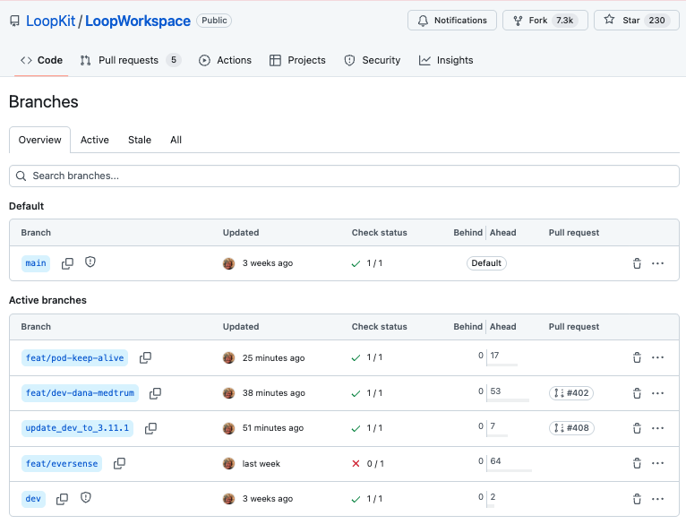
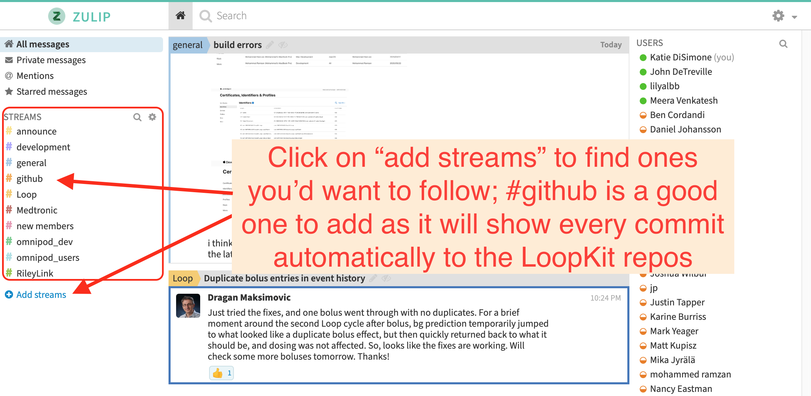
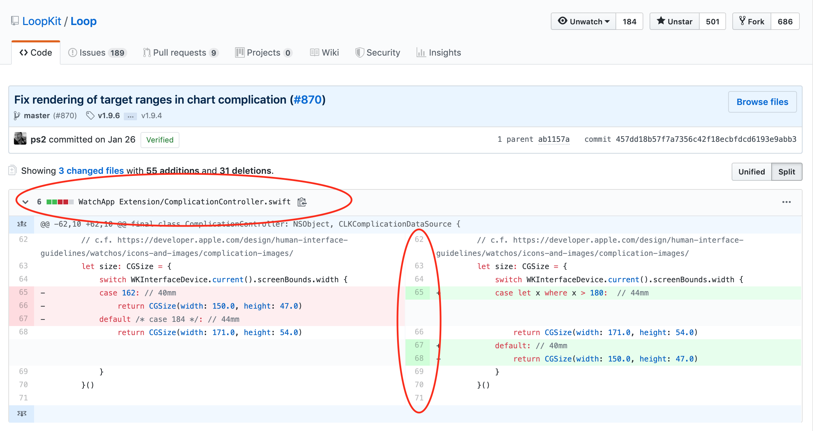
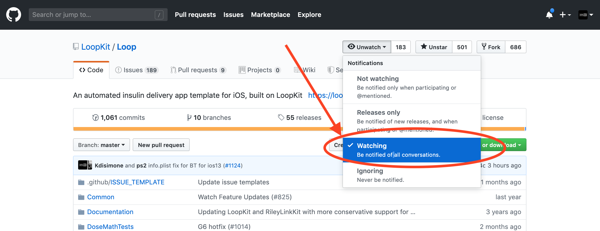

## Overview

The early history of the *Loop* app was touched on in the introductory [*LoopDocs* Overview: Development History](../intro/overview-intro.md#development-history){: target="_blank"} section.

The [*Loop* Releases](releases.md){: target="_blank"}  page lists releases since version 3.0 in reverse chronological order. For older release history, check out [*Loop* 2 and older](releases-version2.md){: target="_blank"} .

The current released version of the *Loop* app is always in the `main` branch of the LoopWorkspace repository.


### Relationship with *Tidepool Loop*

*Tidepool Loop* is an independent version of *Loop*. *Tidepool Loop* started with *Loop* code, added safety features, and additional FDA approved device integrations. Much of the *Tidepool Loop* improvements are also published as open source, which volunteers in the community are free to incorporate back into *Loop*. The device integrations for *Tidepool Loop* are generally closed source when required by device manufacturers.

* In 2019, the non-profit *Tidepool* organization partnered with the JAEB Foundation to review outcomes from volunteers using *Loop*
    * *Tidepool* successfully submitted *Tidepool Loop* to the Federal Drug Administration as an approved automated insulin delivery system
    * *Tidepool Loop* is available now, please see their website for more information: [*Tidepool Loop*](https://www.tidepool.org/tidepool-loop)
* In 2022, some of the *Tidepool* open-source code was brought into the *Loop* project by dedicated volunteers and eventually released as *Loop* 3
    * The traditional OS-AID process of community volunteers providing updates continued throughout
* In 2026, volunteers are once-again bringing in upgrades from *Tidepool* open-source code, laying the foundation for what will be *Loop* 4.
    * Look for upcoming information about `next-dev` branch - it is awesome, but still being tested
    * If you are interested, follow along in [zulipchat: Loop next-dev Status](https://loop.zulipchat.com/#narrow/channel/144182-development/topic/Loop.20next-dev.20Status/with/600761707)

### Development Branches and Breaking Changes

The next version of the *Loop* app is developed using branches. 

* The `dev` branch is used by the developers to push out changes for users to test before that code is released
    * Sometimes there are breaking changes
        * A breaking change is when you can build the new branch over your existing app, but cannot go backwards without deleting your app from your phone
    * We are bringing in updates for Tidepool in a special branch `next-dev`
        * Note that you might be able to go backward to `main` or `dev` from `next-dev` but it is not guaranteed
* In addition there are specific feature branches that enable users to test new pump and cgm managers or features for existing managers before they are added to the `dev` branch
* You should only test a development or feature branch if you are willing to be an active participant with the developers:
    * [Monitor announcements in zulipchat](https://loop.zulipchat.com/#narrow/channel/144182-development) 
    * Provide feedback
    * Build frequently to obtain the latest feature or bug-fix that is being tested
* If you are willing to help out - this is the way the next release of *Loop* is improved.

Please read this entire page before using any version of *Loop* other than the released code.

## Updates in `dev`

This section provides an overview of changes to `dev` compared to the current release: `Loop v3.14.0`. 

The current version of `dev` is v3.14.2. This has some very significant changes - please read the bullets and the Omnipod warning.

* The Medtrum Nano 200 U / 300 U pump manager is added to the dev branch and will be in the next release
* The Eversense E3 and 365 sensor CGM manager is added to the dev branch and will be in the next release
* The unified OmnipodKit pump manager, which controls either Classic (Eros) or DASH pods, is added to the dev branch and will be in the next release
    * The OmniBLE and OmniKit single-pod-type pump managers were removed from the dev branch

!!! important "Omnipod Users cannot return to v3.14.0 after building v3.14.2 without replacing their Pod"
    The new unified Omnipod Pump Manager, OmnipodKit, is the only Omnipod pump manager available in v3.14.2.

    If you are running a Pod, you can install v3.14.2 over v3.14.0 or earlier and the Pod control will automatically transition to the OmnipodKit Pump Manager.

    If you are running a Pod with v3.14.2, but reinstall 3.14.0 or earlier over it, there will not be an OmnipodKit Pump Manager available so you lose contact with your Pod.
    
    * If this happens to you: **install v3.14.2 on your phone and control will be restored**.

For those on the Dana pump. You need to keep building a feature branch, but the name of the branch changed. The old one is still available but has been removed from LoopDocs.

Please see [Table of Retired Branches](#table-of-retired-branches) for up to date information about what branch you need to build for Dana support.

Please check the [development channel in zulipchat](https://loop.zulipchat.com/#narrow/channel/144182-development) for notifications when an update to the `dev` branch is expected so you will be prepared. Do this **before** you install a `dev` build from TestFlight.

### Branches

In addition to the main and dev branches, which are tightly controlled and only updated through a formal pull request and approval process, there are also some feature and update branches. These branches are subject to more frequent updates, so users testing these branches should follow along in zulipchat for information.

* The `update_dev_to_M.m.#` is where the next version of dev is tested before becoming part of `dev` and later being released as `main`
* The branches starting with `feat/` have one or more special features, like support for new pumps, CGM or the new universal pump manager for all types of Omnipods

The graphic below shows the `main` and `dev` branches along with some feature branches and an update branch. This is a snapshot in time and no longer reflects the current status. Always check [Table of Active Branches](#table-of-active-branches).

> {width="750"}
{align="center"}


??? tip "Updates in Progress (Click to open/close)"
    * Sometimes there is a work-in-progress branch, `update_dev_to_M.m.#` used to collect new items in preparation for the next `dev` branch. This allows people to test and comment on the updates before they land in the `dev` branch.
    * There are also feature branches for items like new pumps and new CGMs:
        * The feature branches typically spin off of `dev`, but if a `updates_dev_to_ . . .` branch is in work, it is merged into the feature branches as items get included

### Table of Active Branches

The table below lists active branches. 

* Note that updates may occur and be announced in zulipchat a day or two before updates propagate to *LoopDocs*
* Anyone using a feature branch needs to be alert and check zulipchat regularly
* For example, while preparing for v3.14.2, older feature branches were retired
    * Check the [Table of Retired Branches](#table-of-retired-branches) to get the support you need.

| <div style="width:140px"> branch | version # | <div style="width:140px">last updated | comments |
|:--|:--|:--|:--|
| main | 3.14.0 | 14 May 2026 | release |
| dev | 3.14.2 | 5 June 2026 | v3.14.2 has a breaking change wrt `main`<br>- v3.14.1: [PR 452](https://github.com/LoopKit/LoopWorkspace/pull/452#top) add alert about dev branch<br>- v3.14.2 [PR 453](https://github.com/LoopKit/LoopWorkspace/pull/453)<br>- add MedtrumKit<br>- add EversenseKit<br>- add OmnipodKit<br>- delete OmniBLE and OmniKit<br>**Please read** [Transition to OmnipodKit](#transition-to-omnipodkit) |
| `feat/all-managers`<br>- SHA `1b4718f` | 3.14.2 | 5 June 2026| This branch contains all the managers and is primarily for developers to use for testing<br>It also provides `DanaKit @ c544c42` support<br>**Please read** [Status for Dana Support](#status-for-dana-support)<br>**Please read** [Feature Branch: feat/all-managers](#feature-branch-featall-managers) |
| `next-dev` | 3.15.0 | subject to rapid change | [PR 454](https://github.com/LoopKit/LoopWorkspace/pull/454)<br>[zulipchat: Loop next-dev Status](https://loop.zulipchat.com/#narrow/channel/144182-development/topic/Loop.20next-dev.20Status/with/600761707) |

??? question "What is SHA? (Click to Open/Close)"
    SHA-1 means Secure Hash Algorithm 1. This is used to generate an alphanumeric code to identify which version of a repository is used. 

    Each time you save a change to your&nbsp;<span translate="no">GitHub repository</span>, a unique SHA-1 is created. That identifier is used to tell *GitHub* a specific change that you want applied or identifies a specific version for that <code>repository</code>. These work for any compatible <code>fork</code> from the original&nbsp;<span translate="no">GitHub repository</span>.

    The SHA-1 20-character value is abbreviated as SHA and typically only the first 7 or 8 characters are presented to identify the commit for a particular repository.

### Table of Retired Branches

| Retired Branch |  Use Instead | Status Link |
|:--|:--|:--|
| feat/dev-dana-medtrum |For Medtrum, use `dev`<br>For Dana, use `feat/all-managers` | [Status for Medtrum](#status-for-medtrum-support)<br>[Status for Dana](#status-for-dana-support) |
| feat/eversense |  For Eversense, use `dev` | [Status for Eversense](#status-for-eversense-support) |
| feat/omnipodkit | Use `dev` unless you are a developer<br>developers can use `feat/all-managers` |  [Feature Branch: feat/all-managers](#feature-branch-featall-managers) |

### How to Build Feature Branches

For full instructions on building different branches, review these pages:

* [Browser Build: Build a Version in Development](../browser/build-dev-browser.md#build-development-version){: target="_blank" }
    * For short-cut instructions on adding the feature branch: [Feature Branch](../browser/build-dev-browser.md#feature-branch){: target="_blank" }
* [Mac Xcode: Build a Version in Development](../build/build-dev-mac.md#build-other-branches){: target="_blank" }

#### Browser Build

Use the page linked above to add the desired branch name (from the table above) to your fork. In other words, where the directions indicate the `dev` branch, you substitute the branch name of interest.

#### Mac-Xcode Build 

For Mac Xcode build, the lines you need to copy and paste into a Terminal window are explicitly provided below:

``` { .bash .copy  title="Download and build the feat/all-managers branch" }
/bin/bash -c "$(curl -fsSL \
  https://raw.githubusercontent.com/loopandlearn/lnl-scripts/main/BuildLoop.sh)" \
   - feat/all-managers
```


### Version Number Plan

Please see [`Loop` Version Numbering](releases.md#loop-version-numbering) for the current method for version numbering for the `main` and `dev` branches.

The version number in the feature branch will match either the `dev` branch version number or a work-in-progress update to the `dev` branch which uses the naming convention `update_dev_to_M.m.#`.

* In other words, the feature branch is up to date with other changes to `dev` or `update_dev_to_M.m.#` with the added support for the specific feature
* Each feature has an associated repository that contains the feature
    * When updates to the feature are added, the SHA for the feature branch and the SHA for the submodule(s) which support that feature will be reported in the table above and can be found by examining the LoopWorkspace repository for that feature branch

- - -

### Status for Pod Keep Alive Support

For those using iPhone 16 or 17e with Atlas DASH Pods, the keep alive support is available in the released code, `main`, v3.14.0 or in the development code, `dev`, v3.14.2.

- - -

### Status for Medtrum Support

Medtrum support was added to the `dev` branch in version 3.14.2.

- - -

### Status for Eversense Support

Eversense support was added to the `dev` branch in version 3.14.2.

- - -

### Status for Dana Support

For Dana support, you must build a new feature branch, feat/all-managers. The old feature branches will be deleted without further warning.

* Build instructions are found here: [How to Build Feature Branches](#how-to-build-feature-branches).
* See [Feature Branch: feat/all-managers](#feature-branch-featall-managers) for more information about the branch. 
* Keep reading here for Dana specific status.


!!! important "New Managers"
    The `feat/all-managers` branch is used to add new Pump Managers and CGM Managers which may have known or unknown bugs. Once the managers are deemed reliable, they are added to the `dev` branch and subsequently released. This branch contains new and old managers (like OmniBLE and OmniKit) for use by developers.
    
    Please only use a feature branch if you are prepared to follow along in zulipchat and are willing to help test and resolve issues. This is critical when using new pump managers.

    * Please ensure you have the latest version of a given branch by synching before you build:
        * Browser Build: be sure you select `feat/all-managers` branch
            * The Build Loop action automatically syncs your fork when building
            * Be sure to install the resultant build from *TestFlight* onto your phone
        * Mac-Xcode: you can update your clone or download a fresh copy
            * if updating your clone, be sure to type `git pull --recurse` in your `LoopWorkspace` folder to include updates to all submodules
            * See [Mac-Xcode Build](#mac-xcode-build) for fresh download instructions

!!! important "Bluetooth Connection Issues for Dana and Medtrum"
    Both the Dana and Medtrum pumps are designed to stay in continuous Bluetooth commnication with the pump controller. This is quite different from the older Pod and Medtronic pumps.
    
    The behavior of your OS-AID system needs to properly handle bolus and temp basal rate events in progress if that communication is interrupted.  This can happen if someone walks away from their phone during a bolus or while a temp basal rate is in progress.

    These issues were fixed in MedtrumKit and the lessons learned will be applied to DanaKit.

    There are known issues for DanaKit, which is why that pump manager is not yet in the `dev` branch

    Please read the rest of this section to learn about how this might affect an older or current version of your OS-AID app.

#### Open Issue for DanaKit

!!! bug "DanaKit Bluetooth Comms Loss Not Fixed"

    #### DanaKit - Issue is still open

    The Medtrum Issue report led to testing for DanaKit. The bolus issue has a slightly different error signature. This two issues are still open, so Dana users need to be aware of them.

    [DanaKit Issue 36](https://github.com/bastiaanv/DanaKit/issues/36) reported that DanaKit did not properly handle a Temp Basal Rate (TBR) event if BLE comms was lost at the time the TBR completed.

    [DanaKit Issue 34](https://github.com/bastiaanv/DanaKit/issues/34)

    * When Bluetooth communication is interrupted during a bolus, the pump manager reports the bolus as finalized even if it is still being delivered
    * If this happens, you cannot cancel from the app
    * The OS-AID treats that bolus as finalized as soon as communication is lost

    This is less serious of a problem because the reported IOB matches what the pump was told to deliver. But of course, it will be fixed.

#### Issue Fixed Earlier

!!! success "Temp Basal Accounting Corrected"
    The accounting used by Loop requires specific feedback from the Pump Managers. This important information was not initially added to the Dana or Medtrum pump managers. Those both were developed first for Trio which uses a different algorithm and accounts for insulin dosing differently.

    This oversight is fixed for both Dana and Medtrum.

    * Medtrum was fixed on 17 Feb 2026
    * Dana was fixed on 26 Feb 2026

    If you were using Loop with one of these pumps before those dates, be aware that when you update your build, your settings may need to be adjusted.

    * For more information see the closed MedtrumKit Issue: [Loop and Medtrum Pump Manager: Basal Delivery Accounting is Not Correct](https://github.com/jbr7rr/MedtrumKit/issues/77#issuecomment-3915865502)
    * For more information see the closed DanaKit Issue: [Loop and DanaKit: Observe Pump Event Details in Loop](https://github.com/bastiaanv/DanaKit/issues/32#issuecomment-3937294107)

- - -

### Feature Branch: feat/all-managers

The `feat/all-managers` branch replaces several [retired feature branches](#table-of-retired-branches). If you need a feature branch for a Dana pump - you need to build this branch. Be sure to review the [Status For Dana Support](#status-for-dana-support) section.

If you previously used a feature branch for Medtrum or Eversense support, you can switch to the `dev` branch.

!!! Question "What is different between `feat/all-managers` and `dev` branch"
    There are several differences between `feat/all-managers` and `dev` branch.  For one thing, this branch has all the pump managers: OmniBLE, OmniKit, OmnipodKit, DanaKit, MedtrumKit and MinimedKit and the new CGM manager EversenseKit. When other new managers become available, they may be added here for testing.

    Keeping OmniBLE & OmniKit in this branch is useful for developers. Those pump managers were removed from `dev` branch (3.14.2) and will soon be removed from `main` when `dev` is merged into main. We expect those managers will eventually be dropped from this branch, but only when the developers agree to do so.

    Because OmniBLE & OmniKit are present, a tester who comes in with a Pod attached to one of those managers stays with the manager. The automatic conversion to OmnipodKit, which happens with v3.14.2, does not happen with this branch. The tester has to manually change pump managers during a Pod change.

#### Transition to OmnipodKit

!!! important "Once you transition to OmnipodKit, stay with OmnipodKit"
    The new unified Omnipod Pump Manager, OmnipodKit, is provided in v3.14.2 or newer.

    If you are running a Pod and you transition to the OmnipodKit Pump Manager, then any build you install on your phone should have OmnipodKit. If you need to downgrade to a build earlier than v3.14.2, do so after deactivating a Pod.


The OmnipodKit pump manager comes with improved user interface and user experience for Omnipod Classic (Eros) and DASH pods including

* Some layout adjustments
* Some new labels
* Some reworked sub-menus with added information or features

If you are running the `dev` branch - your Pod is automatically transitioned to OmnipodKit. You will notice the user interface is a little different. If you are running `feat/all-managers` branch, see [Manual transition with `feat/all-managers`](#manual-transition-with-featall-managers).

One of the biggest things is that you can change Pod types between Pods without deleting the pump manager. That means all your configuration choices for desired notifications and type of Insulin are maintained when you change Pod Types. With this version of OmnipodKit, only Eros and DASH are supported.

!!! question "Why OmnipodKit?"
    When the initial work to add DASH to the supported pumps was started in 2021, a completely separate pump submodule was created distinct from the Classic (Eros) pump submodule. In other words, OmniBLE handled DASH and OmniKit handled Eros.

    A significant portion of the two repositories serve the same function. Whenever a fix or improvement was added to OmniBLE, it was duplicated and added to OmniKit. Having a universal pod manager saves significant developer resources.

    OmnipodKit provides the individual support needed for different `Pod Types` while using a single copy of code for most of the logic and user interface.

    The improvements that have been going on in the background landed in the new pump manager only - and were not replicated in the OmniKit or OmniBLE repositories.

    This will be a significant time saver for developers moving forward for updating code and adding support for new types of pods.

#### Manual transition with `feat/all-managers`

If you are running `feat/all-managers` branch, you need to take these steps to switch to using the new pump manager.

The next time you change a pod, delete the pump manager you are using and add a new pump. See [Change Pump Type](../loop-3/add-pump.md#change-pump-type){: target="_blank" } for detailed instructions.

* Select `All Omnipod Types` as your new pump manager.
* Go through the onboarding of selecting notifications and reminders and insulin type.
* You will then be presented with a screen to select the type of pod. 
* Choose the Classic (Eros) or DASH Pod type


- - -

## Older updates

### Updates from v3.8 to v3.10

The updates developed in the `dev` branch before the release of v3.10.0 are found in these PR.

*   [Update dev to 3.9.5](https://github.com/LoopKit/LoopWorkspace/pull/394)
*   [Update dev to 3.9.4](https://github.com/LoopKit/LoopWorkspace/pull/367)
*   [Update dev to 3.9.3](https://github.com/LoopKit/LoopWorkspace/pull/358)


### Updates from v3.6 to v3.8

The updates developed in the `dev` branch before the release of v3.8.0, are provided in reverse chronological order.

#### v3.7.7

The changes are to maintenance scripts and to translations with no change to the function of the code:

* There are some updates to translated strings that people who use Loop in other languages may notice
    * The DanaKit pump translations now work
    * Parts of the Favorite Foods sections are now translated
    * Many common keys used in more than one submodule are linked so they only need to be translated one time to appear in the app
* With v3.6.2, the method to Add Identifiers when using Browser Build for the *Loop* app changed. 
    * The new method requires the time-sensitive capability be added manually
    * This change was captured in LoopDocs but not in testflight.md
    * The instructions found in testflight.md were updated
* For developers who might want to know, this update included
    * conversion to use String Catalogs for localization in the submodules with associated tweaks to Xcode configuration
    * updates to the CircleCI configurations

#### v3.7.6

* Updated some localization (strings translated to different languages)
    * Added scripts to make localization more streamlined
* Cleaned up some code
    * Fixed a bolus problem with iOS 26
    * Discarded some unneeded files
    * Updated to Xcode 16.4 for browser build and CircleCI quality testing

#### v3.7.5

* Added support for Dana-i and DanaRS-v3 pump models

#### v3.7.0 through v3.7.4

* `dev` v3.7.x was same as [`main` v3.6.x](releases.md#loop-v364).

### Updates from v3.4 to v3.6

All updates are reported in [`Loop 3.6.0`](releases.md#loop-v360){: target="_blank" }

Check [Version History](releases.md#loop-3-version-history) for minor updates found in 3.6.x.

### Updates from v3.2 to v3.4

Features new with v3.4, originally in the Updates in `dev` section before the release, have been inserted into the appropriate part of the *LoopDocs* website (indicated by the up-right arrow after the link). The links below are left to assist people in finding the features.

* [Support for Libre Sensors](../loop-3/add-cgm.md#libre){: target="_blank" }
* [Pump or CGM Simulator on Phone](simulator.md#pump-or-cgm-simulator-on-phone){: target="_blank" }
* [Algorithm Experiments](../loop-3/settings.md#algorithm-experiments){: target="_blank" }
    * [<span translate="no">Glucose Based Partial Application</span> Factor](../loop-3/features.md#glucose-based-partial-application-gbpa){: target="_blank" }
    * [<span translate="no">Integral Retrospective Correction</span>](../loop-3/features.md#integral-retrospective-correction-irc){: target="_blank" }
* [Favorite Foods](../loop-3/settings.md#favorite-foods){: target="_blank" }
* [<span translate="no">TestFlight Expiration Warning</span>](../operation/features/notifications.md#loop-app-expiration-notification){: target="_blank" }

- - -

## What are Git Branches?

There is a lot of discussion about *branches* with *Loop* but the concept is simple. Basically, they are all slightly different versions of *Loop*...kind of like different edits of the same book.

To really understand what branches are, we should probably explain a little more about the software and how development works.  You can watch a 30-minute long, classic Katie DiSimone [video explanation about branches](https://www.youtube.com/watch?v=cWqvYs4Azt0&t=4s) created when *Loop* Version 2.0 was newly released. Keep in mind while watching the video:


Details that are different:

* The way the code is organized has changed: see [LoopWorkspace](loopworkspace.md){: target="_blank" }
* The default branch name used to be `master` - but is now `main`
* `carthage` is no longer used to determine which submodules (frameworks) are pulled in to build Loop (see [LoopWorkspace](loopworkspace.md))

The information in this video is still generally useful with the last half focused on automatic-bolus - the automatic-bolus dosing strategy has now been incorporated into <span>*Loop* `main` branch</span>. *Loop* has moved on to using only one stable branch (`main`), with `dev` suggested for developers/testers.

### `Loop` GitHub Information

*Loop* developers own an account in *GitHub* called [LoopKit](https://github.com/LoopKit).  Within that account, the developers have several <code>repositories</code> that support *Loop* in particular. A repository&#8203; is like a book...let's think of it like a cookbook for now. Within the `LoopKit` account, there are `repositories` for Loop&#8203; itself, *LoopDocs*, and various other supporting "frameworks" that are <span>helper &#8203;repositories&#8203; for *Loop*</span> to build correctly. For example, Loop&#39;s &#8203;repository&#8203; has a lot of info about the app itself; the outward-facing things that you interact with. How information is put to you and taken in from you...that's in *Loop* <code>repository</code> code. But, there's more than just a user interface for Loop. *Loop* has to do a lot of complex work like Bluetooth communications, algorithm math, pump communications, etc. The *Loop* app has help from frameworks to do those other parts. `CGMBLEkit`&nbsp; for some of the transmitter parts of *Loop*, `RileyLink_ios` for the pump managers (talking to the pumps and decoding their information), `LoopKit` for the algorithm about carbs and insulin curves, etc.

When you build *Loop*, you actually start with LoopWorkspace which points to all the other repositories needed for a complete *Loop* app.

### *Loop* as a Cookbook

So let's imagine *Loop* as a cookbook. The developers are the authors/chefs of the recipes (code) in the cookbook. The authors spend countless hours testing new recipes, taste testing, and documenting improvements. They send the drafts to the editor, who makes suggestions and eventually, the cookbook is finalized. There are no grammar issues, and no typos, the photos are beautiful and the recipes are yummy. They publish the book and you see a gorgeous final product on the shelves. That is called a release&#8203, and it is the `main` branch. This book has been well-tested and is super stable. Every time you cook with those recipes, you know exactly what you're getting and lots of people have had a chance before you to make sure that it all tastes good. The `main` branch is stable and tested.

But then...the chefs/developers go on a trip. They are inspired by new cuisine and want to add new recipes to the old cookbook. (Things like Omnipod&#8203; support and the overrides are new "recipes" that were developed since the last `main` release, for example.) But, the process of developing a recipe is arduous. There was a lot of trial and error involved. Lots of tweaking ingredients (code). The editors try out the new recipes and offer feedback (similar to the [Issues List on GitHub](https://github.com/LoopKit/Loop/issues)). While the recipes are being developed, they have a version of the old cookbook that gets marked up...edited in pencil a lot. Scribbles and notes in the side. Revisions happen frequently because that's what testing new recipes is all about. These marked-up versions of the cookbook are called the `dev` branch. Short for "development" branch. Like the name sounds...this is where new developments are happening, new recipes, and tweaks.

After much testing and tweaking, eventually, the recipes get the flavors right (bugs in code are squashed) and enough people have provided feedback and careful observations of results...that the book goes to the publishing house for the next printing. The cookbook is republished with an updated edition number and new recipes are highlighted. When this happens in *Loop*,  <span>Loop&#39;s `main` branch</span> is updated with the new features coming from `dev` (aka, the `dev` branch is merged into the `main` branch). When that happens, the `main` branch gets another `release` version. At this point, `dev` and `main` are identical. They remain so until the development team for *Loop*&nbsp; starts working on the next batch of improvements, which could be in the next hour or even days later, but then the cycle starts again.  The developers will start editing the code again and dropping those edits in the `dev` branch for further development.

## What's going on in the `dev` branch?

The `dev` branch is where the next version of *Loop* is being developed and tested.

If you choose to build *Loop* using a `dev` branch, you need to be aware that the `dev` branch may update code frequently and unannounced in the traditional sense that most users in the  *Looped* group or *Instagram* would see. Developers are not helped by people being in a `dev` branch if those users mistakenly think of it as a stable `main` branch with lots of detailed docs to go with it. People should only use a `dev` branch build if they EDUCATE themselves on the expectations and how to properly manage `dev` information and updates. People using the `dev` branch should also have regular access to a computer to be able to rebuild quickly if a new bug/fix is identified.

If you choose to use a `dev` build, you can stay abreast of developments in a number of ways...but they will all require you to do some legwork and keep yourself informed. This is not a situation where you should expect a fancy *Loopdocs* page updated regularly with current "`dev` updates"...that's just not the way the `dev` branch works (at least normally). There is, however, an attempt to organize the current status of development in the [Updates in `dev`](#updates-in-dev) section.

### Subscribe to the Zulipchat channels

Use [Zulipchat](https://loop.zulipchat.com) forums for *Loop*.  
This forum has several streams of conversations (`streams`) depending on interest. I highly recommend following all the streams so you do not miss conversations.  You can select by stream and by topic within a stream to focus on a given conversation.  

!!! tip "Zulip Chat Streams"
    - If you are using the **dev** branch, you **must** be in the **[#development](https://loop.zulipchat.com/#narrow/stream/144182-development)** stream.  
    - If you want to know when **LoopDocs** gets updated, follow the **[#documentation](https://loop.zulipchat.com/#narrow/stream/270362-documentation)** stream.  
    - **Code changes** are called commits in GitHub.  
      The **[#github](https://loop.zulipchat.com/#narrow/stream/144191-github)** stream will have an automated post whenever a new commit is made and it will give a brief line description of the commit.

{width="650"}
{align="center"}

You can also go directly to the git commit history for each of the branches if you'd like. Note that `LoopWorkspace` is the card-catalog for all the books (repositories) used by Loop.

- [`LoopWorkspace` **`main`** branch: git commit history](https://github.com/LoopKit/LoopWorkspace/commits/main)
- [`LoopWorkspace` **`dev`** branch: git commit history](https://github.com/LoopKit/LoopWorkspace/commits/dev)

If you click on the commit, you can see exactly what changes to the code were made. It's an interesting learning experience. In red is the old code, and in green is the updated code. The line numbers and file names of the edited code are also there to help.)

{width="550"}
{align="center"}

I don't expect many of you would understand exactly what the edits mean, or how the new code might function. However, I bring up the topic of git commit history so that you can use that to realize just how often the `dev` branch is updated. Go ahead and look at the number and frequency of commits in that branch.  That's why no one would want to maintain a documentation list of the changes in the `dev` branch. It's just too much of a moving target.

### Watch the `Loop Repository` and `Issues List`

Open the [`Loop repository`](https://github.com/LoopKit/Loop) and subscribe to the `Issues`. 

You can choose to watch the `repository` so that you get emails when new `Issues` are reported. This is a good way to find out if other people are reporting odd behavior that you are wondering about. If you use `dev` and wonder about something you are seeing in *Loop*, you can check [`Issues` list](https://github.com/LoopKit/Loop/issues) to see if others are noticing the same. If so, you can help by capturing information and reporting it. Not super helpful to just say "Yeah, me too..." but better if you can attach screenshots, `Issue Reports` from *Loop* settings, and a thorough description of the problem you are seeing. Be a part of the solution by thoughtfully providing information to help debug.

{width="650"}
{align="center"}

### Become familiar with your data sources

Another useful thing if you'll be on `dev` branches undergoing a lot of active change...know how *Loop* works and where to look for additional information about what you are seeing. For example, if you see an IOB value that looks odd, you should know to look at the insulin deliveries stored in the *Health* app.

### Generate an Issue Report and a Critical Event Log

!!! tip "Issue Report vs Loop Issue"
    The action in the *Loop* app where you select `Issue Report` generates a human-readable LoopReport file that you can share which has a lot of useful information.

    The `Loop Issue` mentioned in [Watch the `Loop Repository` and `Issues List`](#watch-the-loop-repository-and-issues-list) is a website at GitHub where known Issues with the *Loop* app are kept in permanent storage.

    The names are similar, but the activity is quite different.

Know how to generate an `Issue Report` and `Export a Critical Event Log` when you see a problem so you can provide that if asked. 

* An `Issue Report` is a log file generated by the *Loop* app that has a lot of information the developers can parse to figure out what *Loop* was doing when you were having a problem. Some items go back 84 hours (pump and cgm messages), others are limited to a few hours (decision arrays) and some items are overall status (build version number and phone model / iOS).
* A `Critical Event Log` contains a zip of 7 individual zips. Each zip is for one day and contains the complete set of data used for Loop decision making. The event log goes back 7 full days.

To issue these reports:

* `Loop Settings` and then scroll almost to the bottom and select `Issue Report` and thenm share
* `Loop Settings` and then scroll almost to the bottom and select `Export a Critical Event Log` and then share

### Create a Debug Report

This 6-minute long, classic Katie DiSimone video shows how to [capture debugging logs](https://youtu.be/Ac4MguvUO7M). If you are testing a new branch, this is a valuable skill to assist developers in identifying problems. In addition to showing you how to generate and save the debug text information, the video explains how to create a <code>gist</code> with the debug information using your *GitHub* account and file an official Issue on the *Loop* *GitHub* <code>repository</code>. This may be required in some cases.  But start by chatting directly on [Zulipchat](https://loop.zulipchat.com) with the developer. What you are experiencing may already be known. If the developers need you to open a new `Issue`, they will say so on *Zulipchat*.


## `Repositories` and Code

If you're a developer looking for direct links to the **code and documentation** in *GitHub*:

* [`LoopWorkspace`](https://github.com/LoopKit/LoopWorkspace)
* [`LoopDocs`](https://github.com/LoopKit/Loopdocs)

For more information on **how to contribute code to the *Loop* project**, please review:

  * [How to Contribute to Open Source](https://opensource.guide/how-to-contribute/)
  * the [LICENSE](https://github.com/LoopKit/Loop/blob/main/LICENSE.md)
  * the  [CODE_OF_CONDUCT](https://github.com/LoopKit/Loop/blob/main/CODE_OF_CONDUCT.md)

If you want to contribute **code improvements**, please join [*Loop Zulipchat*](https://loop.zulipchat.com) and be sure to subscribe to all the channels. Meet the developers and testers who make this app, and learn about what is coming next.
